```{r setup, include=FALSE, echo=FALSE, warning=FALSE, message=FALSE}
knitr::opts_chunk$set(warning=FALSE, message=FALSE, echo = FALSE,
                      fig.align = "center")

#Attach libraries 
library(tidyverse)
library(here)
library(janitor)
library(broom)
library(kableExtra)
library(sjmisc)
library(snakecase)
```

# Overview

**Participants**

- *n* = 120 total midlife with DSI scans
- *n* = 118 useable DSI scans (removed subjects 329 and 372)

After preprocessing and quality control, subject 347 was removed as well due to being an outlier.

DSP Variables: wayfinding success, solution index, path efficiency

- *n* = 71 for all subjects
- *n* = 26 for men
- *n* = 45 for women
- *n* = 18 for pre
- *n* = 14 for peri
- *n* = 13 for post


**DSI Studio**

DSI Studio GUI version: chen-2022-06-09

This is same as version and tag used in Docker, which is: chen-2022-07-31


**Parameters**

- T-threshold = 2.5
- Length = 25
- Permutation = 4,000
- Pruning = 4
- Non-normalized QA

# Methods

A diffusion spectrum imaging scheme was used, and a total of 128 diffusion sampling were acquired. The maximum b-value was 4990 s/mm². The in-plane resolution was 1.8 mm. The slice thickness was 1.8 mm. The accuracy of b-table orientation was examined by comparing fiber orientations with those of a population-averaged template (Yeh et al. Neuroimage, 2018). The b-table was flipped by .012fy. The diffusion data were reconstructed in the MNI space using q-space diffeomorphic reconstruction (Yeh et al., Neuroimage, 58(1):91-9, 2011) to obtain the spin distribution function (Yeh et al., IEEE TMI, ;29(9):1626-35, 2010). A diffusion sampling length ratio of 1.25 was used. The output resolution in diffeomorphic reconstruction was 1.8 mm isotropic. The tensor metrics were calculated using DWI with b-value lower than 1750 s/mm². The quantitative anisotropy was extracted as the local connectome fingerprint (LCF, Yeh et al. PLoS Comput Biol 12(11): e1005203) and used in the connectometry analysis.

Diffusion MRI connectometry (Yeh et al. NeuroImage 125 (2016): 162-171) was used to derive the correlational tractography that has QA, AD, MD, RD correlated with either DSP wayfinding success, solution index, or path efficiency. A nonparametric Spearman partial correlation was used to derive the correlation, and the effect of sex_binary, age_spatial_years, and repo_status_dummy was removed using a multiple regression model (*depending on whether looking by sex or reproductive status*). Different number of subjects were included in the analysis depending on the group. 

A T-score threshold of 2.5 was assigned and tracked using a deterministic fiber tracking algorithm (Yeh et al. PLoS ONE 8(11): e80713, 2013) to obtain correlational tractography. A seeding region was placed at whole brain. The tracks were filtered by topology-informed pruning (Yeh et al. Neurotherapeutics, 16(1), 52-58, 2019) with 4 iteration(s). A length threshold of 25 voxel distance was used to select tracks. To estimate the false discovery rate, a total of 4000 randomized permutations were applied to the group label to obtain the null distribution of the track length.

Older version of DSI studio reports "no significant results in tracts" even though there are significant tracts, so that is reported in quotes. For reports where there are absolutely no tracts showing up in the results, then there really are no significant results in tracts. For those that state "no significant results in tracts" and also have all tracts < 10, then results are neglibigle and can be ignored.


# Wayfinding Success {.tabset .tabset-dropdown}

## QA {.tabset}

There were negative but no positive correlations between QA and DSP wayfinding success when all subjects were included in the analysis. When men were analyzed separately, men displayed more negatively associated correlations between QA and wayfinding success. Women also displayed tracts with more negative correlations. When assessing by reproductive stage, both peris and posts displayed both positive and negative correlations (with peris displaying tracts with mostly positive associations) while pres displayed only a few tracts for positive and negative correlations with performance. 


### All Subjects 

<span style="color: #ff5500;"><font size="5"><bold> Positive Correlations (FDR = 1.000000) </span></font></bold>

No significant results in tracts.

<br>
<span style="color: #00ffff;"><font size="5"><bold> Negative Correlations (FDR = 0.000312) </span></font></bold>

```{r qa_neg_wayfinding_all}
#All subjects negative
df <- read_csv(here("data", "dsp", "wayfinding_success", "qa",
                    "qa_neg_dsp_wayfinding_all.csv")) %>% 
  clean_names() %>% 
  filter(tract_name %in% c("number of tracts","mean length(mm)",
                          "diameter(mm)", "volume(mm^3)")) %>% 
  rotate_df() %>% row_to_names(row_number = 1) %>% 
  rownames_to_column("tract_name") %>% 
  mutate(tract_name = to_any_case(tract_name,"upper_camel", sep_out = "_")) %>% 
  mutate_at(c(2:5), as.numeric) %>% 
  filter(`number of tracts` >= 10)

#Present table
df %>% 
  kable(col.names = c("Tract Name", "Number of Tracts", "Mean Length (mm)",
                      "Diameter (mm)", "Volume (mm^3)"),
        digits = 3,
        table.attr = "style='width:90%;'"
        ) %>% 
  kable_styling(bootstrap_options = "hover") %>% 
  scroll_box(width = "800px", height = "200px")
```

<br>
<font size="5"> Figures </font>

<center>
{width=50%}


</center>
<br>


### Men

<span style="color: #ff5500;"><font size="5"><bold> Positive Correlations (FDR = 0.070175) </span></font></bold>

```{r qa_pos_wayfinding_men}
#Men positive
df <- read_csv(here("data", "dsp", "wayfinding_success", "qa",
                    "qa_pos_dsp_wayfinding_men.csv")) %>% 
  clean_names() %>% 
  filter(tract_name %in% c("number of tracts","mean length(mm)",
                          "diameter(mm)", "volume(mm^3)")) %>% 
  rotate_df() %>% row_to_names(row_number = 1) %>% 
  rownames_to_column("tract_name") %>% 
  mutate(tract_name = to_any_case(tract_name,"upper_camel", sep_out = "_")) %>% 
  mutate_at(c(2:5), as.numeric) %>% 
  filter(`number of tracts` >= 10)

#Present table
df %>% 
  kable(col.names = c("Tract Name", "Number of Tracts", "Mean Length (mm)",
                      "Diameter (mm)", "Volume (mm^3)"),
        digits = 3,
        table.attr = "style='width:90%;'"
        ) %>% 
  kable_styling(bootstrap_options = "hover") %>% 
  scroll_box(width = "800px", height = "200px")
```


<br>
<span style="color: #00ffff;"><font size="5"><bold> Negative Correlations (FDR = 0.004283) </span></font></bold>

```{r qa_neg_wayfinding_men}
#Men negative
df <- read_csv(here("data", "dsp", "wayfinding_success", "qa",
                    "qa_neg_dsp_wayfinding_men.csv")) %>% 
  clean_names() %>% 
  filter(tract_name %in% c("number of tracts","mean length(mm)",
                          "diameter(mm)", "volume(mm^3)")) %>% 
  rotate_df() %>% row_to_names(row_number = 1) %>% 
  rownames_to_column("tract_name") %>% 
  mutate(tract_name = to_any_case(tract_name,"upper_camel", sep_out = "_")) %>% 
  mutate_at(c(2:5), as.numeric) %>% 
  filter(`number of tracts` >= 10)

#Present table
df %>% 
  kable(col.names = c("Tract Name", "Number of Tracts", "Mean Length (mm)",
                      "Diameter (mm)", "Volume (mm^3)"),
        digits = 3,
        table.attr = "style='width:90%;'"
        ) %>% 
  kable_styling(bootstrap_options = "hover") %>% 
  scroll_box(width = "800px", height = "200px")
```

<br>
<font size="5"> Figures </font>

<center>
{width=50%}


</center>
<br>

### Women

<span style="color: #ff5500;"><font size="5"><bold> Positive Correlations (FDR =  0.040000) </span></font></bold>

All tracts were < 10.

```{r qa_pos_wayfinding_women}
#Women positive
df <- read_csv(here("data", "dsp", "wayfinding_success", "qa",
                    "qa_pos_dsp_wayfinding_women.csv")) %>% 
  clean_names() %>% 
  filter(tract_name %in% c("number of tracts","mean length(mm)",
                          "diameter(mm)", "volume(mm^3)")) %>% 
  rotate_df() %>% row_to_names(row_number = 1) %>% 
  rownames_to_column("tract_name") %>% 
  mutate(tract_name = to_any_case(tract_name,"upper_camel", sep_out = "_")) %>% 
  mutate_at(c(2:5), as.numeric)
#%>% filter(`number of tracts` >= 10)

#Present table
df %>% 
  kable(col.names = c("Tract Name", "Number of Tracts", "Mean Length (mm)",
                      "Diameter (mm)", "Volume (mm^3)"),
        digits = 3,
        table.attr = "style='width:90%;'"
        ) %>% 
  kable_styling(bootstrap_options = "hover") %>% 
  scroll_box(width = "800px", height = "200px")
```


<br>
<span style="color: #00ffff;"><font size="5"><bold> Negative Correlations (FDR = 0.000128) </span></font></bold>

```{r qa_neg_wayfinding_women}
#Women negative
df <- read_csv(here("data", "dsp", "wayfinding_success", "qa",
                    "qa_neg_dsp_wayfinding_women.csv")) %>% 
  clean_names() %>% 
  filter(tract_name %in% c("number of tracts","mean length(mm)",
                          "diameter(mm)", "volume(mm^3)")) %>% 
  rotate_df() %>% row_to_names(row_number = 1) %>% 
  rownames_to_column("tract_name") %>% 
  mutate(tract_name = to_any_case(tract_name,"upper_camel", sep_out = "_")) %>% 
  mutate_at(c(2:5), as.numeric) %>% 
  filter(`number of tracts` >= 10)

#Present table
df %>% 
  kable(col.names = c("Tract Name", "Number of Tracts", "Mean Length (mm)",
                      "Diameter (mm)", "Volume (mm^3)"),
        digits = 3,
        table.attr = "style='width:90%;'"
        ) %>% 
  kable_styling(bootstrap_options = "hover") %>% 
  scroll_box(width = "800px", height = "200px")
```

<br>
<font size="5"> Figures </font>

<center>
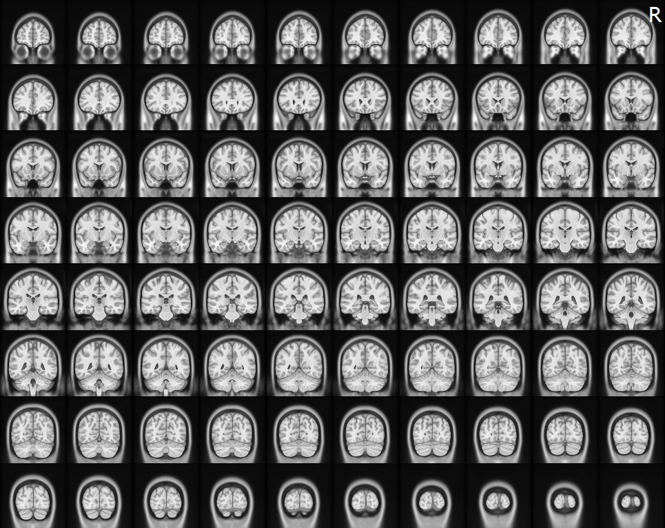{width=50%}


</center>
<br>

### Pre

<span style="color: #ff5500;"><font size="5"><bold> Positive Correlations (FDR =  0.010204) </span></font></bold>

```{r qa_pos_wayfinding_pre}
#Pre positive
df <- read_csv(here("data", "dsp", "wayfinding_success", "qa",
                    "qa_pos_dsp_wayfinding_pre.csv")) %>% 
  clean_names() %>% 
  filter(tract_name %in% c("number of tracts","mean length(mm)",
                          "diameter(mm)", "volume(mm^3)")) %>% 
  rotate_df() %>% row_to_names(row_number = 1) %>% 
  rownames_to_column("tract_name") %>% 
  mutate(tract_name = to_any_case(tract_name,"upper_camel", sep_out = "_")) %>% 
  mutate_at(c(2:5), as.numeric) %>% filter(`number of tracts` >= 10)

#Present table
df %>% 
  kable(col.names = c("Tract Name", "Number of Tracts", "Mean Length (mm)",
                      "Diameter (mm)", "Volume (mm^3)"),
        digits = 3,
        table.attr = "style='width:90%;'"
        ) %>% 
  kable_styling(bootstrap_options = "hover") %>% 
  scroll_box(width = "800px", height = "200px")
```


<br>
<span style="color: #00ffff;"><font size="5"><bold> Negative Correlations (FDR = 0.000952) </span></font></bold>

```{r qa_neg_wayfinding_pre}
#Pre negative
df <- read_csv(here("data", "dsp", "wayfinding_success", "qa",
                    "qa_neg_dsp_wayfinding_pre.csv")) %>% 
  clean_names() %>% 
  filter(tract_name %in% c("number of tracts","mean length(mm)",
                          "diameter(mm)", "volume(mm^3)")) %>% 
  rotate_df() %>% row_to_names(row_number = 1) %>% 
  rownames_to_column("tract_name") %>% 
  mutate(tract_name = to_any_case(tract_name,"upper_camel", sep_out = "_")) %>% 
  mutate_at(c(2:5), as.numeric) %>% 
  filter(`number of tracts` >= 10)

#Present table
df %>% 
  kable(col.names = c("Tract Name", "Number of Tracts", "Mean Length (mm)",
                      "Diameter (mm)", "Volume (mm^3)"),
        digits = 3,
        table.attr = "style='width:90%;'"
        ) %>% 
  kable_styling(bootstrap_options = "hover") %>% 
  scroll_box(width = "800px", height = "200px")
```

<br>
<font size="5"> Figures </font>

<center>
{width=50%}


</center>
<br>

### Peri

<span style="color: #ff5500;"><font size="5"><bold> Positive Correlations (FDR =   0.002637) </span></font></bold>

```{r qa_pos_wayfinding_peri}
#Peri positive
df <- read_csv(here("data", "dsp", "wayfinding_success", "qa",
                    "qa_pos_dsp_wayfinding_peri.csv")) %>% 
  clean_names() %>% 
  filter(tract_name %in% c("number of tracts","mean length(mm)",
                          "diameter(mm)", "volume(mm^3)")) %>% 
  rotate_df() %>% row_to_names(row_number = 1) %>% 
  rownames_to_column("tract_name") %>% 
  mutate(tract_name = to_any_case(tract_name,"upper_camel", sep_out = "_")) %>% 
  mutate_at(c(2:5), as.numeric) %>% filter(`number of tracts` >= 10)

#Present table
df %>% 
  kable(col.names = c("Tract Name", "Number of Tracts", "Mean Length (mm)",
                      "Diameter (mm)", "Volume (mm^3)"),
        digits = 3,
        table.attr = "style='width:90%;'"
        ) %>% 
  kable_styling(bootstrap_options = "hover") %>% 
  scroll_box(width = "800px", height = "200px")
```


<br>
<span style="color: #00ffff;"><font size="5"><bold> Negative Correlations (FDR = 0.192308) </span></font></bold>

```{r qa_neg_wayfinding_peri}
#Peri negative
df <- read_csv(here("data", "dsp", "wayfinding_success", "qa",
                    "qa_neg_dsp_wayfinding_peri.csv")) %>% 
  clean_names() %>% 
  filter(tract_name %in% c("number of tracts","mean length(mm)",
                          "diameter(mm)", "volume(mm^3)")) %>% 
  rotate_df() %>% row_to_names(row_number = 1) %>% 
  rownames_to_column("tract_name") %>% 
  mutate(tract_name = to_any_case(tract_name,"upper_camel", sep_out = "_")) %>% 
  mutate_at(c(2:5), as.numeric) %>% 
  filter(`number of tracts` >= 10)

#Present table
df %>% 
  kable(col.names = c("Tract Name", "Number of Tracts", "Mean Length (mm)",
                      "Diameter (mm)", "Volume (mm^3)"),
        digits = 3,
        table.attr = "style='width:90%;'"
        ) %>% 
  kable_styling(bootstrap_options = "hover") %>% 
  scroll_box(width = "800px", height = "200px")
```

<br>
<font size="5"> Figures </font>

<center>
{width=50%}


</center>
<br>

### Post

<span style="color: #ff5500;"><font size="5"><bold> Positive Correlations (FDR =  0.185305) </span></font></bold>

```{r qa_pos_wayfinding_post}
#Post positive
df <- read_csv(here("data", "dsp", "wayfinding_success", "qa",
                    "qa_pos_dsp_wayfinding_post.csv")) %>% 
  clean_names() %>% 
  filter(tract_name %in% c("number of tracts","mean length(mm)",
                          "diameter(mm)", "volume(mm^3)")) %>% 
  rotate_df() %>% row_to_names(row_number = 1) %>% 
  rownames_to_column("tract_name") %>% 
  mutate(tract_name = to_any_case(tract_name,"upper_camel", sep_out = "_")) %>% 
  mutate_at(c(2:5), as.numeric) %>% filter(`number of tracts` >= 10)

#Present table
df %>% 
  kable(col.names = c("Tract Name", "Number of Tracts", "Mean Length (mm)",
                      "Diameter (mm)", "Volume (mm^3)"),
        digits = 3,
        table.attr = "style='width:90%;'"
        ) %>% 
  kable_styling(bootstrap_options = "hover") %>% 
  scroll_box(width = "800px", height = "200px")
```


<br>
<span style="color: #00ffff;"><font size="5"><bold> Negative Correlations (FDR = 0.227859) </span></font></bold>

"No significant results in tracts."

```{r qa_neg_wayfinding_post}
#Post negative
df <- read_csv(here("data", "dsp", "wayfinding_success", "qa",
                    "qa_neg_dsp_wayfinding_post.csv")) %>% 
  clean_names() %>% 
  filter(tract_name %in% c("number of tracts","mean length(mm)",
                          "diameter(mm)", "volume(mm^3)")) %>% 
  rotate_df() %>% row_to_names(row_number = 1) %>% 
  rownames_to_column("tract_name") %>% 
  mutate(tract_name = to_any_case(tract_name,"upper_camel", sep_out = "_")) %>% 
  mutate_at(c(2:5), as.numeric) %>% 
  filter(`number of tracts` >= 10)

#Present table
df %>% 
  kable(col.names = c("Tract Name", "Number of Tracts", "Mean Length (mm)",
                      "Diameter (mm)", "Volume (mm^3)"),
        digits = 3,
        table.attr = "style='width:90%;'"
        ) %>% 
  kable_styling(bootstrap_options = "hover") %>% 
  scroll_box(width = "800px", height = "200px")
```

<br>
<font size="5"> Figures </font>

<center>
{width=50%}


</center>
<br>


## {-}

## AD {.tabset}

The right fornix tract was displayed for all positive correlations between AD and DSP wayfinding success for all groups. For all subjects and when separated by sex, there wre few tracts that were both negativey and positive correlated with AD and wayfinding success. Men only displayed positive correlations between AD and performance, and women only displayed the right fornix tract in the positive correlation. The left and right fornixs tract were displayed for all negative correlations between MD and wayfinding success for all reproductive stages. Both peris and posts have more positive correlations, whereas pres have more negative correlations.


### All Subjects

<span style="color: #ff5500;"><font size="5"><bold> Positive Correlations (FDR = 0.092079) </span></font></bold>

```{r ad_pos_wayfinding_all}
#All subjects positive
df <- read_csv(here("data", "dsp", "wayfinding_success", "ad",
                    "ad_pos_dsp_wayfinding_all.csv")) %>% 
  clean_names() %>% 
  filter(tract_name %in% c("number of tracts","mean length(mm)",
                          "diameter(mm)", "volume(mm^3)")) %>% 
  rotate_df() %>% row_to_names(row_number = 1) %>% 
  rownames_to_column("tract_name") %>% 
  mutate(tract_name = to_any_case(tract_name,"upper_camel", sep_out = "_")) %>% 
  mutate_at(c(2:5), as.numeric) %>% 
  filter(`number of tracts` >= 10)

#Present table
df %>% 
  kable(col.names = c("Tract Name", "Number of Tracts", "Mean Length (mm)",
                      "Diameter (mm)", "Volume (mm^3)"),
        digits = 3,
        table.attr = "style='width:90%;'"
        ) %>% 
  kable_styling(bootstrap_options = "hover") %>% 
  scroll_box(width = "800px", height = "200px")
```


<br>
<span style="color: #00ffff;"><font size="5"><bold> Negative Correlations (FDR = 0.119565) </span></font></bold>

```{r ad_neg_wayfinding_all}
#All subjects negative
df <- read_csv(here("data", "dsp", "wayfinding_success", "ad",
                    "ad_neg_dsp_wayfinding_all.csv")) %>% 
  clean_names() %>% 
  filter(tract_name %in% c("number of tracts","mean length(mm)",
                          "diameter(mm)", "volume(mm^3)")) %>% 
  rotate_df() %>% row_to_names(row_number = 1) %>% 
  rownames_to_column("tract_name") %>% 
  mutate(tract_name = to_any_case(tract_name,"upper_camel", sep_out = "_")) %>% 
  mutate_at(c(2:5), as.numeric) %>% 
  filter(`number of tracts` >= 10)

#Present table
df %>% 
  kable(col.names = c("Tract Name", "Number of Tracts", "Mean Length (mm)",
                      "Diameter (mm)", "Volume (mm^3)"),
        digits = 3,
        table.attr = "style='width:90%;'"
        ) %>% 
  kable_styling(bootstrap_options = "hover") %>% 
  scroll_box(width = "800px", height = "200px")
```

<br>
<font size="5"> Figures </font>

<center>
{width=50%}


</center>
<br>

### Men 

<span style="color: #ff5500;"><font size="5"><bold> Positive Correlations (FDR = 0.000865) </span></font></bold>

```{r ad_pos_wayfinding_men}
#Men positive
df <- read_csv(here("data", "dsp", "wayfinding_success", "ad",
                    "ad_pos_dsp_wayfinding_men.csv")) %>% 
  clean_names() %>% 
  filter(tract_name %in% c("number of tracts","mean length(mm)",
                          "diameter(mm)", "volume(mm^3)")) %>% 
  rotate_df() %>% row_to_names(row_number = 1) %>% 
  rownames_to_column("tract_name") %>% 
  mutate(tract_name = to_any_case(tract_name,"upper_camel", sep_out = "_")) %>% 
  mutate_at(c(2:5), as.numeric) %>% 
  filter(`number of tracts` >= 10)

#Present table
df %>% 
  kable(col.names = c("Tract Name", "Number of Tracts", "Mean Length (mm)",
                      "Diameter (mm)", "Volume (mm^3)"),
        digits = 3,
        table.attr = "style='width:90%;'"
        ) %>% 
  kable_styling(bootstrap_options = "hover") %>% 
  scroll_box(width = "800px", height = "200px")
```


<br>
<span style="color: #00ffff;"><font size="5"><bold> Negative Correlations (FDR = 1.000000) </span></font></bold>

No significant results in tracts.

<br>
<font size="5"> Figures </font>

<center>
{width=50%}


</center>
<br>

### Women

<span style="color: #ff5500;"><font size="5"><bold> Positive Correlations (FDR = 0.096386) </span></font></bold>

```{r ad_pos_wayfinding_women}
#Women positive
df <- read_csv(here("data", "dsp", "wayfinding_success", "ad",
                    "ad_pos_dsp_wayfinding_women.csv")) %>% 
  clean_names() %>% 
  filter(tract_name %in% c("number of tracts","mean length(mm)",
                          "diameter(mm)", "volume(mm^3)")) %>% 
  rotate_df() %>% row_to_names(row_number = 1) %>% 
  rownames_to_column("tract_name") %>% 
  mutate(tract_name = to_any_case(tract_name,"upper_camel", sep_out = "_")) %>% 
  mutate_at(c(2:5), as.numeric) %>% 
  filter(`number of tracts` >= 10)

#Present table
df %>% 
  kable(col.names = c("Tract Name", "Number of Tracts", "Mean Length (mm)",
                      "Diameter (mm)", "Volume (mm^3)"),
        digits = 3,
        table.attr = "style='width:90%;'"
        ) %>% 
  kable_styling(bootstrap_options = "hover") %>% 
  scroll_box(width = "800px", height = "200px")
```


<br>
<span style="color: #00ffff;"><font size="5"><bold> Negative Correlations (FDR = 0.001045) </span></font></bold>

```{r ad_neg_wayfinding_women}
#Women negative
df <- read_csv(here("data", "dsp", "wayfinding_success", "ad",
                    "ad_neg_dsp_wayfinding_women.csv")) %>% 
  clean_names() %>% 
  filter(tract_name %in% c("number of tracts","mean length(mm)",
                          "diameter(mm)", "volume(mm^3)")) %>% 
  rotate_df() %>% row_to_names(row_number = 1) %>% 
  rownames_to_column("tract_name") %>% 
  mutate(tract_name = to_any_case(tract_name,"upper_camel", sep_out = "_")) %>% 
  mutate_at(c(2:5), as.numeric) %>% 
  filter(`number of tracts` >= 10)

#Present table
df %>% 
  kable(col.names = c("Tract Name", "Number of Tracts", "Mean Length (mm)",
                      "Diameter (mm)", "Volume (mm^3)"),
        digits = 3,
        table.attr = "style='width:90%;'"
        ) %>% 
  kable_styling(bootstrap_options = "hover") %>% 
  scroll_box(width = "800px", height = "200px")
```

<br>
<font size="5"> Figures </font>

<center>
{width=50%}


</center>
<br>

### Pre

<span style="color: #ff5500;"><font size="5"><bold> Positive Correlations (FDR = 1.000000) </span></font></bold>

"No significant results in tracts."

```{r ad_pos_wayfinding_pre}
#Pre positive
df <- read_csv(here("data", "dsp", "wayfinding_success", "ad",
                    "ad_pos_dsp_wayfinding_pre.csv")) %>% 
  clean_names() %>% 
  filter(tract_name %in% c("number of tracts","mean length(mm)",
                          "diameter(mm)", "volume(mm^3)")) %>% 
  rotate_df() %>% row_to_names(row_number = 1) %>% 
  rownames_to_column("tract_name") %>% 
  mutate(tract_name = to_any_case(tract_name,"upper_camel", sep_out = "_")) %>% 
  mutate_at(c(2:5), as.numeric) %>% 
  filter(`number of tracts` >= 10)

#Present table
df %>% 
  kable(col.names = c("Tract Name", "Number of Tracts", "Mean Length (mm)",
                      "Diameter (mm)", "Volume (mm^3)"),
        digits = 3,
        table.attr = "style='width:90%;'"
        ) %>% 
  kable_styling(bootstrap_options = "hover") %>% 
  scroll_box(width = "800px", height = "200px")
```


<br>
<span style="color: #00ffff;"><font size="5"><bold> Negative Correlations (FDR = 0.169427) </span></font></bold>

```{r ad_neg_wayfinding_pre}
#Pre negative
df <- read_csv(here("data", "dsp", "wayfinding_success", "ad",
                    "ad_neg_dsp_wayfinding_pre.csv")) %>% 
  clean_names() %>% 
  filter(tract_name %in% c("number of tracts","mean length(mm)",
                          "diameter(mm)", "volume(mm^3)")) %>% 
  rotate_df() %>% row_to_names(row_number = 1) %>% 
  rownames_to_column("tract_name") %>% 
  mutate(tract_name = to_any_case(tract_name,"upper_camel", sep_out = "_")) %>% 
  mutate_at(c(2:5), as.numeric) %>% 
  filter(`number of tracts` >= 10)

#Present table
df %>% 
  kable(col.names = c("Tract Name", "Number of Tracts", "Mean Length (mm)",
                      "Diameter (mm)", "Volume (mm^3)"),
        digits = 3,
        table.attr = "style='width:90%;'"
        ) %>% 
  kable_styling(bootstrap_options = "hover") %>% 
  scroll_box(width = "800px", height = "200px")
```

<br>
<font size="5"> Figures </font>

<center>
{width=50%}


</center>
<br>

### Peri

<span style="color: #ff5500;"><font size="5"><bold> Positive Correlations (FDR = 0.199339) </span></font></bold>


```{r ad_pos_wayfinding_peri}
#Peri positive
df <- read_csv(here("data", "dsp", "wayfinding_success", "ad",
                    "ad_pos_dsp_wayfinding_peri.csv")) %>% 
  clean_names() %>% 
  filter(tract_name %in% c("number of tracts","mean length(mm)",
                          "diameter(mm)", "volume(mm^3)")) %>% 
  rotate_df() %>% row_to_names(row_number = 1) %>% 
  rownames_to_column("tract_name") %>% 
  mutate(tract_name = to_any_case(tract_name,"upper_camel", sep_out = "_")) %>% 
  mutate_at(c(2:5), as.numeric) %>% 
  filter(`number of tracts` >= 10)

#Present table
df %>% 
  kable(col.names = c("Tract Name", "Number of Tracts", "Mean Length (mm)",
                      "Diameter (mm)", "Volume (mm^3)"),
        digits = 3,
        table.attr = "style='width:90%;'"
        ) %>% 
  kable_styling(bootstrap_options = "hover") %>% 
  scroll_box(width = "800px", height = "200px")
```


<br>
<span style="color: #00ffff;"><font size="5"><bold> Negative Correlations (FDR = 1.000000) </span></font></bold>

"No significant results in tracts."

```{r ad_neg_wayfinding_peri}
#Peri negative
df <- read_csv(here("data", "dsp", "wayfinding_success", "ad",
                    "ad_neg_dsp_wayfinding_peri.csv")) %>% 
  clean_names() %>% 
  filter(tract_name %in% c("number of tracts","mean length(mm)",
                          "diameter(mm)", "volume(mm^3)")) %>% 
  rotate_df() %>% row_to_names(row_number = 1) %>% 
  rownames_to_column("tract_name") %>% 
  mutate(tract_name = to_any_case(tract_name,"upper_camel", sep_out = "_")) %>% 
  mutate_at(c(2:5), as.numeric) %>% 
  filter(`number of tracts` >= 10)

#Present table
df %>% 
  kable(col.names = c("Tract Name", "Number of Tracts", "Mean Length (mm)",
                      "Diameter (mm)", "Volume (mm^3)"),
        digits = 3,
        table.attr = "style='width:90%;'"
        ) %>% 
  kable_styling(bootstrap_options = "hover") %>% 
  scroll_box(width = "800px", height = "200px")
```

<br>
<font size="5"> Figures </font>

<center>
{width=50%}


</center>
<br>

### Post

<span style="color: #ff5500;"><font size="5"><bold> Positive Correlations (FDR = 0.135023) </span></font></bold>


```{r ad_pos_wayfinding_post}
#Post positive
df <- read_csv(here("data", "dsp", "wayfinding_success", "ad",
                    "ad_pos_dsp_wayfinding_post.csv")) %>% 
  clean_names() %>% 
  filter(tract_name %in% c("number of tracts","mean length(mm)",
                          "diameter(mm)", "volume(mm^3)")) %>% 
  rotate_df() %>% row_to_names(row_number = 1) %>% 
  rownames_to_column("tract_name") %>% 
  mutate(tract_name = to_any_case(tract_name,"upper_camel", sep_out = "_")) %>% 
  mutate_at(c(2:5), as.numeric) %>% 
  filter(`number of tracts` >= 10)

#Present table
df %>% 
  kable(col.names = c("Tract Name", "Number of Tracts", "Mean Length (mm)",
                      "Diameter (mm)", "Volume (mm^3)"),
        digits = 3,
        table.attr = "style='width:90%;'"
        ) %>% 
  kable_styling(bootstrap_options = "hover") %>% 
  scroll_box(width = "800px", height = "200px")
```


<br>
<span style="color: #00ffff;"><font size="5"><bold> Negative Correlations (FDR = 0.287832) </span></font></bold>

"No significant results in tracts."

```{r ad_neg_wayfinding_post}
#Post negative
df <- read_csv(here("data", "dsp", "wayfinding_success", "ad",
                    "ad_neg_dsp_wayfinding_post.csv")) %>% 
  clean_names() %>% 
  filter(tract_name %in% c("number of tracts","mean length(mm)",
                          "diameter(mm)", "volume(mm^3)")) %>% 
  rotate_df() %>% row_to_names(row_number = 1) %>% 
  rownames_to_column("tract_name") %>% 
  mutate(tract_name = to_any_case(tract_name,"upper_camel", sep_out = "_")) %>% 
  mutate_at(c(2:5), as.numeric) %>% 
  filter(`number of tracts` >= 10)

#Present table
df %>% 
  kable(col.names = c("Tract Name", "Number of Tracts", "Mean Length (mm)",
                      "Diameter (mm)", "Volume (mm^3)"),
        digits = 3,
        table.attr = "style='width:90%;'"
        ) %>% 
  kable_styling(bootstrap_options = "hover") %>% 
  scroll_box(width = "800px", height = "200px")
```

<br>
<font size="5"> Figures </font>

<center>
{width=50%}


</center>
<br>

## {-}

## MD {.tabset}

The right fornix tract was displayed for all positive correlations between MD and DSP wayfinding success for all groups. Across all subjects, there are more positive than negative associations. When separated by sex, the left and right fornix were displayed for positive correlations between MD and DSP wayfinding success. Men have positive but no negative correlations between MD and DSP wayfinding success. The left fornix tract was displayed for all negative correlations between MD and wayfinding success for women and all reproductive stages. Both peris and posts have more positive correlations, whereas pres have more negative correlations.

### All Subjects

<span style="color: #ff5500;"><font size="5"><bold> Positive Correlations (FDR = 0.007198) </span></font></bold>

```{r md_pos_wayfinding_all}
#All subjects positive
df <- read_csv(here("data", "dsp", "wayfinding_success", "md",
                    "md_pos_dsp_wayfinding_all.csv")) %>% 
  clean_names() %>% 
  filter(tract_name %in% c("number of tracts","mean length(mm)",
                          "diameter(mm)", "volume(mm^3)")) %>% 
  rotate_df() %>% row_to_names(row_number = 1) %>% 
  rownames_to_column("tract_name") %>% 
  mutate(tract_name = to_any_case(tract_name,"upper_camel", sep_out = "_")) %>% 
  mutate_at(c(2:5), as.numeric) %>% 
  filter(`number of tracts` >= 10)

#Present table
df %>% 
  kable(col.names = c("Tract Name", "Number of Tracts", "Mean Length (mm)",
                      "Diameter (mm)", "Volume (mm^3)"),
        digits = 3,
        table.attr = "style='width:90%;'"
        ) %>% 
  kable_styling(bootstrap_options = "hover") %>% 
  scroll_box(width = "800px", height = "200px")
```


<br>
<span style="color: #00ffff;"><font size="5"><bold> Negative Correlations (FDR = 1.000000) </span></font></bold>

"No significant results in tracts."

```{r md_neg_wayfinding_all}
#All subjects negative
df <- read_csv(here("data", "dsp", "wayfinding_success", "md",
                    "md_neg_dsp_wayfinding_all.csv")) %>% 
  clean_names() %>% 
  filter(tract_name %in% c("number of tracts","mean length(mm)",
                          "diameter(mm)", "volume(mm^3)")) %>% 
  rotate_df() %>% row_to_names(row_number = 1) %>% 
  rownames_to_column("tract_name") %>% 
  mutate(tract_name = to_any_case(tract_name,"upper_camel", sep_out = "_")) %>% 
  mutate_at(c(2:5), as.numeric) %>% 
  filter(`number of tracts` >= 10)

#Present table
df %>% 
  kable(col.names = c("Tract Name", "Number of Tracts", "Mean Length (mm)",
                      "Diameter (mm)", "Volume (mm^3)"),
        digits = 3,
        table.attr = "style='width:90%;'"
        ) %>% 
  kable_styling(bootstrap_options = "hover") %>% 
  scroll_box(width = "800px", height = "200px")
```

<br>
<font size="5"> Figures </font>

<center>
{width=50%}


</center>
<br>

### Men

<span style="color: #ff5500;"><font size="5"><bold> Positive Correlations (FDR = 0.006910) </span></font></bold>

```{r md_pos_wayfinding_men}
#Men positive
df <- read_csv(here("data", "dsp", "wayfinding_success", "md",
                    "md_pos_dsp_wayfinding_men.csv")) %>% 
  clean_names() %>% 
  filter(tract_name %in% c("number of tracts","mean length(mm)",
                          "diameter(mm)", "volume(mm^3)")) %>% 
  rotate_df() %>% row_to_names(row_number = 1) %>% 
  rownames_to_column("tract_name") %>% 
  mutate(tract_name = to_any_case(tract_name,"upper_camel", sep_out = "_")) %>% 
  mutate_at(c(2:5), as.numeric) %>% 
  filter(`number of tracts` >= 10)

#Present table
df %>% 
  kable(col.names = c("Tract Name", "Number of Tracts", "Mean Length (mm)",
                      "Diameter (mm)", "Volume (mm^3)"),
        digits = 3,
        table.attr = "style='width:90%;'"
        ) %>% 
  kable_styling(bootstrap_options = "hover") %>% 
  scroll_box(width = "800px", height = "200px")
```


<br>
<span style="color: #00ffff;"><font size="5"><bold> Negative Correlations (FDR = 1.000000) </span></font></bold>

No significant results in tracts.


<br>
<font size="5"> Figures </font>

<center>
{width=50%}


</center>
<br>

### Women

<span style="color: #ff5500;"><font size="5"><bold> Positive Correlations (FDR = 0.138284) </span></font></bold>

```{r md_pos_wayfinding_women}
#Women positive
df <- read_csv(here("data", "dsp", "wayfinding_success", "md",
                    "md_pos_dsp_wayfinding_women.csv")) %>% 
  clean_names() %>% 
  filter(tract_name %in% c("number of tracts","mean length(mm)",
                          "diameter(mm)", "volume(mm^3)")) %>% 
  rotate_df() %>% row_to_names(row_number = 1) %>% 
  rownames_to_column("tract_name") %>% 
  mutate(tract_name = to_any_case(tract_name,"upper_camel", sep_out = "_")) %>% 
  mutate_at(c(2:5), as.numeric) %>% 
  filter(`number of tracts` >= 10)

#Present table
df %>% 
  kable(col.names = c("Tract Name", "Number of Tracts", "Mean Length (mm)",
                      "Diameter (mm)", "Volume (mm^3)"),
        digits = 3,
        table.attr = "style='width:90%;'"
        ) %>% 
  kable_styling(bootstrap_options = "hover") %>% 
  scroll_box(width = "800px", height = "200px")
```


<br>
<span style="color: #00ffff;"><font size="5"><bold> Negative Correlations (FDR = 0.078419) </span></font></bold>

```{r md_neg_wayfinding_women}
#Women negative
df <- read_csv(here("data", "dsp", "wayfinding_success", "md",
                    "md_neg_dsp_wayfinding_women.csv")) %>% 
  clean_names() %>% 
  filter(tract_name %in% c("number of tracts","mean length(mm)",
                          "diameter(mm)", "volume(mm^3)")) %>% 
  rotate_df() %>% row_to_names(row_number = 1) %>% 
  rownames_to_column("tract_name") %>% 
  mutate(tract_name = to_any_case(tract_name,"upper_camel", sep_out = "_")) %>% 
  mutate_at(c(2:5), as.numeric) %>% 
  filter(`number of tracts` >= 10)

#Present table
df %>% 
  kable(col.names = c("Tract Name", "Number of Tracts", "Mean Length (mm)",
                      "Diameter (mm)", "Volume (mm^3)"),
        digits = 3,
        table.attr = "style='width:90%;'"
        ) %>% 
  kable_styling(bootstrap_options = "hover") %>% 
  scroll_box(width = "800px", height = "200px")
```

<br>
<font size="5"> Figures </font>

<center>
{width=50%}


</center>
<br>


### Pre

<span style="color: #ff5500;"><font size="5"><bold> Positive Correlations (FDR = 1.000000) </span></font></bold>

"No significant results in tracts."

```{r md_pos_wayfinding_pre}
#Pre positive
df <- read_csv(here("data", "dsp", "wayfinding_success", "md",
                    "md_pos_dsp_wayfinding_pre.csv")) %>% 
  clean_names() %>% 
  filter(tract_name %in% c("number of tracts","mean length(mm)",
                          "diameter(mm)", "volume(mm^3)")) %>% 
  rotate_df() %>% row_to_names(row_number = 1) %>% 
  rownames_to_column("tract_name") %>% 
  mutate(tract_name = to_any_case(tract_name,"upper_camel", sep_out = "_")) %>% 
  mutate_at(c(2:5), as.numeric) %>% 
  filter(`number of tracts` >= 10)

#Present table
df %>% 
  kable(col.names = c("Tract Name", "Number of Tracts", "Mean Length (mm)",
                      "Diameter (mm)", "Volume (mm^3)"),
        digits = 3,
        table.attr = "style='width:90%;'"
        ) %>% 
  kable_styling(bootstrap_options = "hover") %>% 
  scroll_box(width = "800px", height = "200px")
```


<br>
<span style="color: #00ffff;"><font size="5"><bold> Negative Correlations (FDR = 0.206540) </span></font></bold>

"No significant results in tracts."

```{r md_neg_wayfinding_pre}
#Pre negative
df <- read_csv(here("data", "dsp", "wayfinding_success", "md",
                    "md_neg_dsp_wayfinding_pre.csv")) %>% 
  clean_names() %>% 
  filter(tract_name %in% c("number of tracts","mean length(mm)",
                          "diameter(mm)", "volume(mm^3)")) %>% 
  rotate_df() %>% row_to_names(row_number = 1) %>% 
  rownames_to_column("tract_name") %>% 
  mutate(tract_name = to_any_case(tract_name,"upper_camel", sep_out = "_")) %>% 
  mutate_at(c(2:5), as.numeric) %>% 
  filter(`number of tracts` >= 10)

#Present table
df %>% 
  kable(col.names = c("Tract Name", "Number of Tracts", "Mean Length (mm)",
                      "Diameter (mm)", "Volume (mm^3)"),
        digits = 3,
        table.attr = "style='width:90%;'"
        ) %>% 
  kable_styling(bootstrap_options = "hover") %>% 
  scroll_box(width = "800px", height = "200px")
```

<br>
<font size="5"> Figures </font>

<center>
{width=50%}


</center>
<br>


### Peri

<span style="color: #ff5500;"><font size="5"><bold> Positive Correlations (FDR = 0.283494) </span></font></bold>

"No significant results in tracts."

```{r md_pos_wayfinding_peri}
#Peri positive
df <- read_csv(here("data", "dsp", "wayfinding_success", "md",
                    "md_pos_dsp_wayfinding_peri.csv")) %>% 
  clean_names() %>% 
  filter(tract_name %in% c("number of tracts","mean length(mm)",
                          "diameter(mm)", "volume(mm^3)")) %>% 
  rotate_df() %>% row_to_names(row_number = 1) %>% 
  rownames_to_column("tract_name") %>% 
  mutate(tract_name = to_any_case(tract_name,"upper_camel", sep_out = "_")) %>% 
  mutate_at(c(2:5), as.numeric) %>% 
  filter(`number of tracts` >= 10)

#Present table
df %>% 
  kable(col.names = c("Tract Name", "Number of Tracts", "Mean Length (mm)",
                      "Diameter (mm)", "Volume (mm^3)"),
        digits = 3,
        table.attr = "style='width:90%;'"
        ) %>% 
  kable_styling(bootstrap_options = "hover") %>% 
  scroll_box(width = "800px", height = "200px")
```


<br>
<span style="color: #00ffff;"><font size="5"><bold> Negative Correlations (FDR = 1.000000) </span></font></bold>

"No significant results in tracts."

```{r md_neg_wayfinding_peri}
#Peri negative
df <- read_csv(here("data", "dsp", "wayfinding_success", "md",
                    "md_neg_dsp_wayfinding_peri.csv")) %>% 
  clean_names() %>% 
  filter(tract_name %in% c("number of tracts","mean length(mm)",
                          "diameter(mm)", "volume(mm^3)")) %>% 
  rotate_df() %>% row_to_names(row_number = 1) %>% 
  rownames_to_column("tract_name") %>% 
  mutate(tract_name = to_any_case(tract_name,"upper_camel", sep_out = "_")) %>% 
  mutate_at(c(2:5), as.numeric) %>% 
  filter(`number of tracts` >= 10)

#Present table
df %>% 
  kable(col.names = c("Tract Name", "Number of Tracts", "Mean Length (mm)",
                      "Diameter (mm)", "Volume (mm^3)"),
        digits = 3,
        table.attr = "style='width:90%;'"
        ) %>% 
  kable_styling(bootstrap_options = "hover") %>% 
  scroll_box(width = "800px", height = "200px")
```

<br>
<font size="5"> Figures </font>

<center>
{width=50%}


</center>
<br>


### Post

<span style="color: #ff5500;"><font size="5"><bold> Positive Correlations (FDR = 0.119090) </span></font></bold>

```{r md_pos_wayfinding_post}
#Post positive
df <- read_csv(here("data", "dsp", "wayfinding_success", "md",
                    "md_pos_dsp_wayfinding_post.csv")) %>% 
  clean_names() %>% 
  filter(tract_name %in% c("number of tracts","mean length(mm)",
                          "diameter(mm)", "volume(mm^3)")) %>% 
  rotate_df() %>% row_to_names(row_number = 1) %>% 
  rownames_to_column("tract_name") %>% 
  mutate(tract_name = to_any_case(tract_name,"upper_camel", sep_out = "_")) %>% 
  mutate_at(c(2:5), as.numeric) %>% 
  filter(`number of tracts` >= 10)

#Present table
df %>% 
  kable(col.names = c("Tract Name", "Number of Tracts", "Mean Length (mm)",
                      "Diameter (mm)", "Volume (mm^3)"),
        digits = 3,
        table.attr = "style='width:90%;'"
        ) %>% 
  kable_styling(bootstrap_options = "hover") %>% 
  scroll_box(width = "800px", height = "200px")
```


<br>
<span style="color: #00ffff;"><font size="5"><bold> Negative Correlations (FDR = 0.379440) </span></font></bold>

"No significant results in tracts."

```{r md_neg_wayfinding_post}
#Post negative
df <- read_csv(here("data", "dsp", "wayfinding_success", "md",
                    "md_neg_dsp_wayfinding_post.csv")) %>% 
  clean_names() %>% 
  filter(tract_name %in% c("number of tracts","mean length(mm)",
                          "diameter(mm)", "volume(mm^3)")) %>% 
  rotate_df() %>% row_to_names(row_number = 1) %>% 
  rownames_to_column("tract_name") %>% 
  mutate(tract_name = to_any_case(tract_name,"upper_camel", sep_out = "_")) %>% 
  mutate_at(c(2:5), as.numeric) %>% 
  filter(`number of tracts` >= 10)

#Present table
df %>% 
  kable(col.names = c("Tract Name", "Number of Tracts", "Mean Length (mm)",
                      "Diameter (mm)", "Volume (mm^3)"),
        digits = 3,
        table.attr = "style='width:90%;'"
        ) %>% 
  kable_styling(bootstrap_options = "hover") %>% 
  scroll_box(width = "800px", height = "200px")
```

<br>
<font size="5"> Figures </font>

<center>
{width=50%}


</center>
<br>


## {-}

## RD {.tabset}

There were only positive tracts displayed for all subjects and for men when for the relationship between RD and DSP wayfinding success. The left and right fornix tracts were displayed for positive correlations for men and women, and the right fornix tract was commonly displayed among all reproductive stage groups for positive associations. The left fornix tracts was displayed among women and all reproductive groups for negative correlations between RD and wayfinding success. Pres had more negative correlations, whereas peris and posts had more positive correlations.

### All Subjects

<span style="color: #ff5500;"><font size="5"><bold> Positive Correlations (FDR = 0.007701) </span></font></bold>

```{r rd_pos_wayfinding_all}
#All subjects positive
df <- read_csv(here("data", "dsp", "wayfinding_success", "rd",
                    "rd_pos_dsp_wayfinding_all.csv")) %>% 
  clean_names() %>% 
  filter(tract_name %in% c("number of tracts","mean length(mm)",
                          "diameter(mm)", "volume(mm^3)")) %>% 
  rotate_df() %>% row_to_names(row_number = 1) %>% 
  rownames_to_column("tract_name") %>% 
  mutate(tract_name = to_any_case(tract_name,"upper_camel", sep_out = "_")) %>% 
  mutate_at(c(2:5), as.numeric) %>% 
  filter(`number of tracts` >= 10)

#Present table
df %>% 
  kable(col.names = c("Tract Name", "Number of Tracts", "Mean Length (mm)",
                      "Diameter (mm)", "Volume (mm^3)"),
        digits = 3,
        table.attr = "style='width:90%;'"
        ) %>% 
  kable_styling(bootstrap_options = "hover") %>% 
  scroll_box(width = "800px", height = "200px")
```


<br>
<span style="color: #00ffff;"><font size="5"><bold> Negative Correlations (FDR = 1.000000) </span></font></bold>

"No significant results in tracts" *and* all tracts < 10.

<br>
<font size="5"> Figures </font>

<center>
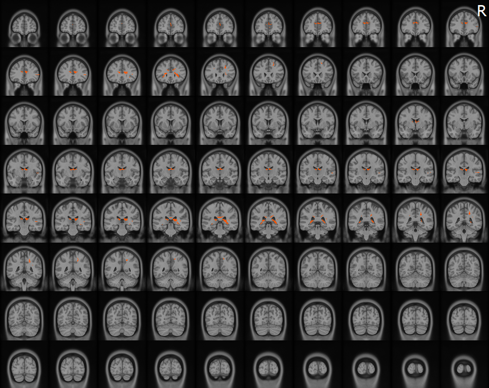{width=50%}

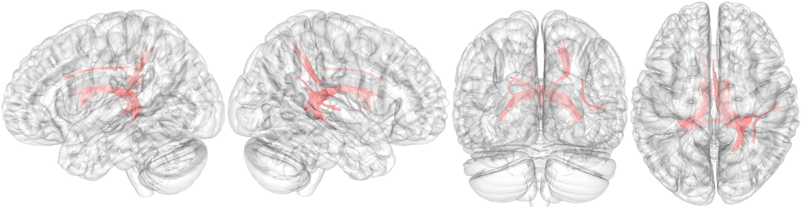

</center>
<br>

### Men

<span style="color: #ff5500;"><font size="5"><bold> Positive Correlations (FDR = 0.009969) </span></font></bold>

```{r rd_pos_wayfinding_men}
#Men positive
df <- read_csv(here("data", "dsp", "wayfinding_success", "rd",
                    "rd_pos_dsp_wayfinding_men.csv")) %>% 
  clean_names() %>% 
  filter(tract_name %in% c("number of tracts","mean length(mm)",
                          "diameter(mm)", "volume(mm^3)")) %>% 
  rotate_df() %>% row_to_names(row_number = 1) %>% 
  rownames_to_column("tract_name") %>% 
  mutate(tract_name = to_any_case(tract_name,"upper_camel", sep_out = "_")) %>% 
  mutate_at(c(2:5), as.numeric) %>% 
  filter(`number of tracts` >= 10)

#Present table
df %>% 
  kable(col.names = c("Tract Name", "Number of Tracts", "Mean Length (mm)",
                      "Diameter (mm)", "Volume (mm^3)"),
        digits = 3,
        table.attr = "style='width:90%;'"
        ) %>% 
  kable_styling(bootstrap_options = "hover") %>% 
  scroll_box(width = "800px", height = "200px")
```


<br>
<span style="color: #00ffff;"><font size="5"><bold> Negative Correlations (FDR = 1.000000) </span></font></bold>

No significant results in tracts.


<br>
<font size="5"> Figures </font>

<center>
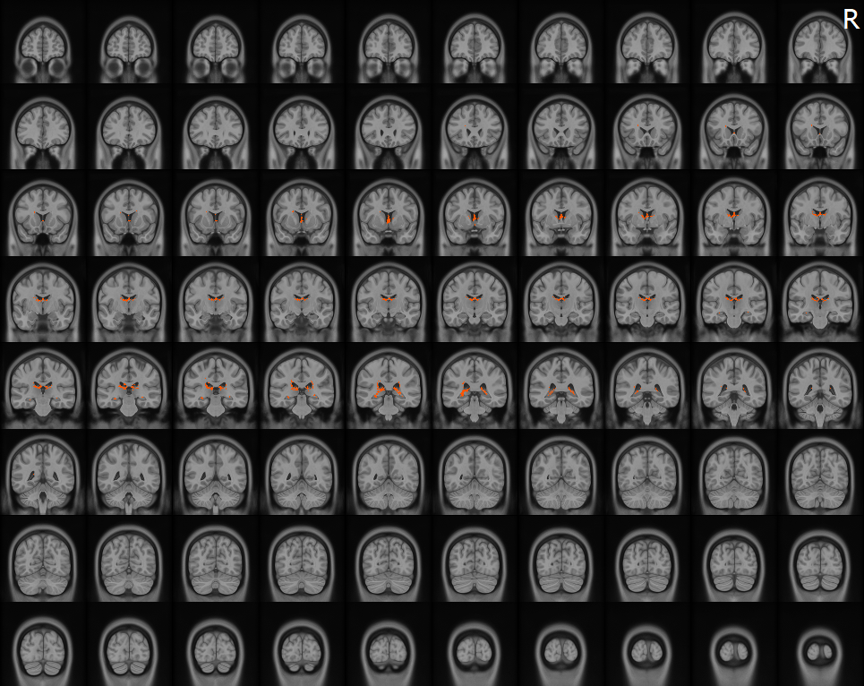{width=50%}

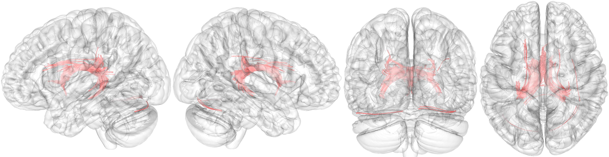

</center>
<br>

### Women

<span style="color: #ff5500;"><font size="5"><bold> Positive Correlations (FDR = 0.297806) </span></font></bold>

"No significant results in tracts."

```{r rd_pos_wayfinding_women}
#Women positive
df <- read_csv(here("data", "dsp", "wayfinding_success", "rd",
                    "rd_pos_dsp_wayfinding_women.csv")) %>% 
  clean_names() %>% 
  filter(tract_name %in% c("number of tracts","mean length(mm)",
                          "diameter(mm)", "volume(mm^3)")) %>% 
  rotate_df() %>% row_to_names(row_number = 1) %>% 
  rownames_to_column("tract_name") %>% 
  mutate(tract_name = to_any_case(tract_name,"upper_camel", sep_out = "_")) %>% 
  mutate_at(c(2:5), as.numeric) %>% 
  filter(`number of tracts` >= 10)

#Present table
df %>% 
  kable(col.names = c("Tract Name", "Number of Tracts", "Mean Length (mm)",
                      "Diameter (mm)", "Volume (mm^3)"),
        digits = 3,
        table.attr = "style='width:90%;'"
        ) %>% 
  kable_styling(bootstrap_options = "hover") %>% 
  scroll_box(width = "800px", height = "200px")
```


<br>
<span style="color: #00ffff;"><font size="5"><bold> Negative Correlations (FDR = 0.116981) </span></font></bold>

```{r rd_neg_wayfinding_women}
#Women negative
df <- read_csv(here("data", "dsp", "wayfinding_success", "rd",
                    "rd_neg_dsp_wayfinding_women.csv")) %>% 
  clean_names() %>% 
  filter(tract_name %in% c("number of tracts","mean length(mm)",
                          "diameter(mm)", "volume(mm^3)")) %>% 
  rotate_df() %>% row_to_names(row_number = 1) %>% 
  rownames_to_column("tract_name") %>% 
  mutate(tract_name = to_any_case(tract_name,"upper_camel", sep_out = "_")) %>% 
  mutate_at(c(2:5), as.numeric) %>% 
  filter(`number of tracts` >= 10)

#Present table
df %>% 
  kable(col.names = c("Tract Name", "Number of Tracts", "Mean Length (mm)",
                      "Diameter (mm)", "Volume (mm^3)"),
        digits = 3,
        table.attr = "style='width:90%;'"
        ) %>% 
  kable_styling(bootstrap_options = "hover") %>% 
  scroll_box(width = "800px", height = "200px")
```

<br>
<font size="5"> Figures </font>

<center>
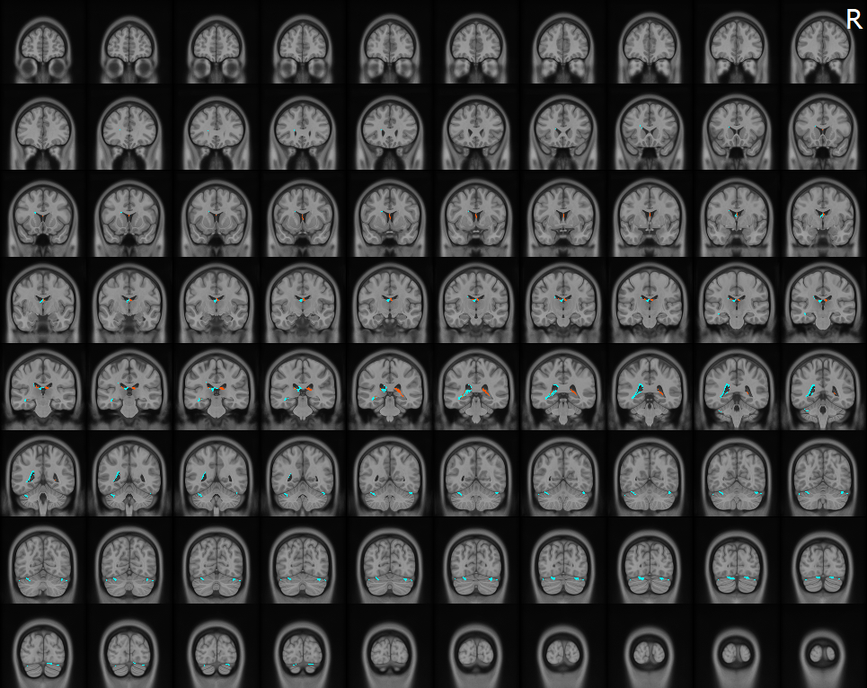{width=50%}


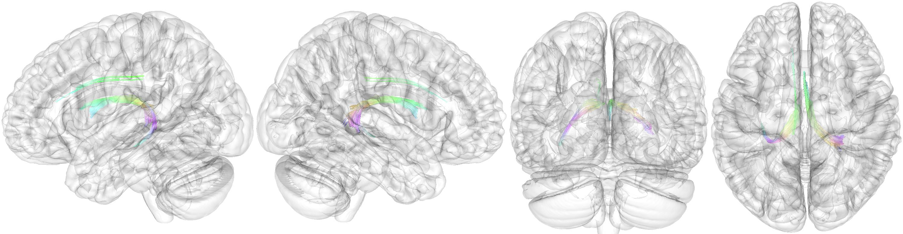

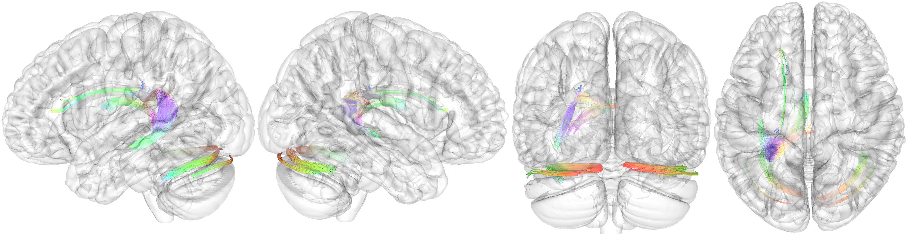

</center>
<br>

### Pre

<span style="color: #ff5500;"><font size="5"><bold> Positive Correlations (FDR = 0.830275) </span></font></bold>

"No significant results in tracts."

```{r rd_pos_wayfinding_pre}
#Pre positive
df <- read_csv(here("data", "dsp", "wayfinding_success", "rd",
                    "rd_pos_dsp_wayfinding_pre.csv")) %>% 
  clean_names() %>% 
  filter(tract_name %in% c("number of tracts","mean length(mm)",
                          "diameter(mm)", "volume(mm^3)")) %>% 
  rotate_df() %>% row_to_names(row_number = 1) %>% 
  rownames_to_column("tract_name") %>% 
  mutate(tract_name = to_any_case(tract_name,"upper_camel", sep_out = "_")) %>% 
  mutate_at(c(2:5), as.numeric) %>% 
  filter(`number of tracts` >= 10)

#Present table
df %>% 
  kable(col.names = c("Tract Name", "Number of Tracts", "Mean Length (mm)",
                      "Diameter (mm)", "Volume (mm^3)"),
        digits = 3,
        table.attr = "style='width:90%;'"
        ) %>% 
  kable_styling(bootstrap_options = "hover") %>% 
  scroll_box(width = "800px", height = "200px")
```


<br>
<span style="color: #00ffff;"><font size="5"><bold> Negative Correlations (FDR = 0.254985) </span></font></bold>

"No significant results in tracts."

```{r rd_neg_wayfinding_pre}
#Pre negative
df <- read_csv(here("data", "dsp", "wayfinding_success", "rd",
                    "rd_neg_dsp_wayfinding_pre.csv")) %>% 
  clean_names() %>% 
  filter(tract_name %in% c("number of tracts","mean length(mm)",
                          "diameter(mm)", "volume(mm^3)")) %>% 
  rotate_df() %>% row_to_names(row_number = 1) %>% 
  rownames_to_column("tract_name") %>% 
  mutate(tract_name = to_any_case(tract_name,"upper_camel", sep_out = "_")) %>% 
  mutate_at(c(2:5), as.numeric) %>% 
  filter(`number of tracts` >= 10)

#Present table
df %>% 
  kable(col.names = c("Tract Name", "Number of Tracts", "Mean Length (mm)",
                      "Diameter (mm)", "Volume (mm^3)"),
        digits = 3,
        table.attr = "style='width:90%;'"
        ) %>% 
  kable_styling(bootstrap_options = "hover") %>% 
  scroll_box(width = "800px", height = "200px")
```

<br>
<font size="5"> Figures </font>

<center>
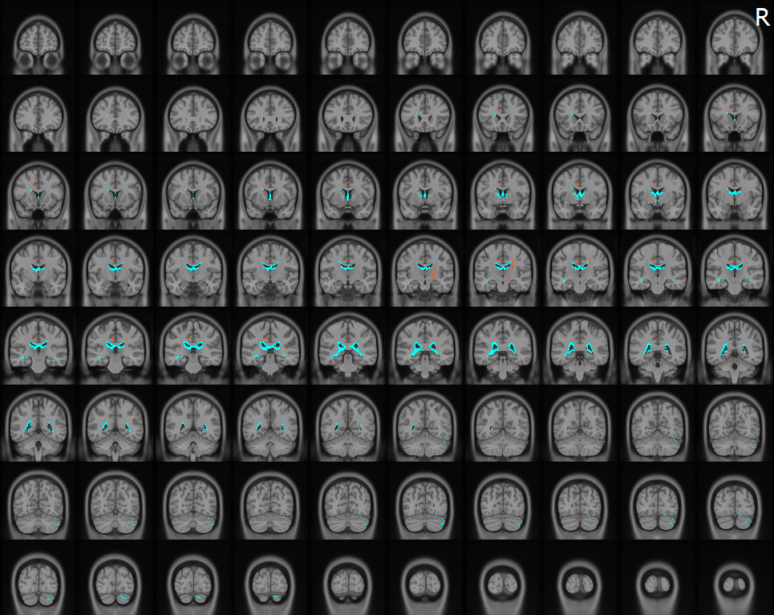{width=50%}


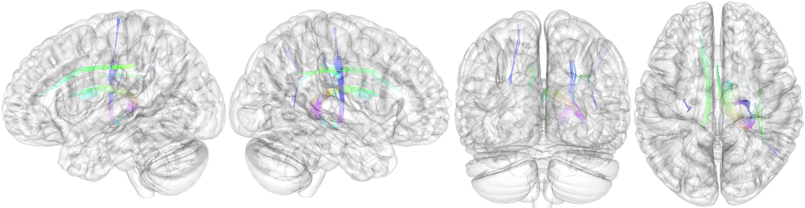

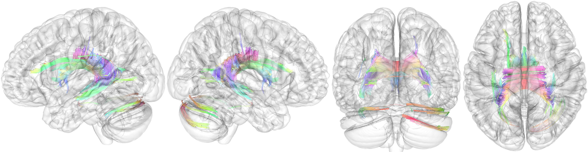

</center>
<br>

### Peri

<span style="color: #ff5500;"><font size="5"><bold> Positive Correlations (FDR = 0.272899) </span></font></bold>

"No significant results in tracts."

```{r rd_pos_wayfinding_peri}
#Peri positive
df <- read_csv(here("data", "dsp", "wayfinding_success", "rd",
                    "rd_pos_dsp_wayfinding_peri.csv")) %>% 
  clean_names() %>% 
  filter(tract_name %in% c("number of tracts","mean length(mm)",
                          "diameter(mm)", "volume(mm^3)")) %>% 
  rotate_df() %>% row_to_names(row_number = 1) %>% 
  rownames_to_column("tract_name") %>% 
  mutate(tract_name = to_any_case(tract_name,"upper_camel", sep_out = "_")) %>% 
  mutate_at(c(2:5), as.numeric) %>% 
  filter(`number of tracts` >= 10)

#Present table
df %>% 
  kable(col.names = c("Tract Name", "Number of Tracts", "Mean Length (mm)",
                      "Diameter (mm)", "Volume (mm^3)"),
        digits = 3,
        table.attr = "style='width:90%;'"
        ) %>% 
  kable_styling(bootstrap_options = "hover") %>% 
  scroll_box(width = "800px", height = "200px")
```


<br>
<span style="color: #00ffff;"><font size="5"><bold> Negative Correlations (FDR = 1.000000) </span></font></bold>

"No significant results in tracts."

```{r rd_neg_wayfinding_peri}
#Peri negative
df <- read_csv(here("data", "dsp", "wayfinding_success", "rd",
                    "rd_neg_dsp_wayfinding_peri.csv")) %>% 
  clean_names() %>% 
  filter(tract_name %in% c("number of tracts","mean length(mm)",
                          "diameter(mm)", "volume(mm^3)")) %>% 
  rotate_df() %>% row_to_names(row_number = 1) %>% 
  rownames_to_column("tract_name") %>% 
  mutate(tract_name = to_any_case(tract_name,"upper_camel", sep_out = "_")) %>% 
  mutate_at(c(2:5), as.numeric) %>% 
  filter(`number of tracts` >= 10)

#Present table
df %>% 
  kable(col.names = c("Tract Name", "Number of Tracts", "Mean Length (mm)",
                      "Diameter (mm)", "Volume (mm^3)"),
        digits = 3,
        table.attr = "style='width:90%;'"
        ) %>% 
  kable_styling(bootstrap_options = "hover") %>% 
  scroll_box(width = "800px", height = "200px")
```

<br>
<font size="5"> Figures </font>

<center>
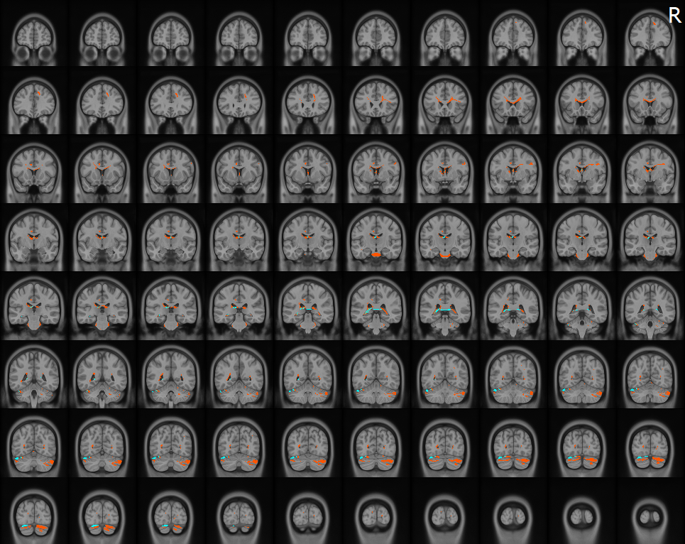{width=50%}


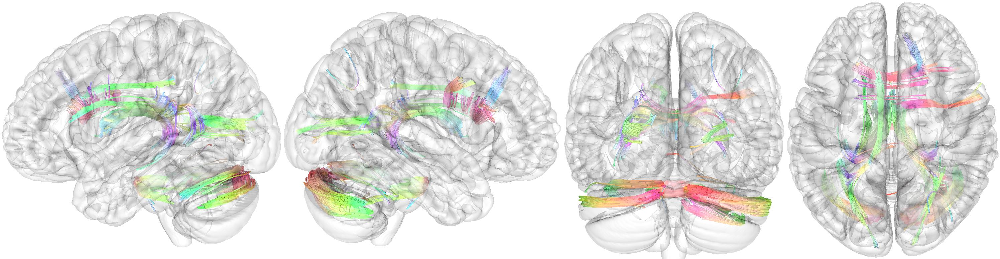

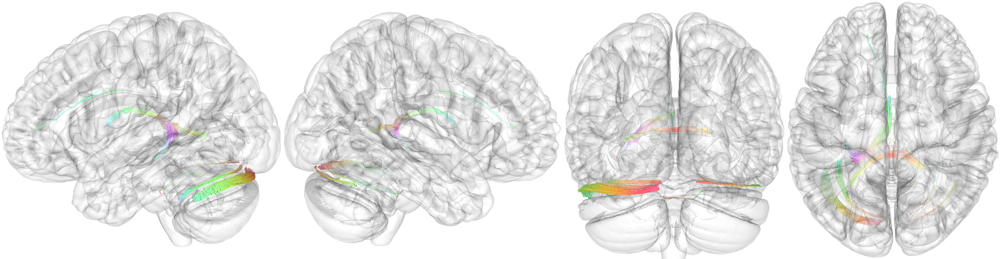

</center>
<br>

### Post

<span style="color: #ff5500;"><font size="5"><bold> Positive Correlations (FDR = 0.225851) </span></font></bold>

"No significant results in tracts."

```{r rd_pos_wayfinding_post}
#Post positive
df <- read_csv(here("data", "dsp", "wayfinding_success", "rd",
                    "rd_pos_dsp_wayfinding_post.csv")) %>% 
  clean_names() %>% 
  filter(tract_name %in% c("number of tracts","mean length(mm)",
                          "diameter(mm)", "volume(mm^3)")) %>% 
  rotate_df() %>% row_to_names(row_number = 1) %>% 
  rownames_to_column("tract_name") %>% 
  mutate(tract_name = to_any_case(tract_name,"upper_camel", sep_out = "_")) %>% 
  mutate_at(c(2:5), as.numeric) %>% 
  filter(`number of tracts` >= 10)

#Present table
df %>% 
  kable(col.names = c("Tract Name", "Number of Tracts", "Mean Length (mm)",
                      "Diameter (mm)", "Volume (mm^3)"),
        digits = 3,
        table.attr = "style='width:90%;'"
        ) %>% 
  kable_styling(bootstrap_options = "hover") %>% 
  scroll_box(width = "800px", height = "200px")
```


<br>
<span style="color: #00ffff;"><font size="5"><bold> Negative Correlations (FDR = 0.468263) </span></font></bold>

"No significant results in tracts."

```{r rd_neg_wayfinding_post}
#Post negative
df <- read_csv(here("data", "dsp", "wayfinding_success", "rd",
                    "rd_neg_dsp_wayfinding_post.csv")) %>% 
  clean_names() %>% 
  filter(tract_name %in% c("number of tracts","mean length(mm)",
                          "diameter(mm)", "volume(mm^3)")) %>% 
  rotate_df() %>% row_to_names(row_number = 1) %>% 
  rownames_to_column("tract_name") %>% 
  mutate(tract_name = to_any_case(tract_name,"upper_camel", sep_out = "_")) %>% 
  mutate_at(c(2:5), as.numeric) %>% 
  filter(`number of tracts` >= 10)

#Present table
df %>% 
  kable(col.names = c("Tract Name", "Number of Tracts", "Mean Length (mm)",
                      "Diameter (mm)", "Volume (mm^3)"),
        digits = 3,
        table.attr = "style='width:90%;'"
        ) %>% 
  kable_styling(bootstrap_options = "hover") %>% 
  scroll_box(width = "800px", height = "200px")
```

<br>
<font size="5"> Figures </font>

<center>
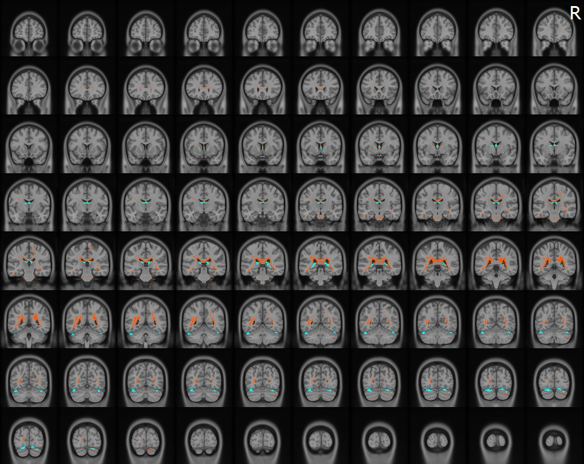{width=50%}

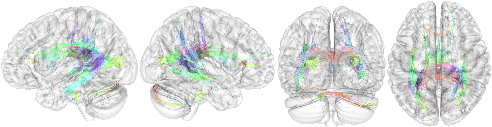

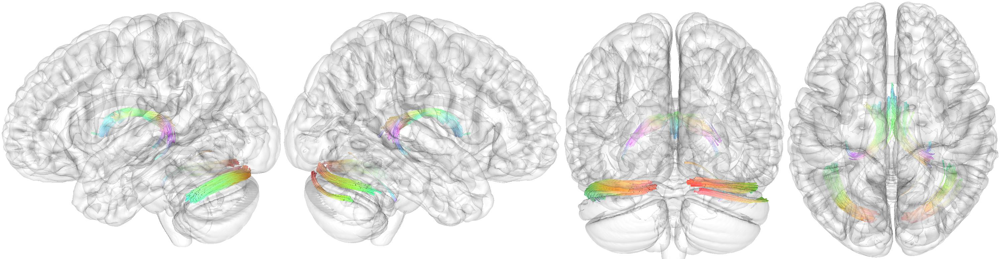

</center>
<br>

## {-}

# {-}

# Solution Index {.tabset .tabset-dropdown}

## QA {.tabset}

There were more negative correlations with tracts between QA and DSP solution index for almost all groups, with main tracts in the corpus callosum. Men and women also show more negative correlations with QA and DSP solution index, and reproductive groups show majority of negative correlations as well.

### All Subjects

<span style="color: #ff5500;"><font size="5"><bold> Positive Correlations (FDR = 0.643432) </span></font></bold>

"No significant results in tracts."

```{r qa_pos_solution_all}
#All subjects positive
df <- read_csv(here("data", "dsp", "solution_index", "qa",
                    "qa_pos_dsp_solution_all.csv")) %>% 
  clean_names() %>% 
  filter(tract_name %in% c("number of tracts","mean length(mm)",
                          "diameter(mm)", "volume(mm^3)")) %>% 
  rotate_df() %>% row_to_names(row_number = 1) %>% 
  rownames_to_column("tract_name") %>% 
  mutate(tract_name = to_any_case(tract_name,"upper_camel", sep_out = "_")) %>% 
  mutate_at(c(2:5), as.numeric) %>% 
  filter(`number of tracts` >= 10)

#Present table
df %>% 
  kable(col.names = c("Tract Name", "Number of Tracts", "Mean Length (mm)",
                      "Diameter (mm)", "Volume (mm^3)"),
        digits = 3,
        table.attr = "style='width:90%;'"
        ) %>% 
  kable_styling(bootstrap_options = "hover") %>% 
  scroll_box(width = "800px", height = "200px")
```


<br>
<span style="color: #00ffff;"><font size="5"><bold> Negative Correlations (FDR = 0.000625) </span></font></bold>

```{r qa_neg_solution_all}
#All subjects negative
df <- read_csv(here("data", "dsp", "solution_index", "qa",
                    "qa_neg_dsp_solution_all.csv")) %>% 
  clean_names() %>% 
  filter(tract_name %in% c("number of tracts","mean length(mm)",
                          "diameter(mm)", "volume(mm^3)")) %>% 
  rotate_df() %>% row_to_names(row_number = 1) %>% 
  rownames_to_column("tract_name") %>% 
  mutate(tract_name = to_any_case(tract_name,"upper_camel", sep_out = "_")) %>% 
  mutate_at(c(2:5), as.numeric) %>% 
  filter(`number of tracts` >= 10)

#Present table
df %>% 
  kable(col.names = c("Tract Name", "Number of Tracts", "Mean Length (mm)",
                      "Diameter (mm)", "Volume (mm^3)"),
        digits = 3,
        table.attr = "style='width:90%;'"
        ) %>% 
  kable_styling(bootstrap_options = "hover") %>% 
  scroll_box(width = "800px", height = "200px")
```

<br>
<font size="5"> Figures </font>

<center>
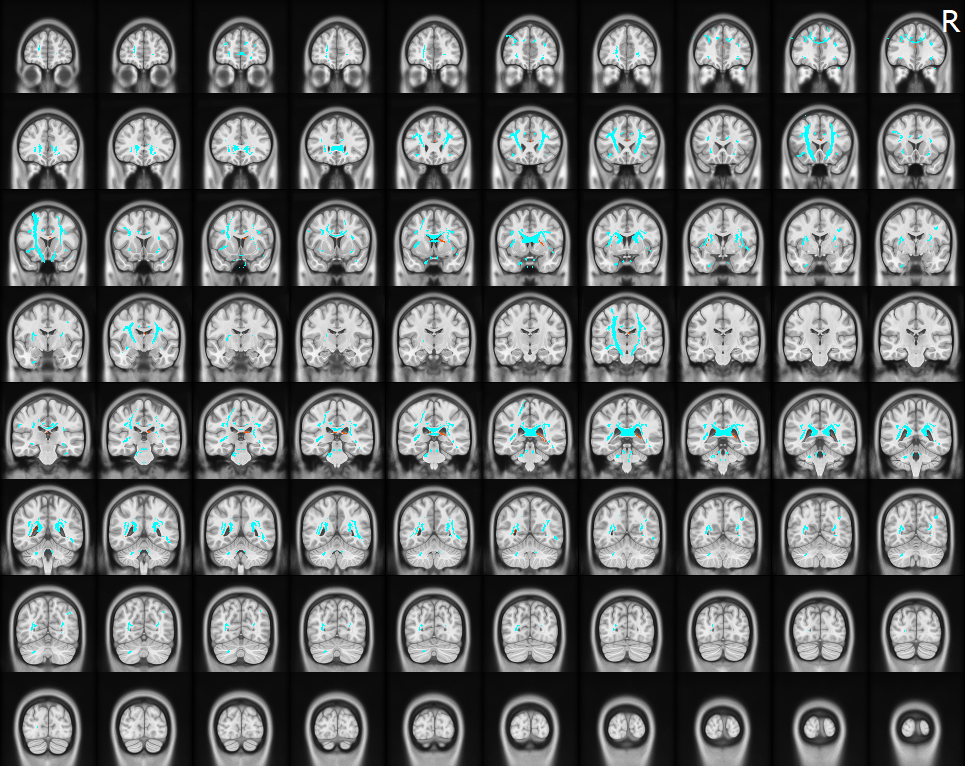{width=50%}

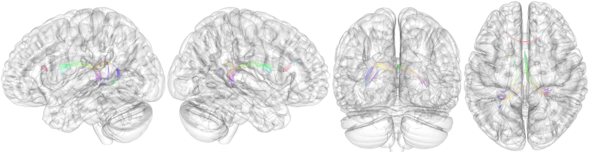

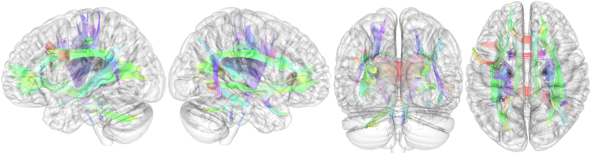

</center>
<br>

### Men

<span style="color: #ff5500;"><font size="5"><bold> Positive Correlations (FDR = 0.005155) </span></font></bold>


```{r qa_pos_solution_men}
#Men positive
df <- read_csv(here("data", "dsp", "solution_index", "qa",
                    "qa_pos_dsp_solution_men.csv")) %>% 
  clean_names() %>% 
  filter(tract_name %in% c("number of tracts","mean length(mm)",
                          "diameter(mm)", "volume(mm^3)")) %>% 
  rotate_df() %>% row_to_names(row_number = 1) %>% 
  rownames_to_column("tract_name") %>% 
  mutate(tract_name = to_any_case(tract_name,"upper_camel", sep_out = "_")) %>% 
  mutate_at(c(2:5), as.numeric) %>% 
  filter(`number of tracts` >= 10)

#Present table
df %>% 
  kable(col.names = c("Tract Name", "Number of Tracts", "Mean Length (mm)",
                      "Diameter (mm)", "Volume (mm^3)"),
        digits = 3,
        table.attr = "style='width:90%;'"
        ) %>% 
  kable_styling(bootstrap_options = "hover") %>% 
  scroll_box(width = "800px", height = "200px")
```


<br>
<span style="color: #00ffff;"><font size="5"><bold> Negative Correlations (FDR = 0.001159) </span></font></bold>

```{r qa_neg_solution_men}
#Men negative
df <- read_csv(here("data", "dsp", "solution_index", "qa",
                    "qa_neg_dsp_solution_men.csv")) %>% 
  clean_names() %>% 
  filter(tract_name %in% c("number of tracts","mean length(mm)",
                          "diameter(mm)", "volume(mm^3)")) %>% 
  rotate_df() %>% row_to_names(row_number = 1) %>% 
  rownames_to_column("tract_name") %>% 
  mutate(tract_name = to_any_case(tract_name,"upper_camel", sep_out = "_")) %>% 
  mutate_at(c(2:5), as.numeric) %>% 
  filter(`number of tracts` >= 10)

#Present table
df %>% 
  kable(col.names = c("Tract Name", "Number of Tracts", "Mean Length (mm)",
                      "Diameter (mm)", "Volume (mm^3)"),
        digits = 3,
        table.attr = "style='width:90%;'"
        ) %>% 
  kable_styling(bootstrap_options = "hover") %>% 
  scroll_box(width = "800px", height = "200px")
```

<br>
<font size="5"> Figures </font>

<center>
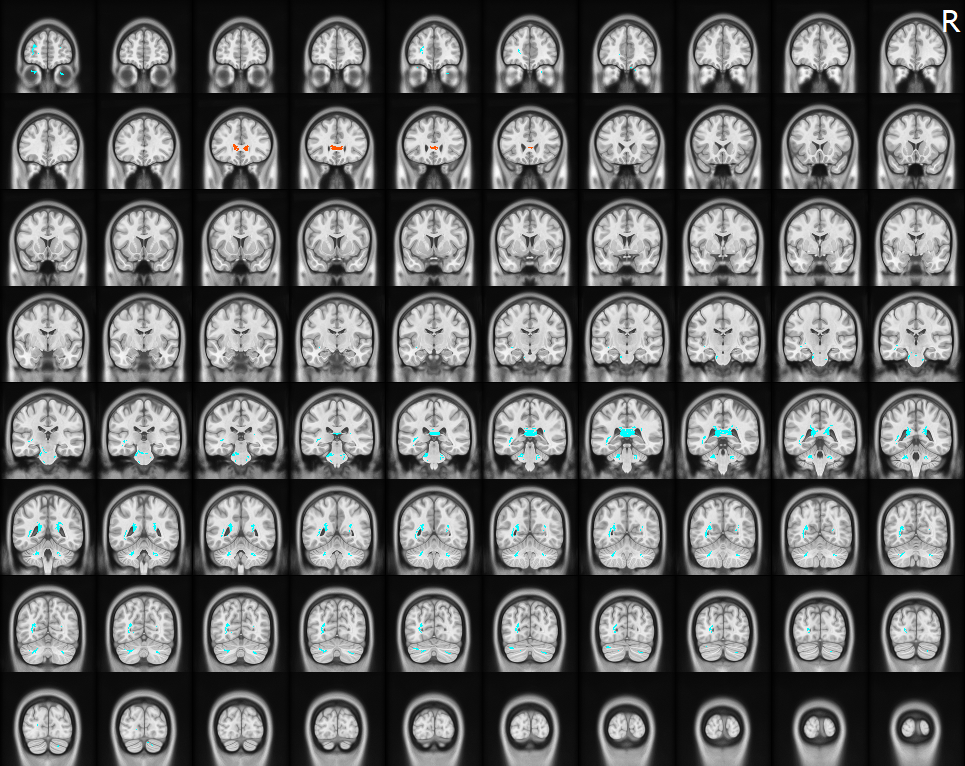{width=50%}

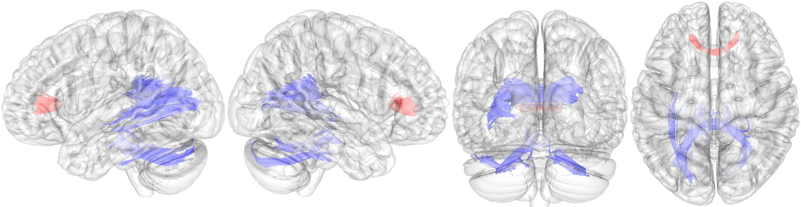

</center>
<br>

### Women

<span style="color: #ff5500;"><font size="5"><bold> Positive Correlations (FDR = 0.019608) </span></font></bold>

```{r qa_pos_solution_women}
#Women positive
df <- read_csv(here("data", "dsp", "solution_index", "qa",
                    "qa_pos_dsp_solution_women.csv")) %>% 
  clean_names() %>% 
  filter(tract_name %in% c("number of tracts","mean length(mm)",
                          "diameter(mm)", "volume(mm^3)")) %>% 
  rotate_df() %>% row_to_names(row_number = 1) %>% 
  rownames_to_column("tract_name") %>% 
  mutate(tract_name = to_any_case(tract_name,"upper_camel", sep_out = "_")) %>% 
  mutate_at(c(2:5), as.numeric) %>% 
  filter(`number of tracts` >= 10)

#Present table
df %>% 
  kable(col.names = c("Tract Name", "Number of Tracts", "Mean Length (mm)",
                      "Diameter (mm)", "Volume (mm^3)"),
        digits = 3,
        table.attr = "style='width:90%;'"
        ) %>% 
  kable_styling(bootstrap_options = "hover") %>% 
  scroll_box(width = "800px", height = "200px")
```


<br>
<span style="color: #00ffff;"><font size="5"><bold> Negative Correlations (FDR = 0.000551) </span></font></bold>

```{r qa_neg_solution_women}
#Women negative
df <- read_csv(here("data", "dsp", "solution_index", "qa",
                    "qa_neg_dsp_solution_women.csv")) %>% 
  clean_names() %>% 
  filter(tract_name %in% c("number of tracts","mean length(mm)",
                          "diameter(mm)", "volume(mm^3)")) %>% 
  rotate_df() %>% row_to_names(row_number = 1) %>% 
  rownames_to_column("tract_name") %>% 
  mutate(tract_name = to_any_case(tract_name,"upper_camel", sep_out = "_")) %>% 
  mutate_at(c(2:5), as.numeric) %>% 
  filter(`number of tracts` >= 10)

#Present table
df %>% 
  kable(col.names = c("Tract Name", "Number of Tracts", "Mean Length (mm)",
                      "Diameter (mm)", "Volume (mm^3)"),
        digits = 3,
        table.attr = "style='width:90%;'"
        ) %>% 
  kable_styling(bootstrap_options = "hover") %>% 
  scroll_box(width = "800px", height = "200px")
```

<br>
<font size="5"> Figures </font>

<center>
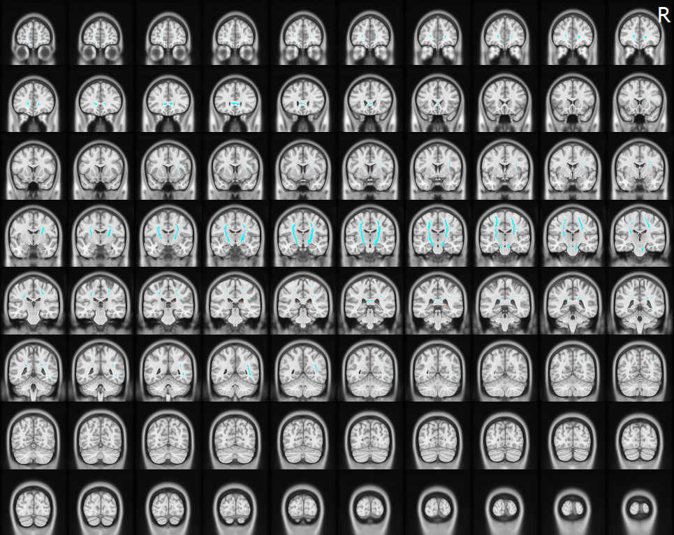{width=50%}

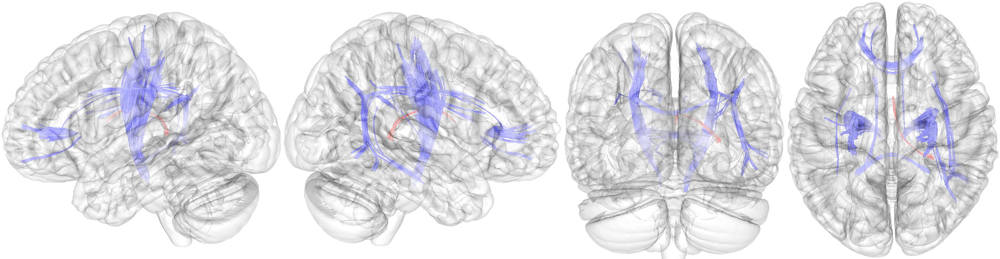
</center>
<br>

### Pre

<span style="color: #ff5500;"><font size="5"><bold> Positive Correlations (FDR = 0.001342) </span></font></bold>

```{r qa_pos_solution_pre}
#Pre positive
df <- read_csv(here("data", "dsp", "solution_index", "qa",
                    "qa_pos_dsp_solution_pre.csv")) %>% 
  clean_names() %>% 
  filter(tract_name %in% c("number of tracts","mean length(mm)",
                          "diameter(mm)", "volume(mm^3)")) %>% 
  rotate_df() %>% row_to_names(row_number = 1) %>% 
  rownames_to_column("tract_name") %>% 
  mutate(tract_name = to_any_case(tract_name,"upper_camel", sep_out = "_")) %>% 
  mutate_at(c(2:5), as.numeric) %>% 
  filter(`number of tracts` >= 10)

#Present table
df %>% 
  kable(col.names = c("Tract Name", "Number of Tracts", "Mean Length (mm)",
                      "Diameter (mm)", "Volume (mm^3)"),
        digits = 3,
        table.attr = "style='width:90%;'"
        ) %>% 
  kable_styling(bootstrap_options = "hover") %>% 
  scroll_box(width = "800px", height = "200px")
```


<br>
<span style="color: #00ffff;"><font size="5"><bold> Negative Correlations (FDR = 0.008445) </span></font></bold>

```{r qa_neg_solution_pre}
#Pre negative
df <- read_csv(here("data", "dsp", "solution_index", "qa",
                    "qa_neg_dsp_solution_pre.csv")) %>% 
  clean_names() %>% 
  filter(tract_name %in% c("number of tracts","mean length(mm)",
                          "diameter(mm)", "volume(mm^3)")) %>% 
  rotate_df() %>% row_to_names(row_number = 1) %>% 
  rownames_to_column("tract_name") %>% 
  mutate(tract_name = to_any_case(tract_name,"upper_camel", sep_out = "_")) %>% 
  mutate_at(c(2:5), as.numeric) %>% 
  filter(`number of tracts` >= 10)

#Present table
df %>% 
  kable(col.names = c("Tract Name", "Number of Tracts", "Mean Length (mm)",
                      "Diameter (mm)", "Volume (mm^3)"),
        digits = 3,
        table.attr = "style='width:90%;'"
        ) %>% 
  kable_styling(bootstrap_options = "hover") %>% 
  scroll_box(width = "800px", height = "200px")
```

<br>
<font size="5"> Figures </font>

<center>
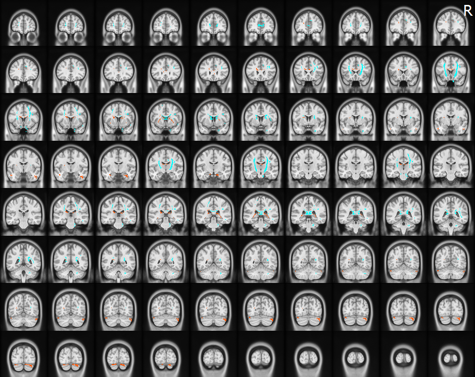{width=50%}

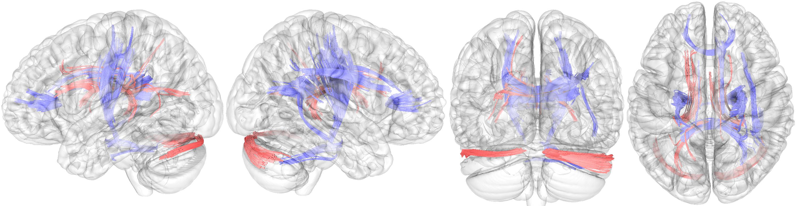
</center>
<br>

### Peri

<span style="color: #ff5500;"><font size="5"><bold> Positive Correlations (FDR = 0.410256) </span></font></bold>

"No significant results in tracts."

```{r qa_pos_solution_peri}
#Peri positive
df <- read_csv(here("data", "dsp", "solution_index", "qa",
                    "qa_pos_dsp_solution_peri.csv")) %>% 
  clean_names() %>% 
  filter(tract_name %in% c("number of tracts","mean length(mm)",
                          "diameter(mm)", "volume(mm^3)")) %>% 
  rotate_df() %>% row_to_names(row_number = 1) %>% 
  rownames_to_column("tract_name") %>% 
  mutate(tract_name = to_any_case(tract_name,"upper_camel", sep_out = "_")) %>% 
  mutate_at(c(2:5), as.numeric) %>% 
  filter(`number of tracts` >= 10)

#Present table
df %>% 
  kable(col.names = c("Tract Name", "Number of Tracts", "Mean Length (mm)",
                      "Diameter (mm)", "Volume (mm^3)"),
        digits = 3,
        table.attr = "style='width:90%;'"
        ) %>% 
  kable_styling(bootstrap_options = "hover") %>% 
  scroll_box(width = "800px", height = "200px")
```


<br>
<span style="color: #00ffff;"><font size="5"><bold> Negative Correlations (FDR = 0.013692) </span></font></bold>

```{r qa_neg_solution_peri}
#Peri negative
df <- read_csv(here("data", "dsp", "solution_index", "qa",
                    "qa_neg_dsp_solution_peri.csv")) %>% 
  clean_names() %>% 
  filter(tract_name %in% c("number of tracts","mean length(mm)",
                          "diameter(mm)", "volume(mm^3)")) %>% 
  rotate_df() %>% row_to_names(row_number = 1) %>% 
  rownames_to_column("tract_name") %>% 
  mutate(tract_name = to_any_case(tract_name,"upper_camel", sep_out = "_")) %>% 
  mutate_at(c(2:5), as.numeric) %>% 
  filter(`number of tracts` >= 10)

#Present table
df %>% 
  kable(col.names = c("Tract Name", "Number of Tracts", "Mean Length (mm)",
                      "Diameter (mm)", "Volume (mm^3)"),
        digits = 3,
        table.attr = "style='width:90%;'"
        ) %>% 
  kable_styling(bootstrap_options = "hover") %>% 
  scroll_box(width = "800px", height = "200px")
```

<br>
<font size="5"> Figures </font>

<center>
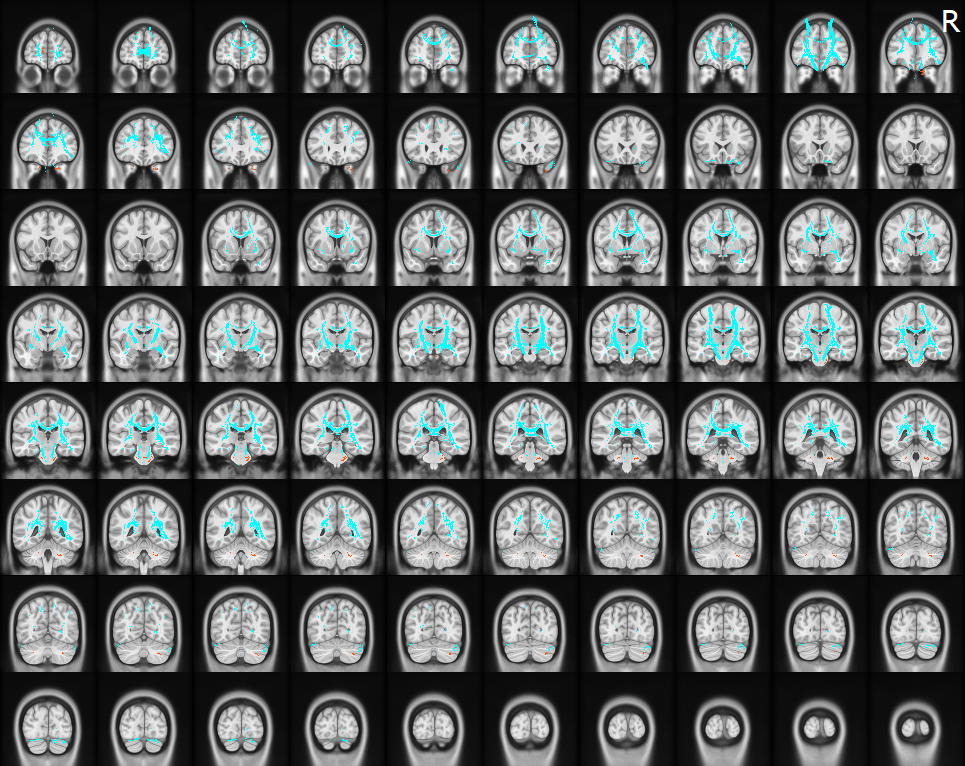{width=50%}

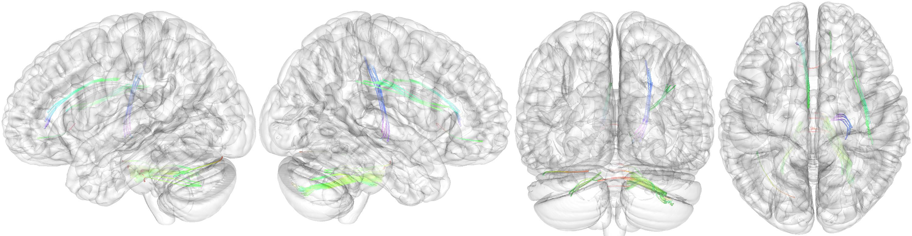

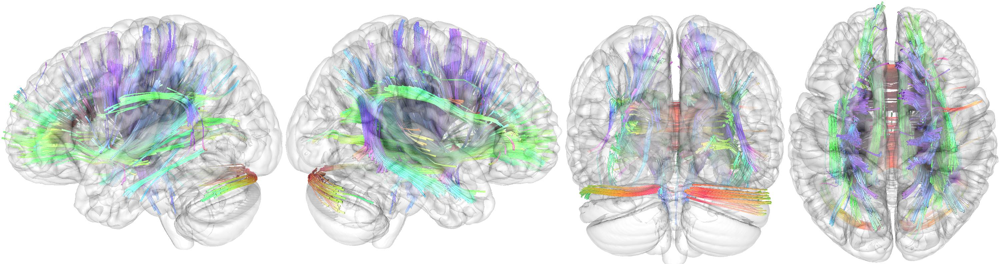

</center>
<br>

### Post

<span style="color: #ff5500;"><font size="5"><bold> Positive Correlations (FDR = 0.004243) </span></font></bold>


```{r qa_pos_solution_post}
#Post positive
df <- read_csv(here("data", "dsp", "solution_index", "qa",
                    "qa_pos_dsp_solution_post.csv")) %>% 
  clean_names() %>% 
  filter(tract_name %in% c("number of tracts","mean length(mm)",
                          "diameter(mm)", "volume(mm^3)")) %>% 
  rotate_df() %>% row_to_names(row_number = 1) %>% 
  rownames_to_column("tract_name") %>% 
  mutate(tract_name = to_any_case(tract_name,"upper_camel", sep_out = "_")) %>% 
  mutate_at(c(2:5), as.numeric) %>% 
  filter(`number of tracts` >= 10)

#Present table
df %>% 
  kable(col.names = c("Tract Name", "Number of Tracts", "Mean Length (mm)",
                      "Diameter (mm)", "Volume (mm^3)"),
        digits = 3,
        table.attr = "style='width:90%;'"
        ) %>% 
  kable_styling(bootstrap_options = "hover") %>% 
  scroll_box(width = "800px", height = "200px")
```


<br>
<span style="color: #00ffff;"><font size="5"><bold> Negative Correlations (FDR = 0.000235) </span></font></bold>

```{r qa_neg_solution_post}
#Post negative
df <- read_csv(here("data", "dsp", "solution_index", "qa",
                    "qa_neg_dsp_solution_post.csv")) %>% 
  clean_names() %>% 
  filter(tract_name %in% c("number of tracts","mean length(mm)",
                          "diameter(mm)", "volume(mm^3)")) %>% 
  rotate_df() %>% row_to_names(row_number = 1) %>% 
  rownames_to_column("tract_name") %>% 
  mutate(tract_name = to_any_case(tract_name,"upper_camel", sep_out = "_")) %>% 
  mutate_at(c(2:5), as.numeric) %>% 
  filter(`number of tracts` >= 10)

#Present table
df %>% 
  kable(col.names = c("Tract Name", "Number of Tracts", "Mean Length (mm)",
                      "Diameter (mm)", "Volume (mm^3)"),
        digits = 3,
        table.attr = "style='width:90%;'"
        ) %>% 
  kable_styling(bootstrap_options = "hover") %>% 
  scroll_box(width = "800px", height = "200px")
```

<br>
<font size="5"> Figures </font>

<center>
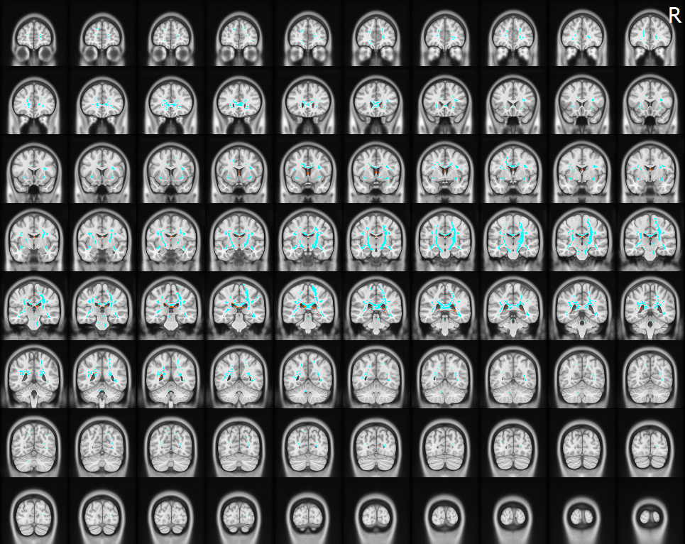{width=50%}


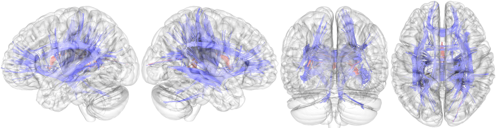
</center>
<br>


## {-}

## AD {.tabset}

The right fornix tract was commonly displayed with negative correlations with AD and  DSP solution index for all groups. There were no significant results in tracts for positive correlations among all subjects and women groups. Most tracts were found in negative correlations with AD and DSP solution index. Among reproductive stage, peris had more positive correlations while pres and posts mainly had negative correlations.

### All Subjects

<span style="color: #ff5500;"><font size="5"><bold> Positive Correlations (FDR = 1.000000) </span></font></bold>

No significant results in tracts.


<br>
<span style="color: #00ffff;"><font size="5"><bold> Negative Correlations (FDR = 0.000130) </span></font></bold>

```{r ad_neg_solution_all}
#All subjects negative
df <- read_csv(here("data", "dsp", "solution_index", "ad",
                    "ad_neg_dsp_solution_all.csv")) %>% 
  clean_names() %>% 
  filter(tract_name %in% c("number of tracts","mean length(mm)",
                          "diameter(mm)", "volume(mm^3)")) %>% 
  rotate_df() %>% row_to_names(row_number = 1) %>% 
  rownames_to_column("tract_name") %>% 
  mutate(tract_name = to_any_case(tract_name,"upper_camel", sep_out = "_")) %>% 
  mutate_at(c(2:5), as.numeric) %>% 
  filter(`number of tracts` >= 10)

#Present table
df %>% 
  kable(col.names = c("Tract Name", "Number of Tracts", "Mean Length (mm)",
                      "Diameter (mm)", "Volume (mm^3)"),
        digits = 3,
        table.attr = "style='width:90%;'"
        ) %>% 
  kable_styling(bootstrap_options = "hover") %>% 
  scroll_box(width = "800px", height = "200px")
```

<br>
<font size="5"> Figures </font>

<center>
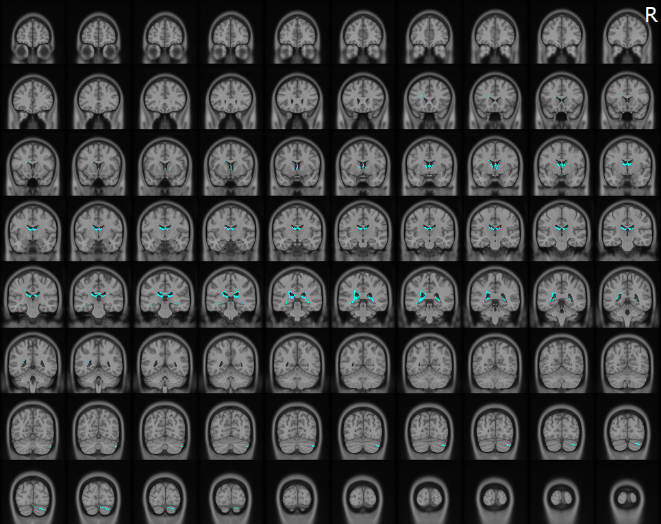{width=50%}

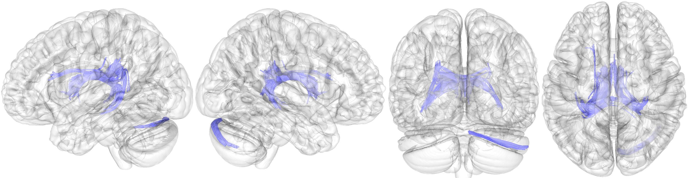
</center>
<br>


### Men

<span style="color: #ff5500;"><font size="5"><bold> Positive Correlations (FDR = 0.346154) </span></font></bold>

"No significant results in tracts."


```{r ad_pos_solution_men}
#Men positive
df <- read_csv(here("data", "dsp", "solution_index", "ad",
                    "ad_pos_dsp_solution_men.csv")) %>% 
  clean_names() %>% 
  filter(tract_name %in% c("number of tracts","mean length(mm)",
                          "diameter(mm)", "volume(mm^3)")) %>% 
  rotate_df() %>% row_to_names(row_number = 1) %>% 
  rownames_to_column("tract_name") %>% 
  mutate(tract_name = to_any_case(tract_name,"upper_camel", sep_out = "_")) %>% 
  mutate_at(c(2:5), as.numeric) %>% 
  filter(`number of tracts` >= 10)

#Present table
df %>% 
  kable(col.names = c("Tract Name", "Number of Tracts", "Mean Length (mm)",
                      "Diameter (mm)", "Volume (mm^3)"),
        digits = 3,
        table.attr = "style='width:90%;'"
        ) %>% 
  kable_styling(bootstrap_options = "hover") %>% 
  scroll_box(width = "800px", height = "200px")
```


<br>
<span style="color: #00ffff;"><font size="5"><bold> Negative Correlations (FDR = 0.586127) </span></font></bold>

"No significant results in tracts."

```{r ad_neg_solution_men}
#Men negative
df <- read_csv(here("data", "dsp", "solution_index", "ad",
                    "ad_neg_dsp_solution_men.csv")) %>% 
  clean_names() %>% 
  filter(tract_name %in% c("number of tracts","mean length(mm)",
                          "diameter(mm)", "volume(mm^3)")) %>% 
  rotate_df() %>% row_to_names(row_number = 1) %>% 
  rownames_to_column("tract_name") %>% 
  mutate(tract_name = to_any_case(tract_name,"upper_camel", sep_out = "_")) %>% 
  mutate_at(c(2:5), as.numeric) %>% 
  filter(`number of tracts` >= 10)

#Present table
df %>% 
  kable(col.names = c("Tract Name", "Number of Tracts", "Mean Length (mm)",
                      "Diameter (mm)", "Volume (mm^3)"),
        digits = 3,
        table.attr = "style='width:90%;'"
        ) %>% 
  kable_styling(bootstrap_options = "hover") %>% 
  scroll_box(width = "800px", height = "200px")
```

<br>
<font size="5"> Figures </font>

<center>
{width=50%}

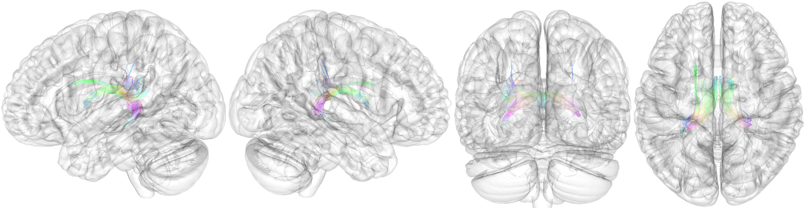

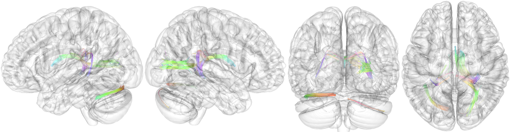

</center>
<br>


### Women

<span style="color: #ff5500;"><font size="5"><bold> Positive Correlations (FDR = 1.000000) </span></font></bold>

No significant results in tracts.


<br>
<span style="color: #00ffff;"><font size="5"><bold> Negative Correlations (FDR = 0.000139) </span></font></bold>


```{r ad_neg_solution_women}
#Women negative
df <- read_csv(here("data", "dsp", "solution_index", "ad",
                    "ad_neg_dsp_solution_women.csv")) %>% 
  clean_names() %>% 
  filter(tract_name %in% c("number of tracts","mean length(mm)",
                          "diameter(mm)", "volume(mm^3)")) %>% 
  rotate_df() %>% row_to_names(row_number = 1) %>% 
  rownames_to_column("tract_name") %>% 
  mutate(tract_name = to_any_case(tract_name,"upper_camel", sep_out = "_")) %>% 
  mutate_at(c(2:5), as.numeric) %>% 
  filter(`number of tracts` >= 10)

#Present table
df %>% 
  kable(col.names = c("Tract Name", "Number of Tracts", "Mean Length (mm)",
                      "Diameter (mm)", "Volume (mm^3)"),
        digits = 3,
        table.attr = "style='width:90%;'"
        ) %>% 
  kable_styling(bootstrap_options = "hover") %>% 
  scroll_box(width = "800px", height = "200px")
```

<br>
<font size="5"> Figures </font>

<center>
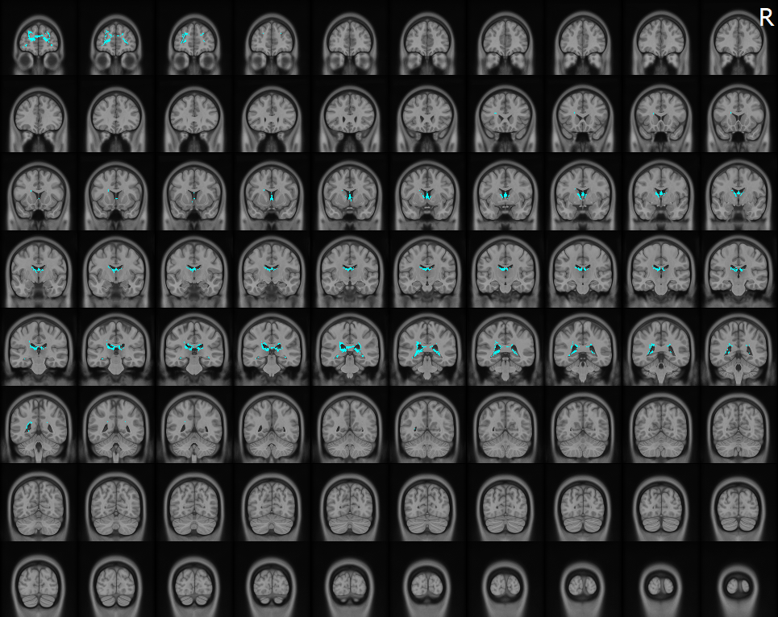{width=50%}


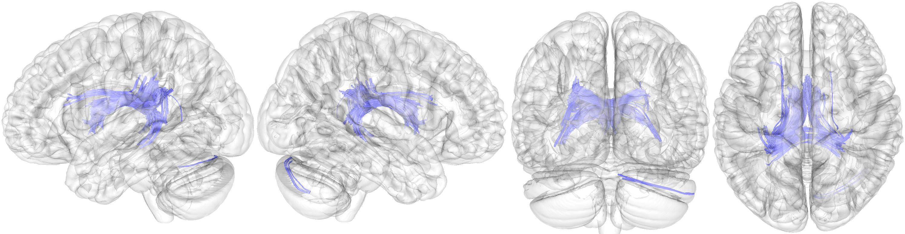

</center>
<br>

### Pre

<span style="color: #ff5500;"><font size="5"><bold> Positive Correlations (FDR = 0.166667) </span></font></bold>

All tracts < 10.

```{r ad_pos_solution_pre}
#Pre positive
df <- read_csv(here("data", "dsp", "solution_index", "ad",
                    "ad_pos_dsp_solution_pre.csv")) %>% 
  clean_names() %>% 
  filter(tract_name %in% c("number of tracts","mean length(mm)",
                          "diameter(mm)", "volume(mm^3)")) %>% 
  rotate_df() %>% row_to_names(row_number = 1) %>% 
  rownames_to_column("tract_name") %>% 
  mutate(tract_name = to_any_case(tract_name,"upper_camel", sep_out = "_")) %>% 
  mutate_at(c(2:5), as.numeric) 
#%>% filter(`number of tracts` >= 10)

#Present table
df %>% 
  kable(col.names = c("Tract Name", "Number of Tracts", "Mean Length (mm)",
                      "Diameter (mm)", "Volume (mm^3)"),
        digits = 3,
        table.attr = "style='width:90%;'"
        ) %>% 
  kable_styling(bootstrap_options = "hover") %>% 
  scroll_box(width = "800px", height = "200px")
```


<br>
<span style="color: #00ffff;"><font size="5"><bold> Negative Correlations (FDR = 0.000702) </span></font></bold>


```{r ad_neg_solution_pre}
#Pre negative
df <- read_csv(here("data", "dsp", "solution_index", "ad",
                    "ad_neg_dsp_solution_pre.csv")) %>% 
  clean_names() %>% 
  filter(tract_name %in% c("number of tracts","mean length(mm)",
                          "diameter(mm)", "volume(mm^3)")) %>% 
  rotate_df() %>% row_to_names(row_number = 1) %>% 
  rownames_to_column("tract_name") %>% 
  mutate(tract_name = to_any_case(tract_name,"upper_camel", sep_out = "_")) %>% 
  mutate_at(c(2:5), as.numeric) %>% 
  filter(`number of tracts` >= 10)

#Present table
df %>% 
  kable(col.names = c("Tract Name", "Number of Tracts", "Mean Length (mm)",
                      "Diameter (mm)", "Volume (mm^3)"),
        digits = 3,
        table.attr = "style='width:90%;'"
        ) %>% 
  kable_styling(bootstrap_options = "hover") %>% 
  scroll_box(width = "800px", height = "200px")
```

<br>
<font size="5"> Figures </font>

<center>
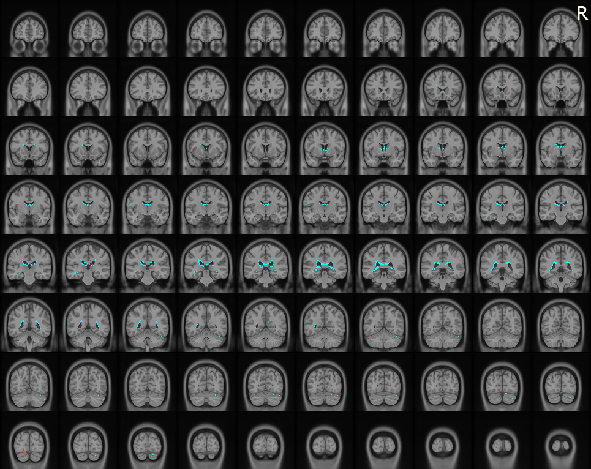{width=50%}

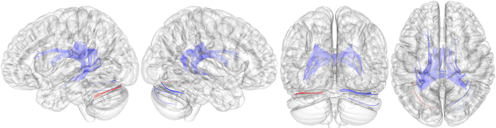

</center>
<br>

### Peri


<span style="color: #ff5500;"><font size="5"><bold> Positive Correlations (FDR = 0.231995) </span></font></bold>

"No significant results in tracts."

```{r ad_pos_solution_peri}
#Peri positive
df <- read_csv(here("data", "dsp", "solution_index", "ad",
                    "ad_pos_dsp_solution_peri.csv")) %>% 
  clean_names() %>% 
  filter(tract_name %in% c("number of tracts","mean length(mm)",
                          "diameter(mm)", "volume(mm^3)")) %>% 
  rotate_df() %>% row_to_names(row_number = 1) %>% 
  rownames_to_column("tract_name") %>% 
  mutate(tract_name = to_any_case(tract_name,"upper_camel", sep_out = "_")) %>% 
  mutate_at(c(2:5), as.numeric) %>% filter(`number of tracts` >= 10)

#Present table
df %>% 
  kable(col.names = c("Tract Name", "Number of Tracts", "Mean Length (mm)",
                      "Diameter (mm)", "Volume (mm^3)"),
        digits = 3,
        table.attr = "style='width:90%;'"
        ) %>% 
  kable_styling(bootstrap_options = "hover") %>% 
  scroll_box(width = "800px", height = "200px")
```


<br>
<span style="color: #00ffff;"><font size="5"><bold> Negative Correlations (FDR = 0.515029) </span></font></bold>

"No significant results in tracts."


```{r ad_neg_solution_peri}
#Peri negative
df <- read_csv(here("data", "dsp", "solution_index", "ad",
                    "ad_neg_dsp_solution_peri.csv")) %>% 
  clean_names() %>% 
  filter(tract_name %in% c("number of tracts","mean length(mm)",
                          "diameter(mm)", "volume(mm^3)")) %>% 
  rotate_df() %>% row_to_names(row_number = 1) %>% 
  rownames_to_column("tract_name") %>% 
  mutate(tract_name = to_any_case(tract_name,"upper_camel", sep_out = "_")) %>% 
  mutate_at(c(2:5), as.numeric) %>% 
  filter(`number of tracts` >= 10)

#Present table
df %>% 
  kable(col.names = c("Tract Name", "Number of Tracts", "Mean Length (mm)",
                      "Diameter (mm)", "Volume (mm^3)"),
        digits = 3,
        table.attr = "style='width:90%;'"
        ) %>% 
  kable_styling(bootstrap_options = "hover") %>% 
  scroll_box(width = "800px", height = "200px")
```

<br>
<font size="5"> Figures </font>

<center>
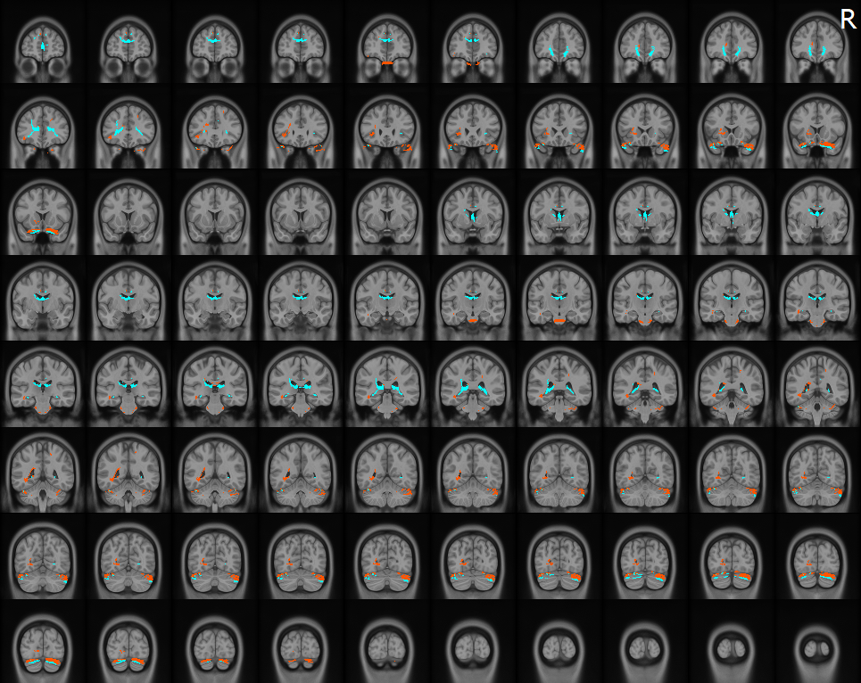{width=50%}

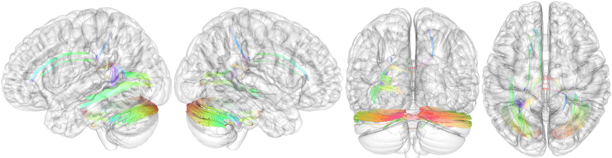

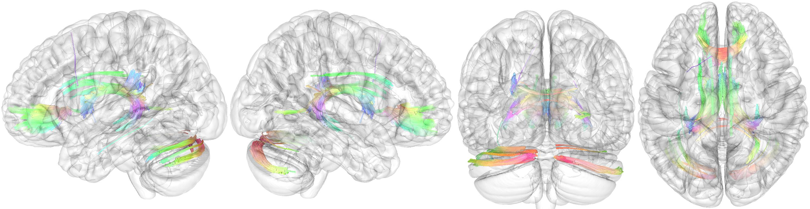

</center>
<br>

### Post

<span style="color: #ff5500;"><font size="5"><bold> Positive Correlations (FDR = 0.025641) </span></font></bold>

```{r ad_pos_solution_post}
#Post positive
df <- read_csv(here("data", "dsp", "solution_index", "ad",
                    "ad_pos_dsp_solution_post.csv")) %>% 
  clean_names() %>% 
  filter(tract_name %in% c("number of tracts","mean length(mm)",
                          "diameter(mm)", "volume(mm^3)")) %>% 
  rotate_df() %>% row_to_names(row_number = 1) %>% 
  rownames_to_column("tract_name") %>% 
  mutate(tract_name = to_any_case(tract_name,"upper_camel", sep_out = "_")) %>% 
  mutate_at(c(2:5), as.numeric) %>% filter(`number of tracts` >= 10)

#Present table
df %>% 
  kable(col.names = c("Tract Name", "Number of Tracts", "Mean Length (mm)",
                      "Diameter (mm)", "Volume (mm^3)"),
        digits = 3,
        table.attr = "style='width:90%;'"
        ) %>% 
  kable_styling(bootstrap_options = "hover") %>% 
  scroll_box(width = "800px", height = "200px")
```


<br>
<span style="color: #00ffff;"><font size="5"><bold> Negative Correlations (FDR = 0.000581) </span></font></bold>

```{r ad_neg_solution_post}
#Post negative
df <- read_csv(here("data", "dsp", "solution_index", "ad",
                    "ad_neg_dsp_solution_post.csv")) %>% 
  clean_names() %>% 
  filter(tract_name %in% c("number of tracts","mean length(mm)",
                          "diameter(mm)", "volume(mm^3)")) %>% 
  rotate_df() %>% row_to_names(row_number = 1) %>% 
  rownames_to_column("tract_name") %>% 
  mutate(tract_name = to_any_case(tract_name,"upper_camel", sep_out = "_")) %>% 
  mutate_at(c(2:5), as.numeric) %>% 
  filter(`number of tracts` >= 10)

#Present table
df %>% 
  kable(col.names = c("Tract Name", "Number of Tracts", "Mean Length (mm)",
                      "Diameter (mm)", "Volume (mm^3)"),
        digits = 3,
        table.attr = "style='width:90%;'"
        ) %>% 
  kable_styling(bootstrap_options = "hover") %>% 
  scroll_box(width = "800px", height = "200px")
```

<br>
<font size="5"> Figures </font>

<center>
{width=50%}


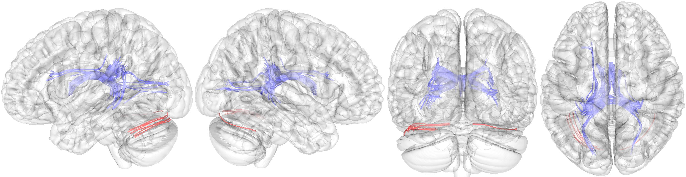

</center>
<br>


## {-}

## MD {.tabset}

The left and right fornix and corpus callosum tapetum tracts were commonly displayed among negative correlations for all groups between MD and DSP solution index. There were no significant positive correlations observed for all subjects, women, and pres. Men and peris had the most significant tracts for positive correlations. Most tracts were displayed for negative correlations with MD and DSP solution index.

### All Subjects

<span style="color: #ff5500;"><font size="5"><bold> Positive Correlations (FDR = 1.000000) </span></font></bold>

No significant results in tracts.


<br>
<span style="color: #00ffff;"><font size="5"><bold> Negative Correlations (FDR = 0.000877) </span></font></bold>

```{r md_neg_solution_all}
#All subjects negative
df <- read_csv(here("data", "dsp", "solution_index", "md",
                    "md_neg_dsp_solution_all.csv")) %>% 
  clean_names() %>% 
  filter(tract_name %in% c("number of tracts","mean length(mm)",
                          "diameter(mm)", "volume(mm^3)")) %>% 
  rotate_df() %>% row_to_names(row_number = 1) %>% 
  rownames_to_column("tract_name") %>% 
  mutate(tract_name = to_any_case(tract_name,"upper_camel", sep_out = "_")) %>% 
  mutate_at(c(2:5), as.numeric) %>% 
  filter(`number of tracts` >= 10)

#Present table
df %>% 
  kable(col.names = c("Tract Name", "Number of Tracts", "Mean Length (mm)",
                      "Diameter (mm)", "Volume (mm^3)"),
        digits = 3,
        table.attr = "style='width:90%;'"
        ) %>% 
  kable_styling(bootstrap_options = "hover") %>% 
  scroll_box(width = "800px", height = "200px")
```

<br>
<font size="5"> Figures </font>

<center>
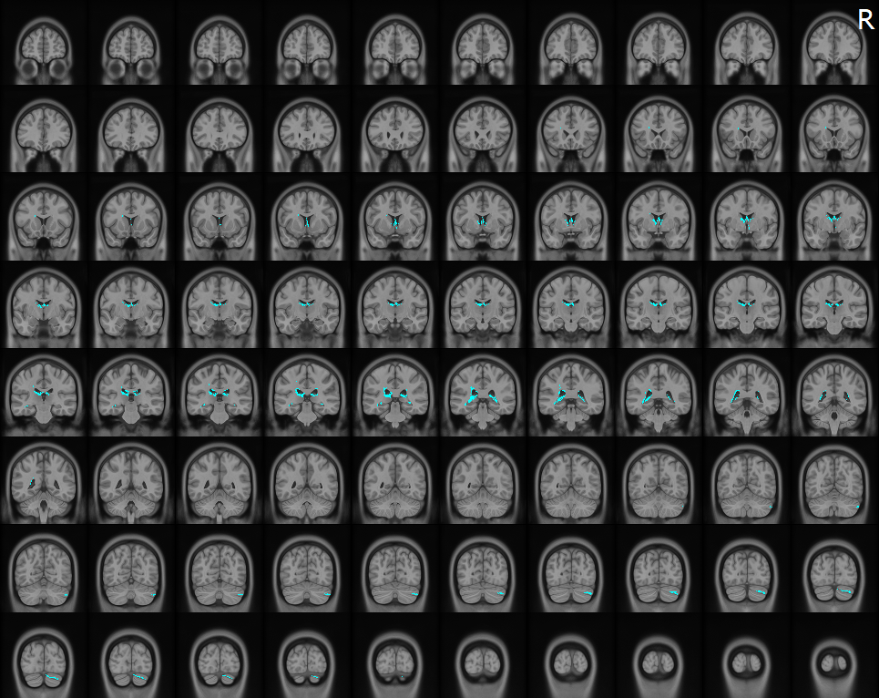{width=50%}

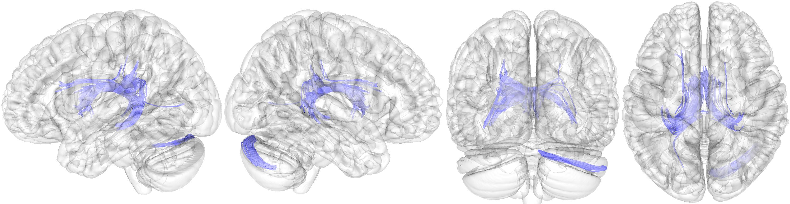

</center>
<br>

### Men

<span style="color: #ff5500;"><font size="5"><bold> Positive Correlations (FDR = 0.266154) </span></font></bold>

"No significant results intracts."

```{r md_pos_solution_men}
#Men positive
df <- read_csv(here("data", "dsp", "solution_index", "md",
                    "md_pos_dsp_solution_men.csv")) %>% 
  clean_names() %>% 
  filter(tract_name %in% c("number of tracts","mean length(mm)",
                          "diameter(mm)", "volume(mm^3)")) %>% 
  rotate_df() %>% row_to_names(row_number = 1) %>% 
  rownames_to_column("tract_name") %>% 
  mutate(tract_name = to_any_case(tract_name,"upper_camel", sep_out = "_")) %>% 
  mutate_at(c(2:5), as.numeric) %>% 
  filter(`number of tracts` >= 10)

#Present table
df %>% 
  kable(col.names = c("Tract Name", "Number of Tracts", "Mean Length (mm)",
                      "Diameter (mm)", "Volume (mm^3)"),
        digits = 3,
        table.attr = "style='width:90%;'"
        ) %>% 
  kable_styling(bootstrap_options = "hover") %>% 
  scroll_box(width = "800px", height = "200px")
```


<br>
<span style="color: #00ffff;"><font size="5"><bold> Negative Correlations (FDR = 0.737869) </span></font></bold>

"No significant results intracts."

```{r md_neg_solution_men}
#Men negative
df <- read_csv(here("data", "dsp", "solution_index", "md",
                    "md_neg_dsp_solution_men.csv")) %>% 
  clean_names() %>% 
  filter(tract_name %in% c("number of tracts","mean length(mm)",
                          "diameter(mm)", "volume(mm^3)")) %>% 
  rotate_df() %>% row_to_names(row_number = 1) %>% 
  rownames_to_column("tract_name") %>% 
  mutate(tract_name = to_any_case(tract_name,"upper_camel", sep_out = "_")) %>% 
  mutate_at(c(2:5), as.numeric) %>% 
  filter(`number of tracts` >= 10)

#Present table
df %>% 
  kable(col.names = c("Tract Name", "Number of Tracts", "Mean Length (mm)",
                      "Diameter (mm)", "Volume (mm^3)"),
        digits = 3,
        table.attr = "style='width:90%;'"
        ) %>% 
  kable_styling(bootstrap_options = "hover") %>% 
  scroll_box(width = "800px", height = "200px")
```

<br>
<font size="5"> Figures </font>

<center>
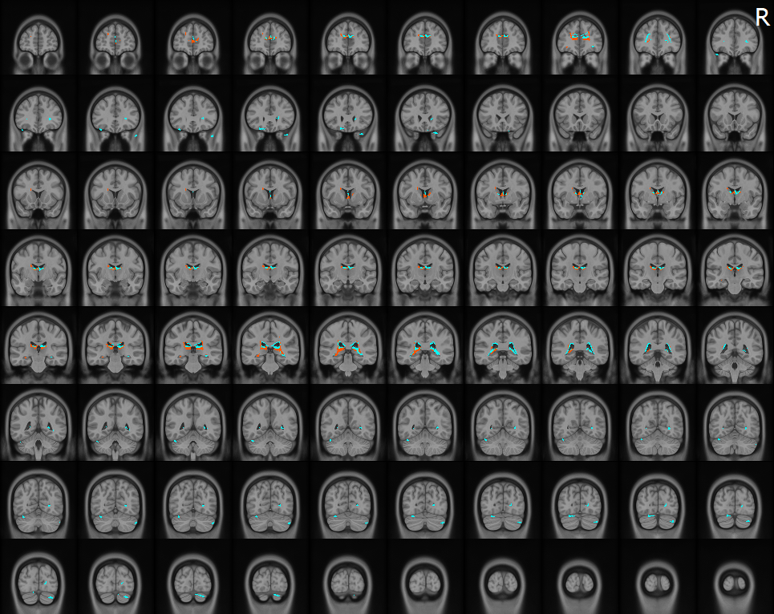{width=50%}

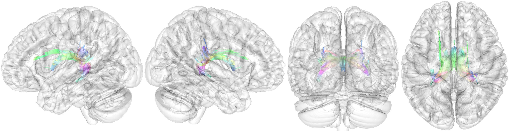

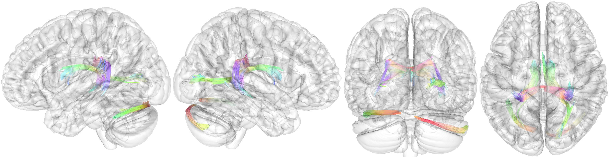

</center>
<br>

### Women

<span style="color: #ff5500;"><font size="5"><bold> Positive Correlations (FDR = 1.000000) </span></font></bold>

No significant results in tracts.

<br>
<span style="color: #00ffff;"><font size="5"><bold> Negative Correlations (FDR = 0.000169) </span></font></bold>

```{r md_neg_solution_women}
#Women negative
df <- read_csv(here("data", "dsp", "solution_index", "md",
                    "md_neg_dsp_solution_women.csv")) %>% 
  clean_names() %>% 
  filter(tract_name %in% c("number of tracts","mean length(mm)",
                          "diameter(mm)", "volume(mm^3)")) %>% 
  rotate_df() %>% row_to_names(row_number = 1) %>% 
  rownames_to_column("tract_name") %>% 
  mutate(tract_name = to_any_case(tract_name,"upper_camel", sep_out = "_")) %>% 
  mutate_at(c(2:5), as.numeric) %>% 
  filter(`number of tracts` >= 10)

#Present table
df %>% 
  kable(col.names = c("Tract Name", "Number of Tracts", "Mean Length (mm)",
                      "Diameter (mm)", "Volume (mm^3)"),
        digits = 3,
        table.attr = "style='width:90%;'"
        ) %>% 
  kable_styling(bootstrap_options = "hover") %>% 
  scroll_box(width = "800px", height = "200px")
```

<br>
<font size="5"> Figures </font>

<center>
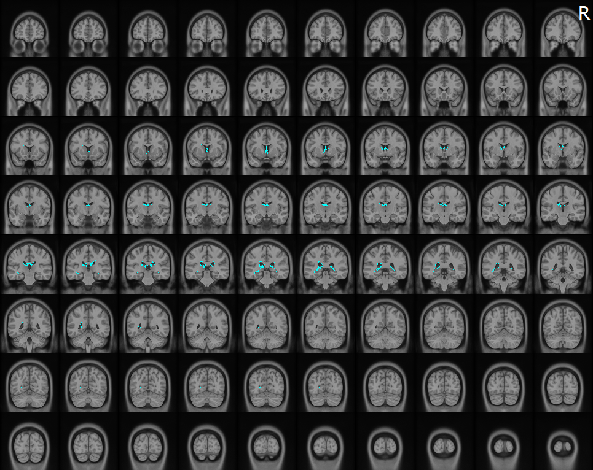{width=50%}

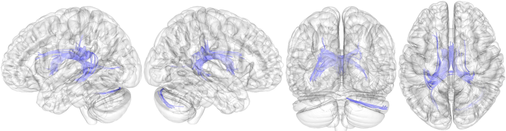

</center>
<br>

### Pre

<span style="color: #ff5500;"><font size="5"><bold> Positive Correlations (FDR = 1.000000) </span></font></bold>

No significant results in tracts.

<br>
<span style="color: #00ffff;"><font size="5"><bold> Negative Correlations (FDR = 0.001491) </span></font></bold>

```{r md_neg_solution_pre}
#Pre negative
df <- read_csv(here("data", "dsp", "solution_index", "md",
                    "md_neg_dsp_solution_pre.csv")) %>% 
  clean_names() %>% 
  filter(tract_name %in% c("number of tracts","mean length(mm)",
                          "diameter(mm)", "volume(mm^3)")) %>% 
  rotate_df() %>% row_to_names(row_number = 1) %>% 
  rownames_to_column("tract_name") %>% 
  mutate(tract_name = to_any_case(tract_name,"upper_camel", sep_out = "_")) %>% 
  mutate_at(c(2:5), as.numeric) %>% 
  filter(`number of tracts` >= 10)

#Present table
df %>% 
  kable(col.names = c("Tract Name", "Number of Tracts", "Mean Length (mm)",
                      "Diameter (mm)", "Volume (mm^3)"),
        digits = 3,
        table.attr = "style='width:90%;'"
        ) %>% 
  kable_styling(bootstrap_options = "hover") %>% 
  scroll_box(width = "800px", height = "200px")
```

<br>
<font size="5"> Figures </font>

<center>
{width=50%}


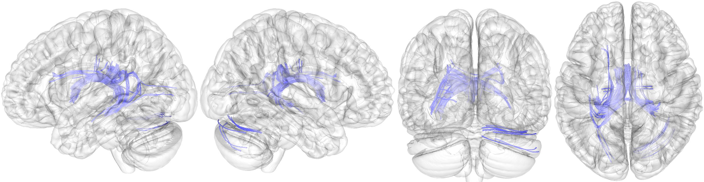

</center>
<br>

### Peri

<span style="color: #ff5500;"><font size="5"><bold> Positive Correlations (FDR = 0.236985) </span></font></bold>

"No significant results in tracts."

```{r md_pos_solution_peri}
#Peri positive
df <- read_csv(here("data", "dsp", "solution_index", "md",
                    "md_pos_dsp_solution_peri.csv")) %>% 
  clean_names() %>% 
  filter(tract_name %in% c("number of tracts","mean length(mm)",
                          "diameter(mm)", "volume(mm^3)")) %>% 
  rotate_df() %>% row_to_names(row_number = 1) %>% 
  rownames_to_column("tract_name") %>% 
  mutate(tract_name = to_any_case(tract_name,"upper_camel", sep_out = "_")) %>% 
  mutate_at(c(2:5), as.numeric) %>% 
  filter(`number of tracts` >= 10)

#Present table
df %>% 
  kable(col.names = c("Tract Name", "Number of Tracts", "Mean Length (mm)",
                      "Diameter (mm)", "Volume (mm^3)"),
        digits = 3,
        table.attr = "style='width:90%;'"
        ) %>% 
  kable_styling(bootstrap_options = "hover") %>% 
  scroll_box(width = "800px", height = "200px")
```


<br>
<span style="color: #00ffff;"><font size="5"><bold> Negative Correlations (FDR = 0.977853) </span></font></bold>

"No significant results in tracts."

```{r md_neg_solution_peri}
#Peri negative
df <- read_csv(here("data", "dsp", "solution_index", "md",
                    "md_neg_dsp_solution_peri.csv")) %>% 
  clean_names() %>% 
  filter(tract_name %in% c("number of tracts","mean length(mm)",
                          "diameter(mm)", "volume(mm^3)")) %>% 
  rotate_df() %>% row_to_names(row_number = 1) %>% 
  rownames_to_column("tract_name") %>% 
  mutate(tract_name = to_any_case(tract_name,"upper_camel", sep_out = "_")) %>% 
  mutate_at(c(2:5), as.numeric) %>% 
  filter(`number of tracts` >= 10)

#Present table
df %>% 
  kable(col.names = c("Tract Name", "Number of Tracts", "Mean Length (mm)",
                      "Diameter (mm)", "Volume (mm^3)"),
        digits = 3,
        table.attr = "style='width:90%;'"
        ) %>% 
  kable_styling(bootstrap_options = "hover") %>% 
  scroll_box(width = "800px", height = "200px")
```

<br>
<font size="5"> Figures </font>

<center>
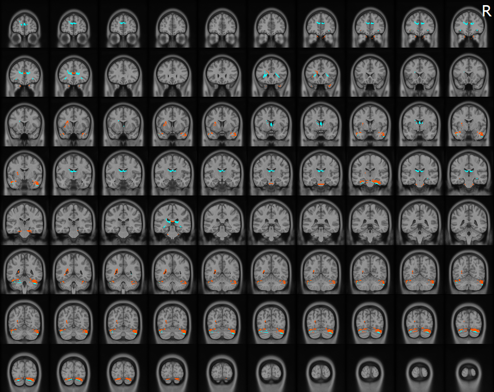{width=50%}


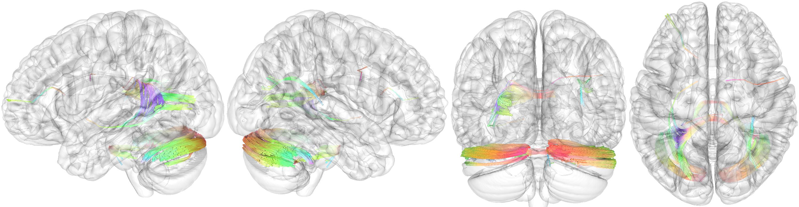

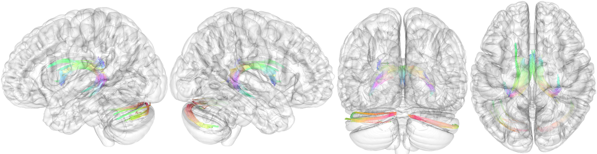

</center>
<br>

### Post

<span style="color: #ff5500;"><font size="5"><bold> Positive Correlations (FDR = 0.238806) </span></font></bold>

"No significant results in tracts."

```{r md_pos_solution_post}
#Post positive
df <- read_csv(here("data", "dsp", "solution_index", "md",
                    "md_pos_dsp_solution_post.csv")) %>% 
  clean_names() %>% 
  filter(tract_name %in% c("number of tracts","mean length(mm)",
                          "diameter(mm)", "volume(mm^3)")) %>% 
  rotate_df() %>% row_to_names(row_number = 1) %>% 
  rownames_to_column("tract_name") %>% 
  mutate(tract_name = to_any_case(tract_name,"upper_camel", sep_out = "_")) %>% 
  mutate_at(c(2:5), as.numeric) %>% 
  filter(`number of tracts` >= 10)

#Present table
df %>% 
  kable(col.names = c("Tract Name", "Number of Tracts", "Mean Length (mm)",
                      "Diameter (mm)", "Volume (mm^3)"),
        digits = 3,
        table.attr = "style='width:90%;'"
        ) %>% 
  kable_styling(bootstrap_options = "hover") %>% 
  scroll_box(width = "800px", height = "200px")
```


<br>
<span style="color: #00ffff;"><font size="5"><bold> Negative Correlations (FDR = 0.000149) </span></font></bold>

```{r md_neg_solution_post}
#Post negative
df <- read_csv(here("data", "dsp", "solution_index", "md",
                    "md_neg_dsp_solution_post.csv")) %>% 
  clean_names() %>% 
  filter(tract_name %in% c("number of tracts","mean length(mm)",
                          "diameter(mm)", "volume(mm^3)")) %>% 
  rotate_df() %>% row_to_names(row_number = 1) %>% 
  rownames_to_column("tract_name") %>% 
  mutate(tract_name = to_any_case(tract_name,"upper_camel", sep_out = "_")) %>% 
  mutate_at(c(2:5), as.numeric) %>% 
  filter(`number of tracts` >= 10)

#Present table
df %>% 
  kable(col.names = c("Tract Name", "Number of Tracts", "Mean Length (mm)",
                      "Diameter (mm)", "Volume (mm^3)"),
        digits = 3,
        table.attr = "style='width:90%;'"
        ) %>% 
  kable_styling(bootstrap_options = "hover") %>% 
  scroll_box(width = "800px", height = "200px")
```

<br>
<font size="5"> Figures </font>

<center>
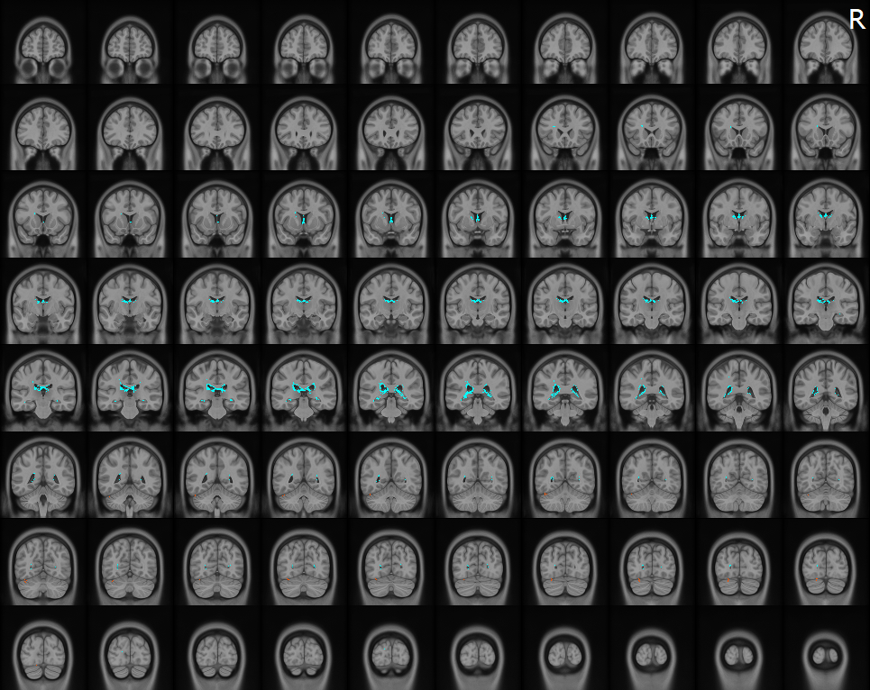{width=50%}

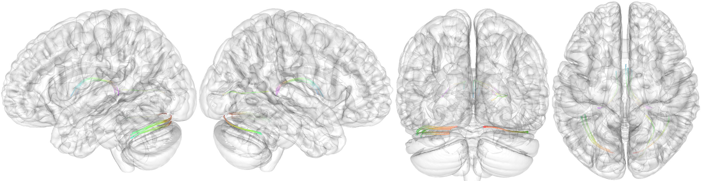

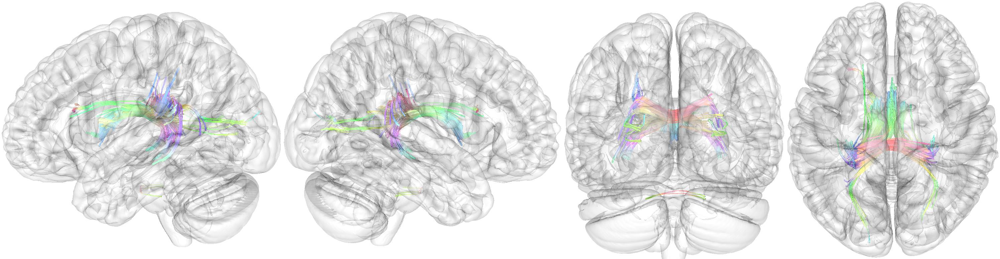

</center>
<br>


## {-}

## RD {.tabset}

The left and right fornix tracts were commonly displayed among negative correlations for all groups between RD and DSP solution index. There were no significant positive correlations observed for all subjects, women, and pres. Men and peris had the most significant tracts for positive correlations. Most tracts were displayed for negative correlations with RD and DSP solution index.

### All Subjects

<span style="color: #ff5500;"><font size="5"><bold> Positive Correlations (FDR = 1.000000) </span></font></bold>

No significant results in tracts.


<br>
<span style="color: #00ffff;"><font size="5"><bold> Negative Correlations (FDR = 0.001969) </span></font></bold>

```{r rd_neg_solution_all}
#All subjects negative
df <- read_csv(here("data", "dsp", "solution_index", "rd",
                    "rd_neg_dsp_solution_all.csv")) %>% 
  clean_names() %>% 
  filter(tract_name %in% c("number of tracts","mean length(mm)",
                          "diameter(mm)", "volume(mm^3)")) %>% 
  rotate_df() %>% row_to_names(row_number = 1) %>% 
  rownames_to_column("tract_name") %>% 
  mutate(tract_name = to_any_case(tract_name,"upper_camel", sep_out = "_")) %>% 
  mutate_at(c(2:5), as.numeric) %>% 
  filter(`number of tracts` >= 10)

#Present table
df %>% 
  kable(col.names = c("Tract Name", "Number of Tracts", "Mean Length (mm)",
                      "Diameter (mm)", "Volume (mm^3)"),
        digits = 3,
        table.attr = "style='width:90%;'"
        ) %>% 
  kable_styling(bootstrap_options = "hover") %>% 
  scroll_box(width = "800px", height = "200px")
```

<br>
<font size="5"> Figures </font>

<center>
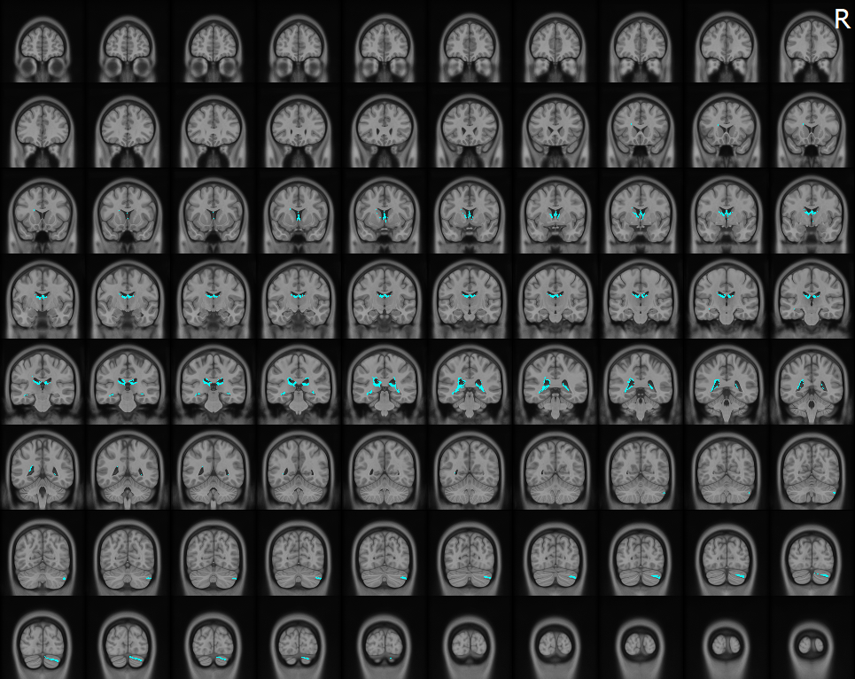{width=50%}

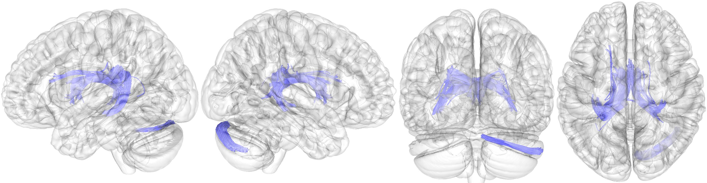

</center>
<br>

### Men

<span style="color: #ff5500;"><font size="5"><bold> Positive Correlations (FDR = 0.247385) </span></font></bold>

"No significant results in tracts."


```{r rd_pos_solution_men}
#Men positive
df <- read_csv(here("data", "dsp", "solution_index", "rd",
                    "rd_pos_dsp_solution_men.csv")) %>% 
  clean_names() %>% 
  filter(tract_name %in% c("number of tracts","mean length(mm)",
                          "diameter(mm)", "volume(mm^3)")) %>% 
  rotate_df() %>% row_to_names(row_number = 1) %>% 
  rownames_to_column("tract_name") %>% 
  mutate(tract_name = to_any_case(tract_name,"upper_camel", sep_out = "_")) %>% 
  mutate_at(c(2:5), as.numeric) %>% 
  filter(`number of tracts` >= 10)

#Present table
df %>% 
  kable(col.names = c("Tract Name", "Number of Tracts", "Mean Length (mm)",
                      "Diameter (mm)", "Volume (mm^3)"),
        digits = 3,
        table.attr = "style='width:90%;'"
        ) %>% 
  kable_styling(bootstrap_options = "hover") %>% 
  scroll_box(width = "800px", height = "200px")
```


<br>
<span style="color: #00ffff;"><font size="5"><bold> Negative Correlations (FDR = 0.619384) </span></font></bold>

"No significant results in tracts."

```{r rd_neg_solution_men}
#Men negative
df <- read_csv(here("data", "dsp", "solution_index", "rd",
                    "rd_neg_dsp_solution_men.csv")) %>% 
  clean_names() %>% 
  filter(tract_name %in% c("number of tracts","mean length(mm)",
                          "diameter(mm)", "volume(mm^3)")) %>% 
  rotate_df() %>% row_to_names(row_number = 1) %>% 
  rownames_to_column("tract_name") %>% 
  mutate(tract_name = to_any_case(tract_name,"upper_camel", sep_out = "_")) %>% 
  mutate_at(c(2:5), as.numeric) %>% 
  filter(`number of tracts` >= 10)

#Present table
df %>% 
  kable(col.names = c("Tract Name", "Number of Tracts", "Mean Length (mm)",
                      "Diameter (mm)", "Volume (mm^3)"),
        digits = 3,
        table.attr = "style='width:90%;'"
        ) %>% 
  kable_styling(bootstrap_options = "hover") %>% 
  scroll_box(width = "800px", height = "200px")
```

<br>
<font size="5"> Figures </font>

<center>
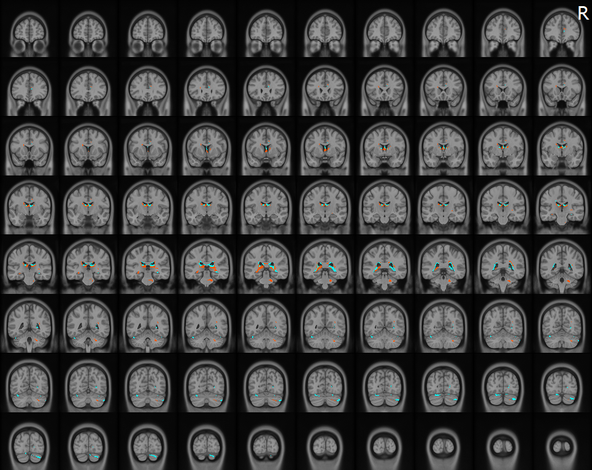{width=50%}

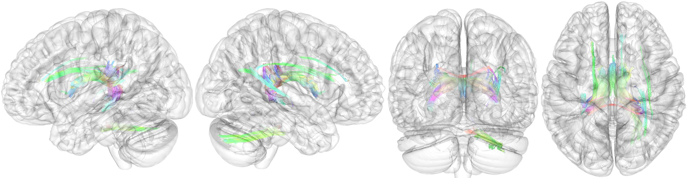

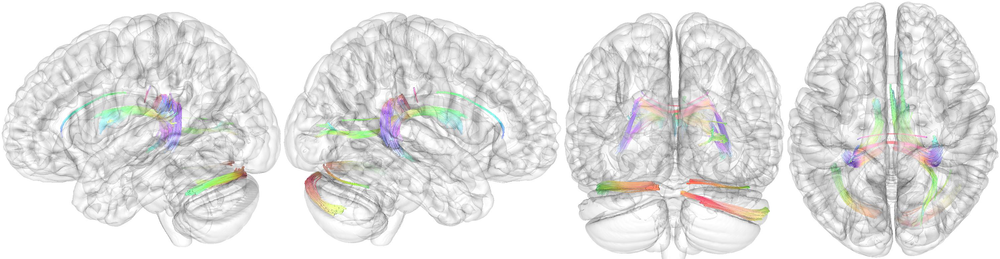

</center>
<br>

### Women

<span style="color: #ff5500;"><font size="5"><bold> Positive Correlations (FDR = 1.000000) </span></font></bold>

No significant results in tracts.


<br>
<span style="color: #00ffff;"><font size="5"><bold> Negative Correlations (FDR = 0.000186) </span></font></bold>

```{r rd_neg_solution_women}
#Women negative
df <- read_csv(here("data", "dsp", "solution_index", "rd",
                    "rd_neg_dsp_solution_women.csv")) %>% 
  clean_names() %>% 
  filter(tract_name %in% c("number of tracts","mean length(mm)",
                          "diameter(mm)", "volume(mm^3)")) %>% 
  rotate_df() %>% row_to_names(row_number = 1) %>% 
  rownames_to_column("tract_name") %>% 
  mutate(tract_name = to_any_case(tract_name,"upper_camel", sep_out = "_")) %>% 
  mutate_at(c(2:5), as.numeric) %>% 
  filter(`number of tracts` >= 10)

#Present table
df %>% 
  kable(col.names = c("Tract Name", "Number of Tracts", "Mean Length (mm)",
                      "Diameter (mm)", "Volume (mm^3)"),
        digits = 3,
        table.attr = "style='width:90%;'"
        ) %>% 
  kable_styling(bootstrap_options = "hover") %>% 
  scroll_box(width = "800px", height = "200px")
```

<br>
<font size="5"> Figures </font>

<center>
{width=50%}


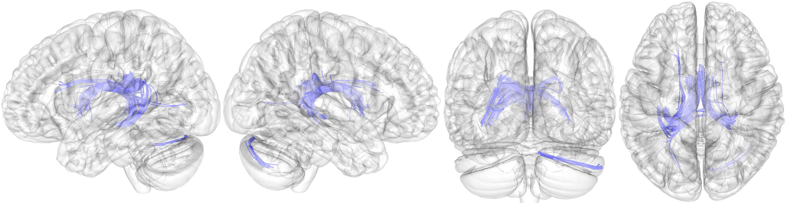

</center>
<br>

### Pre

<span style="color: #ff5500;"><font size="5"><bold> Positive Correlations (FDR = 1.000000) </span></font></bold>

No significant results in tracts.


<br>
<span style="color: #00ffff;"><font size="5"><bold> Negative Correlations (FDR = 0.000195) </span></font></bold>

```{r rd_neg_solution_pre}
#Pre negative
df <- read_csv(here("data", "dsp", "solution_index", "rd",
                    "rd_neg_dsp_solution_pre.csv")) %>% 
  clean_names() %>% 
  filter(tract_name %in% c("number of tracts","mean length(mm)",
                          "diameter(mm)", "volume(mm^3)")) %>% 
  rotate_df() %>% row_to_names(row_number = 1) %>% 
  rownames_to_column("tract_name") %>% 
  mutate(tract_name = to_any_case(tract_name,"upper_camel", sep_out = "_")) %>% 
  mutate_at(c(2:5), as.numeric) %>% 
  filter(`number of tracts` >= 10)

#Present table
df %>% 
  kable(col.names = c("Tract Name", "Number of Tracts", "Mean Length (mm)",
                      "Diameter (mm)", "Volume (mm^3)"),
        digits = 3,
        table.attr = "style='width:90%;'"
        ) %>% 
  kable_styling(bootstrap_options = "hover") %>% 
  scroll_box(width = "800px", height = "200px")
```

<br>
<font size="5"> Figures </font>

<center>
{width=50%}

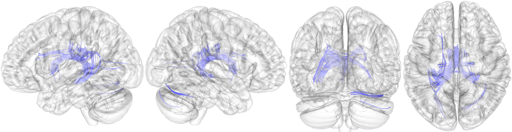

</center>
<br>

### Peri

<span style="color: #ff5500;"><font size="5"><bold> Positive Correlations (FDR = 0.161928) </span></font></bold>

```{r rd_pos_solution_peri}
#Peri positive
df <- read_csv(here("data", "dsp", "solution_index", "rd",
                    "rd_pos_dsp_solution_peri.csv")) %>% 
  clean_names() %>% 
  filter(tract_name %in% c("number of tracts","mean length(mm)",
                          "diameter(mm)", "volume(mm^3)")) %>% 
  rotate_df() %>% row_to_names(row_number = 1) %>% 
  rownames_to_column("tract_name") %>% 
  mutate(tract_name = to_any_case(tract_name,"upper_camel", sep_out = "_")) %>% 
  mutate_at(c(2:5), as.numeric) %>% 
  filter(`number of tracts` >= 10)

#Present table
df %>% 
  kable(col.names = c("Tract Name", "Number of Tracts", "Mean Length (mm)",
                      "Diameter (mm)", "Volume (mm^3)"),
        digits = 3,
        table.attr = "style='width:90%;'"
        ) %>% 
  kable_styling(bootstrap_options = "hover") %>% 
  scroll_box(width = "800px", height = "200px")
```


<br>
<span style="color: #00ffff;"><font size="5"><bold> Negative Correlations (FDR = 1.000000) </span></font></bold>

"No significant results in tracts."

```{r rd_neg_solution_peri}
#Peri negative
df <- read_csv(here("data", "dsp", "solution_index", "rd",
                    "rd_neg_dsp_solution_peri.csv")) %>% 
  clean_names() %>% 
  filter(tract_name %in% c("number of tracts","mean length(mm)",
                          "diameter(mm)", "volume(mm^3)")) %>% 
  rotate_df() %>% row_to_names(row_number = 1) %>% 
  rownames_to_column("tract_name") %>% 
  mutate(tract_name = to_any_case(tract_name,"upper_camel", sep_out = "_")) %>% 
  mutate_at(c(2:5), as.numeric) %>% 
  filter(`number of tracts` >= 10)

#Present table
df %>% 
  kable(col.names = c("Tract Name", "Number of Tracts", "Mean Length (mm)",
                      "Diameter (mm)", "Volume (mm^3)"),
        digits = 3,
        table.attr = "style='width:90%;'"
        ) %>% 
  kable_styling(bootstrap_options = "hover") %>% 
  scroll_box(width = "800px", height = "200px")
```

<br>
<font size="5"> Figures </font>

<center>
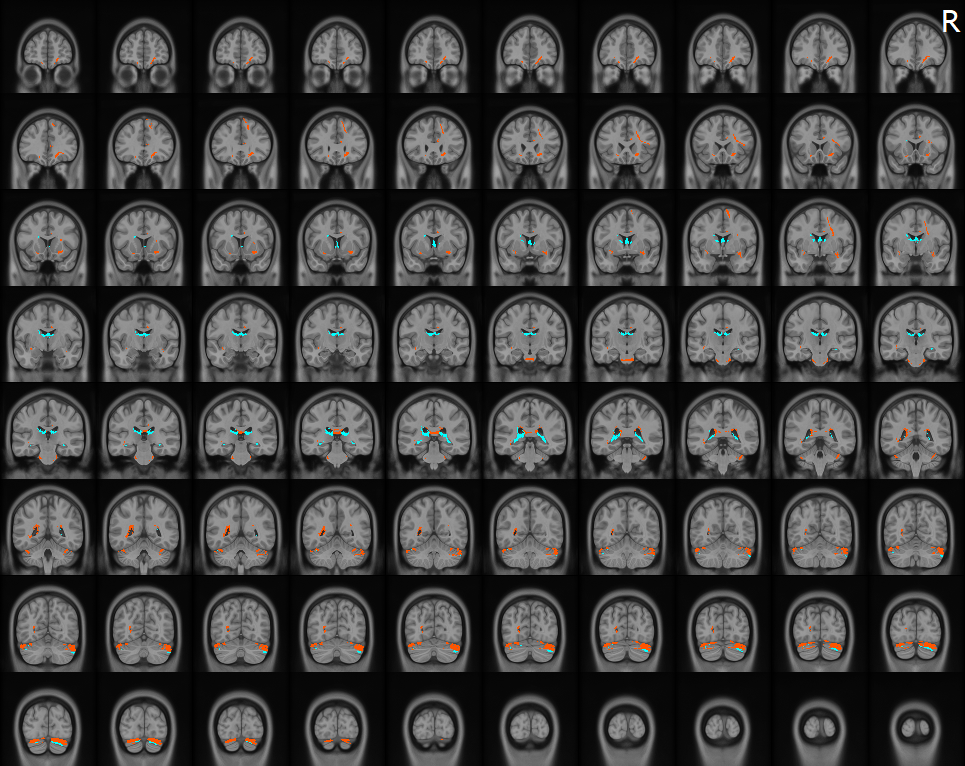{width=50%}

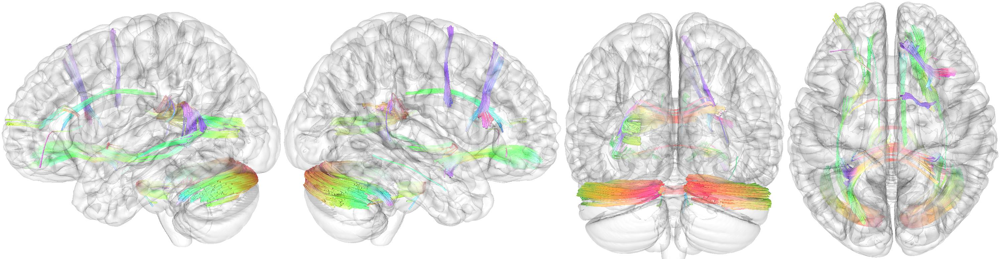

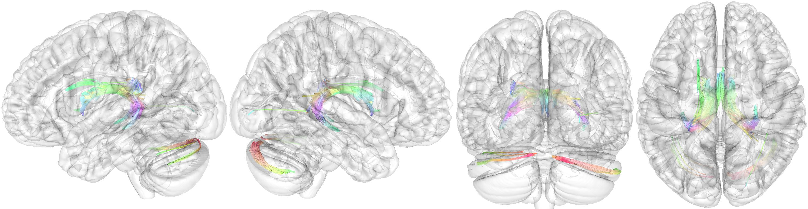

</center>
<br>

### Post

<span style="color: #ff5500;"><font size="5"><bold> Positive Correlations (FDR = 0.295082) </span></font></bold>

"No significant results in tracts."

```{r rd_pos_solution_post}
#Post positive
df <- read_csv(here("data", "dsp", "solution_index", "rd",
                    "rd_pos_dsp_solution_post.csv")) %>% 
  clean_names() %>% 
  filter(tract_name %in% c("number of tracts","mean length(mm)",
                          "diameter(mm)", "volume(mm^3)")) %>% 
  rotate_df() %>% row_to_names(row_number = 1) %>% 
  rownames_to_column("tract_name") %>% 
  mutate(tract_name = to_any_case(tract_name,"upper_camel", sep_out = "_")) %>% 
  mutate_at(c(2:5), as.numeric) %>% 
  filter(`number of tracts` >= 10)

#Present table
df %>% 
  kable(col.names = c("Tract Name", "Number of Tracts", "Mean Length (mm)",
                      "Diameter (mm)", "Volume (mm^3)"),
        digits = 3,
        table.attr = "style='width:90%;'"
        ) %>% 
  kable_styling(bootstrap_options = "hover") %>% 
  scroll_box(width = "800px", height = "200px")
```


<br>
<span style="color: #00ffff;"><font size="5"><bold> Negative Correlations (FDR = 0.000150) </span></font></bold>

```{r rd_neg_solution_post}
#Post negative
df <- read_csv(here("data", "dsp", "solution_index", "rd",
                    "rd_neg_dsp_solution_post.csv")) %>% 
  clean_names() %>% 
  filter(tract_name %in% c("number of tracts","mean length(mm)",
                          "diameter(mm)", "volume(mm^3)")) %>% 
  rotate_df() %>% row_to_names(row_number = 1) %>% 
  rownames_to_column("tract_name") %>% 
  mutate(tract_name = to_any_case(tract_name,"upper_camel", sep_out = "_")) %>% 
  mutate_at(c(2:5), as.numeric) %>% 
  filter(`number of tracts` >= 10)

#Present table
df %>% 
  kable(col.names = c("Tract Name", "Number of Tracts", "Mean Length (mm)",
                      "Diameter (mm)", "Volume (mm^3)"),
        digits = 3,
        table.attr = "style='width:90%;'"
        ) %>% 
  kable_styling(bootstrap_options = "hover") %>% 
  scroll_box(width = "800px", height = "200px")
```

<br>
<font size="5"> Figures </font>

<center>
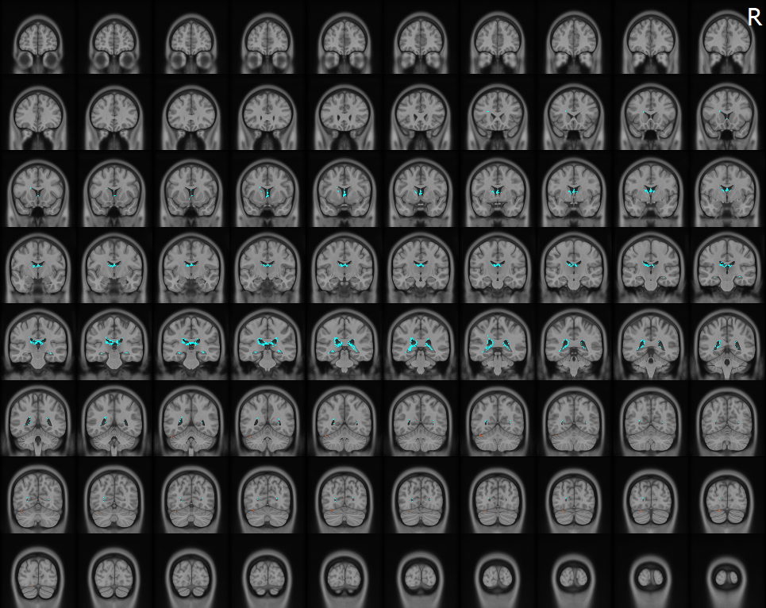{width=50%}

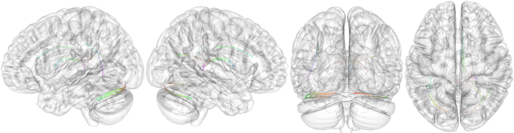

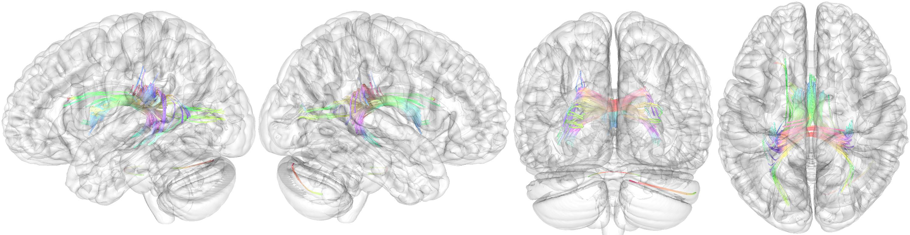

</center>
<br>


## {-}

# {-}


# Path Efficiency {.tabset .tabset-dropdown}

## QA {.tabset}

There were mostly all positive correlations between QA and DSP path efficiency when all subjects were included in the analysis. When men were analyzed separately, men displayed more positively associated correlations between QA and path efficiency. Women displayed tracts with both positive and negative correlations. When assessing by reproductive stage, both peris and posts displayed both positive and negative correlations (with peris displaying tracts with mostly positive associations) while pres displayed only a few tracts for positive and negative correlations with performance. 

### All Subjects

<span style="color: #ff5500;"><font size="5"><bold> Positive Correlations (FDR = 0.016610) </span></font></bold>


```{r qa_pos_path_all}
#All subjects positive
df <- read_csv(here("data", "dsp", "path_efficiency", "qa",
                    "qa_pos_dsp_path_all.csv")) %>% 
  clean_names() %>% 
  filter(tract_name %in% c("number of tracts","mean length(mm)",
                          "diameter(mm)", "volume(mm^3)")) %>% 
  rotate_df() %>% row_to_names(row_number = 1) %>% 
  rownames_to_column("tract_name") %>% 
  mutate(tract_name = to_any_case(tract_name,"upper_camel", sep_out = "_")) %>% 
  mutate_at(c(2:5), as.numeric) %>% 
  filter(`number of tracts` >= 10)

#Present table
df %>% 
  kable(col.names = c("Tract Name", "Number of Tracts", "Mean Length (mm)",
                      "Diameter (mm)", "Volume (mm^3)"),
        digits = 3,
        table.attr = "style='width:90%;'"
        ) %>% 
  kable_styling(bootstrap_options = "hover") %>% 
  scroll_box(width = "800px", height = "200px")
```


<br>
<span style="color: #00ffff;"><font size="5"><bold> Negative Correlations (FDR = 0.020833) </span></font></bold>

```{r qa_neg_path_all}
#All subjects negative
df <- read_csv(here("data", "dsp", "path_efficiency", "qa",
                    "qa_neg_dsp_path_all.csv")) %>% 
  clean_names() %>% 
  filter(tract_name %in% c("number of tracts","mean length(mm)",
                          "diameter(mm)", "volume(mm^3)")) %>% 
  rotate_df() %>% row_to_names(row_number = 1) %>% 
  rownames_to_column("tract_name") %>% 
  mutate(tract_name = to_any_case(tract_name,"upper_camel", sep_out = "_")) %>% 
  mutate_at(c(2:5), as.numeric) %>% filter(`number of tracts` >= 10)

#Present table
df %>% 
  kable(col.names = c("Tract Name", "Number of Tracts", "Mean Length (mm)",
                      "Diameter (mm)", "Volume (mm^3)"),
        digits = 3,
        table.attr = "style='width:90%;'"
        ) %>% 
  kable_styling(bootstrap_options = "hover") %>% 
  scroll_box(width = "800px", height = "200px")
```

<br>
<font size="5"> Figures </font>

<center>
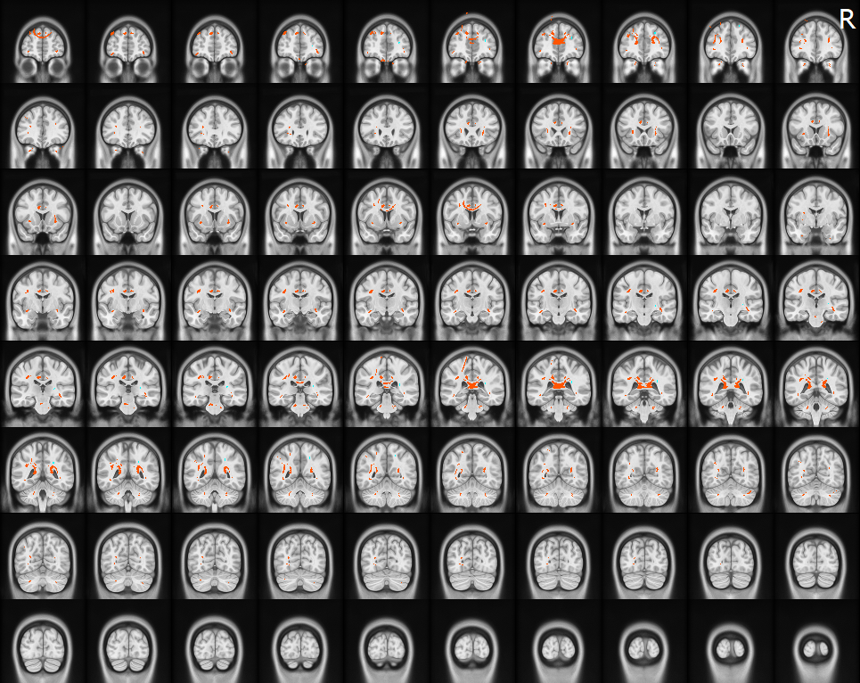{width=50%}


</center>
<br>


### Men

<span style="color: #ff5500;"><font size="5"><bold> Positive Correlations (FDR = 0.000821) </span></font></bold>


```{r qa_pos_path_men}
#Men positive
df <- read_csv(here("data", "dsp", "path_efficiency", "qa",
                    "qa_pos_dsp_path_men.csv")) %>% 
  clean_names() %>% 
  filter(tract_name %in% c("number of tracts","mean length(mm)",
                          "diameter(mm)", "volume(mm^3)")) %>% 
  rotate_df() %>% row_to_names(row_number = 1) %>% 
  rownames_to_column("tract_name") %>% 
  mutate(tract_name = to_any_case(tract_name,"upper_camel", sep_out = "_")) %>% 
  mutate_at(c(2:5), as.numeric) %>% 
  filter(`number of tracts` >= 10)

#Present table
df %>% 
  kable(col.names = c("Tract Name", "Number of Tracts", "Mean Length (mm)",
                      "Diameter (mm)", "Volume (mm^3)"),
        digits = 3,
        table.attr = "style='width:90%;'"
        ) %>% 
  kable_styling(bootstrap_options = "hover") %>% 
  scroll_box(width = "800px", height = "200px")
```


<br>
<span style="color: #00ffff;"><font size="5"><bold> Negative Correlations (FDR = 0.166667) </span></font></bold>

All tracts < 10.

```{r qa_neg_path_men}
#Men negative
df <- read_csv(here("data", "dsp", "path_efficiency", "qa",
                    "qa_neg_dsp_path_men.csv")) %>% 
  clean_names() %>% 
  filter(tract_name %in% c("number of tracts","mean length(mm)",
                          "diameter(mm)", "volume(mm^3)")) %>% 
  rotate_df() %>% row_to_names(row_number = 1) %>% 
  rownames_to_column("tract_name") %>% 
  mutate(tract_name = to_any_case(tract_name,"upper_camel", sep_out = "_")) %>% 
  mutate_at(c(2:5), as.numeric) 
#%>% filter(`number of tracts` >= 10)

#Present table
df %>% 
  kable(col.names = c("Tract Name", "Number of Tracts", "Mean Length (mm)",
                      "Diameter (mm)", "Volume (mm^3)"),
        digits = 3,
        table.attr = "style='width:90%;'"
        ) %>% 
  kable_styling(bootstrap_options = "hover") %>% 
  scroll_box(width = "800px", height = "200px")
```

<br>
<font size="5"> Figures </font>

<center>
{width=50%}


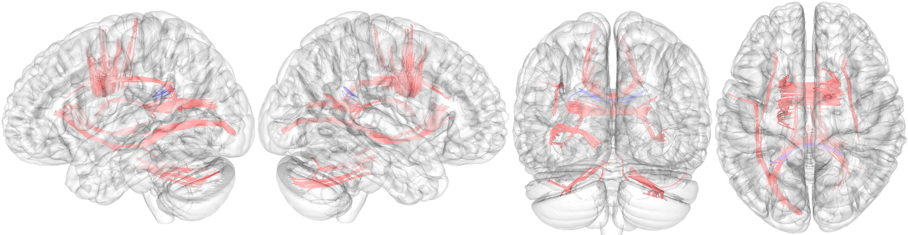

</center>
<br>

### Women

<span style="color: #ff5500;"><font size="5"><bold> Positive Correlations (FDR = 0.012753) </span></font></bold>


```{r qa_pos_path_women}
#Women positive
df <- read_csv(here("data", "dsp", "path_efficiency", "qa",
                    "qa_pos_dsp_path_women.csv")) %>% 
  clean_names() %>% 
  filter(tract_name %in% c("number of tracts","mean length(mm)",
                          "diameter(mm)", "volume(mm^3)")) %>% 
  rotate_df() %>% row_to_names(row_number = 1) %>% 
  rownames_to_column("tract_name") %>% 
  mutate(tract_name = to_any_case(tract_name,"upper_camel", sep_out = "_")) %>% 
  mutate_at(c(2:5), as.numeric) %>% 
  filter(`number of tracts` >= 10)

#Present table
df %>% 
  kable(col.names = c("Tract Name", "Number of Tracts", "Mean Length (mm)",
                      "Diameter (mm)", "Volume (mm^3)"),
        digits = 3,
        table.attr = "style='width:90%;'"
        ) %>% 
  kable_styling(bootstrap_options = "hover") %>% 
  scroll_box(width = "800px", height = "200px")
```


<br>
<span style="color: #00ffff;"><font size="5"><bold> Negative Correlations (FDR = 0.078052) </span></font></bold>

```{r qa_neg_path_women}
#Women negative
df <- read_csv(here("data", "dsp", "path_efficiency", "qa",
                    "qa_neg_dsp_path_women.csv")) %>% 
  clean_names() %>% 
  filter(tract_name %in% c("number of tracts","mean length(mm)",
                          "diameter(mm)", "volume(mm^3)")) %>% 
  rotate_df() %>% row_to_names(row_number = 1) %>% 
  rownames_to_column("tract_name") %>% 
  mutate(tract_name = to_any_case(tract_name,"upper_camel", sep_out = "_")) %>% 
  mutate_at(c(2:5), as.numeric) %>% 
  filter(`number of tracts` >= 10)

#Present table
df %>% 
  kable(col.names = c("Tract Name", "Number of Tracts", "Mean Length (mm)",
                      "Diameter (mm)", "Volume (mm^3)"),
        digits = 3,
        table.attr = "style='width:90%;'"
        ) %>% 
  kable_styling(bootstrap_options = "hover") %>% 
  scroll_box(width = "800px", height = "200px")
```

<br>
<font size="5"> Figures </font>

<center>
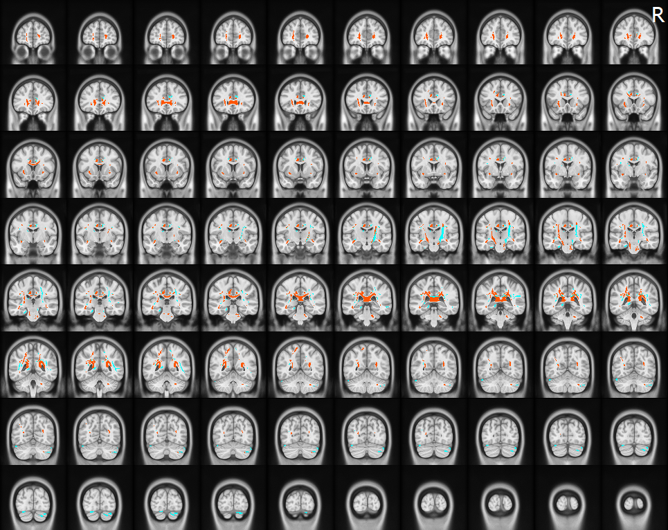{width=50%}

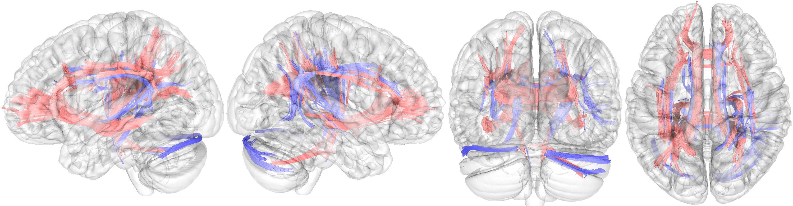

</center>
<br>

### Pre

<span style="color: #ff5500;"><font size="5"><bold> Positive Correlations (FDR = 0.000363) </span></font></bold>


```{r qa_pos_path_pre}
#Pre positive
df <- read_csv(here("data", "dsp", "path_efficiency", "qa",
                    "qa_pos_dsp_path_pre.csv")) %>% 
  clean_names() %>% 
  filter(tract_name %in% c("number of tracts","mean length(mm)",
                          "diameter(mm)", "volume(mm^3)")) %>% 
  rotate_df() %>% row_to_names(row_number = 1) %>% 
  rownames_to_column("tract_name") %>% 
  mutate(tract_name = to_any_case(tract_name,"upper_camel", sep_out = "_")) %>% 
  mutate_at(c(2:5), as.numeric) %>% 
  filter(`number of tracts` >= 10)

#Present table
df %>% 
  kable(col.names = c("Tract Name", "Number of Tracts", "Mean Length (mm)",
                      "Diameter (mm)", "Volume (mm^3)"),
        digits = 3,
        table.attr = "style='width:90%;'"
        ) %>% 
  kable_styling(bootstrap_options = "hover") %>% 
  scroll_box(width = "800px", height = "200px")
```


<br>
<span style="color: #00ffff;"><font size="5"><bold> Negative Correlations (FDR = 0.003906) </span></font></bold>

```{r qa_neg_path_pre}
#Pre negative
df <- read_csv(here("data", "dsp", "path_efficiency", "qa",
                    "qa_neg_dsp_path_pre.csv")) %>% 
  clean_names() %>% 
  filter(tract_name %in% c("number of tracts","mean length(mm)",
                          "diameter(mm)", "volume(mm^3)")) %>% 
  rotate_df() %>% row_to_names(row_number = 1) %>% 
  rownames_to_column("tract_name") %>% 
  mutate(tract_name = to_any_case(tract_name,"upper_camel", sep_out = "_")) %>% 
  mutate_at(c(2:5), as.numeric) %>% 
  filter(`number of tracts` >= 10)

#Present table
df %>% 
  kable(col.names = c("Tract Name", "Number of Tracts", "Mean Length (mm)",
                      "Diameter (mm)", "Volume (mm^3)"),
        digits = 3,
        table.attr = "style='width:90%;'"
        ) %>% 
  kable_styling(bootstrap_options = "hover") %>% 
  scroll_box(width = "800px", height = "200px")
```

<br>
<font size="5"> Figures </font>

<center>
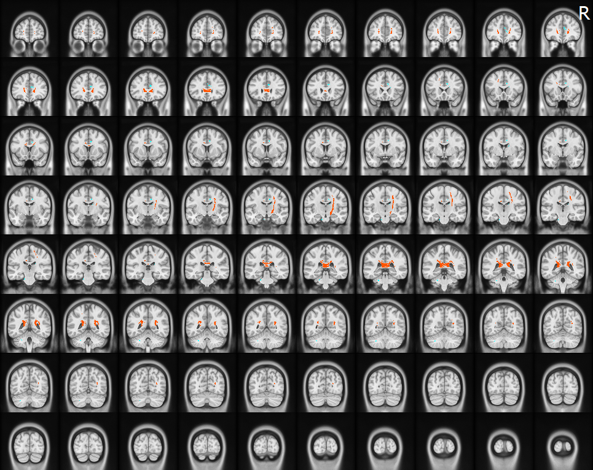{width=50%}


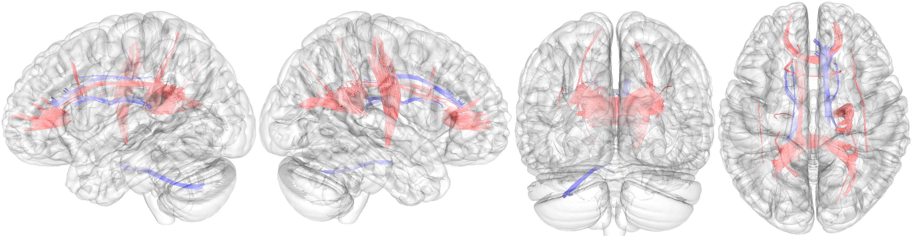

</center>
<br>

### Peri

<span style="color: #ff5500;"><font size="5"><bold> Positive Correlations (FDR = 0.057776) </span></font></bold>


```{r qa_pos_path_peri}
#Peri positive
df <- read_csv(here("data", "dsp", "path_efficiency", "qa",
                    "qa_pos_dsp_path_peri.csv")) %>% 
  clean_names() %>% 
  filter(tract_name %in% c("number of tracts","mean length(mm)",
                          "diameter(mm)", "volume(mm^3)")) %>% 
  rotate_df() %>% row_to_names(row_number = 1) %>% 
  rownames_to_column("tract_name") %>% 
  mutate(tract_name = to_any_case(tract_name,"upper_camel", sep_out = "_")) %>% 
  mutate_at(c(2:5), as.numeric) %>% 
  filter(`number of tracts` >= 10)

#Present table
df %>% 
  kable(col.names = c("Tract Name", "Number of Tracts", "Mean Length (mm)",
                      "Diameter (mm)", "Volume (mm^3)"),
        digits = 3,
        table.attr = "style='width:90%;'"
        ) %>% 
  kable_styling(bootstrap_options = "hover") %>% 
  scroll_box(width = "800px", height = "200px")
```


<br>
<span style="color: #00ffff;"><font size="5"><bold> Negative Correlations (FDR = 0.001329) </span></font></bold>

```{r qa_neg_path_peri}
#Peri negative
df <- read_csv(here("data", "dsp", "path_efficiency", "qa",
                    "qa_neg_dsp_path_peri.csv")) %>% 
  clean_names() %>% 
  filter(tract_name %in% c("number of tracts","mean length(mm)",
                          "diameter(mm)", "volume(mm^3)")) %>% 
  rotate_df() %>% row_to_names(row_number = 1) %>% 
  rownames_to_column("tract_name") %>% 
  mutate(tract_name = to_any_case(tract_name,"upper_camel", sep_out = "_")) %>% 
  mutate_at(c(2:5), as.numeric) %>% 
  filter(`number of tracts` >= 10)

#Present table
df %>% 
  kable(col.names = c("Tract Name", "Number of Tracts", "Mean Length (mm)",
                      "Diameter (mm)", "Volume (mm^3)"),
        digits = 3,
        table.attr = "style='width:90%;'"
        ) %>% 
  kable_styling(bootstrap_options = "hover") %>% 
  scroll_box(width = "800px", height = "200px")
```

<br>
<font size="5"> Figures </font>

<center>
{width=50%}


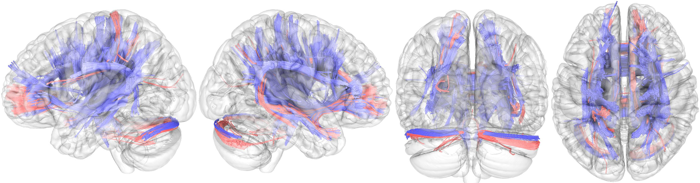

</center>
<br>

### Post

<span style="color: #ff5500;"><font size="5"><bold> Positive Correlations (FDR = 0.000118) </span></font></bold>


```{r qa_pos_path_post}
#Post positive
df <- read_csv(here("data", "dsp", "path_efficiency", "qa",
                    "qa_pos_dsp_path_post.csv")) %>% 
  clean_names() %>% 
  filter(tract_name %in% c("number of tracts","mean length(mm)",
                          "diameter(mm)", "volume(mm^3)")) %>% 
  rotate_df() %>% row_to_names(row_number = 1) %>% 
  rownames_to_column("tract_name") %>% 
  mutate(tract_name = to_any_case(tract_name,"upper_camel", sep_out = "_")) %>% 
  mutate_at(c(2:5), as.numeric) %>% 
  filter(`number of tracts` >= 10)

#Present table
df %>% 
  kable(col.names = c("Tract Name", "Number of Tracts", "Mean Length (mm)",
                      "Diameter (mm)", "Volume (mm^3)"),
        digits = 3,
        table.attr = "style='width:90%;'"
        ) %>% 
  kable_styling(bootstrap_options = "hover") %>% 
  scroll_box(width = "800px", height = "200px")
```


<br>
<span style="color: #00ffff;"><font size="5"><bold> Negative Correlations (FDR = 0.458333) </span></font></bold>

"No significant results in tracts."

```{r qa_neg_path_post}
#Post negative
df <- read_csv(here("data", "dsp", "path_efficiency", "qa",
                    "qa_neg_dsp_path_post.csv")) %>% 
  clean_names() %>% 
  filter(tract_name %in% c("number of tracts","mean length(mm)",
                          "diameter(mm)", "volume(mm^3)")) %>% 
  rotate_df() %>% row_to_names(row_number = 1) %>% 
  rownames_to_column("tract_name") %>% 
  mutate(tract_name = to_any_case(tract_name,"upper_camel", sep_out = "_")) %>% 
  mutate_at(c(2:5), as.numeric) %>% 
  filter(`number of tracts` >= 10)

#Present table
df %>% 
  kable(col.names = c("Tract Name", "Number of Tracts", "Mean Length (mm)",
                      "Diameter (mm)", "Volume (mm^3)"),
        digits = 3,
        table.attr = "style='width:90%;'"
        ) %>% 
  kable_styling(bootstrap_options = "hover") %>% 
  scroll_box(width = "800px", height = "200px")
```

<br>
<font size="5"> Figures </font>

<center>
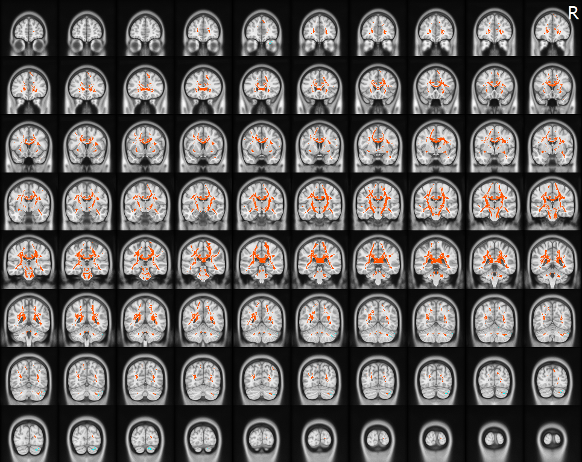{width=50%}

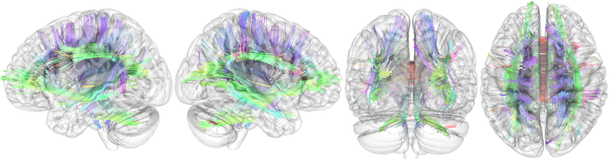

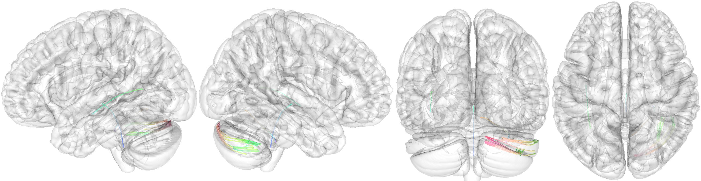

</center>
<br>


## {-}

## AD {.tabset}

There were no significant results in tracts for positive correlations for all subjects. Only the fornix tract showed a negative correlation with AD and DSP path efficiency across all subjects. In men, there were also no significant results for positive correlations, but there were negative correlations. Women and pres had no negative correlations with tracts, but did have positive correlations. Peris and posts have both negative and positive correlations, but moreso negative correlations with tracts. Among women and reproductive stage groups, the right fornix and left cerebellum tract were commonly displayed with positive correlations for AD and path efficiency.

### All Subjects

<span style="color: #ff5500;"><font size="5"><bold> Positive Correlations (FDR = 1.000000) </span></font></bold>

No significant results in tracts.


<br>
<span style="color: #00ffff;"><font size="5"><bold> Negative Correlations (FDR = 0.391892) </span></font></bold>

"No significant results in tracts."

```{r ad_neg_path_all}
#All subjects negative
df <- read_csv(here("data", "dsp", "path_efficiency", "ad",
                    "ad_neg_dsp_path_all.csv")) %>% 
  clean_names() %>% 
  filter(tract_name %in% c("number of tracts","mean length(mm)",
                          "diameter(mm)", "volume(mm^3)")) %>% 
  rotate_df() %>% row_to_names(row_number = 1) %>% 
  rownames_to_column("tract_name") %>% 
  mutate(tract_name = to_any_case(tract_name,"upper_camel", sep_out = "_")) %>% 
  mutate_at(c(2:5), as.numeric) %>% filter(`number of tracts` >= 10)

#Present table
df %>% 
  kable(col.names = c("Tract Name", "Number of Tracts", "Mean Length (mm)",
                      "Diameter (mm)", "Volume (mm^3)"),
        digits = 3,
        table.attr = "style='width:90%;'"
        ) %>% 
  kable_styling(bootstrap_options = "hover") %>% 
  scroll_box(width = "800px", height = "200px")
```

<br>
<font size="5"> Figures </font>

<center>
{width=50%}

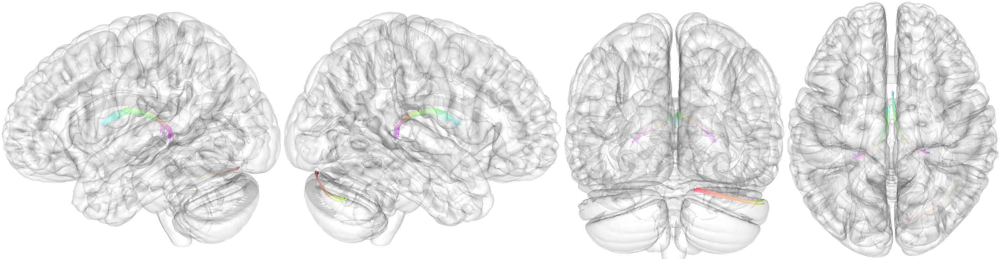

</center>
<br>

### Men

<span style="color: #ff5500;"><font size="5"><bold> Positive Correlations (FDR = 1.000000) </span></font></bold>

No significant results in tracts.


<br>
<span style="color: #00ffff;"><font size="5"><bold> Negative Correlations (FDR = 0.001949) </span></font></bold>


```{r ad_neg_path_men}
#Men negative
df <- read_csv(here("data", "dsp", "path_efficiency", "ad",
                    "ad_neg_dsp_path_men.csv")) %>% 
  clean_names() %>% 
  filter(tract_name %in% c("number of tracts","mean length(mm)",
                          "diameter(mm)", "volume(mm^3)")) %>% 
  rotate_df() %>% row_to_names(row_number = 1) %>% 
  rownames_to_column("tract_name") %>% 
  mutate(tract_name = to_any_case(tract_name,"upper_camel", sep_out = "_")) %>% 
  mutate_at(c(2:5), as.numeric) %>% filter(`number of tracts` >= 10)

#Present table
df %>% 
  kable(col.names = c("Tract Name", "Number of Tracts", "Mean Length (mm)",
                      "Diameter (mm)", "Volume (mm^3)"),
        digits = 3,
        table.attr = "style='width:90%;'"
        ) %>% 
  kable_styling(bootstrap_options = "hover") %>% 
  scroll_box(width = "800px", height = "200px")
```

<br>
<font size="5"> Figures </font>

<center>
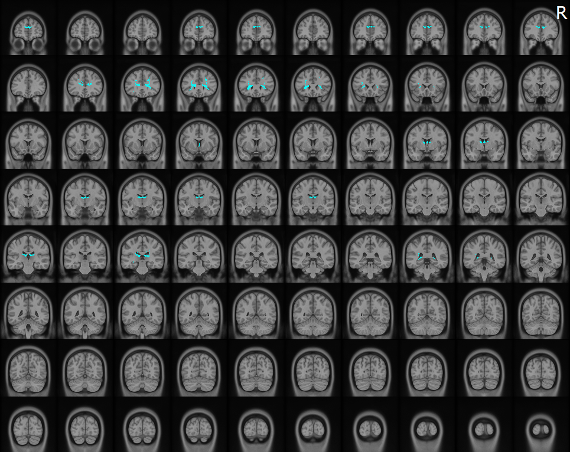{width=50%}


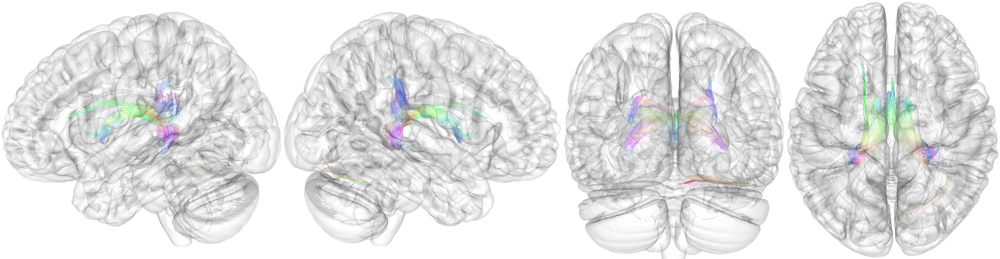

</center>
<br>

### Women

<span style="color: #ff5500;"><font size="5"><bold> Positive Correlations (FDR = 0.013080) </span></font></bold>

```{r ad_pos_path_women}
#Women positive
df <- read_csv(here("data", "dsp", "path_efficiency", "ad",
                    "ad_pos_dsp_path_women.csv")) %>% 
  clean_names() %>% 
  filter(tract_name %in% c("number of tracts","mean length(mm)",
                          "diameter(mm)", "volume(mm^3)")) %>% 
  rotate_df() %>% row_to_names(row_number = 1) %>% 
  rownames_to_column("tract_name") %>% 
  mutate(tract_name = to_any_case(tract_name,"upper_camel", sep_out = "_")) %>% 
  mutate_at(c(2:5), as.numeric) %>% filter(`number of tracts` >= 10)

#Present table
df %>% 
  kable(col.names = c("Tract Name", "Number of Tracts", "Mean Length (mm)",
                      "Diameter (mm)", "Volume (mm^3)"),
        digits = 3,
        table.attr = "style='width:90%;'"
        ) %>% 
  kable_styling(bootstrap_options = "hover") %>% 
  scroll_box(width = "800px", height = "200px")
```


<br>
<span style="color: #00ffff;"><font size="5"><bold> Negative Correlations (FDR = 1.000000) </span></font></bold>

No significant results in tracts.

<br>
<font size="5"> Figures </font>

<center>
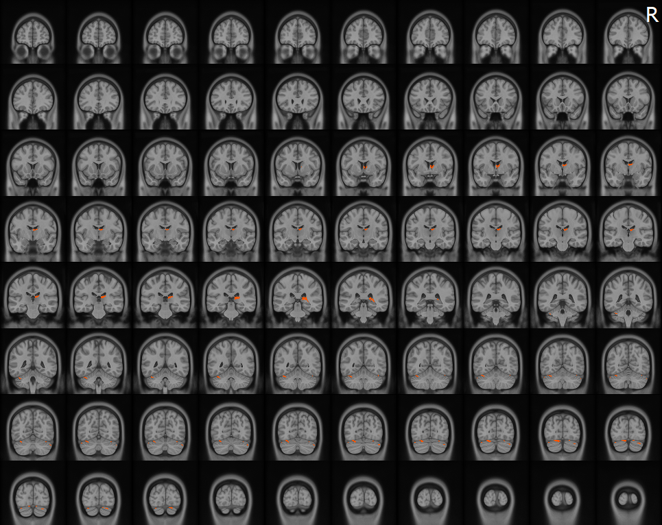{width=50%}

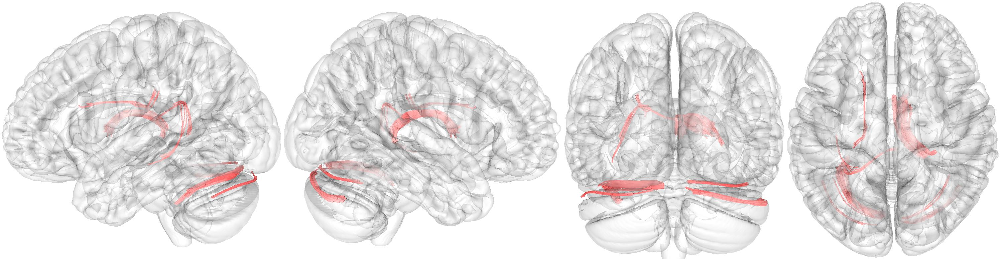

</center>
<br>

### Pre

<span style="color: #ff5500;"><font size="5"><bold> Positive Correlations (FDR = 0.004787) </span></font></bold>

```{r ad_pos_path_pre}
#Pre positive
df <- read_csv(here("data", "dsp", "path_efficiency", "ad",
                    "ad_pos_dsp_path_pre.csv")) %>% 
  clean_names() %>% 
  filter(tract_name %in% c("number of tracts","mean length(mm)",
                          "diameter(mm)", "volume(mm^3)")) %>% 
  rotate_df() %>% row_to_names(row_number = 1) %>% 
  rownames_to_column("tract_name") %>% 
  mutate(tract_name = to_any_case(tract_name,"upper_camel", sep_out = "_")) %>% 
  mutate_at(c(2:5), as.numeric) %>% filter(`number of tracts` >= 10)

#Present table
df %>% 
  kable(col.names = c("Tract Name", "Number of Tracts", "Mean Length (mm)",
                      "Diameter (mm)", "Volume (mm^3)"),
        digits = 3,
        table.attr = "style='width:90%;'"
        ) %>% 
  kable_styling(bootstrap_options = "hover") %>% 
  scroll_box(width = "800px", height = "200px")
```


<br>
<span style="color: #00ffff;"><font size="5"><bold> Negative Correlations (FDR = 1.000000) </span></font></bold>

No significant results in tracts.

<br>
<font size="5"> Figures </font>

<center>
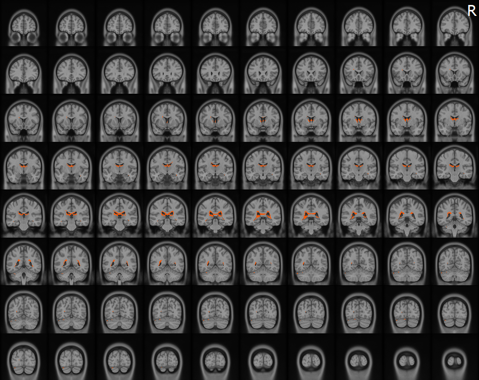{width=50%}


</center>
<br>

### Peri

<span style="color: #ff5500;"><font size="5"><bold> Positive Correlations (FDR = 0.092850) </span></font></bold>

```{r ad_pos_path_peri}
#Peri positive
df <- read_csv(here("data", "dsp", "path_efficiency", "ad",
                    "ad_pos_dsp_path_peri.csv")) %>% 
  clean_names() %>% 
  filter(tract_name %in% c("number of tracts","mean length(mm)",
                          "diameter(mm)", "volume(mm^3)")) %>% 
  rotate_df() %>% row_to_names(row_number = 1) %>% 
  rownames_to_column("tract_name") %>% 
  mutate(tract_name = to_any_case(tract_name,"upper_camel", sep_out = "_")) %>% 
  mutate_at(c(2:5), as.numeric) %>% filter(`number of tracts` >= 10)

#Present table
df %>% 
  kable(col.names = c("Tract Name", "Number of Tracts", "Mean Length (mm)",
                      "Diameter (mm)", "Volume (mm^3)"),
        digits = 3,
        table.attr = "style='width:90%;'"
        ) %>% 
  kable_styling(bootstrap_options = "hover") %>% 
  scroll_box(width = "800px", height = "200px")
```


<br>
<span style="color: #00ffff;"><font size="5"><bold> Negative Correlations (FDR = 0.018732) </span></font></bold>

```{r ad_neg_path_peri}
#Peri negative
df <- read_csv(here("data", "dsp", "path_efficiency", "ad",
                    "ad_neg_dsp_path_peri.csv")) %>% 
  clean_names() %>% 
  filter(tract_name %in% c("number of tracts","mean length(mm)",
                          "diameter(mm)", "volume(mm^3)")) %>% 
  rotate_df() %>% row_to_names(row_number = 1) %>% 
  rownames_to_column("tract_name") %>% 
  mutate(tract_name = to_any_case(tract_name,"upper_camel", sep_out = "_")) %>% 
  mutate_at(c(2:5), as.numeric) %>% filter(`number of tracts` >= 10)

#Present table
df %>% 
  kable(col.names = c("Tract Name", "Number of Tracts", "Mean Length (mm)",
                      "Diameter (mm)", "Volume (mm^3)"),
        digits = 3,
        table.attr = "style='width:90%;'"
        ) %>% 
  kable_styling(bootstrap_options = "hover") %>% 
  scroll_box(width = "800px", height = "200px")
```


<br>
<font size="5"> Figures </font>

<center>
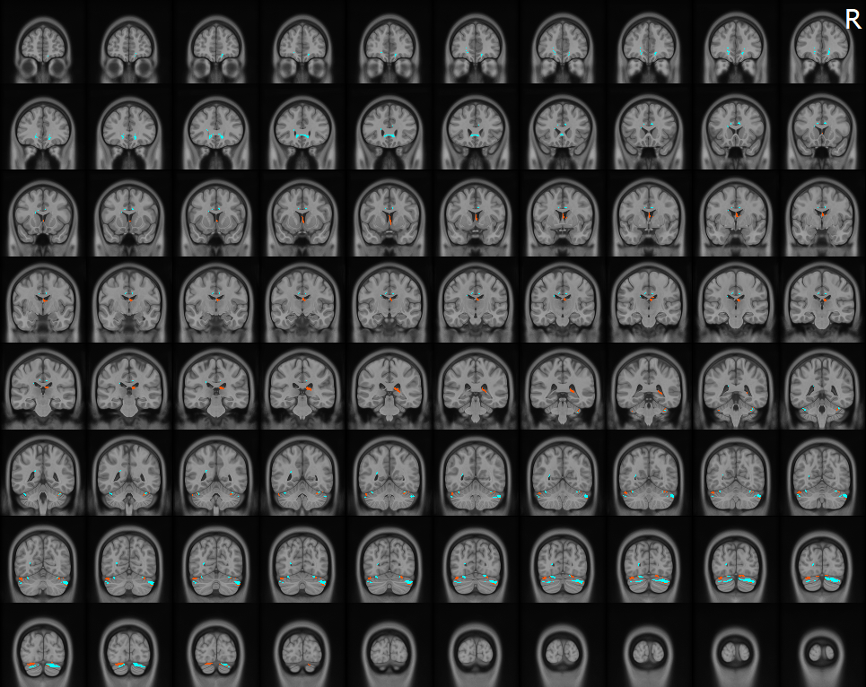{width=50%}


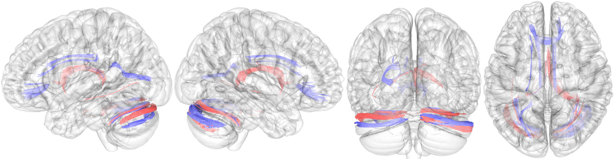

</center>
<br>

### Post

<span style="color: #ff5500;"><font size="5"><bold> Positive Correlations (FDR = 0.204539) </span></font></bold>

"No significant results in tracts."

```{r ad_pos_path_post}
#Post positive
df <- read_csv(here("data", "dsp", "path_efficiency", "ad",
                    "ad_pos_dsp_path_post.csv")) %>% 
  clean_names() %>% 
  filter(tract_name %in% c("number of tracts","mean length(mm)",
                          "diameter(mm)", "volume(mm^3)")) %>% 
  rotate_df() %>% row_to_names(row_number = 1) %>% 
  rownames_to_column("tract_name") %>% 
  mutate(tract_name = to_any_case(tract_name,"upper_camel", sep_out = "_")) %>% 
  mutate_at(c(2:5), as.numeric) %>% filter(`number of tracts` >= 10)

#Present table
df %>% 
  kable(col.names = c("Tract Name", "Number of Tracts", "Mean Length (mm)",
                      "Diameter (mm)", "Volume (mm^3)"),
        digits = 3,
        table.attr = "style='width:90%;'"
        ) %>% 
  kable_styling(bootstrap_options = "hover") %>% 
  scroll_box(width = "800px", height = "200px")
```


<br>
<span style="color: #00ffff;"><font size="5"><bold> Negative Correlations (FDR = 0.462311) </span></font></bold>

"No significant results in tracts."

```{r ad_neg_path_post}
#Post negative
df <- read_csv(here("data", "dsp", "path_efficiency", "ad",
                    "ad_neg_dsp_path_post.csv")) %>% 
  clean_names() %>% 
  filter(tract_name %in% c("number of tracts","mean length(mm)",
                          "diameter(mm)", "volume(mm^3)")) %>% 
  rotate_df() %>% row_to_names(row_number = 1) %>% 
  rownames_to_column("tract_name") %>% 
  mutate(tract_name = to_any_case(tract_name,"upper_camel", sep_out = "_")) %>% 
  mutate_at(c(2:5), as.numeric) %>% filter(`number of tracts` >= 10)

#Present table
df %>% 
  kable(col.names = c("Tract Name", "Number of Tracts", "Mean Length (mm)",
                      "Diameter (mm)", "Volume (mm^3)"),
        digits = 3,
        table.attr = "style='width:90%;'"
        ) %>% 
  kable_styling(bootstrap_options = "hover") %>% 
  scroll_box(width = "800px", height = "200px")
```


<br>
<font size="5"> Figures </font>

<center>
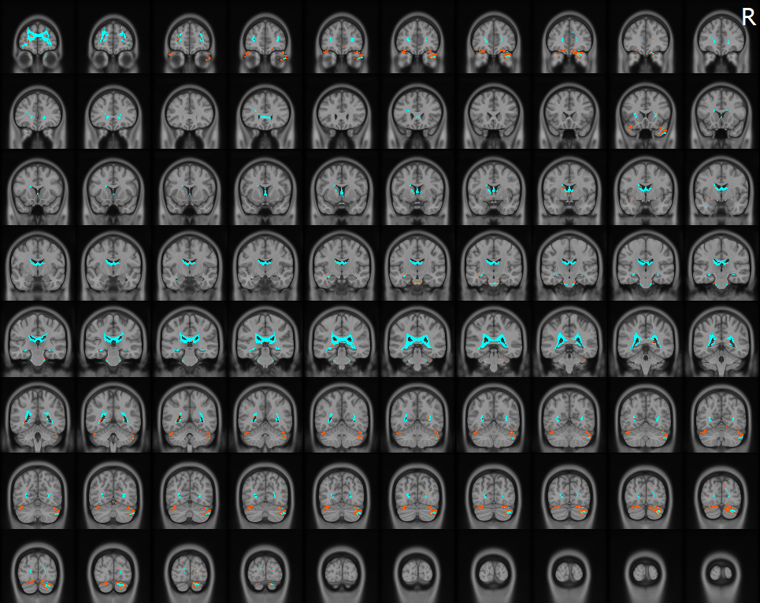{width=50%}


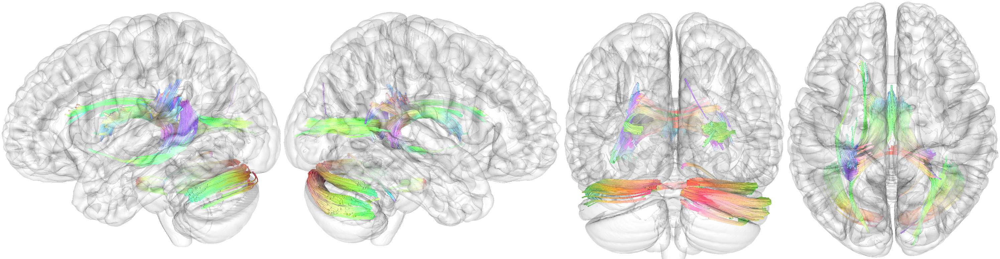

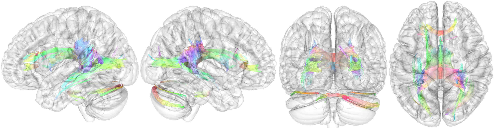

</center>
<br>


## {-}

## MD {.tabset}

There were more negative correlations with tracts for all subjects. When split by sex, men only had negative correlations and women had basically only positive correlations with tracts. Negative tracts for women and pres were negligible since the report says they were not significant and tracts were also less than 10. Peris and posts have both positive and negative correlations with tracts. Among women and reproductive stage groups, the right fornix tract was commonly displayed for positive correlations with MD and path efficiency.

### All Subjects

<span style="color: #ff5500;"><font size="5"><bold> Positive Correlations (FDR = 1.000000) </span></font></bold>

"No significant results in tracts."

```{r md_pos_path_all}
#All subjects positive
df <- read_csv(here("data", "dsp", "path_efficiency", "md",
                    "md_pos_dsp_path_all.csv")) %>% 
  clean_names() %>% 
  filter(tract_name %in% c("number of tracts","mean length(mm)",
                          "diameter(mm)", "volume(mm^3)")) %>% 
  rotate_df() %>% row_to_names(row_number = 1) %>% 
  rownames_to_column("tract_name") %>% 
  mutate(tract_name = to_any_case(tract_name,"upper_camel", sep_out = "_")) %>% 
  mutate_at(c(2:5), as.numeric) %>% filter(`number of tracts` >= 10)

#Present table
df %>% 
  kable(col.names = c("Tract Name", "Number of Tracts", "Mean Length (mm)",
                      "Diameter (mm)", "Volume (mm^3)"),
        digits = 3,
        table.attr = "style='width:90%;'"
        ) %>% 
  kable_styling(bootstrap_options = "hover") %>% 
  scroll_box(width = "800px", height = "200px")
```


<br>
<span style="color: #00ffff;"><font size="5"><bold> Negative Correlations (FDR = 0.491329) </span></font></bold>

"No significant results in tracts."

```{r md_neg_path_all}
#All subjects negative
df <- read_csv(here("data", "dsp", "path_efficiency", "md",
                    "md_neg_dsp_path_all.csv")) %>% 
  clean_names() %>% 
  filter(tract_name %in% c("number of tracts","mean length(mm)",
                          "diameter(mm)", "volume(mm^3)")) %>% 
  rotate_df() %>% row_to_names(row_number = 1) %>% 
  rownames_to_column("tract_name") %>% 
  mutate(tract_name = to_any_case(tract_name,"upper_camel", sep_out = "_")) %>% 
  mutate_at(c(2:5), as.numeric) %>% filter(`number of tracts` >= 10)

#Present table
df %>% 
  kable(col.names = c("Tract Name", "Number of Tracts", "Mean Length (mm)",
                      "Diameter (mm)", "Volume (mm^3)"),
        digits = 3,
        table.attr = "style='width:90%;'"
        ) %>% 
  kable_styling(bootstrap_options = "hover") %>% 
  scroll_box(width = "800px", height = "200px")
```

<br>
<font size="5"> Figures </font>

<center>
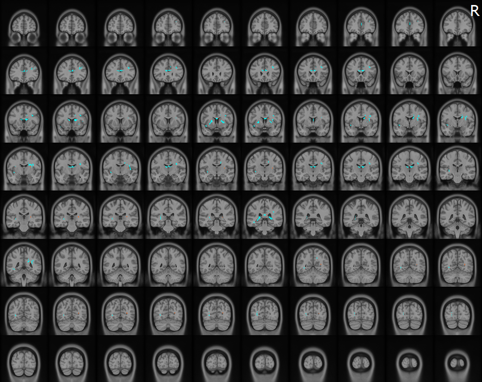{width=50%}

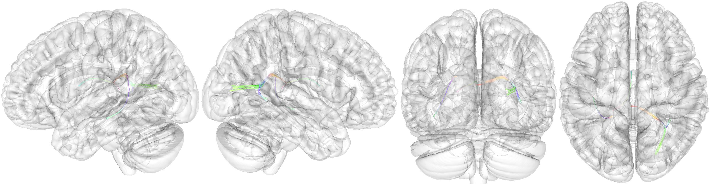

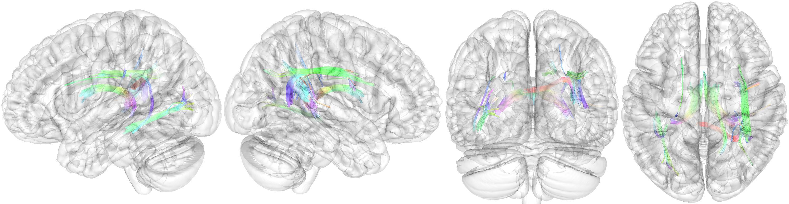

</center>
<br>

### Men

<span style="color: #ff5500;"><font size="5"><bold> Positive Correlations (FDR = 1.000000) </span></font></bold>

No significant results in tracts.

<br>
<span style="color: #00ffff;"><font size="5"><bold> Negative Correlations (FDR = 0.004597) </span></font></bold>

```{r md_neg_path_men}
#Men negative
df <- read_csv(here("data", "dsp", "path_efficiency", "md",
                    "md_neg_dsp_path_men.csv")) %>% 
  clean_names() %>% 
  filter(tract_name %in% c("number of tracts","mean length(mm)",
                          "diameter(mm)", "volume(mm^3)")) %>% 
  rotate_df() %>% row_to_names(row_number = 1) %>% 
  rownames_to_column("tract_name") %>% 
  mutate(tract_name = to_any_case(tract_name,"upper_camel", sep_out = "_")) %>% 
  mutate_at(c(2:5), as.numeric) %>% filter(`number of tracts` >= 10)

#Present table
df %>% 
  kable(col.names = c("Tract Name", "Number of Tracts", "Mean Length (mm)",
                      "Diameter (mm)", "Volume (mm^3)"),
        digits = 3,
        table.attr = "style='width:90%;'"
        ) %>% 
  kable_styling(bootstrap_options = "hover") %>% 
  scroll_box(width = "800px", height = "200px")
```

<br>
<font size="5"> Figures </font>

<center>
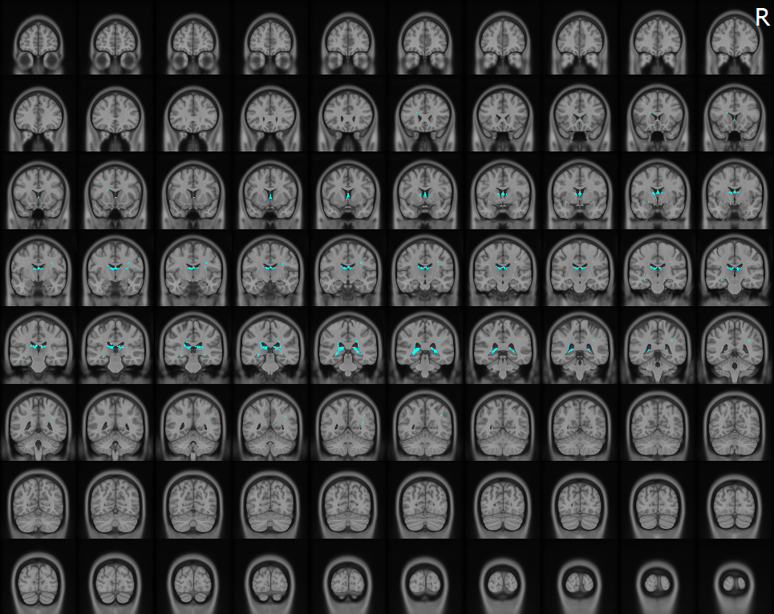{width=50%}

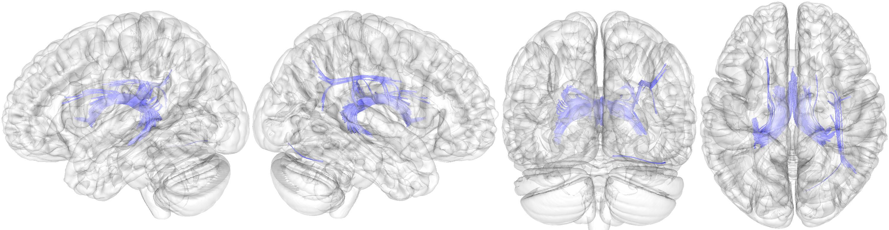

</center>
<br>

### Women

<span style="color: #ff5500;"><font size="5"><bold> Positive Correlations (FDR = 0.107640) </span></font></bold>

```{r md_pos_path_women}
#Women positive
df <- read_csv(here("data", "dsp", "path_efficiency", "md",
                    "md_pos_dsp_path_women.csv")) %>% 
  clean_names() %>% 
  filter(tract_name %in% c("number of tracts","mean length(mm)",
                          "diameter(mm)", "volume(mm^3)")) %>% 
  rotate_df() %>% row_to_names(row_number = 1) %>% 
  rownames_to_column("tract_name") %>% 
  mutate(tract_name = to_any_case(tract_name,"upper_camel", sep_out = "_")) %>% 
  mutate_at(c(2:5), as.numeric) %>% filter(`number of tracts` >= 10)

#Present table
df %>% 
  kable(col.names = c("Tract Name", "Number of Tracts", "Mean Length (mm)",
                      "Diameter (mm)", "Volume (mm^3)"),
        digits = 3,
        table.attr = "style='width:90%;'"
        ) %>% 
  kable_styling(bootstrap_options = "hover") %>% 
  scroll_box(width = "800px", height = "200px")
```


<br>
<span style="color: #00ffff;"><font size="5"><bold> Negative Correlations (FDR = 1.000000) </span></font></bold>

"No significant results in tracts" *and* all tracts < 10.

```{r md_neg_path_women}
#Women negative
df <- read_csv(here("data", "dsp", "path_efficiency", "md",
                    "md_neg_dsp_path_women.csv")) %>% 
  clean_names() %>% 
  filter(tract_name %in% c("number of tracts","mean length(mm)",
                          "diameter(mm)", "volume(mm^3)")) %>% 
  rotate_df() %>% row_to_names(row_number = 1) %>% 
  rownames_to_column("tract_name") %>% 
  mutate(tract_name = to_any_case(tract_name,"upper_camel", sep_out = "_")) %>% 
  mutate_at(c(2:5), as.numeric) #%>% filter(`number of tracts` >= 10)

#Present table
df %>% 
  kable(col.names = c("Tract Name", "Number of Tracts", "Mean Length (mm)",
                      "Diameter (mm)", "Volume (mm^3)"),
        digits = 3,
        table.attr = "style='width:90%;'"
        ) %>% 
  kable_styling(bootstrap_options = "hover") %>% 
  scroll_box(width = "800px", height = "200px")
```

<br>
<font size="5"> Figures </font>

<center>
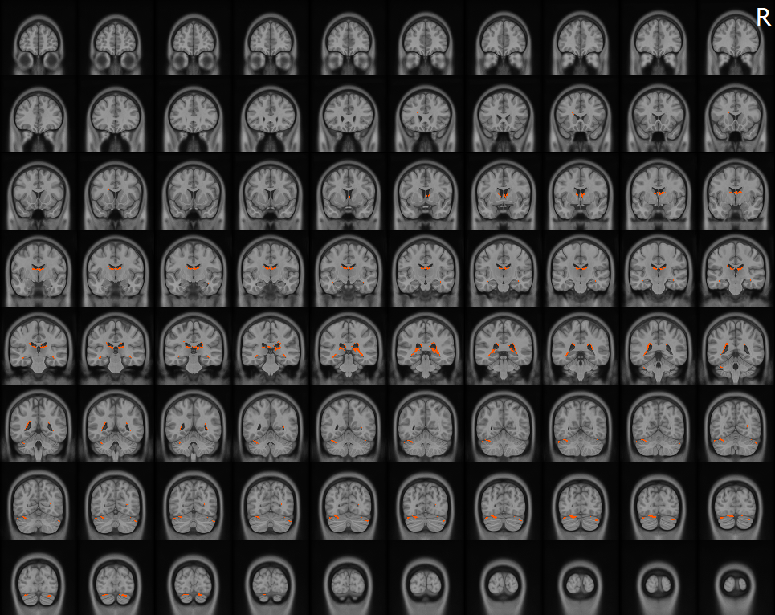{width=50%}

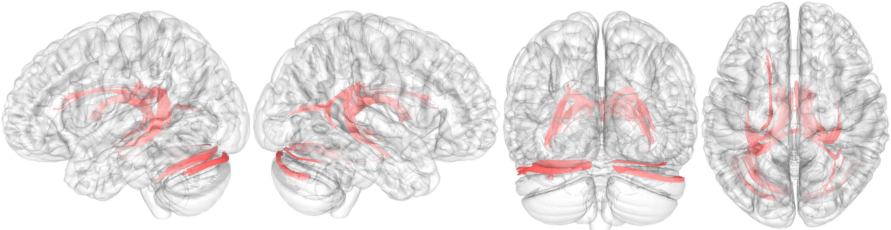

</center>
<br>

### Pre

<span style="color: #ff5500;"><font size="5"><bold> Positive Correlations (FDR = 0.003170) </span></font></bold>

```{r md_pos_path_pre}
#Pre positive
df <- read_csv(here("data", "dsp", "path_efficiency", "md",
                    "md_pos_dsp_path_pre.csv")) %>% 
  clean_names() %>% 
  filter(tract_name %in% c("number of tracts","mean length(mm)",
                          "diameter(mm)", "volume(mm^3)")) %>% 
  rotate_df() %>% row_to_names(row_number = 1) %>% 
  rownames_to_column("tract_name") %>% 
  mutate(tract_name = to_any_case(tract_name,"upper_camel", sep_out = "_")) %>% 
  mutate_at(c(2:5), as.numeric) %>% filter(`number of tracts` >= 10)

#Present table
df %>% 
  kable(col.names = c("Tract Name", "Number of Tracts", "Mean Length (mm)",
                      "Diameter (mm)", "Volume (mm^3)"),
        digits = 3,
        table.attr = "style='width:90%;'"
        ) %>% 
  kable_styling(bootstrap_options = "hover") %>% 
  scroll_box(width = "800px", height = "200px")
```


<br>
<span style="color: #00ffff;"><font size="5"><bold> Negative Correlations (FDR = 1.000000) </span></font></bold>

"No significant results in tracts" *and* all tracts < 10.

```{r md_neg_path_pre}
#Pre negative
df <- read_csv(here("data", "dsp", "path_efficiency", "md",
                    "md_neg_dsp_path_pre.csv")) %>% 
  clean_names() %>% 
  filter(tract_name %in% c("number of tracts","mean length(mm)",
                          "diameter(mm)", "volume(mm^3)")) %>% 
  rotate_df() %>% row_to_names(row_number = 1) %>% 
  rownames_to_column("tract_name") %>% 
  mutate(tract_name = to_any_case(tract_name,"upper_camel", sep_out = "_")) %>% 
  mutate_at(c(2:5), as.numeric) #%>% filter(`number of tracts` >= 10)

#Present table
df %>% 
  kable(col.names = c("Tract Name", "Number of Tracts", "Mean Length (mm)",
                      "Diameter (mm)", "Volume (mm^3)"),
        digits = 3,
        table.attr = "style='width:90%;'"
        ) %>% 
  kable_styling(bootstrap_options = "hover") %>% 
  scroll_box(width = "800px", height = "200px")
```

<br>
<font size="5"> Figures </font>

<center>
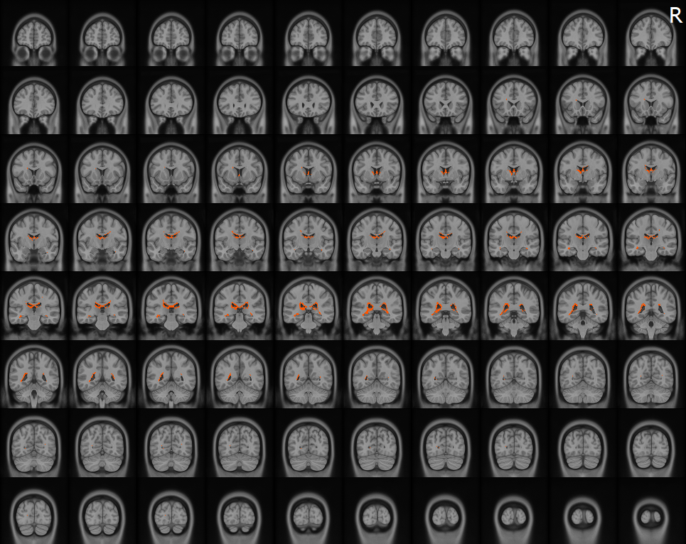{width=50%}


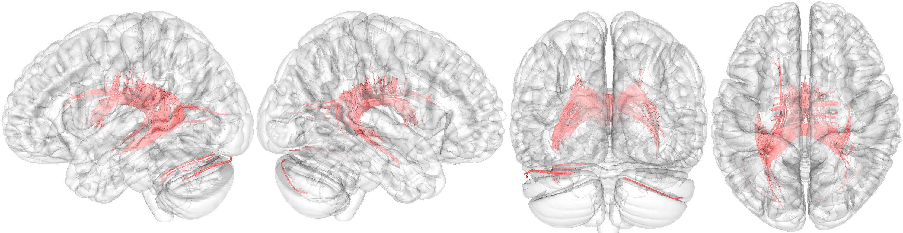

</center>
<br>

### Peri

<span style="color: #ff5500;"><font size="5"><bold> Positive Correlations (FDR = 0.053770) </span></font></bold>

```{r md_pos_path_peri}
#Peri positive
df <- read_csv(here("data", "dsp", "path_efficiency", "md",
                    "md_pos_dsp_path_peri.csv")) %>% 
  clean_names() %>% 
  filter(tract_name %in% c("number of tracts","mean length(mm)",
                          "diameter(mm)", "volume(mm^3)")) %>% 
  rotate_df() %>% row_to_names(row_number = 1) %>% 
  rownames_to_column("tract_name") %>% 
  mutate(tract_name = to_any_case(tract_name,"upper_camel", sep_out = "_")) %>% 
  mutate_at(c(2:5), as.numeric) %>% filter(`number of tracts` >= 10)

#Present table
df %>% 
  kable(col.names = c("Tract Name", "Number of Tracts", "Mean Length (mm)",
                      "Diameter (mm)", "Volume (mm^3)"),
        digits = 3,
        table.attr = "style='width:90%;'"
        ) %>% 
  kable_styling(bootstrap_options = "hover") %>% 
  scroll_box(width = "800px", height = "200px")
```


<br>
<span style="color: #00ffff;"><font size="5"><bold> Negative Correlations (FDR = 0.026111) </span></font></bold>


```{r md_neg_path_peri}
#Peri negative
df <- read_csv(here("data", "dsp", "path_efficiency", "md",
                    "md_neg_dsp_path_peri.csv")) %>% 
  clean_names() %>% 
  filter(tract_name %in% c("number of tracts","mean length(mm)",
                          "diameter(mm)", "volume(mm^3)")) %>% 
  rotate_df() %>% row_to_names(row_number = 1) %>% 
  rownames_to_column("tract_name") %>% 
  mutate(tract_name = to_any_case(tract_name,"upper_camel", sep_out = "_")) %>% 
  mutate_at(c(2:5), as.numeric) %>% filter(`number of tracts` >= 10)

#Present table
df %>% 
  kable(col.names = c("Tract Name", "Number of Tracts", "Mean Length (mm)",
                      "Diameter (mm)", "Volume (mm^3)"),
        digits = 3,
        table.attr = "style='width:90%;'"
        ) %>% 
  kable_styling(bootstrap_options = "hover") %>% 
  scroll_box(width = "800px", height = "200px")
```

<br>
<font size="5"> Figures </font>

<center>
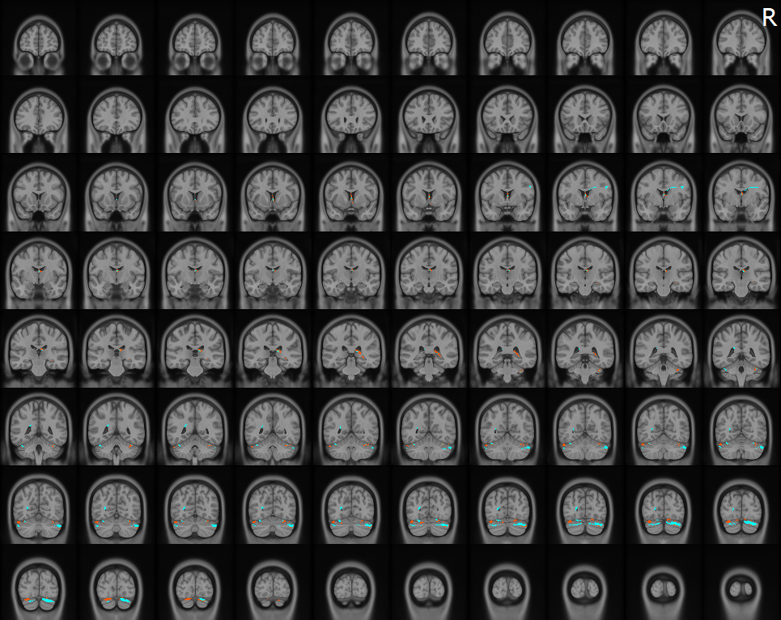{width=50%}


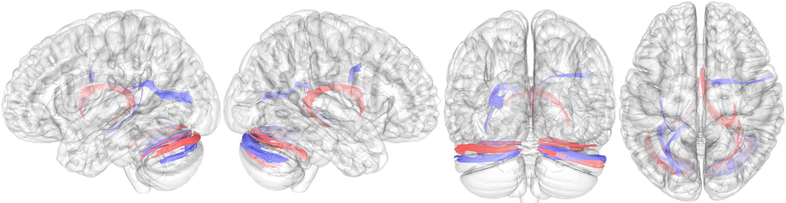

</center>
<br>

### Post

<span style="color: #ff5500;"><font size="5"><bold> Positive Correlations (FDR = 0.181693) </span></font></bold>

```{r md_pos_path_post}
#Post positive
df <- read_csv(here("data", "dsp", "path_efficiency", "md",
                    "md_pos_dsp_path_post.csv")) %>% 
  clean_names() %>% 
  filter(tract_name %in% c("number of tracts","mean length(mm)",
                          "diameter(mm)", "volume(mm^3)")) %>% 
  rotate_df() %>% row_to_names(row_number = 1) %>% 
  rownames_to_column("tract_name") %>% 
  mutate(tract_name = to_any_case(tract_name,"upper_camel", sep_out = "_")) %>% 
  mutate_at(c(2:5), as.numeric) %>% filter(`number of tracts` >= 10)

#Present table
df %>% 
  kable(col.names = c("Tract Name", "Number of Tracts", "Mean Length (mm)",
                      "Diameter (mm)", "Volume (mm^3)"),
        digits = 3,
        table.attr = "style='width:90%;'"
        ) %>% 
  kable_styling(bootstrap_options = "hover") %>% 
  scroll_box(width = "800px", height = "200px")
```


<br>
<span style="color: #00ffff;"><font size="5"><bold> Negative Correlations (FDR = 0.588894) </span></font></bold>

"No significant results in tracts."


```{r md_neg_path_post}
#Post negative
df <- read_csv(here("data", "dsp", "path_efficiency", "md",
                    "md_neg_dsp_path_post.csv")) %>% 
  clean_names() %>% 
  filter(tract_name %in% c("number of tracts","mean length(mm)",
                          "diameter(mm)", "volume(mm^3)")) %>% 
  rotate_df() %>% row_to_names(row_number = 1) %>% 
  rownames_to_column("tract_name") %>% 
  mutate(tract_name = to_any_case(tract_name,"upper_camel", sep_out = "_")) %>% 
  mutate_at(c(2:5), as.numeric) %>% filter(`number of tracts` >= 10)

#Present table
df %>% 
  kable(col.names = c("Tract Name", "Number of Tracts", "Mean Length (mm)",
                      "Diameter (mm)", "Volume (mm^3)"),
        digits = 3,
        table.attr = "style='width:90%;'"
        ) %>% 
  kable_styling(bootstrap_options = "hover") %>% 
  scroll_box(width = "800px", height = "200px")
```

<br>
<font size="5"> Figures </font>

<center>
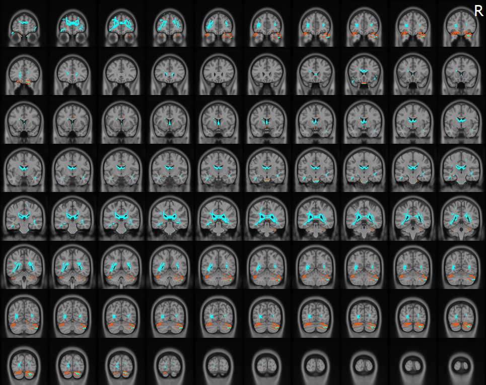{width=50%}

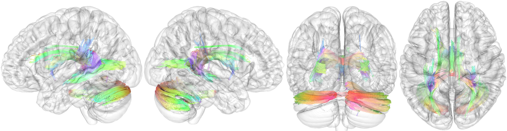

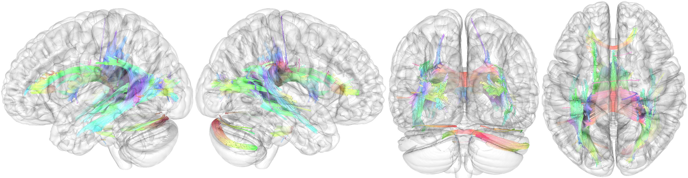

</center>
<br>


## {-}

## RD {.tabset}

When assessing all subjects, there are only negative correlations with tracts for RD and DSP path efficiency. When stratified by sex, men only have negative correlations while women only have positive correlations. Among women and reproductive stage groups, the right fornix tract was commonly displayed for positive correlations. Pres only had positive correlations with tracts, and peri and post have both positive and negative correlations with tracts.

### All Subjects

<span style="color: #ff5500;"><font size="5"><bold> Positive Correlations (FDR = 1.000000) </span></font></bold>

"No significant results in tracts" *and* all tracts < 10.

<br>
<span style="color: #00ffff;"><font size="5"><bold> Negative Correlations (FDR = 0.615267) </span></font></bold>

"No significant results in tracts."

```{r rd_neg_path_all}
#All subjects negative
df <- read_csv(here("data", "dsp", "path_efficiency", "rd",
                    "rd_neg_dsp_path_all.csv")) %>% 
  clean_names() %>% 
  filter(tract_name %in% c("number of tracts","mean length(mm)",
                          "diameter(mm)", "volume(mm^3)")) %>% 
  rotate_df() %>% row_to_names(row_number = 1) %>% 
  rownames_to_column("tract_name") %>% 
  mutate(tract_name = to_any_case(tract_name,"upper_camel", sep_out = "_")) %>% 
  mutate_at(c(2:5), as.numeric) %>% filter(`number of tracts` >= 10)

#Present table
df %>% 
  kable(col.names = c("Tract Name", "Number of Tracts", "Mean Length (mm)",
                      "Diameter (mm)", "Volume (mm^3)"),
        digits = 3,
        table.attr = "style='width:90%;'"
        ) %>% 
  kable_styling(bootstrap_options = "hover") %>% 
  scroll_box(width = "800px", height = "200px")
```

<br>
<font size="5"> Figures </font>

<center>
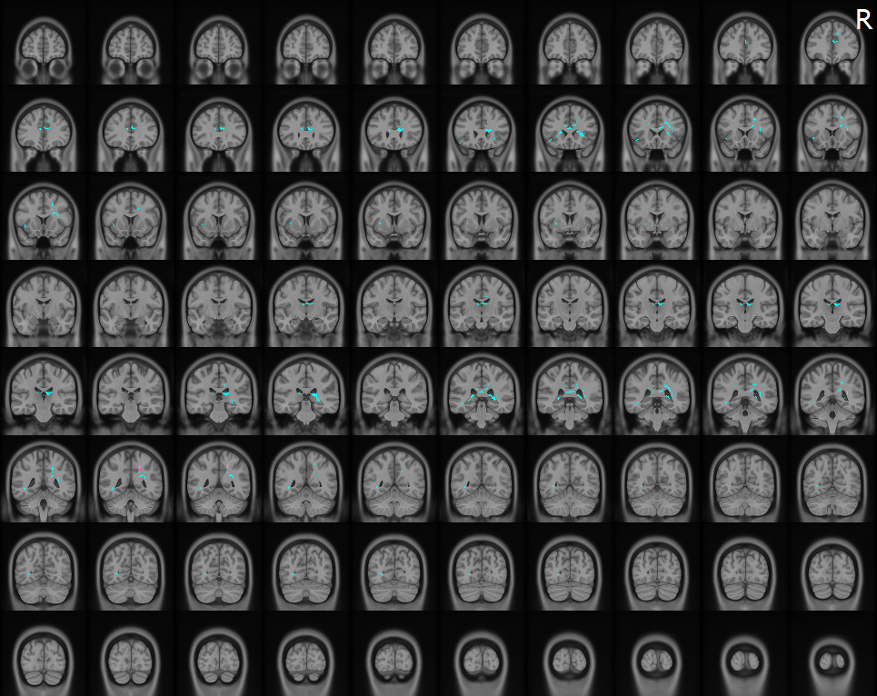{width=50%}

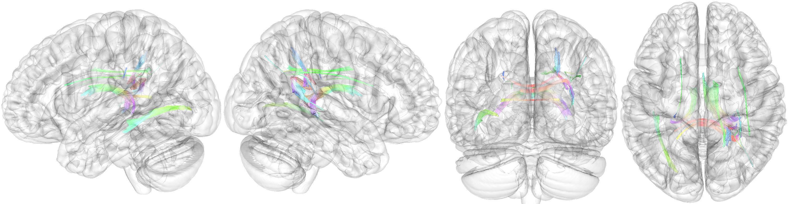

</center>
<br>

### Men

<span style="color: #ff5500;"><font size="5"><bold> Positive Correlations (FDR = 1.000000) </span></font></bold>

"No significant results in tracts" *and* all tracts < 10.

<br>
<span style="color: #00ffff;"><font size="5"><bold> Negative Correlations (FDR = 0.007664) </span></font></bold>

```{r rd_neg_path_men}
#Men negative
df <- read_csv(here("data", "dsp", "path_efficiency", "rd",
                    "rd_neg_dsp_path_men.csv")) %>% 
  clean_names() %>% 
  filter(tract_name %in% c("number of tracts","mean length(mm)",
                          "diameter(mm)", "volume(mm^3)")) %>% 
  rotate_df() %>% row_to_names(row_number = 1) %>% 
  rownames_to_column("tract_name") %>% 
  mutate(tract_name = to_any_case(tract_name,"upper_camel", sep_out = "_")) %>% 
  mutate_at(c(2:5), as.numeric) %>% filter(`number of tracts` >= 10)

#Present table
df %>% 
  kable(col.names = c("Tract Name", "Number of Tracts", "Mean Length (mm)",
                      "Diameter (mm)", "Volume (mm^3)"),
        digits = 3,
        table.attr = "style='width:90%;'"
        ) %>% 
  kable_styling(bootstrap_options = "hover") %>% 
  scroll_box(width = "800px", height = "200px")
```

<br>
<font size="5"> Figures </font>

<center>
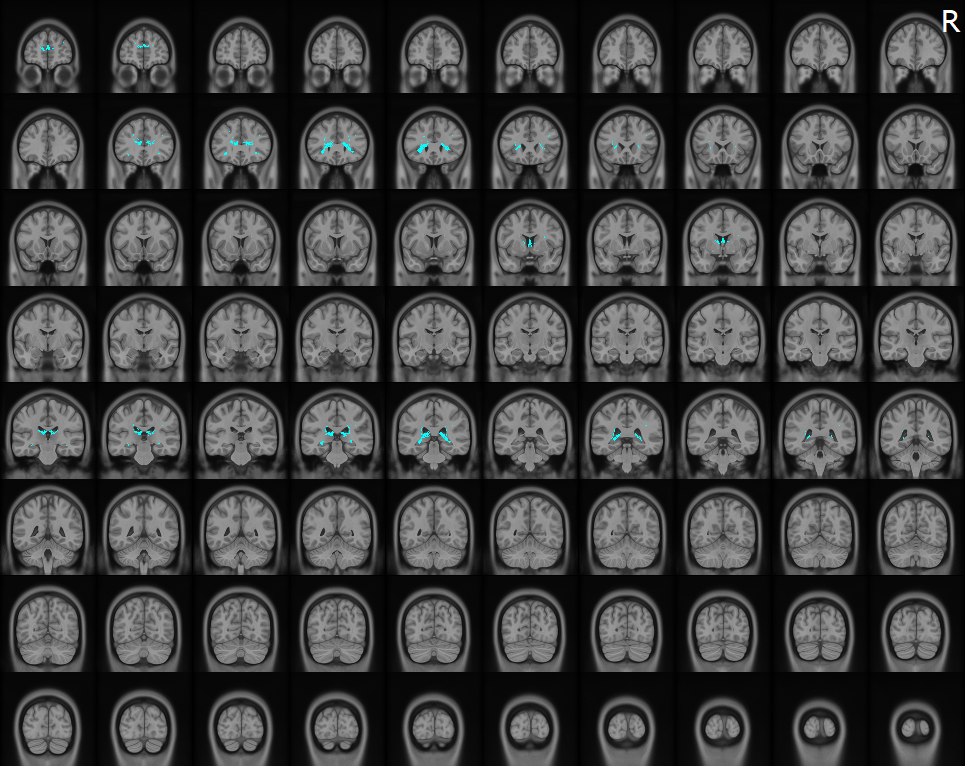{width=50%}


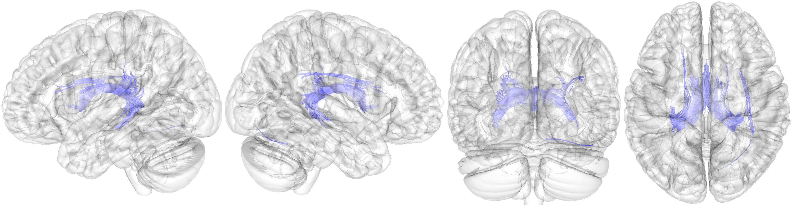

</center>
<br>

### Women

<span style="color: #ff5500;"><font size="5"><bold> Positive Correlations (FDR = 0.129808) </span></font></bold>

```{r rd_pos_path_women}
#Women positive
df <- read_csv(here("data", "dsp", "path_efficiency", "rd",
                    "rd_pos_dsp_path_women.csv")) %>% 
  clean_names() %>% 
  filter(tract_name %in% c("number of tracts","mean length(mm)",
                          "diameter(mm)", "volume(mm^3)")) %>% 
  rotate_df() %>% row_to_names(row_number = 1) %>% 
  rownames_to_column("tract_name") %>% 
  mutate(tract_name = to_any_case(tract_name,"upper_camel", sep_out = "_")) %>% 
  mutate_at(c(2:5), as.numeric) %>% filter(`number of tracts` >= 10)

#Present table
df %>% 
  kable(col.names = c("Tract Name", "Number of Tracts", "Mean Length (mm)",
                      "Diameter (mm)", "Volume (mm^3)"),
        digits = 3,
        table.attr = "style='width:90%;'"
        ) %>% 
  kable_styling(bootstrap_options = "hover") %>% 
  scroll_box(width = "800px", height = "200px")
```


<br>
<span style="color: #00ffff;"><font size="5"><bold> Negative Correlations (FDR = 1.000000) </span></font></bold>

"No significant results in tracts" *and* all tracts < 10.

<br>
<font size="5"> Figures </font>

<center>
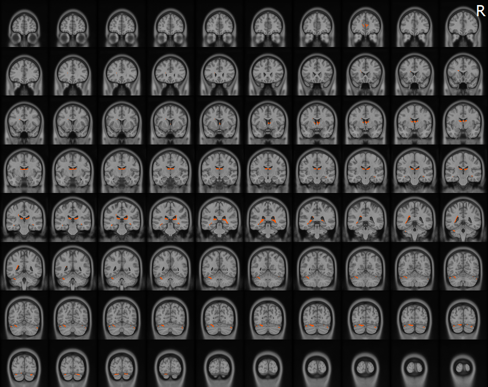{width=50%}


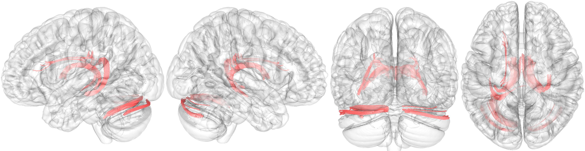

</center>
<br>

### Pre

<span style="color: #ff5500;"><font size="5"><bold> Positive Correlations (FDR = 0.003696) </span></font></bold>

```{r rd_pos_path_pre}
#Pre positive
df <- read_csv(here("data", "dsp", "path_efficiency", "rd",
                    "rd_pos_dsp_path_pre.csv")) %>% 
  clean_names() %>% 
  filter(tract_name %in% c("number of tracts","mean length(mm)",
                          "diameter(mm)", "volume(mm^3)")) %>% 
  rotate_df() %>% row_to_names(row_number = 1) %>% 
  rownames_to_column("tract_name") %>% 
  mutate(tract_name = to_any_case(tract_name,"upper_camel", sep_out = "_")) %>% 
  mutate_at(c(2:5), as.numeric) %>% filter(`number of tracts` >= 10)

#Present table
df %>% 
  kable(col.names = c("Tract Name", "Number of Tracts", "Mean Length (mm)",
                      "Diameter (mm)", "Volume (mm^3)"),
        digits = 3,
        table.attr = "style='width:90%;'"
        ) %>% 
  kable_styling(bootstrap_options = "hover") %>% 
  scroll_box(width = "800px", height = "200px")
```


<br>
<span style="color: #00ffff;"><font size="5"><bold> Negative Correlations (FDR = 1.000000) </span></font></bold>

No significant results in tracts.

<br>
<font size="5"> Figures </font>

<center>
{width=50%}


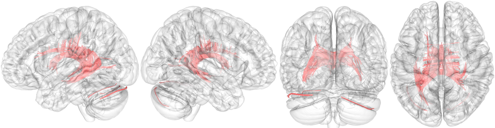

</center>
<br>

### Peri

<span style="color: #ff5500;"><font size="5"><bold> Positive Correlations (FDR = 0.051595) </span></font></bold>

```{r rd_pos_path_peri}
#Peri positive
df <- read_csv(here("data", "dsp", "path_efficiency", "rd",
                    "rd_pos_dsp_path_peri.csv")) %>% 
  clean_names() %>% 
  filter(tract_name %in% c("number of tracts","mean length(mm)",
                          "diameter(mm)", "volume(mm^3)")) %>% 
  rotate_df() %>% row_to_names(row_number = 1) %>% 
  rownames_to_column("tract_name") %>% 
  mutate(tract_name = to_any_case(tract_name,"upper_camel", sep_out = "_")) %>% 
  mutate_at(c(2:5), as.numeric) %>% filter(`number of tracts` >= 10)

#Present table
df %>% 
  kable(col.names = c("Tract Name", "Number of Tracts", "Mean Length (mm)",
                      "Diameter (mm)", "Volume (mm^3)"),
        digits = 3,
        table.attr = "style='width:90%;'"
        ) %>% 
  kable_styling(bootstrap_options = "hover") %>% 
  scroll_box(width = "800px", height = "200px")
```


<br>
<span style="color: #00ffff;"><font size="5"><bold> Negative Correlations (FDR = 0.025754) </span></font></bold>

```{r rd_neg_path_peri}
#Peri negative
df <- read_csv(here("data", "dsp", "path_efficiency", "rd",
                    "rd_neg_dsp_path_peri.csv")) %>% 
  clean_names() %>% 
  filter(tract_name %in% c("number of tracts","mean length(mm)",
                          "diameter(mm)", "volume(mm^3)")) %>% 
  rotate_df() %>% row_to_names(row_number = 1) %>% 
  rownames_to_column("tract_name") %>% 
  mutate(tract_name = to_any_case(tract_name,"upper_camel", sep_out = "_")) %>% 
  mutate_at(c(2:5), as.numeric) %>% filter(`number of tracts` >= 10)

#Present table
df %>% 
  kable(col.names = c("Tract Name", "Number of Tracts", "Mean Length (mm)",
                      "Diameter (mm)", "Volume (mm^3)"),
        digits = 3,
        table.attr = "style='width:90%;'"
        ) %>% 
  kable_styling(bootstrap_options = "hover") %>% 
  scroll_box(width = "800px", height = "200px")
```


<br>
<font size="5"> Figures </font>

<center>
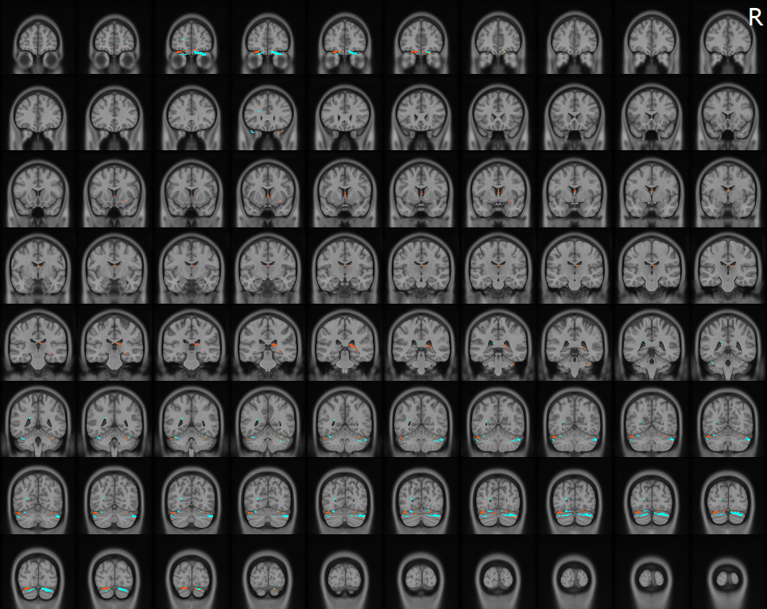{width=50%}

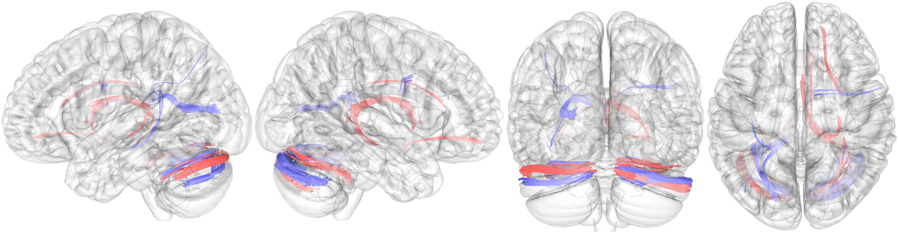

</center>
<br>

### Post

<span style="color: #ff5500;"><font size="5"><bold> Positive Correlations (FDR = 0.181574) </span></font></bold>

```{r rd_pos_path_post}
#Post positive
df <- read_csv(here("data", "dsp", "path_efficiency", "rd",
                    "rd_pos_dsp_path_post.csv")) %>% 
  clean_names() %>% 
  filter(tract_name %in% c("number of tracts","mean length(mm)",
                          "diameter(mm)", "volume(mm^3)")) %>% 
  rotate_df() %>% row_to_names(row_number = 1) %>% 
  rownames_to_column("tract_name") %>% 
  mutate(tract_name = to_any_case(tract_name,"upper_camel", sep_out = "_")) %>% 
  mutate_at(c(2:5), as.numeric) %>% filter(`number of tracts` >= 10)

#Present table
df %>% 
  kable(col.names = c("Tract Name", "Number of Tracts", "Mean Length (mm)",
                      "Diameter (mm)", "Volume (mm^3)"),
        digits = 3,
        table.attr = "style='width:90%;'"
        ) %>% 
  kable_styling(bootstrap_options = "hover") %>% 
  scroll_box(width = "800px", height = "200px")
```


<br>
<span style="color: #00ffff;"><font size="5"><bold> Negative Correlations (FDR = 0.690744) </span></font></bold>

"No significant results in tracts."

```{r rd_neg_path_post}
#Post negative
df <- read_csv(here("data", "dsp", "path_efficiency", "rd",
                    "rd_neg_dsp_path_post.csv")) %>% 
  clean_names() %>% 
  filter(tract_name %in% c("number of tracts","mean length(mm)",
                          "diameter(mm)", "volume(mm^3)")) %>% 
  rotate_df() %>% row_to_names(row_number = 1) %>% 
  rownames_to_column("tract_name") %>% 
  mutate(tract_name = to_any_case(tract_name,"upper_camel", sep_out = "_")) %>% 
  mutate_at(c(2:5), as.numeric) %>% filter(`number of tracts` >= 10)

#Present table
df %>% 
  kable(col.names = c("Tract Name", "Number of Tracts", "Mean Length (mm)",
                      "Diameter (mm)", "Volume (mm^3)"),
        digits = 3,
        table.attr = "style='width:90%;'"
        ) %>% 
  kable_styling(bootstrap_options = "hover") %>% 
  scroll_box(width = "800px", height = "200px")
```


<br>
<font size="5"> Figures </font>

<center>
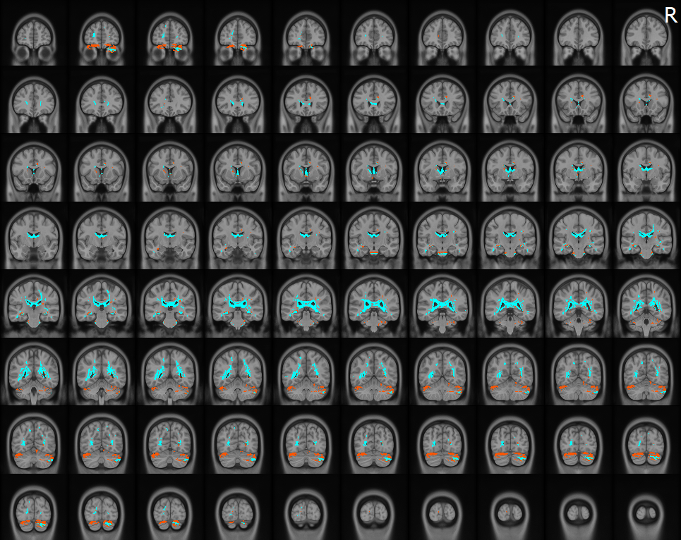{width=50%}


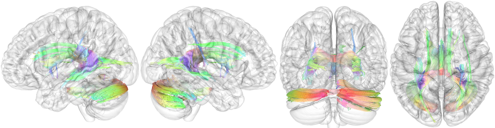

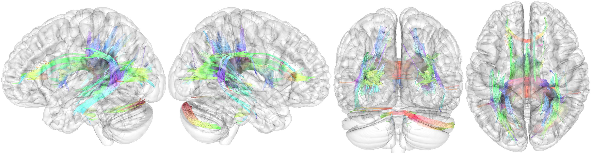

</center>
<br>


## {-}

# {-}

# Summary


<br>

**QA is quantitative anisotropy**: density of anisotropic diffusion after removing the isotropic component (Yeh, 2010), quantifies how specific is the water movement

- Higher is greater white matter integrity
- Lower is lower white matter integrity

**AD is axial diffusivity**: quantifies how fast water diffuses along/parallel to the axon fibers, need to asses with other measurements

- Higher may or may not be associated with greater white matter integrity
- Lower may or may not be associated with lower white matter integrity

**MD is mean diffusivity**: average of the axial and radial diffusivity, overall how diffusive is the water

- Higher is greater diffusivity, associated with greater axonal injury
- Lower is lower diffusivity, better integrity

**RD is radial diffusivity**: water diffusivity moving away from axon, quantifies how fast water diffuses across the axonal bundles

- Higher is greater demyelination: water is not staying with axon and moving away from it
- Lower is better integrity


