```{r setup, include=FALSE, echo=FALSE, warning=FALSE, message=FALSE}
knitr::opts_chunk$set(warning=FALSE, message=FALSE, echo = FALSE,
                      fig.align = "center")

#Attach libraries 
library(tidyverse)
library(here)
library(janitor)
library(broom)
library(kableExtra)
library(sjmisc)
library(snakecase)
```

# Overview

# Methods

A total of 71 diffusion MRI scans were included in the connectometry database. A diffusion spectrum imaging scheme was used, and a total of 128 diffusion sampling were acquired. The maximum b-value was 4990 s/mm². The in-plane resolution was 1.8 mm. The slice thickness was 1.8 mm. The accuracy of b-table orientation was examined by comparing fiber orientations with those of a population-averaged template (Yeh et al. Neuroimage, 2018). The b-table was flipped by .012fy. The diffusion data were reconstructed in the MNI space using q-space diffeomorphic reconstruction (Yeh et al., Neuroimage, 58(1):91-9, 2011) to obtain the spin distribution function (Yeh et al., IEEE TMI, ;29(9):1626-35, 2010). A diffusion sampling length ratio of 1.25 was used. The output resolution in diffeomorphic reconstruction was 1.8 mm isotropic. The tensor metrics were calculated using DWI with b-value lower than 1750 s/mm². The quantitative anisotropy was extracted as the local connectome fingerprint (LCF, Yeh et al. PLoS Comput Biol 12(11): e1005203) and used in the connectometry analysis.

Diffusion MRI connectometry (Yeh et al. NeuroImage 125 (2016): 162-171) was used to derive the correlational tractography that has QA, AD, MD, RD correlated with either DSP wayfinding success, solution index, or path efficiency. A nonparametric Spearman partial correlation was used to derive the correlation, and the effect of sex_binary, age_spatial_years, and repo_status_dummy was removed using a multiple regression model (*depending on whether looking by sex or reproductive status*). Different number of subjects were included in the analysis depending on th group. A T-score threshold of 2.5 was assigned and tracked using a deterministic fiber tracking algorithm (Yeh et al. PLoS ONE 8(11): e80713, 2013) to obtain correlational tractography. A seeding region was placed at whole brain. The tracks were filtered by topology-informed pruning (Yeh et al. Neurotherapeutics, 16(1), 52-58, 2019) with 4 iteration(s). A length threshold of 25 voxel distance was used to select tracks. To estimate the false discovery rate, a total of 4000 randomized permutations were applied to the group label to obtain the null distribution of the track length.


# Wayfinding Success {.tabset .tabset-dropdown}

## QA {.tabset}

There were negative but no positive correlations between QA and DSP wayfinding success when all subjects were included in the analysis. When men were analyzed separately, men displayed more negatively associated correlations between QA and wayfinding success. Women also displayed tracts with more negative correlations. When assessing by reproductive stage, both peris and posts displayed both positive and negative correlations (with peris displaying tracts with mostly positive associations) while pres displayed only a few tracts for positive and negative correlations with performance. 


### All Subjects 

<span style="color: #ff5500;"><font size="5"><bold> Positive Correlations (FDR = 1.000000) </span></font></bold>

No significant results in tracts.

<br>
<span style="color: #00ffff;"><font size="5"><bold> Negative Correlations (FDR = 0.000312) </span></font></bold>

```{r qa_neg_wayfinding_all}
#All subjects negative
df <- read_csv(here("data", "dsp", "wayfinding_success", "qa",
                    "qa_neg_dsp_wayfinding_all.csv")) %>% 
  clean_names() %>% 
  filter(tract_name %in% c("number of tracts","mean length(mm)",
                          "diameter(mm)", "volume(mm^3)")) %>% 
  rotate_df() %>% row_to_names(row_number = 1) %>% 
  rownames_to_column("tract_name") %>% 
  mutate(tract_name = to_any_case(tract_name,"upper_camel", sep_out = "_")) %>% 
  mutate_at(c(2:5), as.numeric) %>% 
  filter(`number of tracts` >= 10)

#Present table
df %>% 
  kable(col.names = c("Tract Name", "Number of Tracts", "Mean Length (mm)",
                      "Diameter (mm)", "Volume (mm^3)"),
        digits = 3,
        table.attr = "style='width:90%;'"
        ) %>% 
  kable_styling(bootstrap_options = "hover") %>% 
  scroll_box(width = "800px", height = "200px")
```

<br>
<font size="5"> Figures </font>

<center>
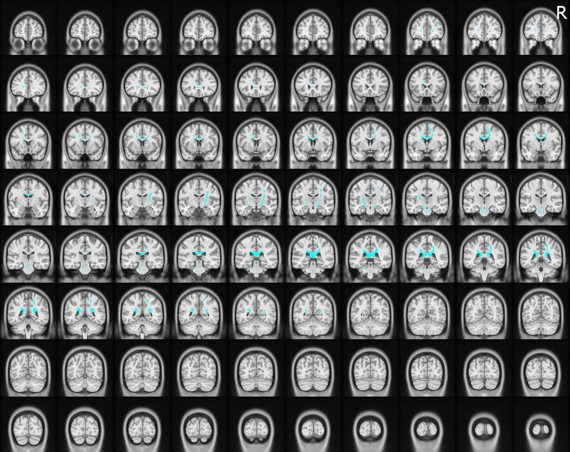{width=50%}

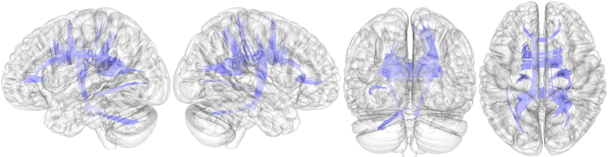

</center>
<br>


### Men

<span style="color: #ff5500;"><font size="5"><bold> Positive Correlations (FDR = 0.070175) </span></font></bold>

```{r qa_pos_wayfinding_men}
#Men positive
df <- read_csv(here("data", "dsp", "wayfinding_success", "qa",
                    "qa_pos_dsp_wayfinding_men.csv")) %>% 
  clean_names() %>% 
  filter(tract_name %in% c("number of tracts","mean length(mm)",
                          "diameter(mm)", "volume(mm^3)")) %>% 
  rotate_df() %>% row_to_names(row_number = 1) %>% 
  rownames_to_column("tract_name") %>% 
  mutate(tract_name = to_any_case(tract_name,"upper_camel", sep_out = "_")) %>% 
  mutate_at(c(2:5), as.numeric) %>% 
  filter(`number of tracts` >= 10)

#Present table
df %>% 
  kable(col.names = c("Tract Name", "Number of Tracts", "Mean Length (mm)",
                      "Diameter (mm)", "Volume (mm^3)"),
        digits = 3,
        table.attr = "style='width:90%;'"
        ) %>% 
  kable_styling(bootstrap_options = "hover") %>% 
  scroll_box(width = "800px", height = "200px")
```


<br>
<span style="color: #00ffff;"><font size="5"><bold> Negative Correlations (FDR = 0.004283) </span></font></bold>

```{r qa_neg_wayfinding_men}
#Men negative
df <- read_csv(here("data", "dsp", "wayfinding_success", "qa",
                    "qa_neg_dsp_wayfinding_men.csv")) %>% 
  clean_names() %>% 
  filter(tract_name %in% c("number of tracts","mean length(mm)",
                          "diameter(mm)", "volume(mm^3)")) %>% 
  rotate_df() %>% row_to_names(row_number = 1) %>% 
  rownames_to_column("tract_name") %>% 
  mutate(tract_name = to_any_case(tract_name,"upper_camel", sep_out = "_")) %>% 
  mutate_at(c(2:5), as.numeric) %>% 
  filter(`number of tracts` >= 10)

#Present table
df %>% 
  kable(col.names = c("Tract Name", "Number of Tracts", "Mean Length (mm)",
                      "Diameter (mm)", "Volume (mm^3)"),
        digits = 3,
        table.attr = "style='width:90%;'"
        ) %>% 
  kable_styling(bootstrap_options = "hover") %>% 
  scroll_box(width = "800px", height = "200px")
```

<br>
<font size="5"> Figures </font>

<center>
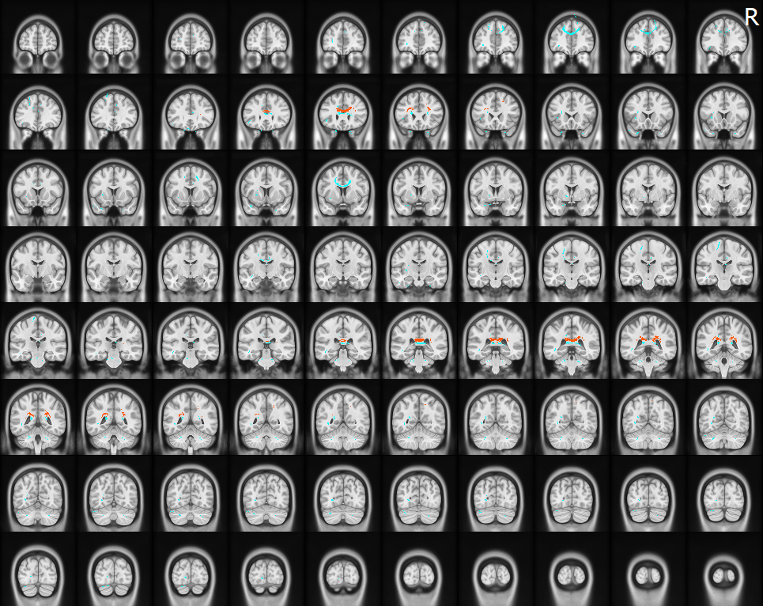{width=50%}

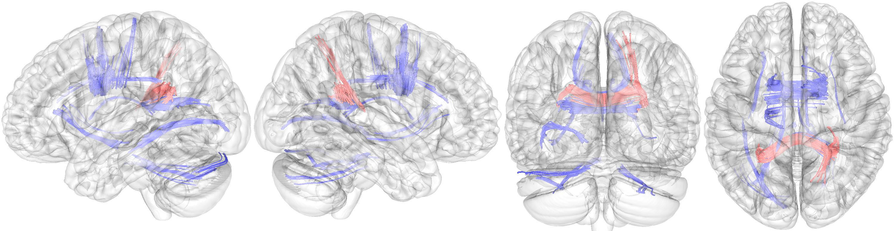

</center>
<br>

### Women

<span style="color: #ff5500;"><font size="5"><bold> Positive Correlations (FDR =  0.040000) </span></font></bold>

All tracts were < 10.

```{r qa_pos_wayfinding_women}
#Women positive
df <- read_csv(here("data", "dsp", "wayfinding_success", "qa",
                    "qa_pos_dsp_wayfinding_women.csv")) %>% 
  clean_names() %>% 
  filter(tract_name %in% c("number of tracts","mean length(mm)",
                          "diameter(mm)", "volume(mm^3)")) %>% 
  rotate_df() %>% row_to_names(row_number = 1) %>% 
  rownames_to_column("tract_name") %>% 
  mutate(tract_name = to_any_case(tract_name,"upper_camel", sep_out = "_")) %>% 
  mutate_at(c(2:5), as.numeric)
#%>% filter(`number of tracts` >= 10)

#Present table
df %>% 
  kable(col.names = c("Tract Name", "Number of Tracts", "Mean Length (mm)",
                      "Diameter (mm)", "Volume (mm^3)"),
        digits = 3,
        table.attr = "style='width:90%;'"
        ) %>% 
  kable_styling(bootstrap_options = "hover") %>% 
  scroll_box(width = "800px", height = "200px")
```


<br>
<span style="color: #00ffff;"><font size="5"><bold> Negative Correlations (FDR = 0.000128) </span></font></bold>

```{r qa_neg_wayfinding_women}
#Women negative
df <- read_csv(here("data", "dsp", "wayfinding_success", "qa",
                    "qa_neg_dsp_wayfinding_women.csv")) %>% 
  clean_names() %>% 
  filter(tract_name %in% c("number of tracts","mean length(mm)",
                          "diameter(mm)", "volume(mm^3)")) %>% 
  rotate_df() %>% row_to_names(row_number = 1) %>% 
  rownames_to_column("tract_name") %>% 
  mutate(tract_name = to_any_case(tract_name,"upper_camel", sep_out = "_")) %>% 
  mutate_at(c(2:5), as.numeric) %>% 
  filter(`number of tracts` >= 10)

#Present table
df %>% 
  kable(col.names = c("Tract Name", "Number of Tracts", "Mean Length (mm)",
                      "Diameter (mm)", "Volume (mm^3)"),
        digits = 3,
        table.attr = "style='width:90%;'"
        ) %>% 
  kable_styling(bootstrap_options = "hover") %>% 
  scroll_box(width = "800px", height = "200px")
```

<br>
<font size="5"> Figures </font>

<center>
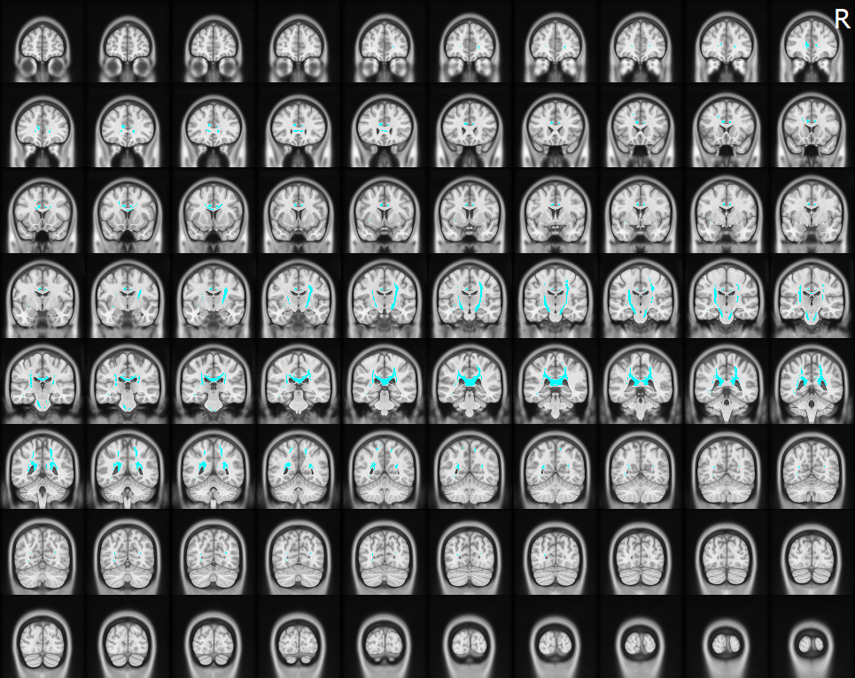{width=50%}


</center>
<br>

### Pre

<span style="color: #ff5500;"><font size="5"><bold> Positive Correlations (FDR =  0.010204) </span></font></bold>

```{r qa_pos_wayfinding_pre}
#Pre positive
df <- read_csv(here("data", "dsp", "wayfinding_success", "qa",
                    "qa_pos_dsp_wayfinding_pre.csv")) %>% 
  clean_names() %>% 
  filter(tract_name %in% c("number of tracts","mean length(mm)",
                          "diameter(mm)", "volume(mm^3)")) %>% 
  rotate_df() %>% row_to_names(row_number = 1) %>% 
  rownames_to_column("tract_name") %>% 
  mutate(tract_name = to_any_case(tract_name,"upper_camel", sep_out = "_")) %>% 
  mutate_at(c(2:5), as.numeric) %>% filter(`number of tracts` >= 10)

#Present table
df %>% 
  kable(col.names = c("Tract Name", "Number of Tracts", "Mean Length (mm)",
                      "Diameter (mm)", "Volume (mm^3)"),
        digits = 3,
        table.attr = "style='width:90%;'"
        ) %>% 
  kable_styling(bootstrap_options = "hover") %>% 
  scroll_box(width = "800px", height = "200px")
```


<br>
<span style="color: #00ffff;"><font size="5"><bold> Negative Correlations (FDR = 0.000952) </span></font></bold>

```{r qa_neg_wayfinding_pre}
#Pre negative
df <- read_csv(here("data", "dsp", "wayfinding_success", "qa",
                    "qa_neg_dsp_wayfinding_pre.csv")) %>% 
  clean_names() %>% 
  filter(tract_name %in% c("number of tracts","mean length(mm)",
                          "diameter(mm)", "volume(mm^3)")) %>% 
  rotate_df() %>% row_to_names(row_number = 1) %>% 
  rownames_to_column("tract_name") %>% 
  mutate(tract_name = to_any_case(tract_name,"upper_camel", sep_out = "_")) %>% 
  mutate_at(c(2:5), as.numeric) %>% 
  filter(`number of tracts` >= 10)

#Present table
df %>% 
  kable(col.names = c("Tract Name", "Number of Tracts", "Mean Length (mm)",
                      "Diameter (mm)", "Volume (mm^3)"),
        digits = 3,
        table.attr = "style='width:90%;'"
        ) %>% 
  kable_styling(bootstrap_options = "hover") %>% 
  scroll_box(width = "800px", height = "200px")
```

<br>
<font size="5"> Figures </font>

<center>
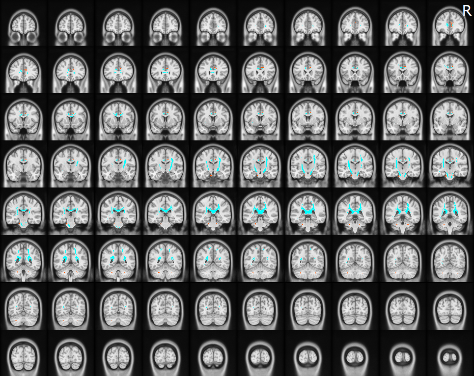{width=50%}
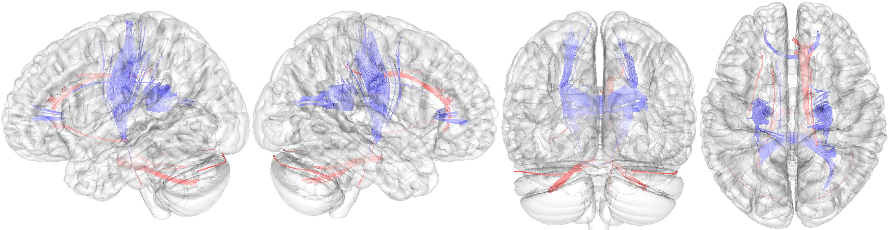

</center>
<br>

### Peri

<span style="color: #ff5500;"><font size="5"><bold> Positive Correlations (FDR =   0.002637) </span></font></bold>

```{r qa_pos_wayfinding_peri}
#Peri positive
df <- read_csv(here("data", "dsp", "wayfinding_success", "qa",
                    "qa_pos_dsp_wayfinding_peri.csv")) %>% 
  clean_names() %>% 
  filter(tract_name %in% c("number of tracts","mean length(mm)",
                          "diameter(mm)", "volume(mm^3)")) %>% 
  rotate_df() %>% row_to_names(row_number = 1) %>% 
  rownames_to_column("tract_name") %>% 
  mutate(tract_name = to_any_case(tract_name,"upper_camel", sep_out = "_")) %>% 
  mutate_at(c(2:5), as.numeric) %>% filter(`number of tracts` >= 10)

#Present table
df %>% 
  kable(col.names = c("Tract Name", "Number of Tracts", "Mean Length (mm)",
                      "Diameter (mm)", "Volume (mm^3)"),
        digits = 3,
        table.attr = "style='width:90%;'"
        ) %>% 
  kable_styling(bootstrap_options = "hover") %>% 
  scroll_box(width = "800px", height = "200px")
```


<br>
<span style="color: #00ffff;"><font size="5"><bold> Negative Correlations (FDR = 0.192308) </span></font></bold>

```{r qa_neg_wayfinding_peri}
#Peri negative
df <- read_csv(here("data", "dsp", "wayfinding_success", "qa",
                    "qa_neg_dsp_wayfinding_peri.csv")) %>% 
  clean_names() %>% 
  filter(tract_name %in% c("number of tracts","mean length(mm)",
                          "diameter(mm)", "volume(mm^3)")) %>% 
  rotate_df() %>% row_to_names(row_number = 1) %>% 
  rownames_to_column("tract_name") %>% 
  mutate(tract_name = to_any_case(tract_name,"upper_camel", sep_out = "_")) %>% 
  mutate_at(c(2:5), as.numeric) %>% 
  filter(`number of tracts` >= 10)

#Present table
df %>% 
  kable(col.names = c("Tract Name", "Number of Tracts", "Mean Length (mm)",
                      "Diameter (mm)", "Volume (mm^3)"),
        digits = 3,
        table.attr = "style='width:90%;'"
        ) %>% 
  kable_styling(bootstrap_options = "hover") %>% 
  scroll_box(width = "800px", height = "200px")
```

<br>
<font size="5"> Figures </font>

<center>
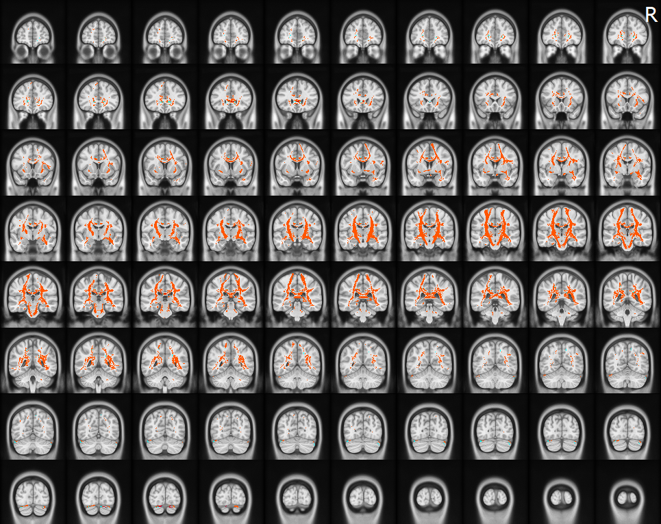{width=50%}

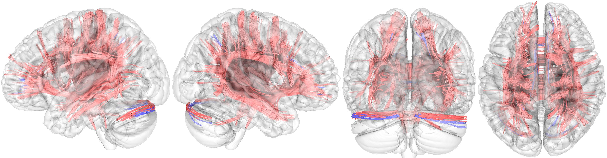

</center>
<br>

### Post

<span style="color: #ff5500;"><font size="5"><bold> Positive Correlations (FDR =  0.185305) </span></font></bold>

```{r qa_pos_wayfinding_post}
#Post positive
df <- read_csv(here("data", "dsp", "wayfinding_success", "qa",
                    "qa_pos_dsp_wayfinding_post.csv")) %>% 
  clean_names() %>% 
  filter(tract_name %in% c("number of tracts","mean length(mm)",
                          "diameter(mm)", "volume(mm^3)")) %>% 
  rotate_df() %>% row_to_names(row_number = 1) %>% 
  rownames_to_column("tract_name") %>% 
  mutate(tract_name = to_any_case(tract_name,"upper_camel", sep_out = "_")) %>% 
  mutate_at(c(2:5), as.numeric) %>% filter(`number of tracts` >= 10)

#Present table
df %>% 
  kable(col.names = c("Tract Name", "Number of Tracts", "Mean Length (mm)",
                      "Diameter (mm)", "Volume (mm^3)"),
        digits = 3,
        table.attr = "style='width:90%;'"
        ) %>% 
  kable_styling(bootstrap_options = "hover") %>% 
  scroll_box(width = "800px", height = "200px")
```


<br>
<span style="color: #00ffff;"><font size="5"><bold> Negative Correlations (FDR = 0.227859) </span></font></bold>

"No significant results in tracts."

```{r qa_neg_wayfinding_post}
#Post negative
df <- read_csv(here("data", "dsp", "wayfinding_success", "qa",
                    "qa_neg_dsp_wayfinding_post.csv")) %>% 
  clean_names() %>% 
  filter(tract_name %in% c("number of tracts","mean length(mm)",
                          "diameter(mm)", "volume(mm^3)")) %>% 
  rotate_df() %>% row_to_names(row_number = 1) %>% 
  rownames_to_column("tract_name") %>% 
  mutate(tract_name = to_any_case(tract_name,"upper_camel", sep_out = "_")) %>% 
  mutate_at(c(2:5), as.numeric) %>% 
  filter(`number of tracts` >= 10)

#Present table
df %>% 
  kable(col.names = c("Tract Name", "Number of Tracts", "Mean Length (mm)",
                      "Diameter (mm)", "Volume (mm^3)"),
        digits = 3,
        table.attr = "style='width:90%;'"
        ) %>% 
  kable_styling(bootstrap_options = "hover") %>% 
  scroll_box(width = "800px", height = "200px")
```

<br>
<font size="5"> Figures </font>

<center>
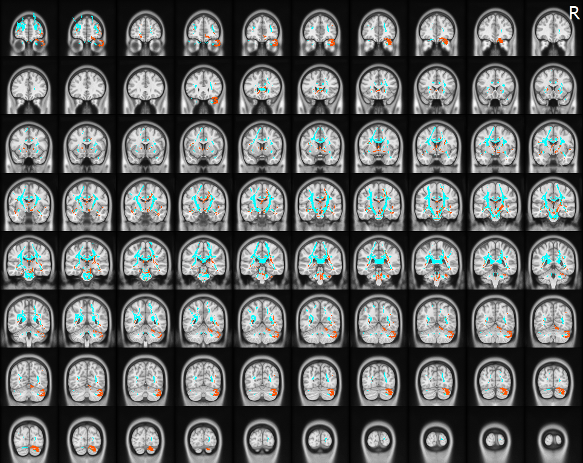{width=50%}

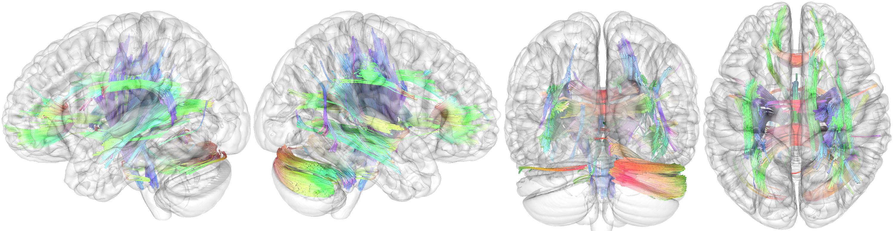

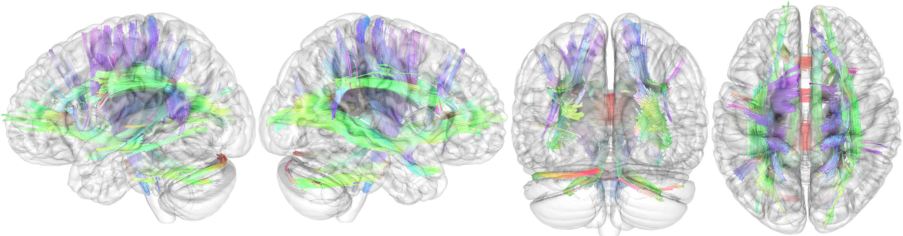

</center>
<br>


## {-}

## AD {.tabset}

The right fornix tract was displayed for all positive correlations between AD and DSP wayfinding success for all groups. For all subjects and when separated by sex, there wre few tracts that were both negativey and positive correlated with AD and wayfinding success. Men only displayed positive correlations between AD and performance, and women only displayed the right fornix tract in the positive correlation. Both peris and posts have more positive correlations, whereas pres have more negative correlations.


### All Subjects

<span style="color: #ff5500;"><font size="5"><bold> Positive Correlations (FDR = 0.092079) </span></font></bold>

```{r ad_pos_wayfinding_all}
#All subjects positive
df <- read_csv(here("data", "dsp", "wayfinding_success", "ad",
                    "ad_pos_dsp_wayfinding_all.csv")) %>% 
  clean_names() %>% 
  filter(tract_name %in% c("number of tracts","mean length(mm)",
                          "diameter(mm)", "volume(mm^3)")) %>% 
  rotate_df() %>% row_to_names(row_number = 1) %>% 
  rownames_to_column("tract_name") %>% 
  mutate(tract_name = to_any_case(tract_name,"upper_camel", sep_out = "_")) %>% 
  mutate_at(c(2:5), as.numeric) %>% 
  filter(`number of tracts` >= 10)

#Present table
df %>% 
  kable(col.names = c("Tract Name", "Number of Tracts", "Mean Length (mm)",
                      "Diameter (mm)", "Volume (mm^3)"),
        digits = 3,
        table.attr = "style='width:90%;'"
        ) %>% 
  kable_styling(bootstrap_options = "hover") %>% 
  scroll_box(width = "800px", height = "200px")
```


<br>
<span style="color: #00ffff;"><font size="5"><bold> Negative Correlations (FDR = 0.119565) </span></font></bold>

```{r ad_neg_wayfinding_all}
#All subjects negative
df <- read_csv(here("data", "dsp", "wayfinding_success", "ad",
                    "ad_neg_dsp_wayfinding_all.csv")) %>% 
  clean_names() %>% 
  filter(tract_name %in% c("number of tracts","mean length(mm)",
                          "diameter(mm)", "volume(mm^3)")) %>% 
  rotate_df() %>% row_to_names(row_number = 1) %>% 
  rownames_to_column("tract_name") %>% 
  mutate(tract_name = to_any_case(tract_name,"upper_camel", sep_out = "_")) %>% 
  mutate_at(c(2:5), as.numeric) %>% 
  filter(`number of tracts` >= 10)

#Present table
df %>% 
  kable(col.names = c("Tract Name", "Number of Tracts", "Mean Length (mm)",
                      "Diameter (mm)", "Volume (mm^3)"),
        digits = 3,
        table.attr = "style='width:90%;'"
        ) %>% 
  kable_styling(bootstrap_options = "hover") %>% 
  scroll_box(width = "800px", height = "200px")
```

<br>
<font size="5"> Figures </font>

<center>
{width=50%}

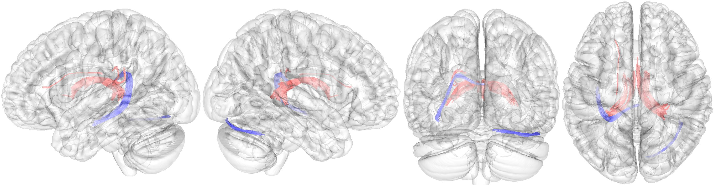

</center>
<br>

### Men 

<span style="color: #ff5500;"><font size="5"><bold> Positive Correlations (FDR = 0.000865) </span></font></bold>

```{r ad_pos_wayfinding_men}
#Men positive
df <- read_csv(here("data", "dsp", "wayfinding_success", "ad",
                    "ad_pos_dsp_wayfinding_men.csv")) %>% 
  clean_names() %>% 
  filter(tract_name %in% c("number of tracts","mean length(mm)",
                          "diameter(mm)", "volume(mm^3)")) %>% 
  rotate_df() %>% row_to_names(row_number = 1) %>% 
  rownames_to_column("tract_name") %>% 
  mutate(tract_name = to_any_case(tract_name,"upper_camel", sep_out = "_")) %>% 
  mutate_at(c(2:5), as.numeric) %>% 
  filter(`number of tracts` >= 10)

#Present table
df %>% 
  kable(col.names = c("Tract Name", "Number of Tracts", "Mean Length (mm)",
                      "Diameter (mm)", "Volume (mm^3)"),
        digits = 3,
        table.attr = "style='width:90%;'"
        ) %>% 
  kable_styling(bootstrap_options = "hover") %>% 
  scroll_box(width = "800px", height = "200px")
```


<br>
<span style="color: #00ffff;"><font size="5"><bold> Negative Correlations (FDR = 1.000000) </span></font></bold>

No significant results in tracts.

<br>
<font size="5"> Figures </font>

<center>
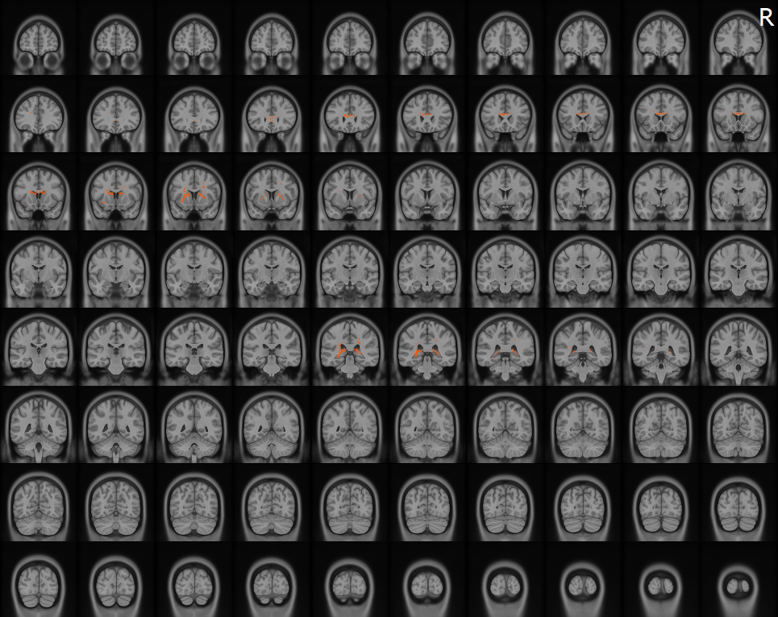{width=50%}
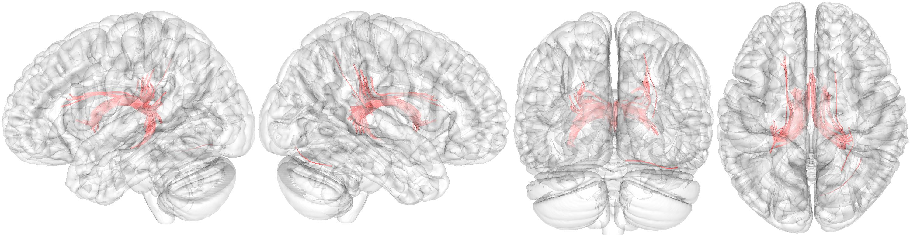

</center>
<br>

### Women

<span style="color: #ff5500;"><font size="5"><bold> Positive Correlations (FDR = 0.096386) </span></font></bold>

```{r ad_pos_wayfinding_women}
#Women positive
df <- read_csv(here("data", "dsp", "wayfinding_success", "ad",
                    "ad_pos_dsp_wayfinding_women.csv")) %>% 
  clean_names() %>% 
  filter(tract_name %in% c("number of tracts","mean length(mm)",
                          "diameter(mm)", "volume(mm^3)")) %>% 
  rotate_df() %>% row_to_names(row_number = 1) %>% 
  rownames_to_column("tract_name") %>% 
  mutate(tract_name = to_any_case(tract_name,"upper_camel", sep_out = "_")) %>% 
  mutate_at(c(2:5), as.numeric) %>% 
  filter(`number of tracts` >= 10)

#Present table
df %>% 
  kable(col.names = c("Tract Name", "Number of Tracts", "Mean Length (mm)",
                      "Diameter (mm)", "Volume (mm^3)"),
        digits = 3,
        table.attr = "style='width:90%;'"
        ) %>% 
  kable_styling(bootstrap_options = "hover") %>% 
  scroll_box(width = "800px", height = "200px")
```


<br>
<span style="color: #00ffff;"><font size="5"><bold> Negative Correlations (FDR = 0.001045) </span></font></bold>

```{r ad_neg_wayfinding_women}
#Women negative
df <- read_csv(here("data", "dsp", "wayfinding_success", "ad",
                    "ad_neg_dsp_wayfinding_women.csv")) %>% 
  clean_names() %>% 
  filter(tract_name %in% c("number of tracts","mean length(mm)",
                          "diameter(mm)", "volume(mm^3)")) %>% 
  rotate_df() %>% row_to_names(row_number = 1) %>% 
  rownames_to_column("tract_name") %>% 
  mutate(tract_name = to_any_case(tract_name,"upper_camel", sep_out = "_")) %>% 
  mutate_at(c(2:5), as.numeric) %>% 
  filter(`number of tracts` >= 10)

#Present table
df %>% 
  kable(col.names = c("Tract Name", "Number of Tracts", "Mean Length (mm)",
                      "Diameter (mm)", "Volume (mm^3)"),
        digits = 3,
        table.attr = "style='width:90%;'"
        ) %>% 
  kable_styling(bootstrap_options = "hover") %>% 
  scroll_box(width = "800px", height = "200px")
```

<br>
<font size="5"> Figures </font>

<center>
{width=50%}
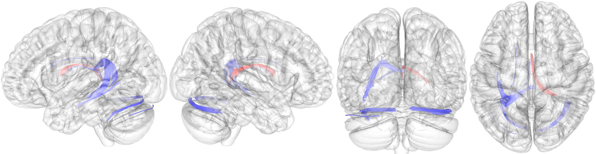

</center>
<br>

### Pre

<span style="color: #ff5500;"><font size="5"><bold> Positive Correlations (FDR = 1.000000) </span></font></bold>

"No significant results in tracts."

```{r ad_pos_wayfinding_pre}
#Pre positive
df <- read_csv(here("data", "dsp", "wayfinding_success", "ad",
                    "ad_pos_dsp_wayfinding_pre.csv")) %>% 
  clean_names() %>% 
  filter(tract_name %in% c("number of tracts","mean length(mm)",
                          "diameter(mm)", "volume(mm^3)")) %>% 
  rotate_df() %>% row_to_names(row_number = 1) %>% 
  rownames_to_column("tract_name") %>% 
  mutate(tract_name = to_any_case(tract_name,"upper_camel", sep_out = "_")) %>% 
  mutate_at(c(2:5), as.numeric) %>% 
  filter(`number of tracts` >= 10)

#Present table
df %>% 
  kable(col.names = c("Tract Name", "Number of Tracts", "Mean Length (mm)",
                      "Diameter (mm)", "Volume (mm^3)"),
        digits = 3,
        table.attr = "style='width:90%;'"
        ) %>% 
  kable_styling(bootstrap_options = "hover") %>% 
  scroll_box(width = "800px", height = "200px")
```


<br>
<span style="color: #00ffff;"><font size="5"><bold> Negative Correlations (FDR = 0.169427) </span></font></bold>

```{r ad_neg_wayfinding_pre}
#Pre negative
df <- read_csv(here("data", "dsp", "wayfinding_success", "ad",
                    "ad_neg_dsp_wayfinding_pre.csv")) %>% 
  clean_names() %>% 
  filter(tract_name %in% c("number of tracts","mean length(mm)",
                          "diameter(mm)", "volume(mm^3)")) %>% 
  rotate_df() %>% row_to_names(row_number = 1) %>% 
  rownames_to_column("tract_name") %>% 
  mutate(tract_name = to_any_case(tract_name,"upper_camel", sep_out = "_")) %>% 
  mutate_at(c(2:5), as.numeric) %>% 
  filter(`number of tracts` >= 10)

#Present table
df %>% 
  kable(col.names = c("Tract Name", "Number of Tracts", "Mean Length (mm)",
                      "Diameter (mm)", "Volume (mm^3)"),
        digits = 3,
        table.attr = "style='width:90%;'"
        ) %>% 
  kable_styling(bootstrap_options = "hover") %>% 
  scroll_box(width = "800px", height = "200px")
```

<br>
<font size="5"> Figures </font>

<center>
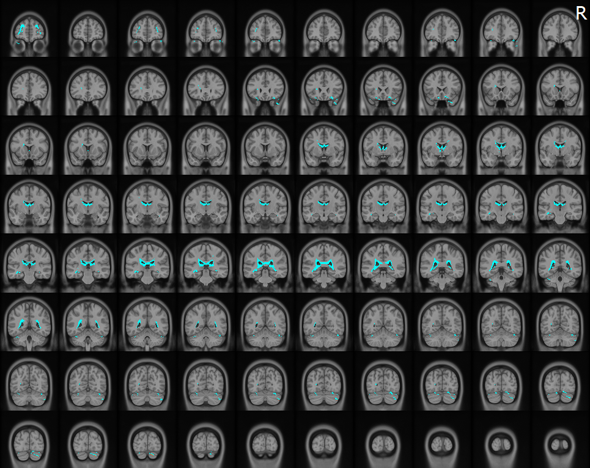{width=50%}

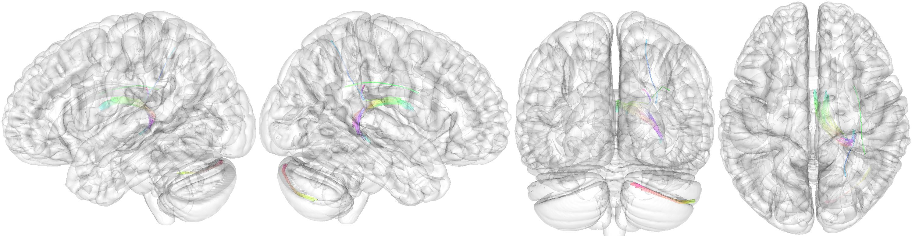

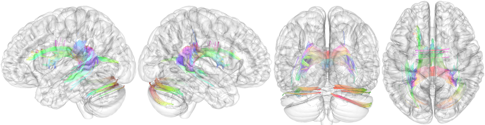

</center>
<br>

### Peri

<span style="color: #ff5500;"><font size="5"><bold> Positive Correlations (FDR = 0.199339) </span></font></bold>


```{r ad_pos_wayfinding_peri}
#Peri positive
df <- read_csv(here("data", "dsp", "wayfinding_success", "ad",
                    "ad_pos_dsp_wayfinding_peri.csv")) %>% 
  clean_names() %>% 
  filter(tract_name %in% c("number of tracts","mean length(mm)",
                          "diameter(mm)", "volume(mm^3)")) %>% 
  rotate_df() %>% row_to_names(row_number = 1) %>% 
  rownames_to_column("tract_name") %>% 
  mutate(tract_name = to_any_case(tract_name,"upper_camel", sep_out = "_")) %>% 
  mutate_at(c(2:5), as.numeric) %>% 
  filter(`number of tracts` >= 10)

#Present table
df %>% 
  kable(col.names = c("Tract Name", "Number of Tracts", "Mean Length (mm)",
                      "Diameter (mm)", "Volume (mm^3)"),
        digits = 3,
        table.attr = "style='width:90%;'"
        ) %>% 
  kable_styling(bootstrap_options = "hover") %>% 
  scroll_box(width = "800px", height = "200px")
```


<br>
<span style="color: #00ffff;"><font size="5"><bold> Negative Correlations (FDR = 1.000000) </span></font></bold>

"No significant results in tracts."

```{r ad_neg_wayfinding_peri}
#Peri negative
df <- read_csv(here("data", "dsp", "wayfinding_success", "ad",
                    "ad_neg_dsp_wayfinding_peri.csv")) %>% 
  clean_names() %>% 
  filter(tract_name %in% c("number of tracts","mean length(mm)",
                          "diameter(mm)", "volume(mm^3)")) %>% 
  rotate_df() %>% row_to_names(row_number = 1) %>% 
  rownames_to_column("tract_name") %>% 
  mutate(tract_name = to_any_case(tract_name,"upper_camel", sep_out = "_")) %>% 
  mutate_at(c(2:5), as.numeric) %>% 
  filter(`number of tracts` >= 10)

#Present table
df %>% 
  kable(col.names = c("Tract Name", "Number of Tracts", "Mean Length (mm)",
                      "Diameter (mm)", "Volume (mm^3)"),
        digits = 3,
        table.attr = "style='width:90%;'"
        ) %>% 
  kable_styling(bootstrap_options = "hover") %>% 
  scroll_box(width = "800px", height = "200px")
```

<br>
<font size="5"> Figures </font>

<center>
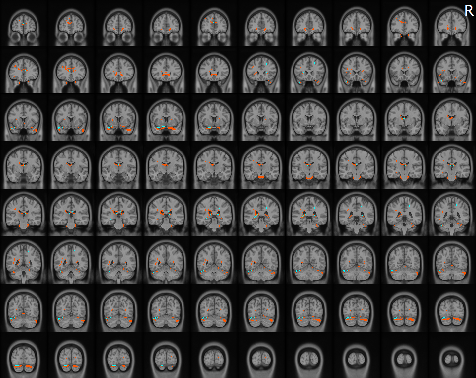{width=50%}

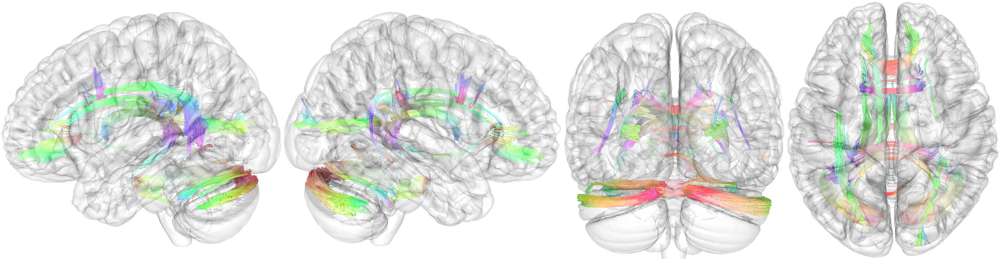

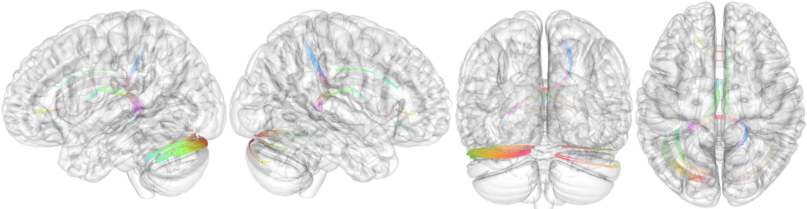

</center>
<br>

### Post

<span style="color: #ff5500;"><font size="5"><bold> Positive Correlations (FDR = 0.135023) </span></font></bold>


```{r ad_pos_wayfinding_post}
#Post positive
df <- read_csv(here("data", "dsp", "wayfinding_success", "ad",
                    "ad_pos_dsp_wayfinding_post.csv")) %>% 
  clean_names() %>% 
  filter(tract_name %in% c("number of tracts","mean length(mm)",
                          "diameter(mm)", "volume(mm^3)")) %>% 
  rotate_df() %>% row_to_names(row_number = 1) %>% 
  rownames_to_column("tract_name") %>% 
  mutate(tract_name = to_any_case(tract_name,"upper_camel", sep_out = "_")) %>% 
  mutate_at(c(2:5), as.numeric) %>% 
  filter(`number of tracts` >= 10)

#Present table
df %>% 
  kable(col.names = c("Tract Name", "Number of Tracts", "Mean Length (mm)",
                      "Diameter (mm)", "Volume (mm^3)"),
        digits = 3,
        table.attr = "style='width:90%;'"
        ) %>% 
  kable_styling(bootstrap_options = "hover") %>% 
  scroll_box(width = "800px", height = "200px")
```


<br>
<span style="color: #00ffff;"><font size="5"><bold> Negative Correlations (FDR = 0.287832) </span></font></bold>

"No significant results in tracts."

```{r ad_neg_wayfinding_post}
#Post negative
df <- read_csv(here("data", "dsp", "wayfinding_success", "ad",
                    "ad_neg_dsp_wayfinding_post.csv")) %>% 
  clean_names() %>% 
  filter(tract_name %in% c("number of tracts","mean length(mm)",
                          "diameter(mm)", "volume(mm^3)")) %>% 
  rotate_df() %>% row_to_names(row_number = 1) %>% 
  rownames_to_column("tract_name") %>% 
  mutate(tract_name = to_any_case(tract_name,"upper_camel", sep_out = "_")) %>% 
  mutate_at(c(2:5), as.numeric) %>% 
  filter(`number of tracts` >= 10)

#Present table
df %>% 
  kable(col.names = c("Tract Name", "Number of Tracts", "Mean Length (mm)",
                      "Diameter (mm)", "Volume (mm^3)"),
        digits = 3,
        table.attr = "style='width:90%;'"
        ) %>% 
  kable_styling(bootstrap_options = "hover") %>% 
  scroll_box(width = "800px", height = "200px")
```

<br>
<font size="5"> Figures </font>

<center>
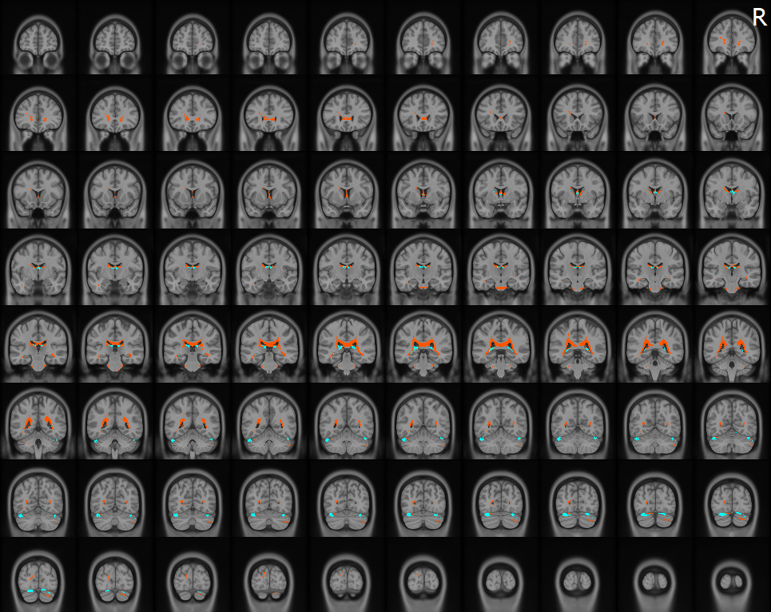{width=50%}


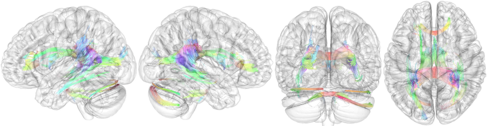

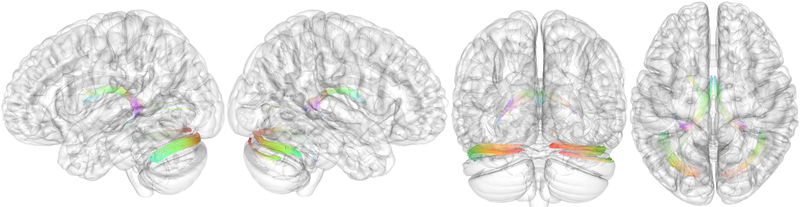

</center>
<br>

## {-}

## MD {.tabset}

The right fornix tract was displayed for all positive correlations between MD and DSP wayfinding success for all groups. Across all subjects, there are more positive than negative associations. When separated by sex, the left and right fornix were displayed for positive correlations between MD and DSP wayfinding success. Men have positive but no negative correlations between MD and DSP wayfinding success. Both peris and posts have more positive correlations, whereas pres have more negative correlations.

### All Subjects

<span style="color: #ff5500;"><font size="5"><bold> Positive Correlations (FDR = 0.007198) </span></font></bold>

```{r md_pos_wayfinding_all}
#All subjects positive
df <- read_csv(here("data", "dsp", "wayfinding_success", "md",
                    "md_pos_dsp_wayfinding_all.csv")) %>% 
  clean_names() %>% 
  filter(tract_name %in% c("number of tracts","mean length(mm)",
                          "diameter(mm)", "volume(mm^3)")) %>% 
  rotate_df() %>% row_to_names(row_number = 1) %>% 
  rownames_to_column("tract_name") %>% 
  mutate(tract_name = to_any_case(tract_name,"upper_camel", sep_out = "_")) %>% 
  mutate_at(c(2:5), as.numeric) %>% 
  filter(`number of tracts` >= 10)

#Present table
df %>% 
  kable(col.names = c("Tract Name", "Number of Tracts", "Mean Length (mm)",
                      "Diameter (mm)", "Volume (mm^3)"),
        digits = 3,
        table.attr = "style='width:90%;'"
        ) %>% 
  kable_styling(bootstrap_options = "hover") %>% 
  scroll_box(width = "800px", height = "200px")
```


<br>
<span style="color: #00ffff;"><font size="5"><bold> Negative Correlations (FDR = 1.000000) </span></font></bold>

"No significant results in tracts."

```{r md_neg_wayfinding_all}
#All subjects negative
df <- read_csv(here("data", "dsp", "wayfinding_success", "md",
                    "md_neg_dsp_wayfinding_all.csv")) %>% 
  clean_names() %>% 
  filter(tract_name %in% c("number of tracts","mean length(mm)",
                          "diameter(mm)", "volume(mm^3)")) %>% 
  rotate_df() %>% row_to_names(row_number = 1) %>% 
  rownames_to_column("tract_name") %>% 
  mutate(tract_name = to_any_case(tract_name,"upper_camel", sep_out = "_")) %>% 
  mutate_at(c(2:5), as.numeric) %>% 
  filter(`number of tracts` >= 10)

#Present table
df %>% 
  kable(col.names = c("Tract Name", "Number of Tracts", "Mean Length (mm)",
                      "Diameter (mm)", "Volume (mm^3)"),
        digits = 3,
        table.attr = "style='width:90%;'"
        ) %>% 
  kable_styling(bootstrap_options = "hover") %>% 
  scroll_box(width = "800px", height = "200px")
```

<br>
<font size="5"> Figures </font>

<center>
{width=50%}
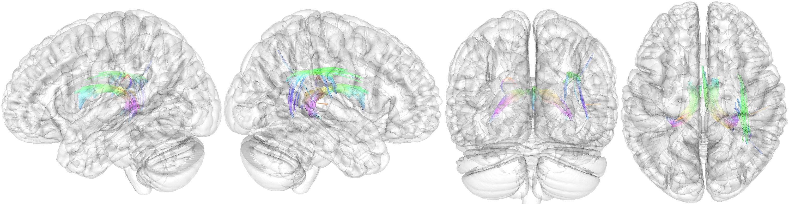

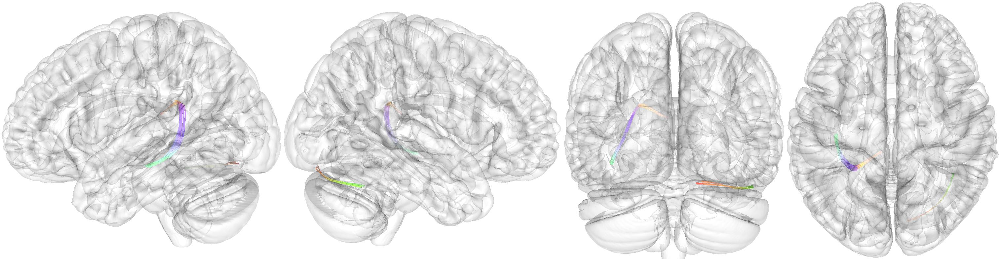

</center>
<br>

### Men

<span style="color: #ff5500;"><font size="5"><bold> Positive Correlations (FDR = 0.006910) </span></font></bold>

```{r md_pos_wayfinding_men}
#Men positive
df <- read_csv(here("data", "dsp", "wayfinding_success", "md",
                    "md_pos_dsp_wayfinding_men.csv")) %>% 
  clean_names() %>% 
  filter(tract_name %in% c("number of tracts","mean length(mm)",
                          "diameter(mm)", "volume(mm^3)")) %>% 
  rotate_df() %>% row_to_names(row_number = 1) %>% 
  rownames_to_column("tract_name") %>% 
  mutate(tract_name = to_any_case(tract_name,"upper_camel", sep_out = "_")) %>% 
  mutate_at(c(2:5), as.numeric) %>% 
  filter(`number of tracts` >= 10)

#Present table
df %>% 
  kable(col.names = c("Tract Name", "Number of Tracts", "Mean Length (mm)",
                      "Diameter (mm)", "Volume (mm^3)"),
        digits = 3,
        table.attr = "style='width:90%;'"
        ) %>% 
  kable_styling(bootstrap_options = "hover") %>% 
  scroll_box(width = "800px", height = "200px")
```


<br>
<span style="color: #00ffff;"><font size="5"><bold> Negative Correlations (FDR = 1.000000) </span></font></bold>

No significant results in tracts.


<br>
<font size="5"> Figures </font>

<center>
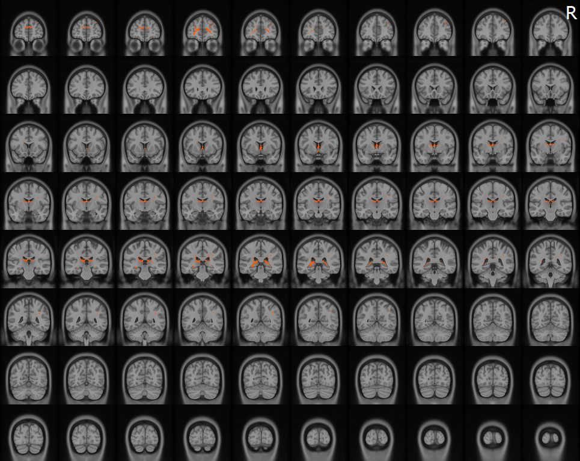{width=50%}
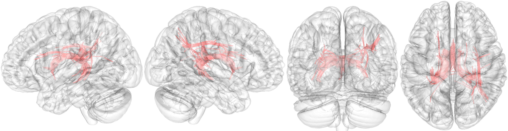

</center>
<br>

### Women

<span style="color: #ff5500;"><font size="5"><bold> Positive Correlations (FDR = 0.138284) </span></font></bold>

```{r md_pos_wayfinding_women}
#Women positive
df <- read_csv(here("data", "dsp", "wayfinding_success", "md",
                    "md_pos_dsp_wayfinding_women.csv")) %>% 
  clean_names() %>% 
  filter(tract_name %in% c("number of tracts","mean length(mm)",
                          "diameter(mm)", "volume(mm^3)")) %>% 
  rotate_df() %>% row_to_names(row_number = 1) %>% 
  rownames_to_column("tract_name") %>% 
  mutate(tract_name = to_any_case(tract_name,"upper_camel", sep_out = "_")) %>% 
  mutate_at(c(2:5), as.numeric) %>% 
  filter(`number of tracts` >= 10)

#Present table
df %>% 
  kable(col.names = c("Tract Name", "Number of Tracts", "Mean Length (mm)",
                      "Diameter (mm)", "Volume (mm^3)"),
        digits = 3,
        table.attr = "style='width:90%;'"
        ) %>% 
  kable_styling(bootstrap_options = "hover") %>% 
  scroll_box(width = "800px", height = "200px")
```


<br>
<span style="color: #00ffff;"><font size="5"><bold> Negative Correlations (FDR = 0.078419) </span></font></bold>

```{r md_neg_wayfinding_women}
#Women negative
df <- read_csv(here("data", "dsp", "wayfinding_success", "md",
                    "md_neg_dsp_wayfinding_women.csv")) %>% 
  clean_names() %>% 
  filter(tract_name %in% c("number of tracts","mean length(mm)",
                          "diameter(mm)", "volume(mm^3)")) %>% 
  rotate_df() %>% row_to_names(row_number = 1) %>% 
  rownames_to_column("tract_name") %>% 
  mutate(tract_name = to_any_case(tract_name,"upper_camel", sep_out = "_")) %>% 
  mutate_at(c(2:5), as.numeric) %>% 
  filter(`number of tracts` >= 10)

#Present table
df %>% 
  kable(col.names = c("Tract Name", "Number of Tracts", "Mean Length (mm)",
                      "Diameter (mm)", "Volume (mm^3)"),
        digits = 3,
        table.attr = "style='width:90%;'"
        ) %>% 
  kable_styling(bootstrap_options = "hover") %>% 
  scroll_box(width = "800px", height = "200px")
```

<br>
<font size="5"> Figures </font>

<center>
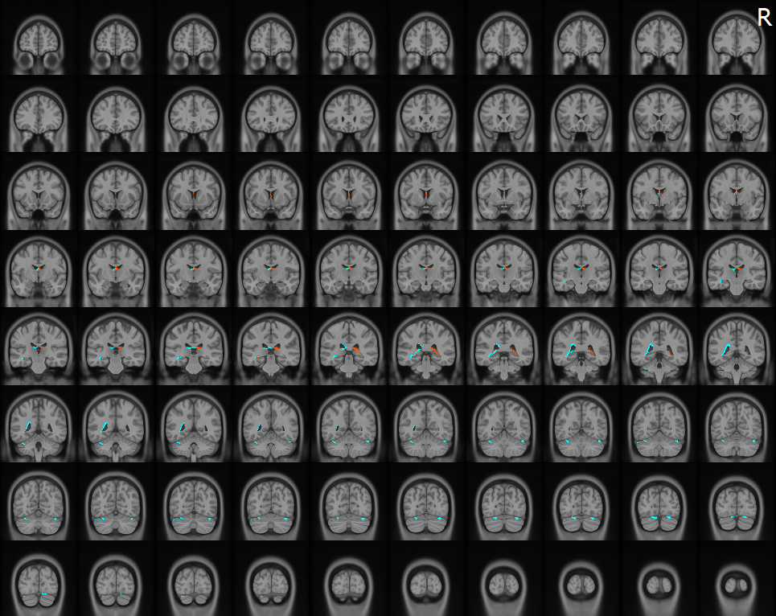{width=50%}

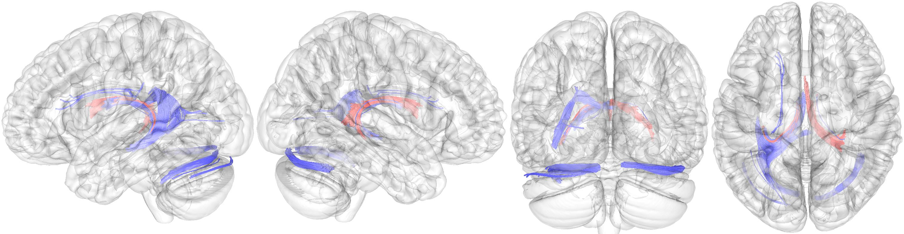

</center>
<br>


### Pre

<span style="color: #ff5500;"><font size="5"><bold> Positive Correlations (FDR = 1.000000) </span></font></bold>

"No significant results in tracts."

```{r md_pos_wayfinding_pre}
#Pre positive
df <- read_csv(here("data", "dsp", "wayfinding_success", "md",
                    "md_pos_dsp_wayfinding_pre.csv")) %>% 
  clean_names() %>% 
  filter(tract_name %in% c("number of tracts","mean length(mm)",
                          "diameter(mm)", "volume(mm^3)")) %>% 
  rotate_df() %>% row_to_names(row_number = 1) %>% 
  rownames_to_column("tract_name") %>% 
  mutate(tract_name = to_any_case(tract_name,"upper_camel", sep_out = "_")) %>% 
  mutate_at(c(2:5), as.numeric) %>% 
  filter(`number of tracts` >= 10)

#Present table
df %>% 
  kable(col.names = c("Tract Name", "Number of Tracts", "Mean Length (mm)",
                      "Diameter (mm)", "Volume (mm^3)"),
        digits = 3,
        table.attr = "style='width:90%;'"
        ) %>% 
  kable_styling(bootstrap_options = "hover") %>% 
  scroll_box(width = "800px", height = "200px")
```


<br>
<span style="color: #00ffff;"><font size="5"><bold> Negative Correlations (FDR = 0.206540) </span></font></bold>

"No significant results in tracts."

```{r md_neg_wayfinding_pre}
#Pre negative
df <- read_csv(here("data", "dsp", "wayfinding_success", "md",
                    "md_neg_dsp_wayfinding_pre.csv")) %>% 
  clean_names() %>% 
  filter(tract_name %in% c("number of tracts","mean length(mm)",
                          "diameter(mm)", "volume(mm^3)")) %>% 
  rotate_df() %>% row_to_names(row_number = 1) %>% 
  rownames_to_column("tract_name") %>% 
  mutate(tract_name = to_any_case(tract_name,"upper_camel", sep_out = "_")) %>% 
  mutate_at(c(2:5), as.numeric) %>% 
  filter(`number of tracts` >= 10)

#Present table
df %>% 
  kable(col.names = c("Tract Name", "Number of Tracts", "Mean Length (mm)",
                      "Diameter (mm)", "Volume (mm^3)"),
        digits = 3,
        table.attr = "style='width:90%;'"
        ) %>% 
  kable_styling(bootstrap_options = "hover") %>% 
  scroll_box(width = "800px", height = "200px")
```

<br>
<font size="5"> Figures </font>

<center>
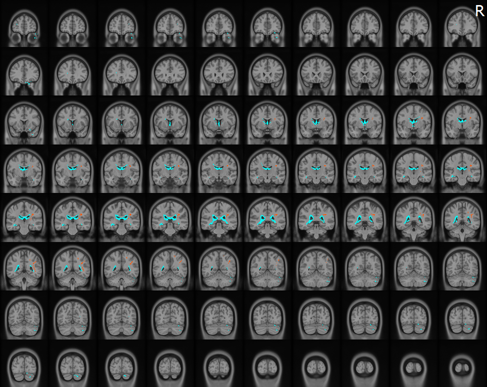{width=50%}

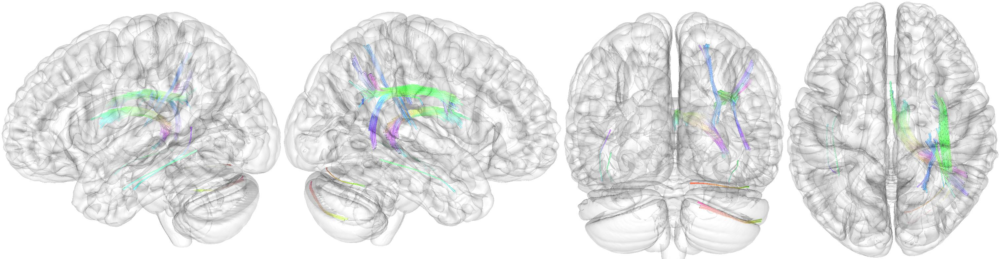

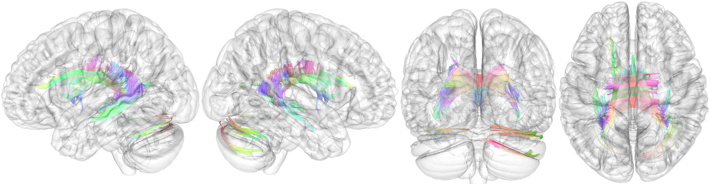

</center>
<br>


### Peri

<span style="color: #ff5500;"><font size="5"><bold> Positive Correlations (FDR = 0.283494) </span></font></bold>

"No significant results in tracts."

```{r md_pos_wayfinding_peri}
#Peri positive
df <- read_csv(here("data", "dsp", "wayfinding_success", "md",
                    "md_pos_dsp_wayfinding_peri.csv")) %>% 
  clean_names() %>% 
  filter(tract_name %in% c("number of tracts","mean length(mm)",
                          "diameter(mm)", "volume(mm^3)")) %>% 
  rotate_df() %>% row_to_names(row_number = 1) %>% 
  rownames_to_column("tract_name") %>% 
  mutate(tract_name = to_any_case(tract_name,"upper_camel", sep_out = "_")) %>% 
  mutate_at(c(2:5), as.numeric) %>% 
  filter(`number of tracts` >= 10)

#Present table
df %>% 
  kable(col.names = c("Tract Name", "Number of Tracts", "Mean Length (mm)",
                      "Diameter (mm)", "Volume (mm^3)"),
        digits = 3,
        table.attr = "style='width:90%;'"
        ) %>% 
  kable_styling(bootstrap_options = "hover") %>% 
  scroll_box(width = "800px", height = "200px")
```


<br>
<span style="color: #00ffff;"><font size="5"><bold> Negative Correlations (FDR = 1.000000) </span></font></bold>

"No significant results in tracts."

```{r md_neg_wayfinding_peri}
#Peri negative
df <- read_csv(here("data", "dsp", "wayfinding_success", "md",
                    "md_neg_dsp_wayfinding_peri.csv")) %>% 
  clean_names() %>% 
  filter(tract_name %in% c("number of tracts","mean length(mm)",
                          "diameter(mm)", "volume(mm^3)")) %>% 
  rotate_df() %>% row_to_names(row_number = 1) %>% 
  rownames_to_column("tract_name") %>% 
  mutate(tract_name = to_any_case(tract_name,"upper_camel", sep_out = "_")) %>% 
  mutate_at(c(2:5), as.numeric) %>% 
  filter(`number of tracts` >= 10)

#Present table
df %>% 
  kable(col.names = c("Tract Name", "Number of Tracts", "Mean Length (mm)",
                      "Diameter (mm)", "Volume (mm^3)"),
        digits = 3,
        table.attr = "style='width:90%;'"
        ) %>% 
  kable_styling(bootstrap_options = "hover") %>% 
  scroll_box(width = "800px", height = "200px")
```

<br>
<font size="5"> Figures </font>

<center>
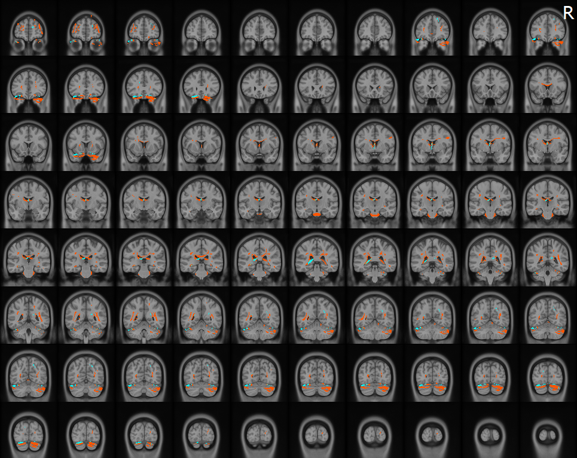{width=50%}


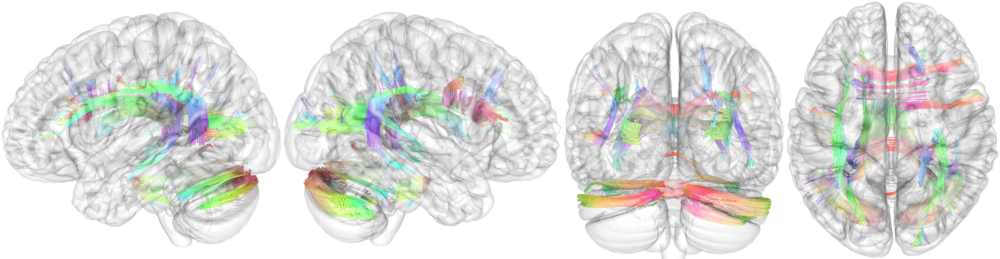

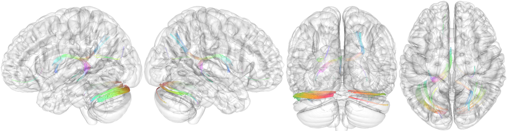

</center>
<br>


### Post

<span style="color: #ff5500;"><font size="5"><bold> Positive Correlations (FDR = 0.119090) </span></font></bold>

```{r md_pos_wayfinding_post}
#Post positive
df <- read_csv(here("data", "dsp", "wayfinding_success", "md",
                    "md_pos_dsp_wayfinding_post.csv")) %>% 
  clean_names() %>% 
  filter(tract_name %in% c("number of tracts","mean length(mm)",
                          "diameter(mm)", "volume(mm^3)")) %>% 
  rotate_df() %>% row_to_names(row_number = 1) %>% 
  rownames_to_column("tract_name") %>% 
  mutate(tract_name = to_any_case(tract_name,"upper_camel", sep_out = "_")) %>% 
  mutate_at(c(2:5), as.numeric) %>% 
  filter(`number of tracts` >= 10)

#Present table
df %>% 
  kable(col.names = c("Tract Name", "Number of Tracts", "Mean Length (mm)",
                      "Diameter (mm)", "Volume (mm^3)"),
        digits = 3,
        table.attr = "style='width:90%;'"
        ) %>% 
  kable_styling(bootstrap_options = "hover") %>% 
  scroll_box(width = "800px", height = "200px")
```


<br>
<span style="color: #00ffff;"><font size="5"><bold> Negative Correlations (FDR = 0.379440) </span></font></bold>

"No significant results in tracts."

```{r md_neg_wayfinding_post}
#Post negative
df <- read_csv(here("data", "dsp", "wayfinding_success", "md",
                    "md_neg_dsp_wayfinding_post.csv")) %>% 
  clean_names() %>% 
  filter(tract_name %in% c("number of tracts","mean length(mm)",
                          "diameter(mm)", "volume(mm^3)")) %>% 
  rotate_df() %>% row_to_names(row_number = 1) %>% 
  rownames_to_column("tract_name") %>% 
  mutate(tract_name = to_any_case(tract_name,"upper_camel", sep_out = "_")) %>% 
  mutate_at(c(2:5), as.numeric) %>% 
  filter(`number of tracts` >= 10)

#Present table
df %>% 
  kable(col.names = c("Tract Name", "Number of Tracts", "Mean Length (mm)",
                      "Diameter (mm)", "Volume (mm^3)"),
        digits = 3,
        table.attr = "style='width:90%;'"
        ) %>% 
  kable_styling(bootstrap_options = "hover") %>% 
  scroll_box(width = "800px", height = "200px")
```

<br>
<font size="5"> Figures </font>

<center>
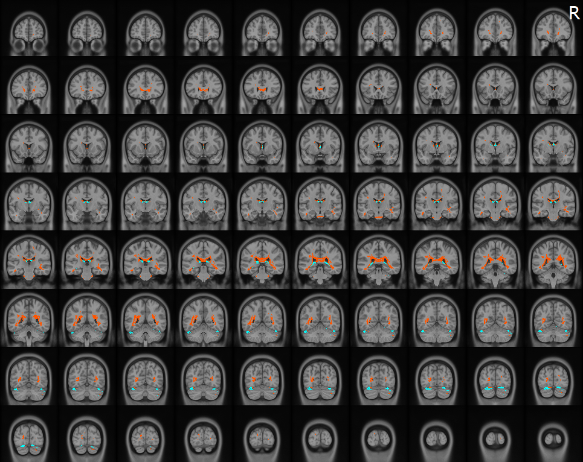{width=50%}

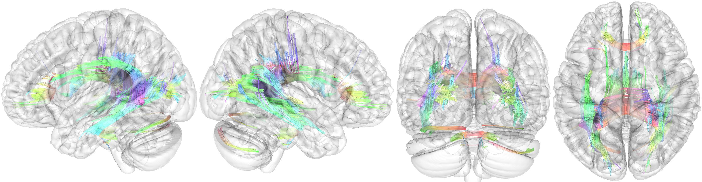


</center>
<br>


## {-}

## RD {.tabset}

### All Subjects

### Men

### Women

### Pre

### Peri

### Post


## {-}

# {-}

# Solution Index {.tabset .tabset-dropdown}

## QA {.tabset}

### All Subjects

### Men

### Women

### Pre

### Peri

### Post


## {-}

## AD {.tabset}

### All Subjects

### Men

### Women

### Pre

### Peri

### Post


## {-}

## MD {.tabset}

### All Subjects

### Men

### Women

### Pre

### Peri

### Post


## {-}

## RD {.tabset}

### All Subjects

### Men

### Women

### Pre

### Peri

### Post


## {-}

# {-}


# Path Efficiency {.tabset .tabset-dropdown}

## QA {.tabset}

### All Subjects

### Men

### Women

### Pre

### Peri

### Post


## {-}

## AD {.tabset}

### All Subjects

### Men

### Women

### Pre

### Peri

### Post


## {-}

## MD {.tabset}

### All Subjects

### Men

### Women

### Pre

### Peri

### Post


## {-}

## RD {.tabset}

### All Subjects

### Men

### Women

### Pre

### Peri

### Post


## {-}

# {-}


# Summary

