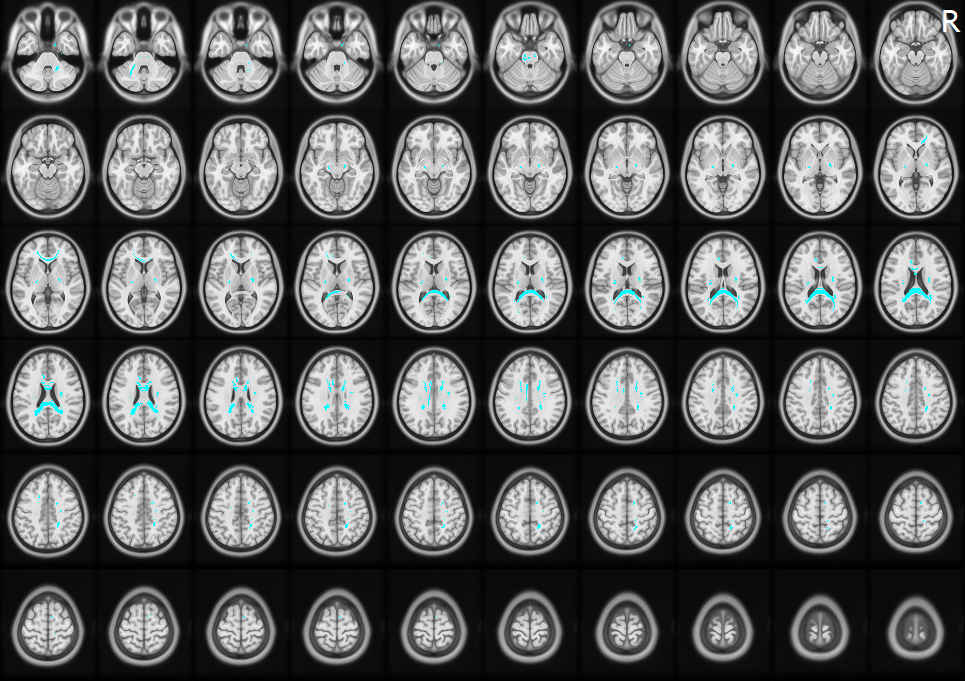
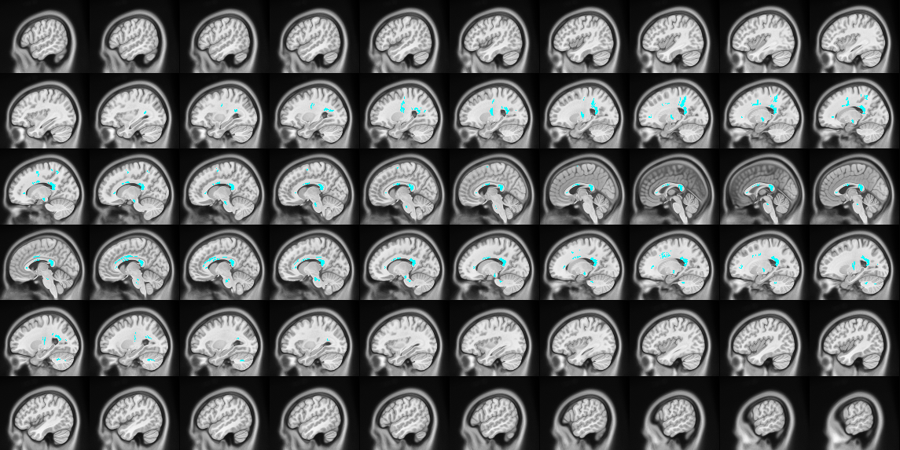

```{r setup, include=FALSE, echo=FALSE, warning=FALSE, message=FALSE}
knitr::opts_chunk$set(warning=FALSE, message=FALSE, echo = FALSE,
                      fig.align = "center")

#Attach libraries 
library(tidyverse)
library(here)
library(janitor)
library(broom)
library(kableExtra)
library(sjmisc)
library(snakecase)
```

# Overview

# Methods


# Wayfinding Success {.tabset .tabset-dropdown}

## QA {.tabset}

### All Subjects 

<span style="color: #ff5500;"><font size="5"><bold> Positive Correlations (FDR = 1.000000) </span></font></bold>

No significant tracts.

<br>

<span style="color: #00ffff;"><font size="5"><bold> Negative Correlations (FDR = 0.000312) </span></font></bold>

```{r}
#All subjects negative
df <- read_csv(here("data", "dsp", "wayfinding_success", "qa",
                    "qa_neg_dsp_wayfinding_all.csv")) %>% 
  clean_names() %>% 
  filter(tract_name %in% c("number of tracts","mean length(mm)",
                          "diameter(mm)", "volume(mm^3)")) %>% 
  rotate_df() %>% row_to_names(row_number = 1) %>% 
  rownames_to_column("tract_name") %>% 
  mutate(tract_name = to_any_case(tract_name,"upper_camel", sep_out = "_")) %>% 
  mutate_at(c(2:5), as.numeric) %>% 
  filter(`number of tracts` >= 10)

#Present table
df %>% 
  kable(col.names = c("Tract Name", "Number of Tracts", "Mean Length (mm)",
                      "Diameter (mm)", "Volume (mm^3)"),
        digits = 3,
        table.attr = "style='width:90%;'"
        ) %>% 
  kable_styling(bootstrap_options = "hover") %>% 
  scroll_box(width = "800px", height = "200px")
```

<br>

<font size="5"><bold> Figures </bold></font>






<br>


### Men

```{r}
#Men
```

### Women

```{r}
#Women
```


### Pre

```{r}

```


### Peri

### Post

## {-}

## AD {.tabset}

### All Subjects

```{r}

```


### Men 

```{r}

```


## {-}

# {-}

# Solution Index


# Path Efficiency


# Summary

