```{r setup, include=FALSE, echo=FALSE, warning=FALSE, message=FALSE}
knitr::opts_chunk$set(warning=FALSE, message=FALSE, echo = FALSE,
                      fig.align = "center")

#Attach libraries 
library(tidyverse)
library(here)
library(janitor)
library(broom)
library(kableExtra)
library(sjmisc)
library(snakecase)
```

# Overview

**Participants**

- *n* = 120 total midlife with DSI scans
- *n* = 118 useable DSI scans (removed subjects 329 and 372)

After preprocessing and quality control, subject 347 was removed as well due to being an outlier.

Hormone measures: estradiol, progesterone, FSH, testosterone

- *n* = 32 for men (testosterone only)
- *n* = 86 for women
- *n* = 32 for pre
- *n* = 28 for peri
- *n* = 26 for post


**DSI Studio**

DSI Studio GUI version: chen-2022-06-09

This is same as version and tag used in Docker, which is: chen-2022-07-31


**Parameters**

- T-threshold = 2.5
- Length = 25
- Permutation = 4,000
- Pruning = 4
- Non-normalized QA

# Methods

A diffusion spectrum imaging scheme was used, and a total of 128 diffusion sampling were acquired. The maximum b-value was 4990 s/mm². The in-plane resolution was 1.8 mm. The slice thickness was 1.8 mm. The accuracy of b-table orientation was examined by comparing fiber orientations with those of a population-averaged template (Yeh et al. Neuroimage, 2018). The b-table was flipped by .012fy. The diffusion data were reconstructed in the MNI space using q-space diffeomorphic reconstruction (Yeh et al., Neuroimage, 58(1):91-9, 2011) to obtain the spin distribution function (Yeh et al., IEEE TMI, ;29(9):1626-35, 2010). A diffusion sampling length ratio of 1.25 was used. The output resolution in diffeomorphic reconstruction was 1.8 mm isotropic. The tensor metrics were calculated using DWI with b-value lower than 1750 s/mm². The quantitative anisotropy was extracted as the local connectome fingerprint (LCF, Yeh et al. PLoS Comput Biol 12(11): e1005203) and used in the connectometry analysis.

Diffusion MRI connectometry (Yeh et al. NeuroImage 125 (2016): 162-171) was used to derive the correlational tractography that has QA, AD, MD, RD correlated with either hormone measure (estradiol, progesterone, FSH, testosterone). A nonparametric Spearman partial correlation was used to derive the correlation, and the effect of age_spatial_years and repo_status_dummy was removed using a multiple regression model. Different number of subjects were included in the analysis depending on the group. 

A T-score threshold of 2.5 was assigned and tracked using a deterministic fiber tracking algorithm (Yeh et al. PLoS ONE 8(11): e80713, 2013) to obtain correlational tractography. A seeding region was placed at whole brain. The tracks were filtered by topology-informed pruning (Yeh et al. Neurotherapeutics, 16(1), 52-58, 2019) with 4 iteration(s). A length threshold of 25 voxel distance was used to select tracks. To estimate the false discovery rate, a total of 4000 randomized permutations were applied to the group label to obtain the null distribution of the track length.

Older version of DSI studio reports "no significant results in tracts" even though there are significant tracts, so that is reported in quotes. For reports where there are absolutely no tracts showing up in the results, then there really are no significant results in tracts. For those that state "no significant results in tracts" and also have all tracts < 10, then results are neglibigle and can be ignored.


# Estradiol {.tabset .tabset-dropdown}

## QA {.tabset}

Across women and reproductive stage groups, estradiol was mainly negatively correlated with QA values for corpus callosum tracts (forceps major, forceps minor, tapetum). There were tracts displayed for positive correlations for women and peri, but they were not significant results in tracts for pre or post.

### Women

<span style="color: #ff5500;"><font size="5"><bold> Positive Correlations (FDR =  0.010204) </span></font></bold>

```{r qa_pos_estradiol_women}
#Women positive
df <- read_csv(here("data", "hormones", "estradiol", "qa",
                    "qa_pos_estradiol_women.csv")) %>% 
  clean_names() %>% 
  filter(tract_name %in% c("number of tracts","mean length(mm)",
                          "diameter(mm)", "volume(mm^3)")) %>% 
  rotate_df() %>% row_to_names(row_number = 1) %>% 
  rownames_to_column("tract_name") %>% 
  mutate(tract_name = to_any_case(tract_name,"upper_camel", sep_out = "_")) %>% 
  mutate_at(c(2:5), as.numeric) %>% filter(`number of tracts` >= 10)

#Present table
df %>% 
  kable(col.names = c("Tract Name", "Number of Tracts", "Mean Length (mm)",
                      "Diameter (mm)", "Volume (mm^3)"),
        digits = 3,
        table.attr = "style='width:90%;'"
        ) %>% 
  kable_styling(bootstrap_options = "hover") %>% 
  scroll_box(width = "800px", height = "200px")
```


<br>
<span style="color: #00ffff;"><font size="5"><bold> Negative Correlations (FDR = 0.000319) </span></font></bold>

```{r qa_neg_estradiol_women}
#Women negative
df <- read_csv(here("data", "hormones", "estradiol", "qa",
                    "qa_neg_estradiol_women.csv")) %>% 
  clean_names() %>% 
  filter(tract_name %in% c("number of tracts","mean length(mm)",
                          "diameter(mm)", "volume(mm^3)")) %>% 
  rotate_df() %>% row_to_names(row_number = 1) %>% 
  rownames_to_column("tract_name") %>% 
  mutate(tract_name = to_any_case(tract_name,"upper_camel", sep_out = "_")) %>% 
  mutate_at(c(2:5), as.numeric) %>% 
  filter(`number of tracts` >= 10)

#Present table
df %>% 
  kable(col.names = c("Tract Name", "Number of Tracts", "Mean Length (mm)",
                      "Diameter (mm)", "Volume (mm^3)"),
        digits = 3,
        table.attr = "style='width:90%;'"
        ) %>% 
  kable_styling(bootstrap_options = "hover") %>% 
  scroll_box(width = "800px", height = "200px")
```

<br>
<font size="5"> Figures </font>

<center>
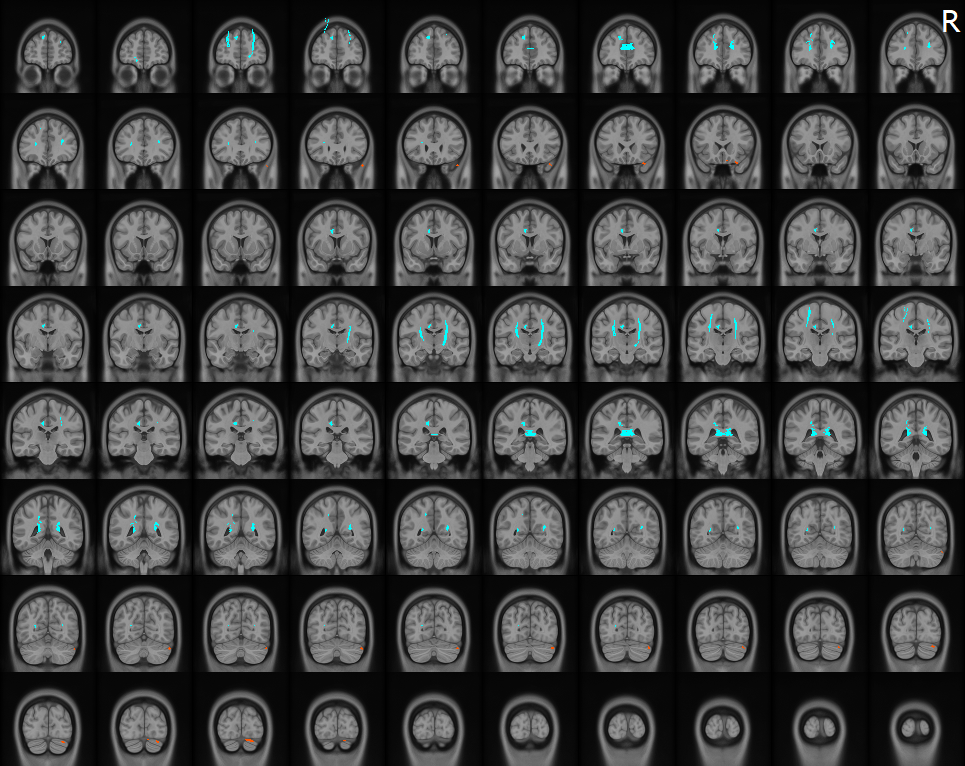{width=50%}

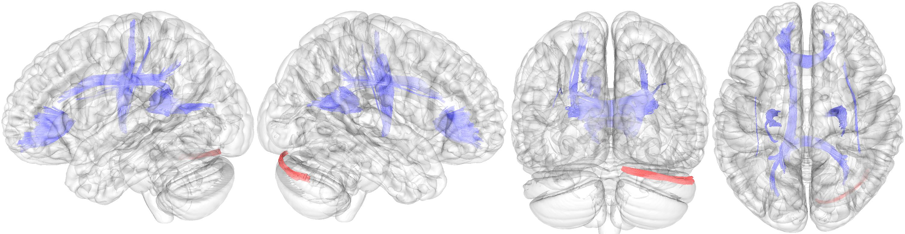

</center>
<br>

### Pre

<span style="color: #ff5500;"><font size="5"><bold> Positive Correlations (FDR =  0.333333) </span></font></bold>

"No significant results in tracts" *and* all tracts were < 10.

<br>
<span style="color: #00ffff;"><font size="5"><bold> Negative Correlations (FDR = 0.002975) </span></font></bold>

```{r qa_neg_estradiol_pre}
#Pre negative
df <- read_csv(here("data", "hormones", "estradiol", "qa",
                    "qa_neg_estradiol_pre.csv")) %>% 
  clean_names() %>% 
  filter(tract_name %in% c("number of tracts","mean length(mm)",
                          "diameter(mm)", "volume(mm^3)")) %>% 
  rotate_df() %>% row_to_names(row_number = 1) %>% 
  rownames_to_column("tract_name") %>% 
  mutate(tract_name = to_any_case(tract_name,"upper_camel", sep_out = "_")) %>% 
  mutate_at(c(2:5), as.numeric) %>% 
  filter(`number of tracts` >= 10)

#Present table
df %>% 
  kable(col.names = c("Tract Name", "Number of Tracts", "Mean Length (mm)",
                      "Diameter (mm)", "Volume (mm^3)"),
        digits = 3,
        table.attr = "style='width:90%;'"
        ) %>% 
  kable_styling(bootstrap_options = "hover") %>% 
  scroll_box(width = "800px", height = "200px")
```

<br>
<font size="5"> Figures </font>

<center>
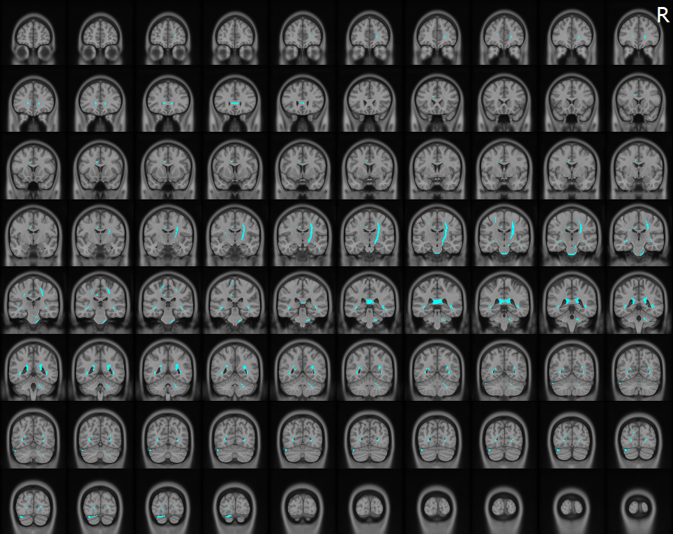{width=50%}


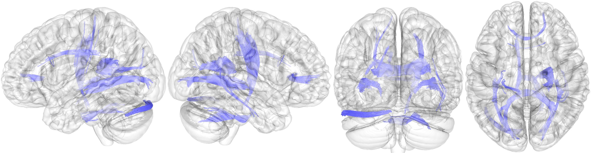

</center>
<br>


### Peri

<span style="color: #ff5500;"><font size="5"><bold> Positive Correlations (FDR =  0.007194) </span></font></bold>

```{r qa_pos_estradiol_peri}
#Peri positive
df <- read_csv(here("data", "hormones", "estradiol", "qa",
                    "qa_pos_estradiol_peri.csv")) %>% 
  clean_names() %>% 
  filter(tract_name %in% c("number of tracts","mean length(mm)",
                          "diameter(mm)", "volume(mm^3)")) %>% 
  rotate_df() %>% row_to_names(row_number = 1) %>% 
  rownames_to_column("tract_name") %>% 
  mutate(tract_name = to_any_case(tract_name,"upper_camel", sep_out = "_")) %>% 
  mutate_at(c(2:5), as.numeric) %>% 
  filter(`number of tracts` >= 10)

#Present table
df %>% 
  kable(col.names = c("Tract Name", "Number of Tracts", "Mean Length (mm)",
                      "Diameter (mm)", "Volume (mm^3)"),
        digits = 3,
        table.attr = "style='width:90%;'"
        ) %>% 
  kable_styling(bootstrap_options = "hover") %>% 
  scroll_box(width = "800px", height = "200px")
```


<br>
<span style="color: #00ffff;"><font size="5"><bold> Negative Correlations (FDR = 0.000102) </span></font></bold>

```{r qa_neg_estradiol_peri}
#Peri negative
df <- read_csv(here("data", "hormones", "estradiol", "qa",
                    "qa_neg_estradiol_peri.csv")) %>% 
  clean_names() %>% 
  filter(tract_name %in% c("number of tracts","mean length(mm)",
                          "diameter(mm)", "volume(mm^3)")) %>% 
  rotate_df() %>% row_to_names(row_number = 1) %>% 
  rownames_to_column("tract_name") %>% 
  mutate(tract_name = to_any_case(tract_name,"upper_camel", sep_out = "_")) %>% 
  mutate_at(c(2:5), as.numeric) %>% 
  filter(`number of tracts` >= 10)

#Present table
df %>% 
  kable(col.names = c("Tract Name", "Number of Tracts", "Mean Length (mm)",
                      "Diameter (mm)", "Volume (mm^3)"),
        digits = 3,
        table.attr = "style='width:90%;'"
        ) %>% 
  kable_styling(bootstrap_options = "hover") %>% 
  scroll_box(width = "800px", height = "200px")
```

<br>
<font size="5"> Figures </font>

<center>
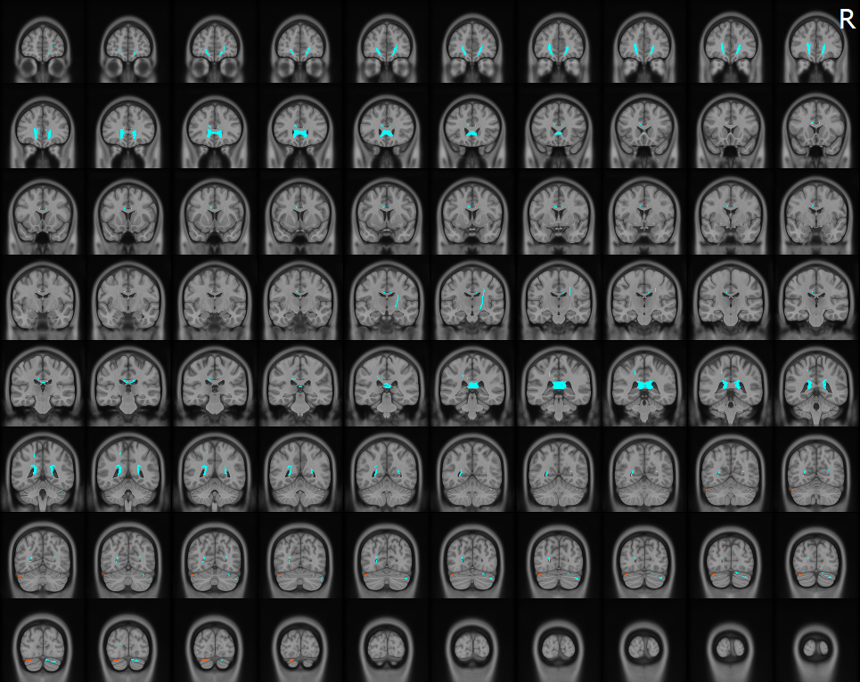{width=50%}

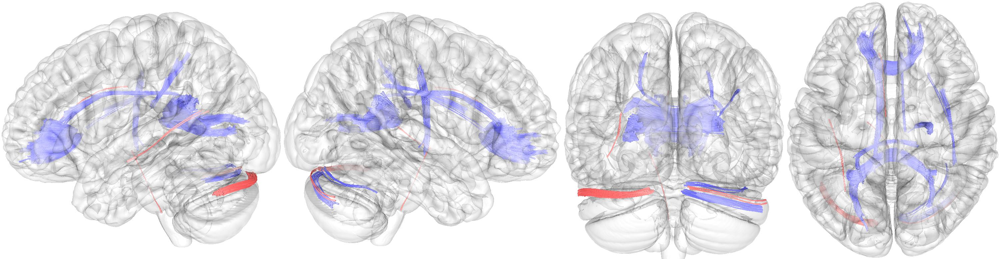

</center>
<br>


### Post

<span style="color: #ff5500;"><font size="5"><bold> Positive Correlations (FDR =  0.250000) </span></font></bold>

"No significant results in tracts" *and* all tracts were < 10.

<br>
<span style="color: #00ffff;"><font size="5"><bold> Negative Correlations (FDR = 0.000457) </span></font></bold>

```{r qa_neg_estradiol_post}
#Post negative
df <- read_csv(here("data", "hormones", "estradiol", "qa",
                    "qa_neg_estradiol_post.csv")) %>% 
  clean_names() %>% 
  filter(tract_name %in% c("number of tracts","mean length(mm)",
                          "diameter(mm)", "volume(mm^3)")) %>% 
  rotate_df() %>% row_to_names(row_number = 1) %>% 
  rownames_to_column("tract_name") %>% 
  mutate(tract_name = to_any_case(tract_name,"upper_camel", sep_out = "_")) %>% 
  mutate_at(c(2:5), as.numeric) %>% 
  filter(`number of tracts` >= 10)

#Present table
df %>% 
  kable(col.names = c("Tract Name", "Number of Tracts", "Mean Length (mm)",
                      "Diameter (mm)", "Volume (mm^3)"),
        digits = 3,
        table.attr = "style='width:90%;'"
        ) %>% 
  kable_styling(bootstrap_options = "hover") %>% 
  scroll_box(width = "800px", height = "200px")
```

<br>
<font size="5"> Figures </font>

<center>
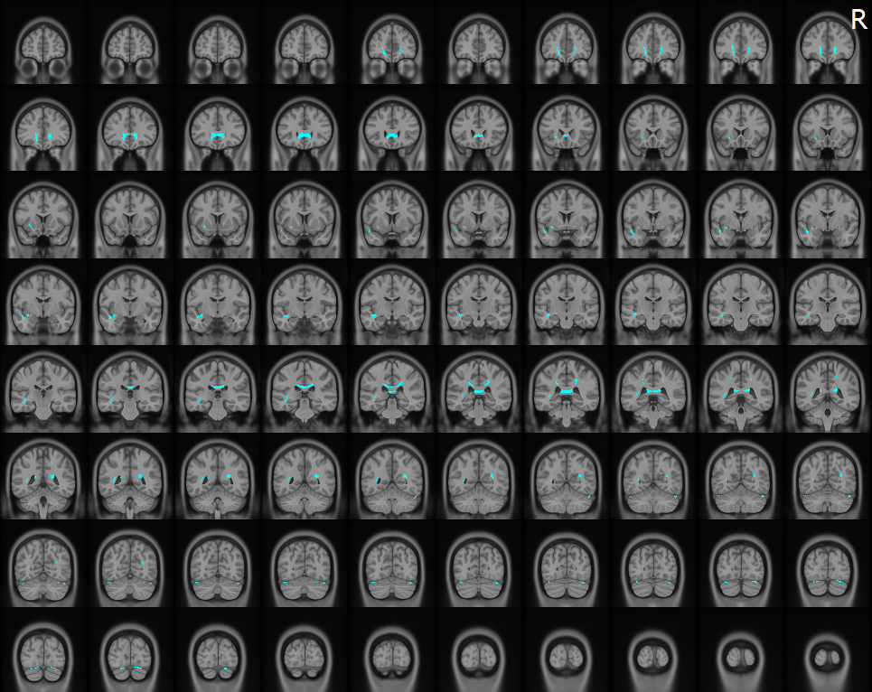{width=50%}

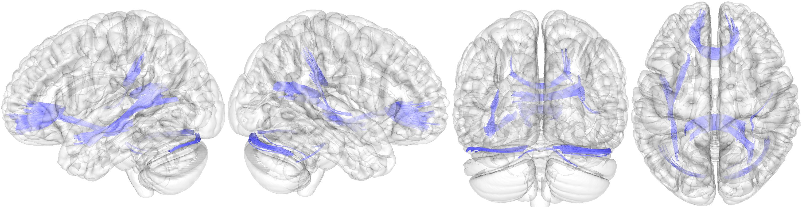

</center>
<br>


## {-}

## AD {.tabset}

Among women overall, there were no positive correlations with tracts, but there are negative correlations especially for fornix (left and right) tract. Among reproductive stage groups, pres and peris have both positive and negative correlations with AD and estradiol. Posts do not have any significant tracts with positive correlations, but there is a negative correlation with left cerebellum only.

### Women

<span style="color: #ff5500;"><font size="5"><bold> Positive Correlations (FDR =  1.000000) </span></font></bold>

No significant results in tracts.

<br>
<span style="color: #00ffff;"><font size="5"><bold> Negative Correlations (FDR = 0.066158) </span></font></bold>

```{r ad_neg_estradiol_women}
#Women negative
df <- read_csv(here("data", "hormones", "estradiol", "ad",
                    "ad_neg_estradiol_women.csv")) %>% 
  clean_names() %>% 
  filter(tract_name %in% c("number of tracts","mean length(mm)",
                          "diameter(mm)", "volume(mm^3)")) %>% 
  rotate_df() %>% row_to_names(row_number = 1) %>% 
  rownames_to_column("tract_name") %>% 
  mutate(tract_name = to_any_case(tract_name,"upper_camel", sep_out = "_")) %>% 
  mutate_at(c(2:5), as.numeric) %>% 
  filter(`number of tracts` >= 10)

#Present table
df %>% 
  kable(col.names = c("Tract Name", "Number of Tracts", "Mean Length (mm)",
                      "Diameter (mm)", "Volume (mm^3)"),
        digits = 3,
        table.attr = "style='width:90%;'"
        ) %>% 
  kable_styling(bootstrap_options = "hover") %>% 
  scroll_box(width = "800px", height = "200px")
```

<br>
<font size="5"> Figures </font>

<center>
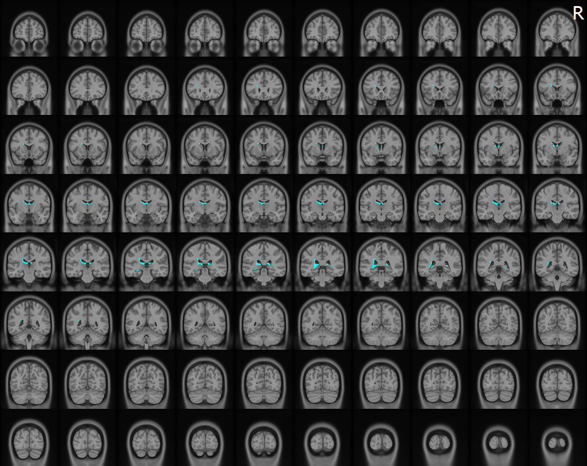{width=50%}

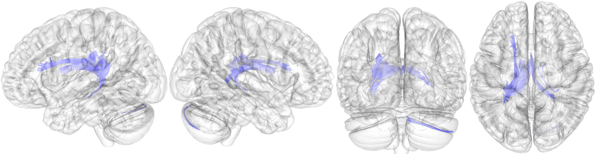

</center>
<br>

### Pre

<span style="color: #ff5500;"><font size="5"><bold> Positive Correlations (FDR =  0.001185) </span></font></bold>

```{r ad_pos_estradiol_pre}
#Pre positive
df <- read_csv(here("data", "hormones", "estradiol", "ad",
                    "ad_pos_estradiol_pre.csv")) %>% 
  clean_names() %>% 
  filter(tract_name %in% c("number of tracts","mean length(mm)",
                          "diameter(mm)", "volume(mm^3)")) %>% 
  rotate_df() %>% row_to_names(row_number = 1) %>% 
  rownames_to_column("tract_name") %>% 
  mutate(tract_name = to_any_case(tract_name,"upper_camel", sep_out = "_")) %>% 
  mutate_at(c(2:5), as.numeric) %>% 
  filter(`number of tracts` >= 10)

#Present table
df %>% 
  kable(col.names = c("Tract Name", "Number of Tracts", "Mean Length (mm)",
                      "Diameter (mm)", "Volume (mm^3)"),
        digits = 3,
        table.attr = "style='width:90%;'"
        ) %>% 
  kable_styling(bootstrap_options = "hover") %>% 
  scroll_box(width = "800px", height = "200px")
```


<br>
<span style="color: #00ffff;"><font size="5"><bold> Negative Correlations (FDR = 0.399568) </span></font></bold>

"No significant results in tracts."

```{r ad_neg_estradiol_pre}
#Pre negative
df <- read_csv(here("data", "hormones", "estradiol", "ad",
                    "ad_neg_estradiol_pre.csv")) %>% 
  clean_names() %>% 
  filter(tract_name %in% c("number of tracts","mean length(mm)",
                          "diameter(mm)", "volume(mm^3)")) %>% 
  rotate_df() %>% row_to_names(row_number = 1) %>% 
  rownames_to_column("tract_name") %>% 
  mutate(tract_name = to_any_case(tract_name,"upper_camel", sep_out = "_")) %>% 
  mutate_at(c(2:5), as.numeric) %>% 
  filter(`number of tracts` >= 10)

#Present table
df %>% 
  kable(col.names = c("Tract Name", "Number of Tracts", "Mean Length (mm)",
                      "Diameter (mm)", "Volume (mm^3)"),
        digits = 3,
        table.attr = "style='width:90%;'"
        ) %>% 
  kable_styling(bootstrap_options = "hover") %>% 
  scroll_box(width = "800px", height = "200px")
```

<br>
<font size="5"> Figures </font>

<center>
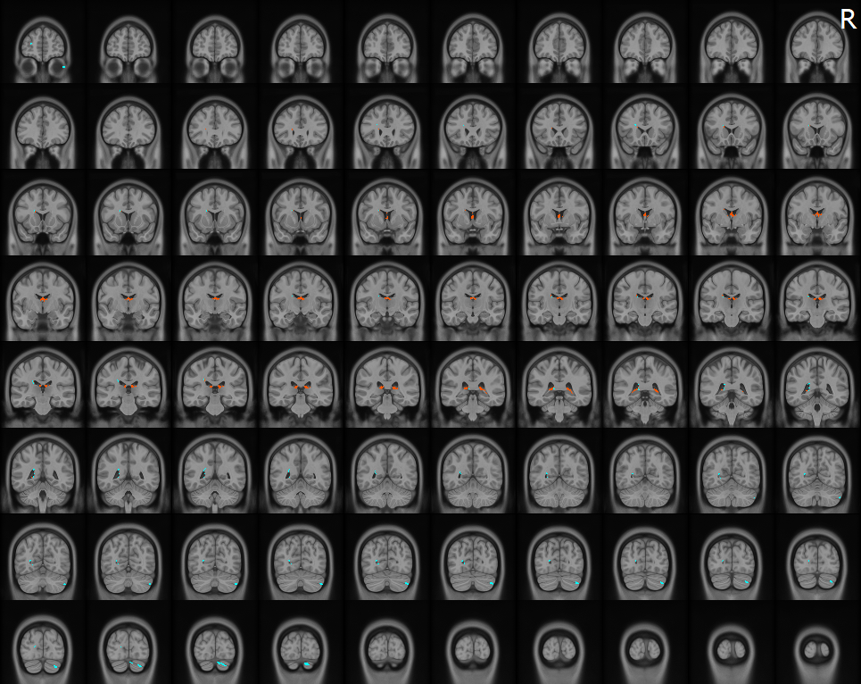{width=50%}

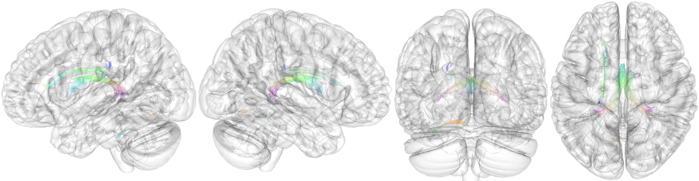

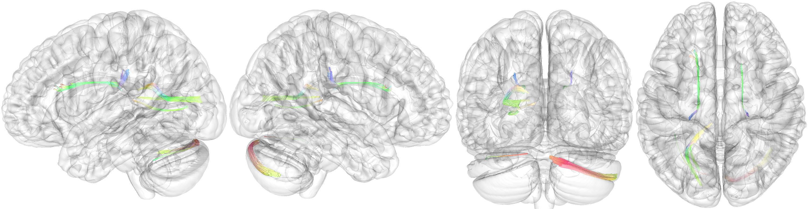

</center>
<br>

### Peri

<span style="color: #ff5500;"><font size="5"><bold> Positive Correlations (FDR =  0.010526) </span></font></bold>

```{r ad_pos_estradiol_peri}
#Peri positive
df <- read_csv(here("data", "hormones", "estradiol", "ad",
                    "ad_pos_estradiol_peri.csv")) %>% 
  clean_names() %>% 
  filter(tract_name %in% c("number of tracts","mean length(mm)",
                          "diameter(mm)", "volume(mm^3)")) %>% 
  rotate_df() %>% row_to_names(row_number = 1) %>% 
  rownames_to_column("tract_name") %>% 
  mutate(tract_name = to_any_case(tract_name,"upper_camel", sep_out = "_")) %>% 
  mutate_at(c(2:5), as.numeric) %>% 
  filter(`number of tracts` >= 10)

#Present table
df %>% 
  kable(col.names = c("Tract Name", "Number of Tracts", "Mean Length (mm)",
                      "Diameter (mm)", "Volume (mm^3)"),
        digits = 3,
        table.attr = "style='width:90%;'"
        ) %>% 
  kable_styling(bootstrap_options = "hover") %>% 
  scroll_box(width = "800px", height = "200px")
```


<br>
<span style="color: #00ffff;"><font size="5"><bold> Negative Correlations (FDR = 0.000227) </span></font></bold>


```{r ad_neg_estradiol_peri}
#Peri negative
df <- read_csv(here("data", "hormones", "estradiol", "ad",
                    "ad_neg_estradiol_peri.csv")) %>% 
  clean_names() %>% 
  filter(tract_name %in% c("number of tracts","mean length(mm)",
                          "diameter(mm)", "volume(mm^3)")) %>% 
  rotate_df() %>% row_to_names(row_number = 1) %>% 
  rownames_to_column("tract_name") %>% 
  mutate(tract_name = to_any_case(tract_name,"upper_camel", sep_out = "_")) %>% 
  mutate_at(c(2:5), as.numeric) %>% 
  filter(`number of tracts` >= 10)

#Present table
df %>% 
  kable(col.names = c("Tract Name", "Number of Tracts", "Mean Length (mm)",
                      "Diameter (mm)", "Volume (mm^3)"),
        digits = 3,
        table.attr = "style='width:90%;'"
        ) %>% 
  kable_styling(bootstrap_options = "hover") %>% 
  scroll_box(width = "800px", height = "200px")
```

<br>
<font size="5"> Figures </font>

<center>
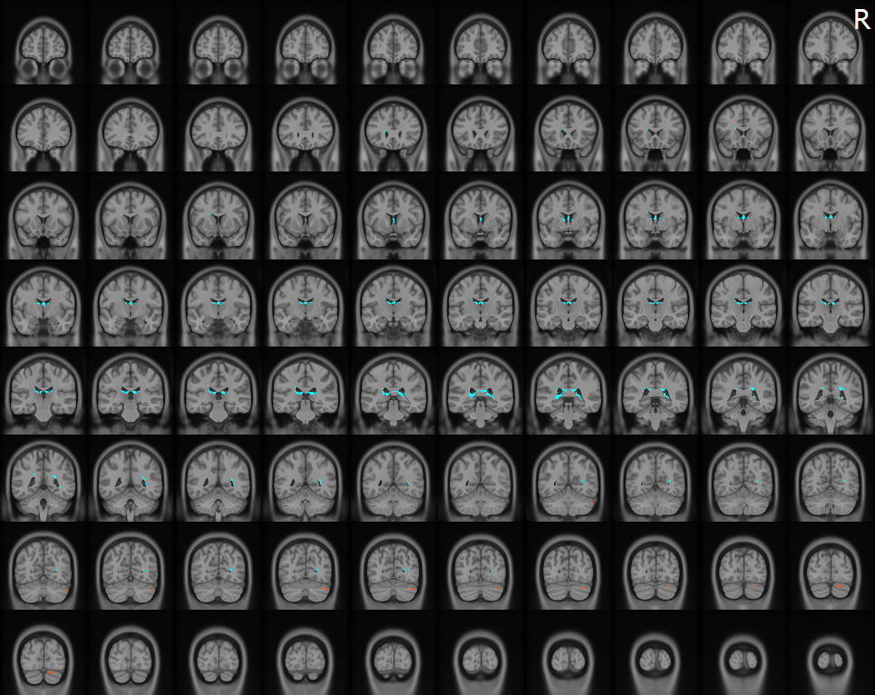{width=50%}


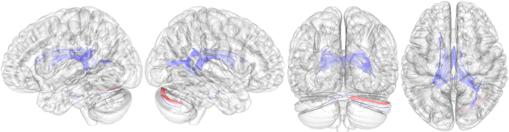

</center>
<br>

### Post

<span style="color: #ff5500;"><font size="5"><bold> Positive Correlations (FDR =  1.000000) </span></font></bold>

No significant results in tracts.


<br>
<span style="color: #00ffff;"><font size="5"><bold> Negative Correlations (FDR = 0.321429) </span></font></bold>

"No significant results in tracts."


```{r ad_neg_estradiol_post}
#Post negative
df <- read_csv(here("data", "hormones", "estradiol", "ad",
                    "ad_neg_estradiol_post.csv")) %>% 
  clean_names() %>% 
  filter(tract_name %in% c("number of tracts","mean length(mm)",
                          "diameter(mm)", "volume(mm^3)")) %>% 
  rotate_df() %>% row_to_names(row_number = 1) %>% 
  rownames_to_column("tract_name") %>% 
  mutate(tract_name = to_any_case(tract_name,"upper_camel", sep_out = "_")) %>% 
  mutate_at(c(2:5), as.numeric) %>% 
  filter(`number of tracts` >= 10)

#Present table
df %>% 
  kable(col.names = c("Tract Name", "Number of Tracts", "Mean Length (mm)",
                      "Diameter (mm)", "Volume (mm^3)"),
        digits = 3,
        table.attr = "style='width:90%;'"
        ) %>% 
  kable_styling(bootstrap_options = "hover") %>% 
  scroll_box(width = "800px", height = "200px")
```

<br>
<font size="5"> Figures </font>

<center>
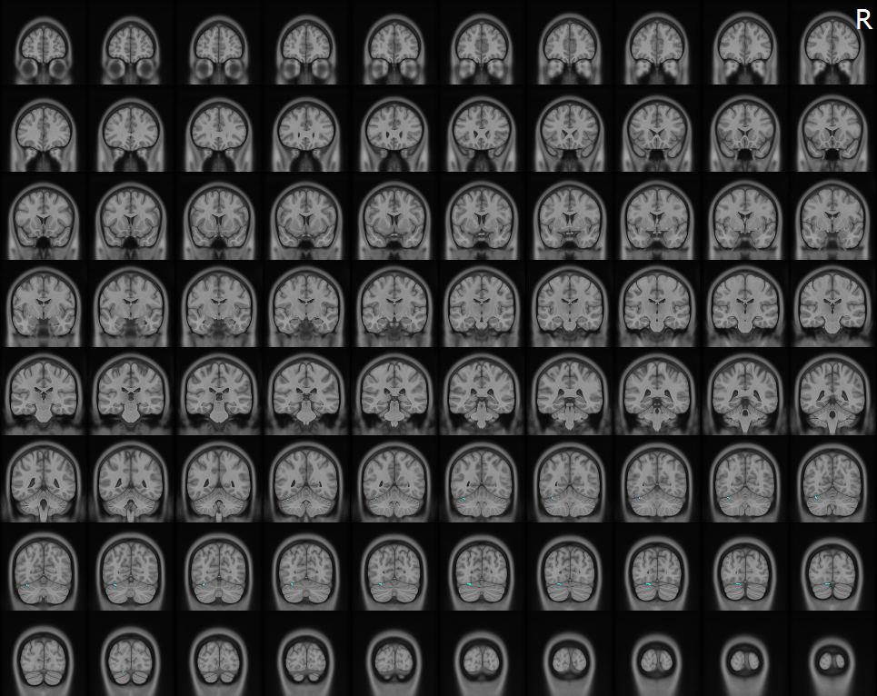{width=50%}


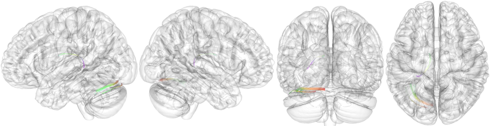

</center>
<br>

## {-}


## MD {.tabset}

There were no significant tracts with positive correlations for MD and estradiol across women, but there were negative correlations with tracts in left and right fornix for women. Among reproductive stage groups, all have both positive and negative correlations but pres had positive correlations with fornix (left and right) tracts.

### Women

<span style="color: #ff5500;"><font size="5"><bold> Positive Correlations (FDR =  1.000000) </span></font></bold>

No significant results in tracts.

<br>
<span style="color: #00ffff;"><font size="5"><bold> Negative Correlations (FDR = 0.064110) </span></font></bold>

```{r md_neg_estradiol_women}
#Women negative
df <- read_csv(here("data", "hormones", "estradiol", "md",
                    "md_neg_estradiol_women.csv")) %>% 
  clean_names() %>% 
  filter(tract_name %in% c("number of tracts","mean length(mm)",
                          "diameter(mm)", "volume(mm^3)")) %>% 
  rotate_df() %>% row_to_names(row_number = 1) %>% 
  rownames_to_column("tract_name") %>% 
  mutate(tract_name = to_any_case(tract_name,"upper_camel", sep_out = "_")) %>% 
  mutate_at(c(2:5), as.numeric) %>% 
  filter(`number of tracts` >= 10)

#Present table
df %>% 
  kable(col.names = c("Tract Name", "Number of Tracts", "Mean Length (mm)",
                      "Diameter (mm)", "Volume (mm^3)"),
        digits = 3,
        table.attr = "style='width:90%;'"
        ) %>% 
  kable_styling(bootstrap_options = "hover") %>% 
  scroll_box(width = "800px", height = "200px")
```

<br>
<font size="5"> Figures </font>

<center>
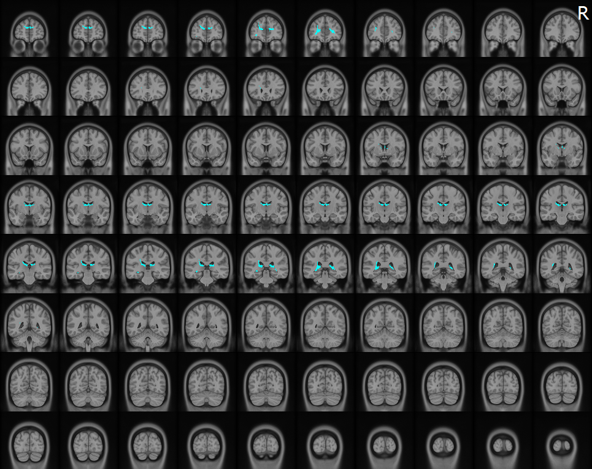{width=50%}

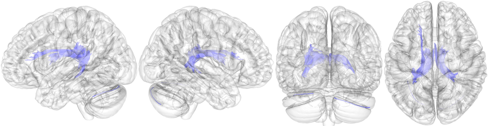

</center>
<br>


### Pre

<span style="color: #ff5500;"><font size="5"><bold> Positive Correlations (FDR =  0.062521) </span></font></bold>

```{r md_pos_estradiol_pre}
#Pre positive
df <- read_csv(here("data", "hormones", "estradiol", "md",
                    "md_pos_estradiol_pre.csv")) %>% 
  clean_names() %>% 
  filter(tract_name %in% c("number of tracts","mean length(mm)",
                          "diameter(mm)", "volume(mm^3)")) %>% 
  rotate_df() %>% row_to_names(row_number = 1) %>% 
  rownames_to_column("tract_name") %>% 
  mutate(tract_name = to_any_case(tract_name,"upper_camel", sep_out = "_")) %>% 
  mutate_at(c(2:5), as.numeric) %>% 
  filter(`number of tracts` >= 10)

#Present table
df %>% 
  kable(col.names = c("Tract Name", "Number of Tracts", "Mean Length (mm)",
                      "Diameter (mm)", "Volume (mm^3)"),
        digits = 3,
        table.attr = "style='width:90%;'"
        ) %>% 
  kable_styling(bootstrap_options = "hover") %>% 
  scroll_box(width = "800px", height = "200px")
```


<br>
<span style="color: #00ffff;"><font size="5"><bold> Negative Correlations (FDR = 1.000000) </span></font></bold>

"No significant results in tracts."

```{r md_neg_estradiol_pre}
#Pre negative
df <- read_csv(here("data", "hormones", "estradiol", "md",
                    "md_neg_estradiol_pre.csv")) %>% 
  clean_names() %>% 
  filter(tract_name %in% c("number of tracts","mean length(mm)",
                          "diameter(mm)", "volume(mm^3)")) %>% 
  rotate_df() %>% row_to_names(row_number = 1) %>% 
  rownames_to_column("tract_name") %>% 
  mutate(tract_name = to_any_case(tract_name,"upper_camel", sep_out = "_")) %>% 
  mutate_at(c(2:5), as.numeric) %>% 
  filter(`number of tracts` >= 10)

#Present table
df %>% 
  kable(col.names = c("Tract Name", "Number of Tracts", "Mean Length (mm)",
                      "Diameter (mm)", "Volume (mm^3)"),
        digits = 3,
        table.attr = "style='width:90%;'"
        ) %>% 
  kable_styling(bootstrap_options = "hover") %>% 
  scroll_box(width = "800px", height = "200px")
```

<br>
<font size="5"> Figures </font>

<center>
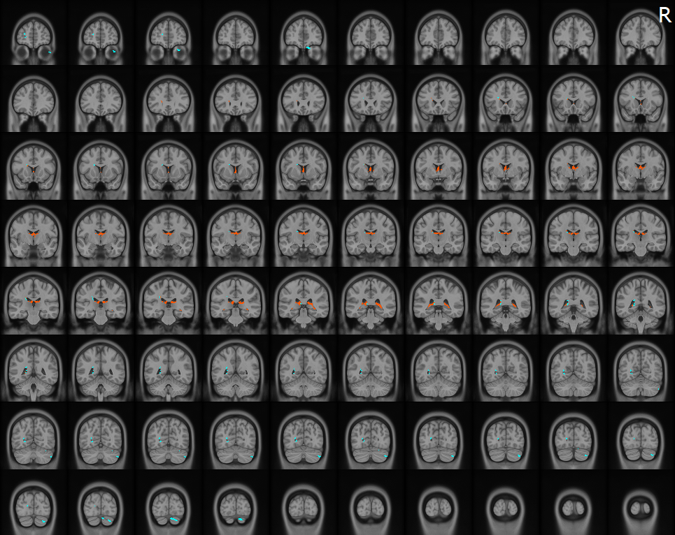{width=50%}


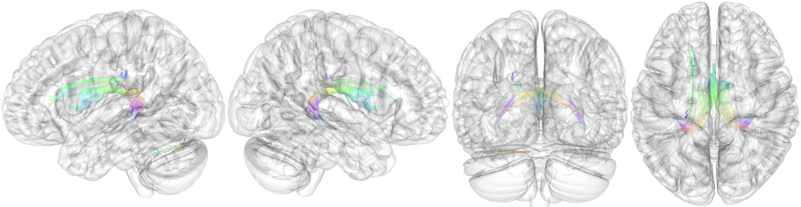


</center>
<br>

### Peri

<span style="color: #ff5500;"><font size="5"><bold> Positive Correlations (FDR =  0.347826) </span></font></bold>

"No significant results in tracts."

```{r md_pos_estradiol_peri}
#Peri positive
df <- read_csv(here("data", "hormones", "estradiol", "md",
                    "md_pos_estradiol_peri.csv")) %>% 
  clean_names() %>% 
  filter(tract_name %in% c("number of tracts","mean length(mm)",
                          "diameter(mm)", "volume(mm^3)")) %>% 
  rotate_df() %>% row_to_names(row_number = 1) %>% 
  rownames_to_column("tract_name") %>% 
  mutate(tract_name = to_any_case(tract_name,"upper_camel", sep_out = "_")) %>% 
  mutate_at(c(2:5), as.numeric) %>% 
  filter(`number of tracts` >= 10)

#Present table
df %>% 
  kable(col.names = c("Tract Name", "Number of Tracts", "Mean Length (mm)",
                      "Diameter (mm)", "Volume (mm^3)"),
        digits = 3,
        table.attr = "style='width:90%;'"
        ) %>% 
  kable_styling(bootstrap_options = "hover") %>% 
  scroll_box(width = "800px", height = "200px")
```


<br>
<span style="color: #00ffff;"><font size="5"><bold> Negative Correlations (FDR = 0.003663) </span></font></bold>

```{r md_neg_estradiol_peri}
#Peri negative
df <- read_csv(here("data", "hormones", "estradiol", "md",
                    "md_neg_estradiol_peri.csv")) %>% 
  clean_names() %>% 
  filter(tract_name %in% c("number of tracts","mean length(mm)",
                          "diameter(mm)", "volume(mm^3)")) %>% 
  rotate_df() %>% row_to_names(row_number = 1) %>% 
  rownames_to_column("tract_name") %>% 
  mutate(tract_name = to_any_case(tract_name,"upper_camel", sep_out = "_")) %>% 
  mutate_at(c(2:5), as.numeric) %>% 
  filter(`number of tracts` >= 10)

#Present table
df %>% 
  kable(col.names = c("Tract Name", "Number of Tracts", "Mean Length (mm)",
                      "Diameter (mm)", "Volume (mm^3)"),
        digits = 3,
        table.attr = "style='width:90%;'"
        ) %>% 
  kable_styling(bootstrap_options = "hover") %>% 
  scroll_box(width = "800px", height = "200px")
```

<br>
<font size="5"> Figures </font>

<center>
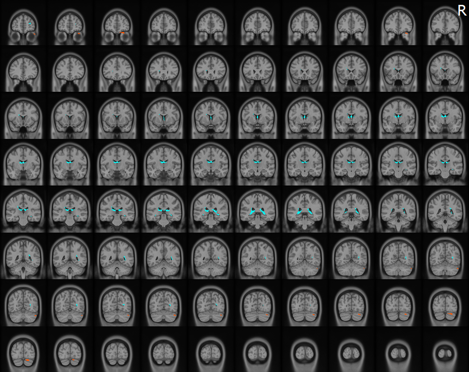{width=50%}

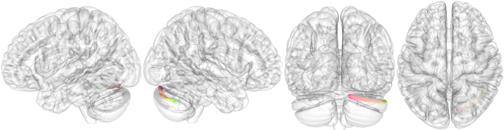

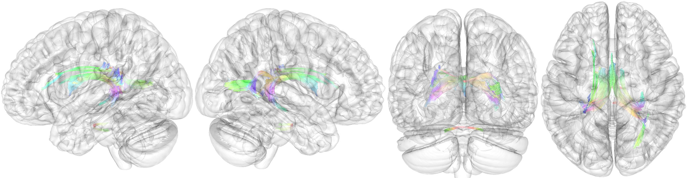

</center>
<br>

### Post

<span style="color: #ff5500;"><font size="5"><bold> Positive Correlations (FDR =  0.012346) </span></font></bold>


```{r md_pos_estradiol_post}
#Post positive
df <- read_csv(here("data", "hormones", "estradiol", "md",
                    "md_pos_estradiol_post.csv")) %>% 
  clean_names() %>% 
  filter(tract_name %in% c("number of tracts","mean length(mm)",
                          "diameter(mm)", "volume(mm^3)")) %>% 
  rotate_df() %>% row_to_names(row_number = 1) %>% 
  rownames_to_column("tract_name") %>% 
  mutate(tract_name = to_any_case(tract_name,"upper_camel", sep_out = "_")) %>% 
  mutate_at(c(2:5), as.numeric) %>% 
  filter(`number of tracts` >= 10)

#Present table
df %>% 
  kable(col.names = c("Tract Name", "Number of Tracts", "Mean Length (mm)",
                      "Diameter (mm)", "Volume (mm^3)"),
        digits = 3,
        table.attr = "style='width:90%;'"
        ) %>% 
  kable_styling(bootstrap_options = "hover") %>% 
  scroll_box(width = "800px", height = "200px")
```


<br>
<span style="color: #00ffff;"><font size="5"><bold> Negative Correlations (FDR = 0.011990) </span></font></bold>

```{r md_neg_estradiol_post}
#Post negative
df <- read_csv(here("data", "hormones", "estradiol", "md",
                    "md_neg_estradiol_post.csv")) %>% 
  clean_names() %>% 
  filter(tract_name %in% c("number of tracts","mean length(mm)",
                          "diameter(mm)", "volume(mm^3)")) %>% 
  rotate_df() %>% row_to_names(row_number = 1) %>% 
  rownames_to_column("tract_name") %>% 
  mutate(tract_name = to_any_case(tract_name,"upper_camel", sep_out = "_")) %>% 
  mutate_at(c(2:5), as.numeric) %>% 
  filter(`number of tracts` >= 10)

#Present table
df %>% 
  kable(col.names = c("Tract Name", "Number of Tracts", "Mean Length (mm)",
                      "Diameter (mm)", "Volume (mm^3)"),
        digits = 3,
        table.attr = "style='width:90%;'"
        ) %>% 
  kable_styling(bootstrap_options = "hover") %>% 
  scroll_box(width = "800px", height = "200px")
```

<br>
<font size="5"> Figures </font>

<center>
{width=50%}

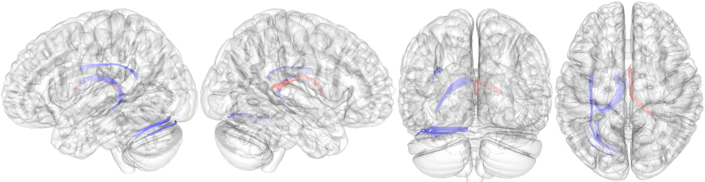

</center>
<br>

## {-}


## RD {.tabset}

There were no significant tracts for positive correlations between RD and estradiol when assessing women altogether. However, there were tracts displayed for negative correlations between RD and estradiol with left fornix tract being commonly displayed for women and all reproductive stage groups. Among pre, peri, and post, there were more tracts with negative correlations than there are tracts with positive correlations.

### Women

<span style="color: #ff5500;"><font size="5"><bold> Positive Correlations (FDR =  1.000000) </span></font></bold>

No significant results in tracts.

<br>
<span style="color: #00ffff;"><font size="5"><bold> Negative Correlations (FDR = 0.066954) </span></font></bold>

```{r rd_neg_estradiol_women}
#Women negative
df <- read_csv(here("data", "hormones", "estradiol", "rd",
                    "rd_neg_estradiol_women.csv")) %>% 
  clean_names() %>% 
  filter(tract_name %in% c("number of tracts","mean length(mm)",
                          "diameter(mm)", "volume(mm^3)")) %>% 
  rotate_df() %>% row_to_names(row_number = 1) %>% 
  rownames_to_column("tract_name") %>% 
  mutate(tract_name = to_any_case(tract_name,"upper_camel", sep_out = "_")) %>% 
  mutate_at(c(2:5), as.numeric) %>% 
  filter(`number of tracts` >= 10)

#Present table
df %>% 
  kable(col.names = c("Tract Name", "Number of Tracts", "Mean Length (mm)",
                      "Diameter (mm)", "Volume (mm^3)"),
        digits = 3,
        table.attr = "style='width:90%;'"
        ) %>% 
  kable_styling(bootstrap_options = "hover") %>% 
  scroll_box(width = "800px", height = "200px")
```

<br>
<font size="5"> Figures </font>

<center>
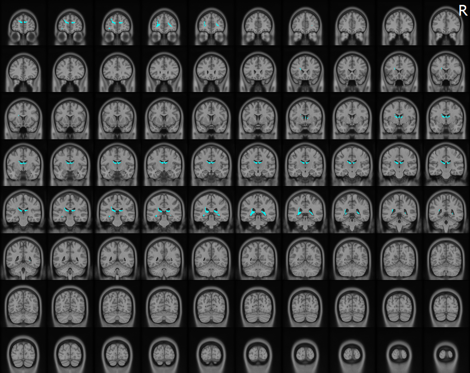{width=50%}

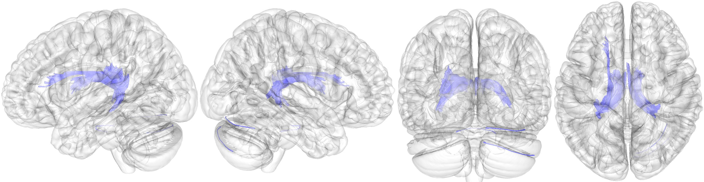

</center>
<br>

### Pre

<span style="color: #ff5500;"><font size="5"><bold> Positive Correlations (FDR =  0.036899) </span></font></bold>

```{r rd_pos_estradiol_pre}
#Pre positive
df <- read_csv(here("data", "hormones", "estradiol", "rd",
                    "rd_pos_estradiol_pre.csv")) %>% 
  clean_names() %>% 
  filter(tract_name %in% c("number of tracts","mean length(mm)",
                          "diameter(mm)", "volume(mm^3)")) %>% 
  rotate_df() %>% row_to_names(row_number = 1) %>% 
  rownames_to_column("tract_name") %>% 
  mutate(tract_name = to_any_case(tract_name,"upper_camel", sep_out = "_")) %>% 
  mutate_at(c(2:5), as.numeric) %>% 
  filter(`number of tracts` >= 10)

#Present table
df %>% 
  kable(col.names = c("Tract Name", "Number of Tracts", "Mean Length (mm)",
                      "Diameter (mm)", "Volume (mm^3)"),
        digits = 3,
        table.attr = "style='width:90%;'"
        ) %>% 
  kable_styling(bootstrap_options = "hover") %>% 
  scroll_box(width = "800px", height = "200px")
```


<br>
<span style="color: #00ffff;"><font size="5"><bold> Negative Correlations (FDR = 1.000000) </span></font></bold>

"No significant results in tracts."

```{r rd_neg_estradiol_pre}
#Pre negative
df <- read_csv(here("data", "hormones", "estradiol", "rd",
                    "rd_neg_estradiol_pre.csv")) %>% 
  clean_names() %>% 
  filter(tract_name %in% c("number of tracts","mean length(mm)",
                          "diameter(mm)", "volume(mm^3)")) %>% 
  rotate_df() %>% row_to_names(row_number = 1) %>% 
  rownames_to_column("tract_name") %>% 
  mutate(tract_name = to_any_case(tract_name,"upper_camel", sep_out = "_")) %>% 
  mutate_at(c(2:5), as.numeric) %>% 
  filter(`number of tracts` >= 10)

#Present table
df %>% 
  kable(col.names = c("Tract Name", "Number of Tracts", "Mean Length (mm)",
                      "Diameter (mm)", "Volume (mm^3)"),
        digits = 3,
        table.attr = "style='width:90%;'"
        ) %>% 
  kable_styling(bootstrap_options = "hover") %>% 
  scroll_box(width = "800px", height = "200px")
```

<br>
<font size="5"> Figures </font>

<center>
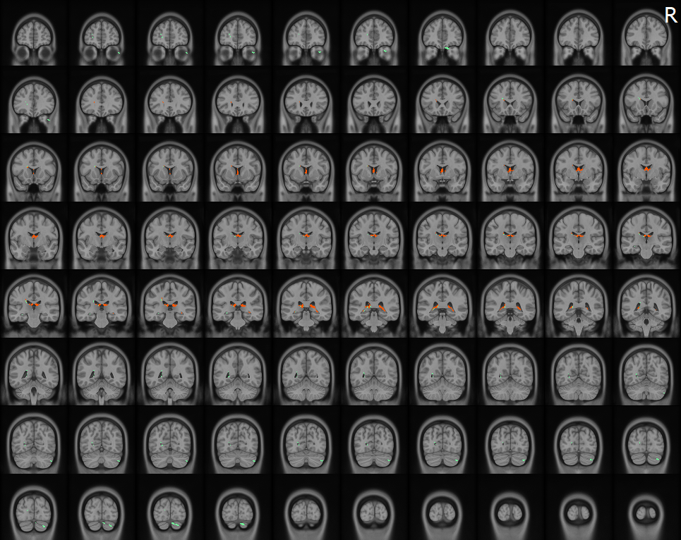{width=50%}

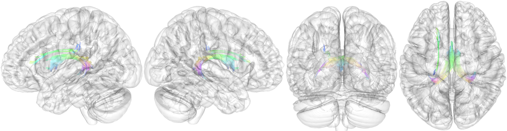

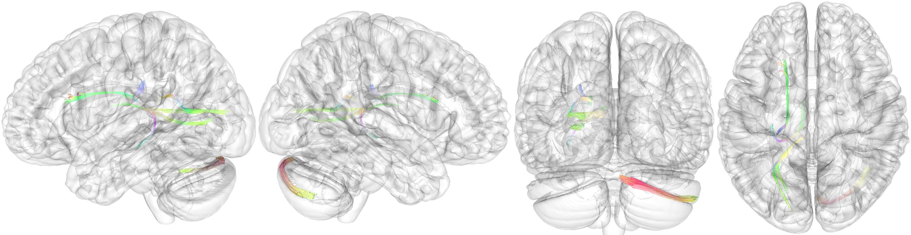

</center>
<br>

### Peri

<span style="color: #ff5500;"><font size="5"><bold> Positive Correlations (FDR =  0.331169) </span></font></bold>

"No significant results in tracts."

```{r rd_pos_estradiol_peri}
#Peri positive
df <- read_csv(here("data", "hormones", "estradiol", "rd",
                    "rd_pos_estradiol_peri.csv")) %>% 
  clean_names() %>% 
  filter(tract_name %in% c("number of tracts","mean length(mm)",
                          "diameter(mm)", "volume(mm^3)")) %>% 
  rotate_df() %>% row_to_names(row_number = 1) %>% 
  rownames_to_column("tract_name") %>% 
  mutate(tract_name = to_any_case(tract_name,"upper_camel", sep_out = "_")) %>% 
  mutate_at(c(2:5), as.numeric) %>% 
  filter(`number of tracts` >= 10)

#Present table
df %>% 
  kable(col.names = c("Tract Name", "Number of Tracts", "Mean Length (mm)",
                      "Diameter (mm)", "Volume (mm^3)"),
        digits = 3,
        table.attr = "style='width:90%;'"
        ) %>% 
  kable_styling(bootstrap_options = "hover") %>% 
  scroll_box(width = "800px", height = "200px")
```


<br>
<span style="color: #00ffff;"><font size="5"><bold> Negative Correlations (FDR = 0.002359) </span></font></bold>

```{r rd_neg_estradiol_peri}
#Peri negative
df <- read_csv(here("data", "hormones", "estradiol", "rd",
                    "rd_neg_estradiol_peri.csv")) %>% 
  clean_names() %>% 
  filter(tract_name %in% c("number of tracts","mean length(mm)",
                          "diameter(mm)", "volume(mm^3)")) %>% 
  rotate_df() %>% row_to_names(row_number = 1) %>% 
  rownames_to_column("tract_name") %>% 
  mutate(tract_name = to_any_case(tract_name,"upper_camel", sep_out = "_")) %>% 
  mutate_at(c(2:5), as.numeric) %>% 
  filter(`number of tracts` >= 10)

#Present table
df %>% 
  kable(col.names = c("Tract Name", "Number of Tracts", "Mean Length (mm)",
                      "Diameter (mm)", "Volume (mm^3)"),
        digits = 3,
        table.attr = "style='width:90%;'"
        ) %>% 
  kable_styling(bootstrap_options = "hover") %>% 
  scroll_box(width = "800px", height = "200px")
```

<br>
<font size="5"> Figures </font>

<center>
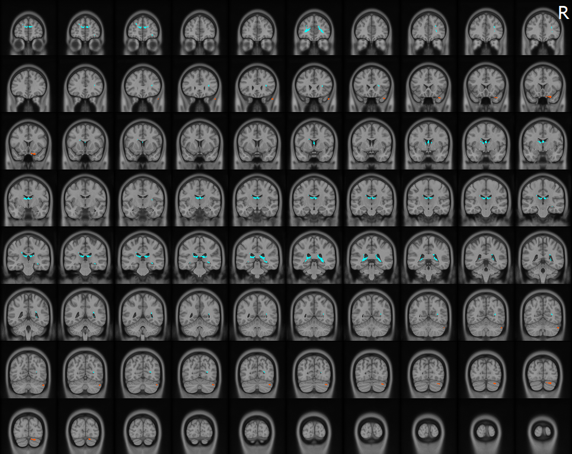{width=50%}


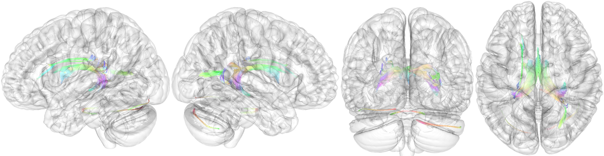

</center>
<br>

### Post

<span style="color: #ff5500;"><font size="5"><bold> Positive Correlations (FDR =  0.004651) </span></font></bold>


```{r rd_pos_estradiol_post}
#Post positive
df <- read_csv(here("data", "hormones", "estradiol", "rd",
                    "rd_pos_estradiol_post.csv")) %>% 
  clean_names() %>% 
  filter(tract_name %in% c("number of tracts","mean length(mm)",
                          "diameter(mm)", "volume(mm^3)")) %>% 
  rotate_df() %>% row_to_names(row_number = 1) %>% 
  rownames_to_column("tract_name") %>% 
  mutate(tract_name = to_any_case(tract_name,"upper_camel", sep_out = "_")) %>% 
  mutate_at(c(2:5), as.numeric) %>% 
  filter(`number of tracts` >= 10)

#Present table
df %>% 
  kable(col.names = c("Tract Name", "Number of Tracts", "Mean Length (mm)",
                      "Diameter (mm)", "Volume (mm^3)"),
        digits = 3,
        table.attr = "style='width:90%;'"
        ) %>% 
  kable_styling(bootstrap_options = "hover") %>% 
  scroll_box(width = "800px", height = "200px")
```


<br>
<span style="color: #00ffff;"><font size="5"><bold> Negative Correlations (FDR = 0.043643) </span></font></bold>

```{r rd_neg_estradiol_post}
#Post negative
df <- read_csv(here("data", "hormones", "estradiol", "rd",
                    "rd_neg_estradiol_post.csv")) %>% 
  clean_names() %>% 
  filter(tract_name %in% c("number of tracts","mean length(mm)",
                          "diameter(mm)", "volume(mm^3)")) %>% 
  rotate_df() %>% row_to_names(row_number = 1) %>% 
  rownames_to_column("tract_name") %>% 
  mutate(tract_name = to_any_case(tract_name,"upper_camel", sep_out = "_")) %>% 
  mutate_at(c(2:5), as.numeric) %>% 
  filter(`number of tracts` >= 10)

#Present table
df %>% 
  kable(col.names = c("Tract Name", "Number of Tracts", "Mean Length (mm)",
                      "Diameter (mm)", "Volume (mm^3)"),
        digits = 3,
        table.attr = "style='width:90%;'"
        ) %>% 
  kable_styling(bootstrap_options = "hover") %>% 
  scroll_box(width = "800px", height = "200px")
```

<br>
<font size="5"> Figures </font>

<center>
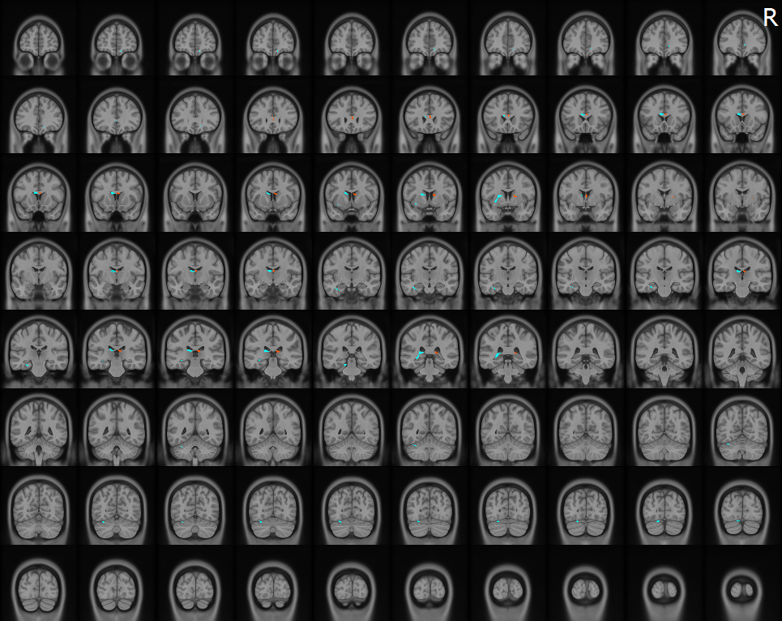{width=50%}


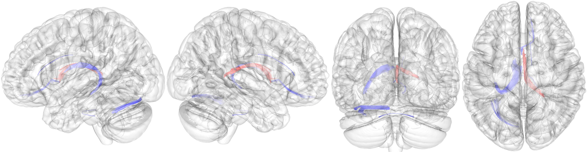

</center>
<br>

## {-}

# {-}

# Progesterone {.tabset .tabset-dropdown}

## QA {.tabset}

There were significant tracts displayed for positive and negative correlations for women and all reproductive stage groups (but tracts in pres are all < 10). For positive correlations, the tract commonly displayed for all groups was the middle cerebellar peduncle and for negative correlations, the tract commonly displayed for all groups was the corpus callosum forceps major. Pres had majority all positive correlations, whereas peris and posts have more tracts with negative correlations between QA and progesterone.

### Women

<span style="color: #ff5500;"><font size="5"><bold> Positive Correlations (FDR =  0.005337) </span></font></bold>

```{r qa_pos_progesterone_women}
#Women positive
df <- read_csv(here("data", "hormones", "progesterone", "qa",
                    "qa_pos_progesterone_women.csv")) %>% 
  clean_names() %>% 
  filter(tract_name %in% c("number of tracts","mean length(mm)",
                          "diameter(mm)", "volume(mm^3)")) %>% 
  rotate_df() %>% row_to_names(row_number = 1) %>% 
  rownames_to_column("tract_name") %>% 
  mutate(tract_name = to_any_case(tract_name,"upper_camel", sep_out = "_")) %>% 
  mutate_at(c(2:5), as.numeric) %>% filter(`number of tracts` >= 10)

#Present table
df %>% 
  kable(col.names = c("Tract Name", "Number of Tracts", "Mean Length (mm)",
                      "Diameter (mm)", "Volume (mm^3)"),
        digits = 3,
        table.attr = "style='width:90%;'"
        ) %>% 
  kable_styling(bootstrap_options = "hover") %>% 
  scroll_box(width = "800px", height = "200px")
```


<br>
<span style="color: #00ffff;"><font size="5"><bold> Negative Correlations (FDR = 0.243731) </span></font></bold>

"No significant results in tracts."

```{r qa_neg_progesterone_women}
#Women negative
df <- read_csv(here("data", "hormones", "progesterone", "qa",
                    "qa_neg_progesterone_women.csv")) %>% 
  clean_names() %>% 
  filter(tract_name %in% c("number of tracts","mean length(mm)",
                          "diameter(mm)", "volume(mm^3)")) %>% 
  rotate_df() %>% row_to_names(row_number = 1) %>% 
  rownames_to_column("tract_name") %>% 
  mutate(tract_name = to_any_case(tract_name,"upper_camel", sep_out = "_")) %>% 
  mutate_at(c(2:5), as.numeric) %>% 
  filter(`number of tracts` >= 10)

#Present table
df %>% 
  kable(col.names = c("Tract Name", "Number of Tracts", "Mean Length (mm)",
                      "Diameter (mm)", "Volume (mm^3)"),
        digits = 3,
        table.attr = "style='width:90%;'"
        ) %>% 
  kable_styling(bootstrap_options = "hover") %>% 
  scroll_box(width = "800px", height = "200px")
```

<br>
<font size="5"> Figures </font>

<center>
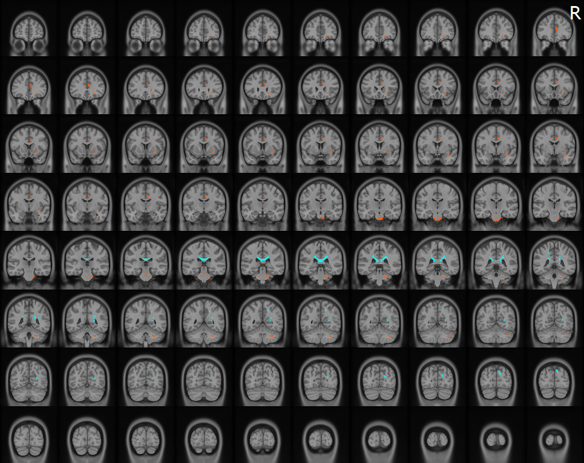{width=50%}

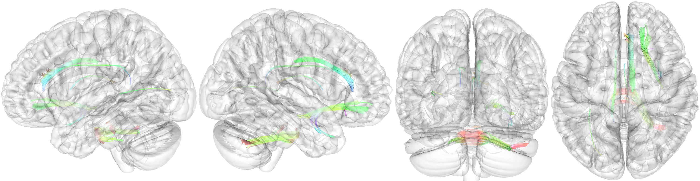

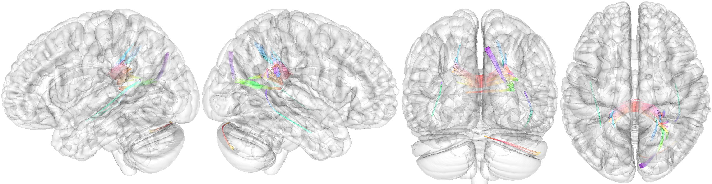

</center>
<br>

### Pre

<span style="color: #ff5500;"><font size="5"><bold> Positive Correlations (FDR =  0.000113) </span></font></bold>

```{r qa_pos_progesterone_pre}
#Pre positive
df <- read_csv(here("data", "hormones", "progesterone", "qa",
                    "qa_pos_progesterone_pre.csv")) %>% 
  clean_names() %>% 
  filter(tract_name %in% c("number of tracts","mean length(mm)",
                          "diameter(mm)", "volume(mm^3)")) %>% 
  rotate_df() %>% row_to_names(row_number = 1) %>% 
  rownames_to_column("tract_name") %>% 
  mutate(tract_name = to_any_case(tract_name,"upper_camel", sep_out = "_")) %>% 
  mutate_at(c(2:5), as.numeric) %>% filter(`number of tracts` >= 10)

#Present table
df %>% 
  kable(col.names = c("Tract Name", "Number of Tracts", "Mean Length (mm)",
                      "Diameter (mm)", "Volume (mm^3)"),
        digits = 3,
        table.attr = "style='width:90%;'"
        ) %>% 
  kable_styling(bootstrap_options = "hover") %>% 
  scroll_box(width = "800px", height = "200px")
```


<br>
<span style="color: #00ffff;"><font size="5"><bold> Negative Correlations (FDR = 0.045455) </span></font></bold>

All tracts were < 10.

```{r qa_neg_progesterone_pre}
#Pre negative
df <- read_csv(here("data", "hormones", "progesterone", "qa",
                    "qa_neg_progesterone_pre.csv")) %>% 
  clean_names() %>% 
  filter(tract_name %in% c("number of tracts","mean length(mm)",
                          "diameter(mm)", "volume(mm^3)")) %>% 
  rotate_df() %>% row_to_names(row_number = 1) %>% 
  rownames_to_column("tract_name") %>% 
  mutate(tract_name = to_any_case(tract_name,"upper_camel", sep_out = "_")) %>% 
  mutate_at(c(2:5), as.numeric)# %>% filter(`number of tracts` >= 10)

#Present table
df %>% 
  kable(col.names = c("Tract Name", "Number of Tracts", "Mean Length (mm)",
                      "Diameter (mm)", "Volume (mm^3)"),
        digits = 3,
        table.attr = "style='width:90%;'"
        ) %>% 
  kable_styling(bootstrap_options = "hover") %>% 
  scroll_box(width = "800px", height = "200px")
```

<br>
<font size="5"> Figures </font>

<center>
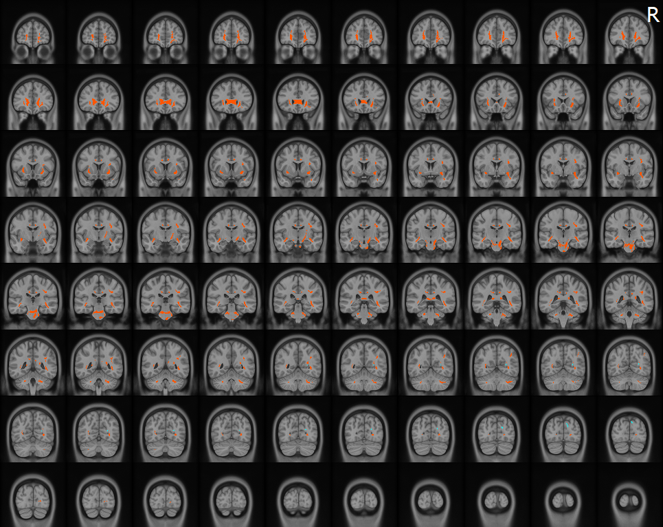{width=50%}


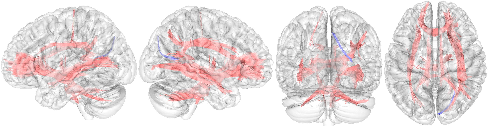

</center>
<br>

### Peri

<span style="color: #ff5500;"><font size="5"><bold> Positive Correlations (FDR =  0.073497) </span></font></bold>

```{r qa_pos_progesterone_peri}
#Peri positive
df <- read_csv(here("data", "hormones", "progesterone", "qa",
                    "qa_pos_progesterone_peri.csv")) %>% 
  clean_names() %>% 
  filter(tract_name %in% c("number of tracts","mean length(mm)",
                          "diameter(mm)", "volume(mm^3)")) %>% 
  rotate_df() %>% row_to_names(row_number = 1) %>% 
  rownames_to_column("tract_name") %>% 
  mutate(tract_name = to_any_case(tract_name,"upper_camel", sep_out = "_")) %>% 
  mutate_at(c(2:5), as.numeric) %>% filter(`number of tracts` >= 10)

#Present table
df %>% 
  kable(col.names = c("Tract Name", "Number of Tracts", "Mean Length (mm)",
                      "Diameter (mm)", "Volume (mm^3)"),
        digits = 3,
        table.attr = "style='width:90%;'"
        ) %>% 
  kable_styling(bootstrap_options = "hover") %>% 
  scroll_box(width = "800px", height = "200px")
```


<br>
<span style="color: #00ffff;"><font size="5"><bold> Negative Correlations (FDR = 0.017040) </span></font></bold>

```{r qa_neg_progesterone_peri}
#Peri negative
df <- read_csv(here("data", "hormones", "progesterone", "qa",
                    "qa_neg_progesterone_peri.csv")) %>% 
  clean_names() %>% 
  filter(tract_name %in% c("number of tracts","mean length(mm)",
                          "diameter(mm)", "volume(mm^3)")) %>% 
  rotate_df() %>% row_to_names(row_number = 1) %>% 
  rownames_to_column("tract_name") %>% 
  mutate(tract_name = to_any_case(tract_name,"upper_camel", sep_out = "_")) %>% 
  mutate_at(c(2:5), as.numeric) %>% filter(`number of tracts` >= 10)

#Present table
df %>% 
  kable(col.names = c("Tract Name", "Number of Tracts", "Mean Length (mm)",
                      "Diameter (mm)", "Volume (mm^3)"),
        digits = 3,
        table.attr = "style='width:90%;'"
        ) %>% 
  kable_styling(bootstrap_options = "hover") %>% 
  scroll_box(width = "800px", height = "200px")
```

<br>
<font size="5"> Figures </font>

<center>
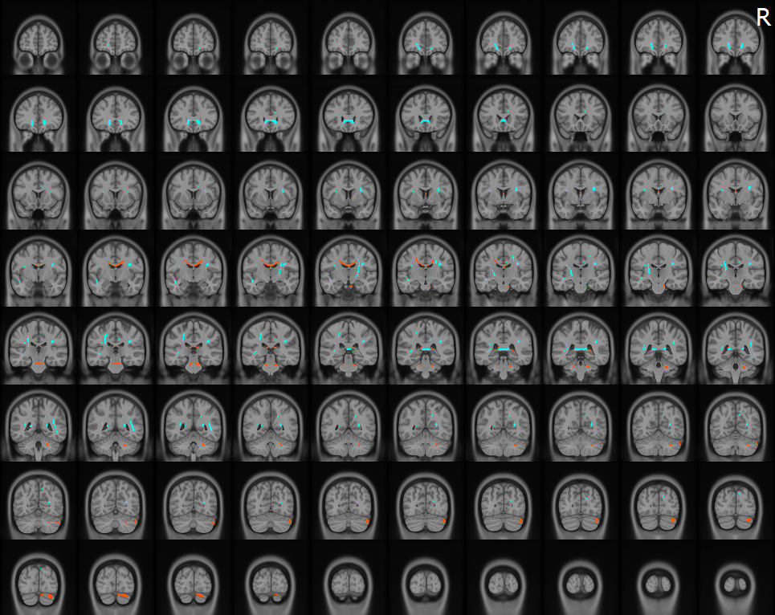{width=50%}

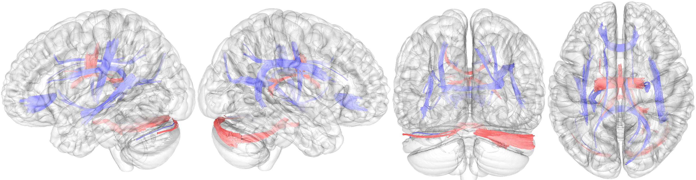

</center>
<br>

### Post

<span style="color: #ff5500;"><font size="5"><bold> Positive Correlations (FDR =  0.297872) </span></font></bold>

"No significant results in tracts."

```{r qa_pos_progesterone_post}
#Post positive
df <- read_csv(here("data", "hormones", "progesterone", "qa",
                    "qa_pos_progesterone_post.csv")) %>% 
  clean_names() %>% 
  filter(tract_name %in% c("number of tracts","mean length(mm)",
                          "diameter(mm)", "volume(mm^3)")) %>% 
  rotate_df() %>% row_to_names(row_number = 1) %>% 
  rownames_to_column("tract_name") %>% 
  mutate(tract_name = to_any_case(tract_name,"upper_camel", sep_out = "_")) %>% 
  mutate_at(c(2:5), as.numeric) %>% filter(`number of tracts` >= 10)

#Present table
df %>% 
  kable(col.names = c("Tract Name", "Number of Tracts", "Mean Length (mm)",
                      "Diameter (mm)", "Volume (mm^3)"),
        digits = 3,
        table.attr = "style='width:90%;'"
        ) %>% 
  kable_styling(bootstrap_options = "hover") %>% 
  scroll_box(width = "800px", height = "200px")
```


<br>
<span style="color: #00ffff;"><font size="5"><bold> Negative Correlations (FDR = 0.006386) </span></font></bold>

```{r qa_neg_progesterone_post}
#Post negative
df <- read_csv(here("data", "hormones", "progesterone", "qa",
                    "qa_neg_progesterone_post.csv")) %>% 
  clean_names() %>% 
  filter(tract_name %in% c("number of tracts","mean length(mm)",
                          "diameter(mm)", "volume(mm^3)")) %>% 
  rotate_df() %>% row_to_names(row_number = 1) %>% 
  rownames_to_column("tract_name") %>% 
  mutate(tract_name = to_any_case(tract_name,"upper_camel", sep_out = "_")) %>% 
  mutate_at(c(2:5), as.numeric) %>% filter(`number of tracts` >= 10)

#Present table
df %>% 
  kable(col.names = c("Tract Name", "Number of Tracts", "Mean Length (mm)",
                      "Diameter (mm)", "Volume (mm^3)"),
        digits = 3,
        table.attr = "style='width:90%;'"
        ) %>% 
  kable_styling(bootstrap_options = "hover") %>% 
  scroll_box(width = "800px", height = "200px")
```

<br>
<font size="5"> Figures </font>

<center>
{width=50%}


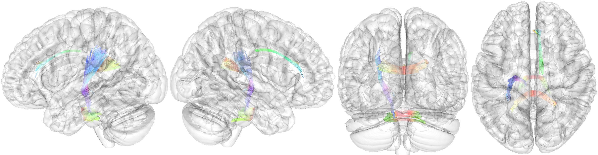

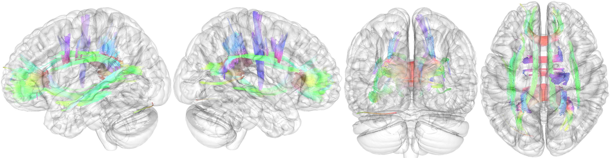

</center>
<br>

## {-}

## AD {.tabset}

There are no significant results for tracts for positive correlations between AD and progesterone for women, or for reproductive stage groups. However, there are significant tracts for negative correlations between AD and progesterone for all groups. The left fornix tract is displayed for women, pre, and peri in negative correlations but not for posts.

### Women

<span style="color: #ff5500;"><font size="5"><bold> Positive Correlations (FDR =  1.000000) </span></font></bold>

No significant results in tracts.

<br>
<span style="color: #00ffff;"><font size="5"><bold> Negative Correlations (FDR = 0.000372) </span></font></bold>

```{r ad_neg_progesterone_women}
#Women negative
df <- read_csv(here("data", "hormones", "progesterone", "ad",
                    "ad_neg_progesterone_women.csv")) %>% 
  clean_names() %>% 
  filter(tract_name %in% c("number of tracts","mean length(mm)",
                          "diameter(mm)", "volume(mm^3)")) %>% 
  rotate_df() %>% row_to_names(row_number = 1) %>% 
  rownames_to_column("tract_name") %>% 
  mutate(tract_name = to_any_case(tract_name,"upper_camel", sep_out = "_")) %>% 
  mutate_at(c(2:5), as.numeric) %>% 
  filter(`number of tracts` >= 10)

#Present table
df %>% 
  kable(col.names = c("Tract Name", "Number of Tracts", "Mean Length (mm)",
                      "Diameter (mm)", "Volume (mm^3)"),
        digits = 3,
        table.attr = "style='width:90%;'"
        ) %>% 
  kable_styling(bootstrap_options = "hover") %>% 
  scroll_box(width = "800px", height = "200px")
```

<br>
<font size="5"> Figures </font>

<center>
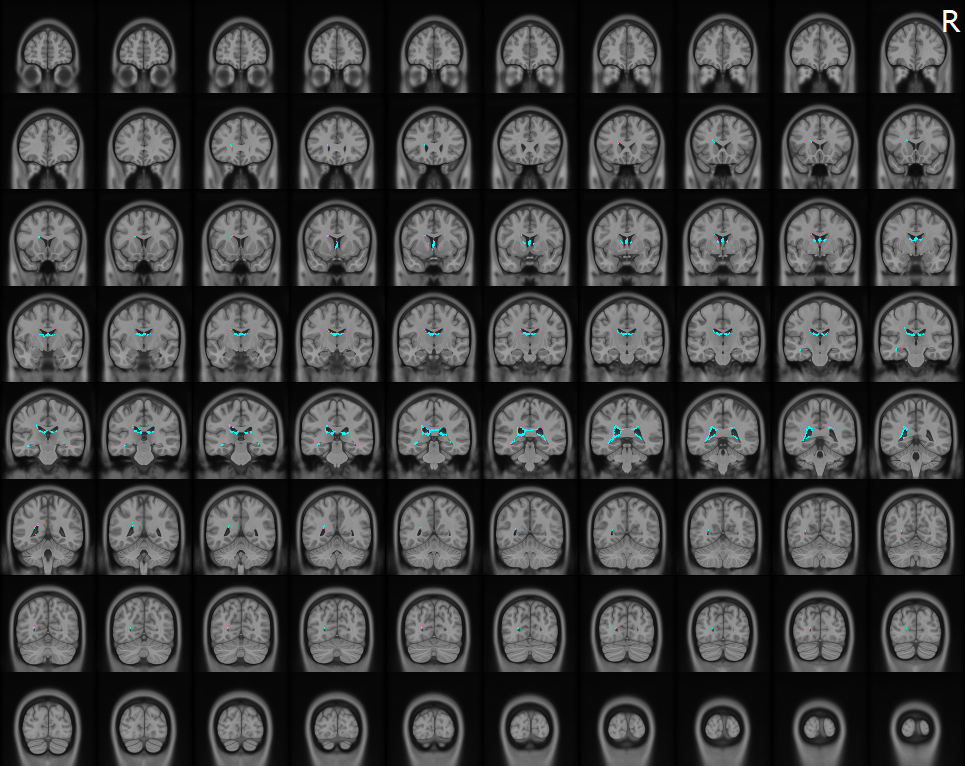{width=50%}

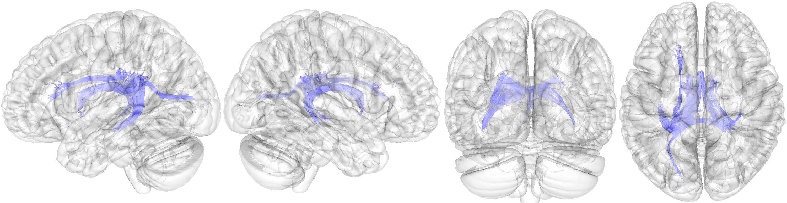

</center>
<br>


### Pre

<span style="color: #ff5500;"><font size="5"><bold> Positive Correlations (FDR =  1.000000) </span></font></bold>

No significant results in tracts *and* all tracts were < 10.

<br>
<span style="color: #00ffff;"><font size="5"><bold> Negative Correlations (FDR = 0.033333) </span></font></bold>

```{r ad_neg_progesterone_pre}
#Pre negative
df <- read_csv(here("data", "hormones", "progesterone", "ad",
                    "ad_neg_progesterone_pre.csv")) %>% 
  clean_names() %>% 
  filter(tract_name %in% c("number of tracts","mean length(mm)",
                          "diameter(mm)", "volume(mm^3)")) %>% 
  rotate_df() %>% row_to_names(row_number = 1) %>% 
  rownames_to_column("tract_name") %>% 
  mutate(tract_name = to_any_case(tract_name,"upper_camel", sep_out = "_")) %>% 
  mutate_at(c(2:5), as.numeric) %>% 
  filter(`number of tracts` >= 10)

#Present table
df %>% 
  kable(col.names = c("Tract Name", "Number of Tracts", "Mean Length (mm)",
                      "Diameter (mm)", "Volume (mm^3)"),
        digits = 3,
        table.attr = "style='width:90%;'"
        ) %>% 
  kable_styling(bootstrap_options = "hover") %>% 
  scroll_box(width = "800px", height = "200px")
```

<br>
<font size="5"> Figures </font>

<center>
{width=50%}


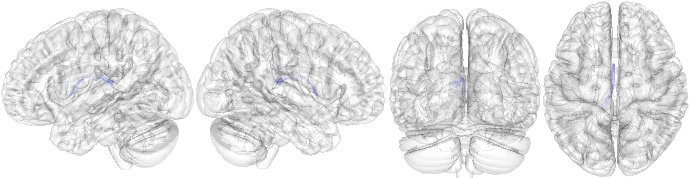

</center>
<br>

### Peri

<span style="color: #ff5500;"><font size="5"><bold> Positive Correlations (FDR =  0.500000) </span></font></bold>

No significant results in tracts *and* all tracts were < 10.

<br>
<span style="color: #00ffff;"><font size="5"><bold> Negative Correlations (FDR = 0.000222) </span></font></bold>

```{r ad_neg_progesterone_peri}
#Peri negative
df <- read_csv(here("data", "hormones", "progesterone", "ad",
                    "ad_neg_progesterone_peri.csv")) %>% 
  clean_names() %>% 
  filter(tract_name %in% c("number of tracts","mean length(mm)",
                          "diameter(mm)", "volume(mm^3)")) %>% 
  rotate_df() %>% row_to_names(row_number = 1) %>% 
  rownames_to_column("tract_name") %>% 
  mutate(tract_name = to_any_case(tract_name,"upper_camel", sep_out = "_")) %>% 
  mutate_at(c(2:5), as.numeric) %>% 
  filter(`number of tracts` >= 10)

#Present table
df %>% 
  kable(col.names = c("Tract Name", "Number of Tracts", "Mean Length (mm)",
                      "Diameter (mm)", "Volume (mm^3)"),
        digits = 3,
        table.attr = "style='width:90%;'"
        ) %>% 
  kable_styling(bootstrap_options = "hover") %>% 
  scroll_box(width = "800px", height = "200px")
```

<br>
<font size="5"> Figures </font>

<center>
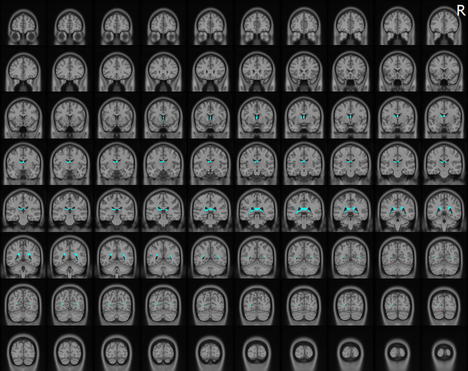{width=50%}


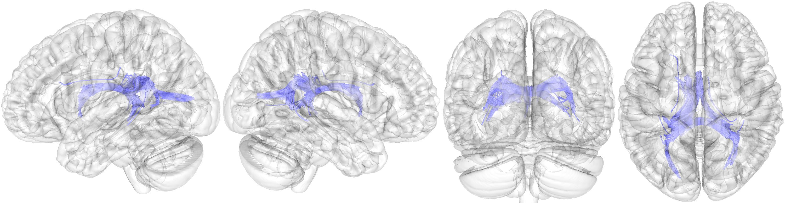

</center>
<br>

### Post

<span style="color: #ff5500;"><font size="5"><bold> Positive Correlations (FDR =  0.333333) </span></font></bold>

No significant results in tracts *and* all tracts were < 10.

<br>
<span style="color: #00ffff;"><font size="5"><bold> Negative Correlations (FDR = 0.000276) </span></font></bold>

```{r ad_neg_progesterone_post}
#Post negative
df <- read_csv(here("data", "hormones", "progesterone", "ad",
                    "ad_neg_progesterone_post.csv")) %>% 
  clean_names() %>% 
  filter(tract_name %in% c("number of tracts","mean length(mm)",
                          "diameter(mm)", "volume(mm^3)")) %>% 
  rotate_df() %>% row_to_names(row_number = 1) %>% 
  rownames_to_column("tract_name") %>% 
  mutate(tract_name = to_any_case(tract_name,"upper_camel", sep_out = "_")) %>% 
  mutate_at(c(2:5), as.numeric) %>% 
  filter(`number of tracts` >= 10)

#Present table
df %>% 
  kable(col.names = c("Tract Name", "Number of Tracts", "Mean Length (mm)",
                      "Diameter (mm)", "Volume (mm^3)"),
        digits = 3,
        table.attr = "style='width:90%;'"
        ) %>% 
  kable_styling(bootstrap_options = "hover") %>% 
  scroll_box(width = "800px", height = "200px")
```

<br>
<font size="5"> Figures </font>

<center>
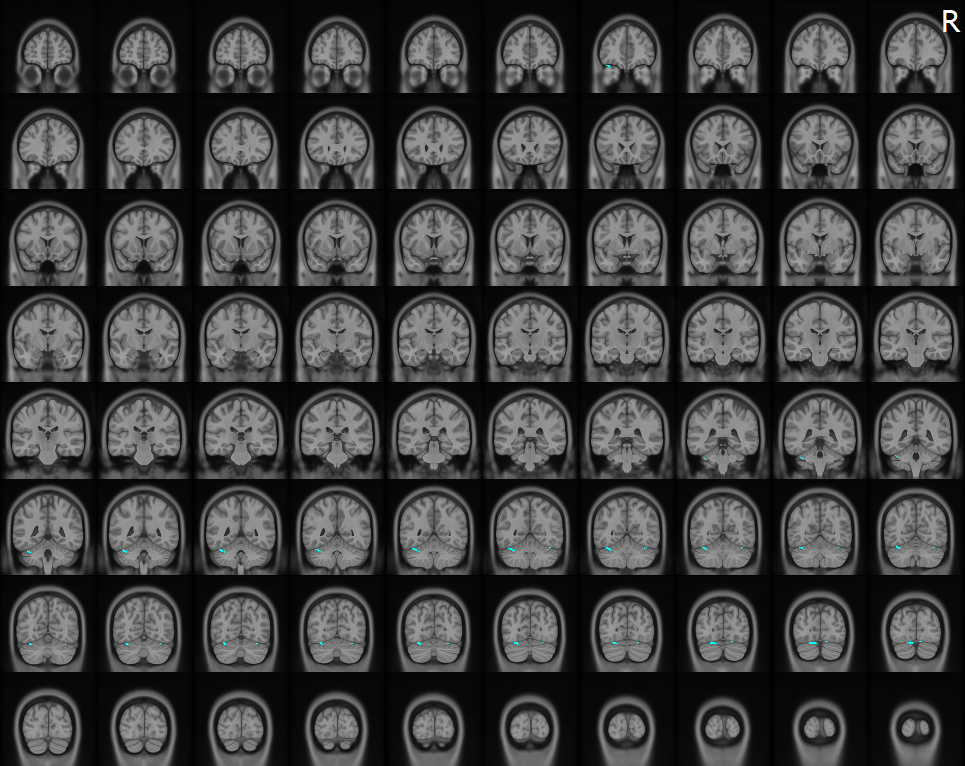{width=50%}

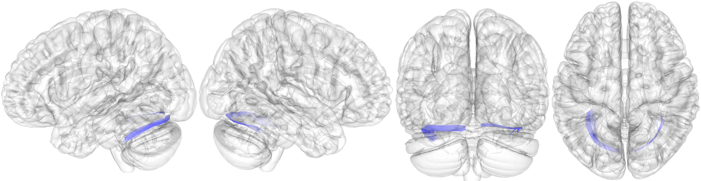

</center>
<br>

## {-}


## MD {.tabset}

There were no positive but there were negative correlations for tracts between MD and progesterone for women overall. The right fornix tracts was commonly displayed among women and all reproductive stage groups for negative correlation between MD and progesterone. Pres show both positive and negative correlation for the fornix tract. For peri and post, most tracts were associated with negative correlations. There were no positive correlations for posts, and the positive correlation for peri is negligible. 

### Women

<span style="color: #ff5500;"><font size="5"><bold> Positive Correlations (FDR =  1.000000) </span></font></bold>

No significant results in tracts.

<br>
<span style="color: #00ffff;"><font size="5"><bold> Negative Correlations (FDR = 0.000247) </span></font></bold>

```{r md_neg_progesterone_women}
#Women negative
df <- read_csv(here("data", "hormones", "progesterone", "md",
                    "md_neg_progesterone_women.csv")) %>% 
  clean_names() %>% 
  filter(tract_name %in% c("number of tracts","mean length(mm)",
                          "diameter(mm)", "volume(mm^3)")) %>% 
  rotate_df() %>% row_to_names(row_number = 1) %>% 
  rownames_to_column("tract_name") %>% 
  mutate(tract_name = to_any_case(tract_name,"upper_camel", sep_out = "_")) %>% 
  mutate_at(c(2:5), as.numeric) %>% 
  filter(`number of tracts` >= 10)

#Present table
df %>% 
  kable(col.names = c("Tract Name", "Number of Tracts", "Mean Length (mm)",
                      "Diameter (mm)", "Volume (mm^3)"),
        digits = 3,
        table.attr = "style='width:90%;'"
        ) %>% 
  kable_styling(bootstrap_options = "hover") %>% 
  scroll_box(width = "800px", height = "200px")
```

<br>
<font size="5"> Figures </font>

<center>
{width=50%}


</center>
<br>

### Pre

<span style="color: #ff5500;"><font size="5"><bold> Positive Correlations (FDR =  0.691176) </span></font></bold>

"No significant results in tracts."

```{r md_pos_progesterone_pre}
#Pre positive
df <- read_csv(here("data", "hormones", "progesterone", "md",
                    "md_pos_progesterone_pre.csv")) %>% 
  clean_names() %>% 
  filter(tract_name %in% c("number of tracts","mean length(mm)",
                          "diameter(mm)", "volume(mm^3)")) %>% 
  rotate_df() %>% row_to_names(row_number = 1) %>% 
  rownames_to_column("tract_name") %>% 
  mutate(tract_name = to_any_case(tract_name,"upper_camel", sep_out = "_")) %>% 
  mutate_at(c(2:5), as.numeric) %>% 
  filter(`number of tracts` >= 10)

#Present table
df %>% 
  kable(col.names = c("Tract Name", "Number of Tracts", "Mean Length (mm)",
                      "Diameter (mm)", "Volume (mm^3)"),
        digits = 3,
        table.attr = "style='width:90%;'"
        ) %>% 
  kable_styling(bootstrap_options = "hover") %>% 
  scroll_box(width = "800px", height = "200px")
```


<br>
<span style="color: #00ffff;"><font size="5"><bold> Negative Correlations (FDR = 0.091743) </span></font></bold>

```{r md_neg_progesterone_pre}
#Pre negative
df <- read_csv(here("data", "hormones", "progesterone", "md",
                    "md_neg_progesterone_pre.csv")) %>% 
  clean_names() %>% 
  filter(tract_name %in% c("number of tracts","mean length(mm)",
                          "diameter(mm)", "volume(mm^3)")) %>% 
  rotate_df() %>% row_to_names(row_number = 1) %>% 
  rownames_to_column("tract_name") %>% 
  mutate(tract_name = to_any_case(tract_name,"upper_camel", sep_out = "_")) %>% 
  mutate_at(c(2:5), as.numeric) %>% 
  filter(`number of tracts` >= 10)

#Present table
df %>% 
  kable(col.names = c("Tract Name", "Number of Tracts", "Mean Length (mm)",
                      "Diameter (mm)", "Volume (mm^3)"),
        digits = 3,
        table.attr = "style='width:90%;'"
        ) %>% 
  kable_styling(bootstrap_options = "hover") %>% 
  scroll_box(width = "800px", height = "200px")
```

<br>
<font size="5"> Figures </font>

<center>
{width=50%}


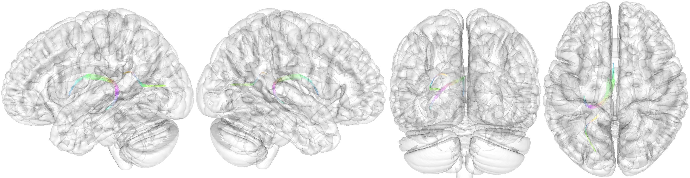

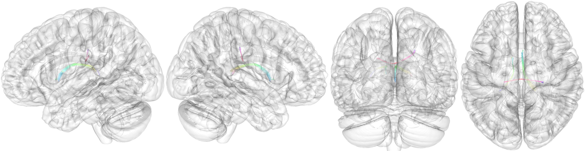

</center>
<br>

### Peri

<span style="color: #ff5500;"><font size="5"><bold> Positive Correlations (FDR =  0.100000) </span></font></bold>

All tracts were < 10.

```{r md_pos_progesterone_peri}
#Peri positive
df <- read_csv(here("data", "hormones", "progesterone", "md",
                    "md_pos_progesterone_peri.csv")) %>% 
  clean_names() %>% 
  filter(tract_name %in% c("number of tracts","mean length(mm)",
                          "diameter(mm)", "volume(mm^3)")) %>% 
  rotate_df() %>% row_to_names(row_number = 1) %>% 
  rownames_to_column("tract_name") %>% 
  mutate(tract_name = to_any_case(tract_name,"upper_camel", sep_out = "_")) %>% 
  mutate_at(c(2:5), as.numeric) #%>% filter(`number of tracts` >= 10)

#Present table
df %>% 
  kable(col.names = c("Tract Name", "Number of Tracts", "Mean Length (mm)",
                      "Diameter (mm)", "Volume (mm^3)"),
        digits = 3,
        table.attr = "style='width:90%;'"
        ) %>% 
  kable_styling(bootstrap_options = "hover") %>% 
  scroll_box(width = "800px", height = "200px")
```


<br>
<span style="color: #00ffff;"><font size="5"><bold> Negative Correlations (FDR = 0.000121) </span></font></bold>

```{r md_neg_progesterone_peri}
#Peri negative
df <- read_csv(here("data", "hormones", "progesterone", "md",
                    "md_neg_progesterone_peri.csv")) %>% 
  clean_names() %>% 
  filter(tract_name %in% c("number of tracts","mean length(mm)",
                          "diameter(mm)", "volume(mm^3)")) %>% 
  rotate_df() %>% row_to_names(row_number = 1) %>% 
  rownames_to_column("tract_name") %>% 
  mutate(tract_name = to_any_case(tract_name,"upper_camel", sep_out = "_")) %>% 
  mutate_at(c(2:5), as.numeric) %>% 
  filter(`number of tracts` >= 10)

#Present table
df %>% 
  kable(col.names = c("Tract Name", "Number of Tracts", "Mean Length (mm)",
                      "Diameter (mm)", "Volume (mm^3)"),
        digits = 3,
        table.attr = "style='width:90%;'"
        ) %>% 
  kable_styling(bootstrap_options = "hover") %>% 
  scroll_box(width = "800px", height = "200px")
```

<br>
<font size="5"> Figures </font>

<center>
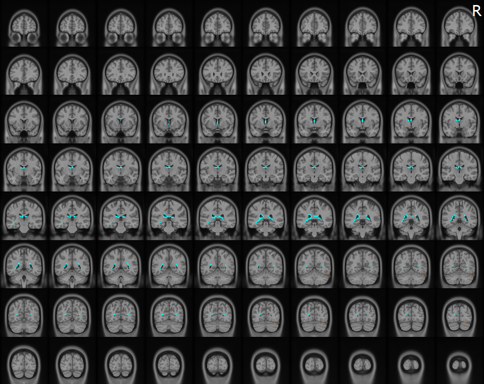{width=50%}

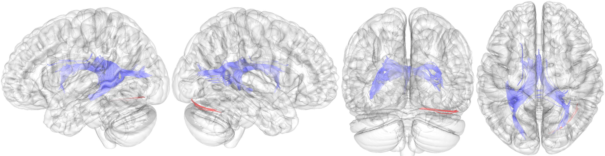

</center>
<br>

### Post

<span style="color: #ff5500;"><font size="5"><bold> Positive Correlations (FDR =  1.000000) </span></font></bold>

No significant results in tracts.

<br>
<span style="color: #00ffff;"><font size="5"><bold> Negative Correlations (FDR = 0.008364) </span></font></bold>

```{r md_neg_progesterone_post}
#Post negative
df <- read_csv(here("data", "hormones", "progesterone", "md",
                    "md_neg_progesterone_post.csv")) %>% 
  clean_names() %>% 
  filter(tract_name %in% c("number of tracts","mean length(mm)",
                          "diameter(mm)", "volume(mm^3)")) %>% 
  rotate_df() %>% row_to_names(row_number = 1) %>% 
  rownames_to_column("tract_name") %>% 
  mutate(tract_name = to_any_case(tract_name,"upper_camel", sep_out = "_")) %>% 
  mutate_at(c(2:5), as.numeric) %>% 
  filter(`number of tracts` >= 10)

#Present table
df %>% 
  kable(col.names = c("Tract Name", "Number of Tracts", "Mean Length (mm)",
                      "Diameter (mm)", "Volume (mm^3)"),
        digits = 3,
        table.attr = "style='width:90%;'"
        ) %>% 
  kable_styling(bootstrap_options = "hover") %>% 
  scroll_box(width = "800px", height = "200px")
```

<br>
<font size="5"> Figures </font>

<center>
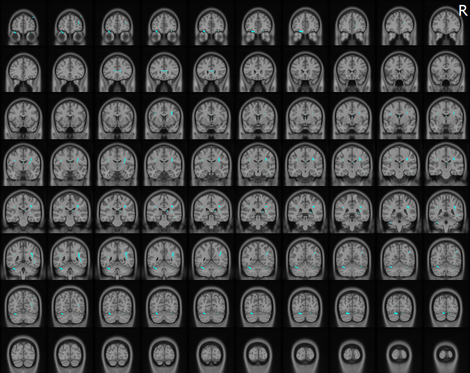{width=50%}

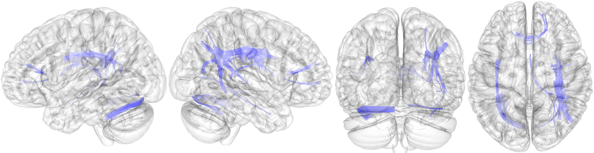

</center>
<br>

## {-}


## RD {.tabset}

Similar to MD, there were no positive but there were negative correlations for tracts between RD and progesterone for women overall. The right fornix tracts was commonly displayed among women and all reproductive stage groups for negative correlation between RD and progesterone. Pres show both positive and negative correlation for the fornix tract. For peri and post, most tracts were associated with negative correlations. There were no positive correlations for posts, and the positive correlation for peri is negligible. 


### Women

<span style="color: #ff5500;"><font size="5"><bold> Positive Correlations (FDR =  1.000000) </span></font></bold>

No significant results in tracts.

<br>
<span style="color: #00ffff;"><font size="5"><bold> Negative Correlations (FDR = 0.000285) </span></font></bold>

```{r rd_neg_progesterone_women}
#Women negative
df <- read_csv(here("data", "hormones", "progesterone", "rd",
                    "rd_neg_progesterone_women.csv")) %>% 
  clean_names() %>% 
  filter(tract_name %in% c("number of tracts","mean length(mm)",
                          "diameter(mm)", "volume(mm^3)")) %>% 
  rotate_df() %>% row_to_names(row_number = 1) %>% 
  rownames_to_column("tract_name") %>% 
  mutate(tract_name = to_any_case(tract_name,"upper_camel", sep_out = "_")) %>% 
  mutate_at(c(2:5), as.numeric) %>% 
  filter(`number of tracts` >= 10)

#Present table
df %>% 
  kable(col.names = c("Tract Name", "Number of Tracts", "Mean Length (mm)",
                      "Diameter (mm)", "Volume (mm^3)"),
        digits = 3,
        table.attr = "style='width:90%;'"
        ) %>% 
  kable_styling(bootstrap_options = "hover") %>% 
  scroll_box(width = "800px", height = "200px")
```

<br>
<font size="5"> Figures </font>

<center>
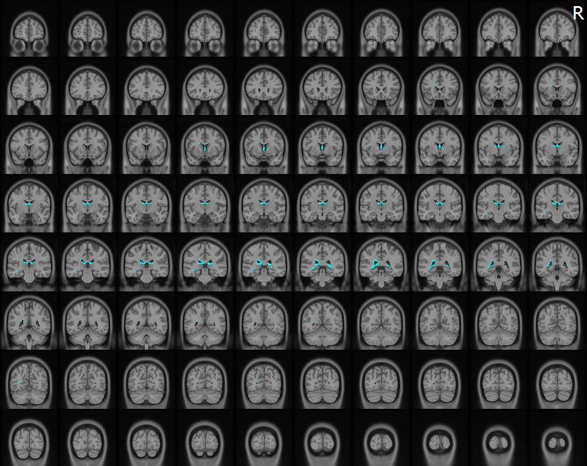{width=50%}

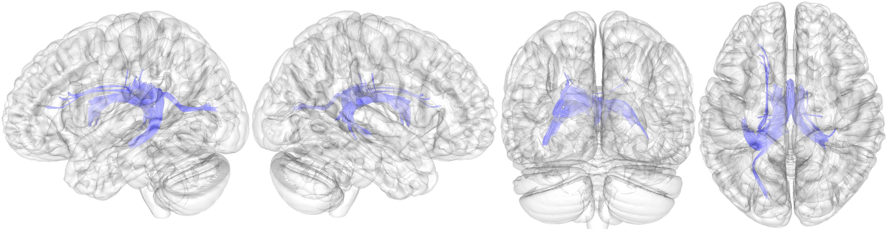

</center>
<br>

### Pre

<span style="color: #ff5500;"><font size="5"><bold> Positive Correlations (FDR =  0.340659) </span></font></bold>

"No significant results in tracts."

```{r rd_pos_progesterone_pre}
#Pre positive
df <- read_csv(here("data", "hormones", "progesterone", "rd",
                    "rd_pos_progesterone_pre.csv")) %>% 
  clean_names() %>% 
  filter(tract_name %in% c("number of tracts","mean length(mm)",
                          "diameter(mm)", "volume(mm^3)")) %>% 
  rotate_df() %>% row_to_names(row_number = 1) %>% 
  rownames_to_column("tract_name") %>% 
  mutate(tract_name = to_any_case(tract_name,"upper_camel", sep_out = "_")) %>% 
  mutate_at(c(2:5), as.numeric) %>% 
  filter(`number of tracts` >= 10)

#Present table
df %>% 
  kable(col.names = c("Tract Name", "Number of Tracts", "Mean Length (mm)",
                      "Diameter (mm)", "Volume (mm^3)"),
        digits = 3,
        table.attr = "style='width:90%;'"
        ) %>% 
  kable_styling(bootstrap_options = "hover") %>% 
  scroll_box(width = "800px", height = "200px")
```


<br>
<span style="color: #00ffff;"><font size="5"><bold> Negative Correlations (FDR = 0.532609) </span></font></bold>

"No significant results in tracts."

```{r rd_neg_progesterone_pre}
#Pre negative
df <- read_csv(here("data", "hormones", "progesterone", "rd",
                    "rd_neg_progesterone_pre.csv")) %>% 
  clean_names() %>% 
  filter(tract_name %in% c("number of tracts","mean length(mm)",
                          "diameter(mm)", "volume(mm^3)")) %>% 
  rotate_df() %>% row_to_names(row_number = 1) %>% 
  rownames_to_column("tract_name") %>% 
  mutate(tract_name = to_any_case(tract_name,"upper_camel", sep_out = "_")) %>% 
  mutate_at(c(2:5), as.numeric) %>% 
  filter(`number of tracts` >= 10)

#Present table
df %>% 
  kable(col.names = c("Tract Name", "Number of Tracts", "Mean Length (mm)",
                      "Diameter (mm)", "Volume (mm^3)"),
        digits = 3,
        table.attr = "style='width:90%;'"
        ) %>% 
  kable_styling(bootstrap_options = "hover") %>% 
  scroll_box(width = "800px", height = "200px")
```

<br>
<font size="5"> Figures </font>

<center>
{width=50%}

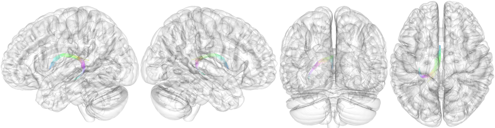

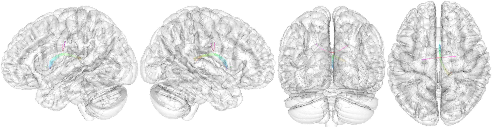

</center>
<br>

### Peri

<span style="color: #ff5500;"><font size="5"><bold> Positive Correlations (FDR =  0.200000) </span></font></bold>

All tracts were < 10.

```{r rd_pos_progesterone_peri}
#Peri positive
df <- read_csv(here("data", "hormones", "progesterone", "rd",
                    "rd_pos_progesterone_peri.csv")) %>% 
  clean_names() %>% 
  filter(tract_name %in% c("number of tracts","mean length(mm)",
                          "diameter(mm)", "volume(mm^3)")) %>% 
  rotate_df() %>% row_to_names(row_number = 1) %>% 
  rownames_to_column("tract_name") %>% 
  mutate(tract_name = to_any_case(tract_name,"upper_camel", sep_out = "_")) %>% 
  mutate_at(c(2:5), as.numeric) #%>% filter(`number of tracts` >= 10)

#Present table
df %>% 
  kable(col.names = c("Tract Name", "Number of Tracts", "Mean Length (mm)",
                      "Diameter (mm)", "Volume (mm^3)"),
        digits = 3,
        table.attr = "style='width:90%;'"
        ) %>% 
  kable_styling(bootstrap_options = "hover") %>% 
  scroll_box(width = "800px", height = "200px")
```


<br>
<span style="color: #00ffff;"><font size="5"><bold> Negative Correlations (FDR = 0.000147) </span></font></bold>

```{r rd_neg_progesterone_peri}
#Peri negative
df <- read_csv(here("data", "hormones", "progesterone", "rd",
                    "rd_neg_progesterone_peri.csv")) %>% 
  clean_names() %>% 
  filter(tract_name %in% c("number of tracts","mean length(mm)",
                          "diameter(mm)", "volume(mm^3)")) %>% 
  rotate_df() %>% row_to_names(row_number = 1) %>% 
  rownames_to_column("tract_name") %>% 
  mutate(tract_name = to_any_case(tract_name,"upper_camel", sep_out = "_")) %>% 
  mutate_at(c(2:5), as.numeric) %>% 
  filter(`number of tracts` >= 10)

#Present table
df %>% 
  kable(col.names = c("Tract Name", "Number of Tracts", "Mean Length (mm)",
                      "Diameter (mm)", "Volume (mm^3)"),
        digits = 3,
        table.attr = "style='width:90%;'"
        ) %>% 
  kable_styling(bootstrap_options = "hover") %>% 
  scroll_box(width = "800px", height = "200px")
```

<br>
<font size="5"> Figures </font>

<center>
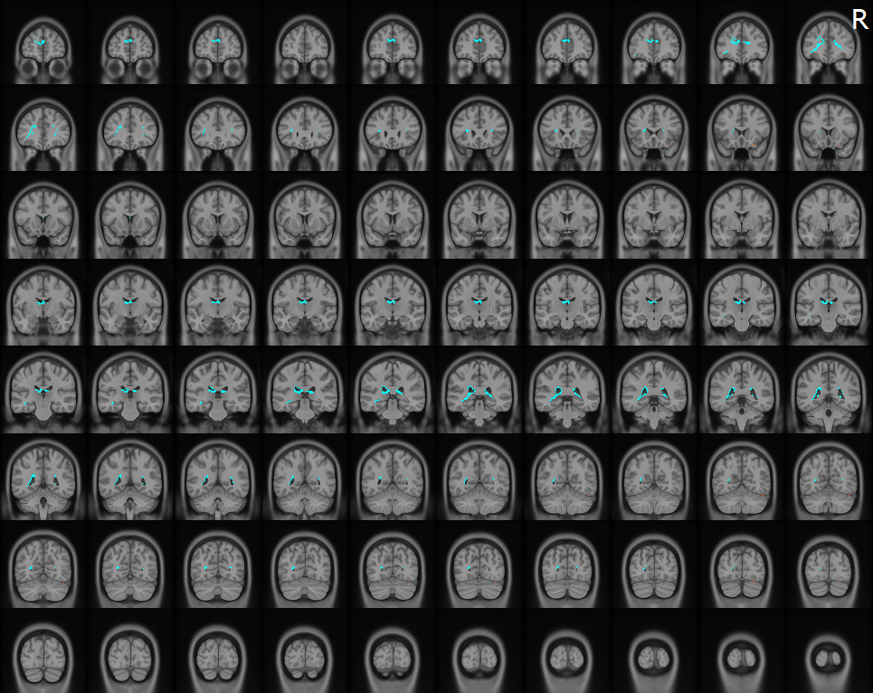{width=50%}


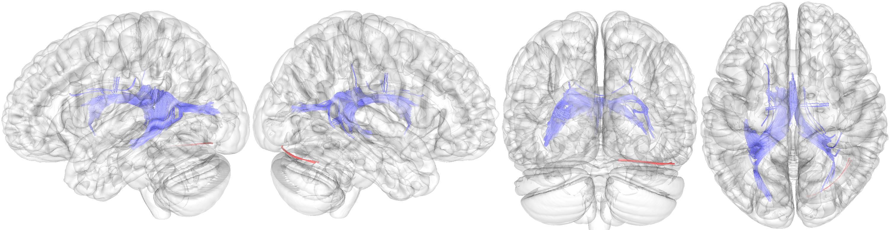

</center>
<br>

### Post

<span style="color: #ff5500;"><font size="5"><bold> Positive Correlations (FDR =  1.000000) </span></font></bold>

No significant results in tracts.

<br>
<span style="color: #00ffff;"><font size="5"><bold> Negative Correlations (FDR = 0.022101) </span></font></bold>

```{r rd_neg_progesterone_post}
#Post negative
df <- read_csv(here("data", "hormones", "progesterone", "rd",
                    "rd_neg_progesterone_post.csv")) %>% 
  clean_names() %>% 
  filter(tract_name %in% c("number of tracts","mean length(mm)",
                          "diameter(mm)", "volume(mm^3)")) %>% 
  rotate_df() %>% row_to_names(row_number = 1) %>% 
  rownames_to_column("tract_name") %>% 
  mutate(tract_name = to_any_case(tract_name,"upper_camel", sep_out = "_")) %>% 
  mutate_at(c(2:5), as.numeric) %>% 
  filter(`number of tracts` >= 10)

#Present table
df %>% 
  kable(col.names = c("Tract Name", "Number of Tracts", "Mean Length (mm)",
                      "Diameter (mm)", "Volume (mm^3)"),
        digits = 3,
        table.attr = "style='width:90%;'"
        ) %>% 
  kable_styling(bootstrap_options = "hover") %>% 
  scroll_box(width = "800px", height = "200px")
```

<br>
<font size="5"> Figures </font>

<center>
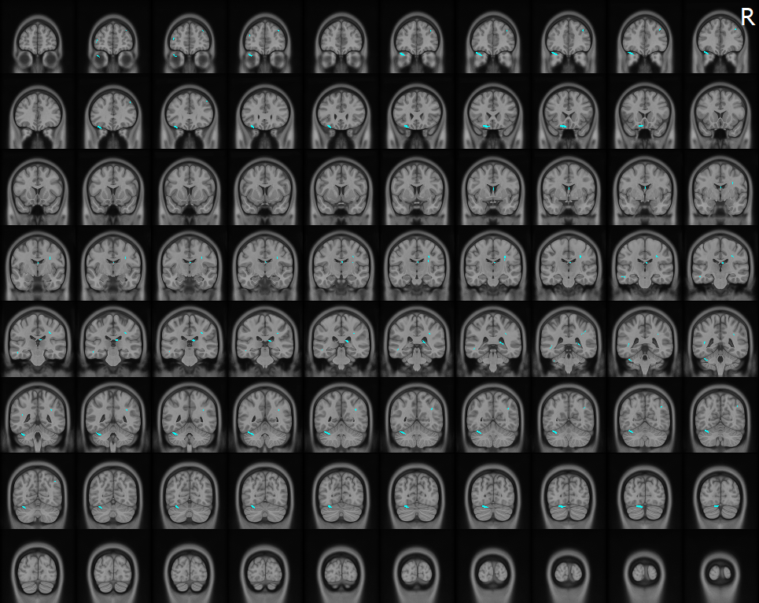{width=50%}


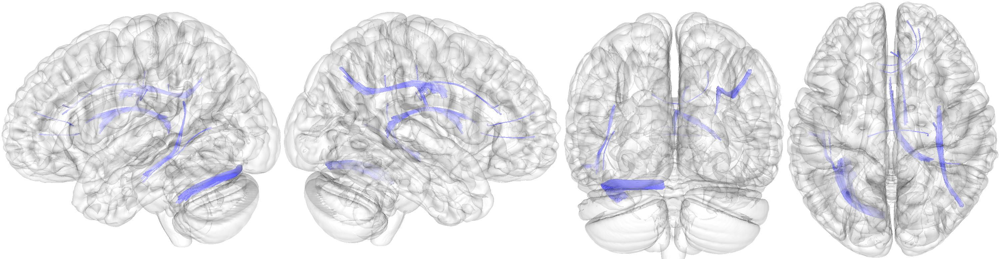

</center>
<br>

## {-}

# {-}

# FSH {.tabset .tabset-dropdown}

## QA {.tabset}

For all women, there were both significant tracts for positive and negative correlations with QA and FSH. The right cerebellum tract was commonly displayed for positive correlations for women and all reproductive stage groups. There were both significant tracts for positive and negative correlations with QA and FSH for pres and posts, but peris only have positive correlations. 

### Women

<span style="color: #ff5500;"><font size="5"><bold> Positive Correlations (FDR =  0.001907) </span></font></bold>

```{r qa_pos_fsh_women}
#Women positive
df <- read_csv(here("data", "hormones", "fsh", "qa",
                    "qa_pos_fsh_women.csv")) %>% 
  clean_names() %>% 
  filter(tract_name %in% c("number of tracts","mean length(mm)",
                          "diameter(mm)", "volume(mm^3)")) %>% 
  rotate_df() %>% row_to_names(row_number = 1) %>% 
  rownames_to_column("tract_name") %>% 
  mutate(tract_name = to_any_case(tract_name,"upper_camel", sep_out = "_")) %>% 
  mutate_at(c(2:5), as.numeric) %>% filter(`number of tracts` >= 10)

#Present table
df %>% 
  kable(col.names = c("Tract Name", "Number of Tracts", "Mean Length (mm)",
                      "Diameter (mm)", "Volume (mm^3)"),
        digits = 3,
        table.attr = "style='width:90%;'"
        ) %>% 
  kable_styling(bootstrap_options = "hover") %>% 
  scroll_box(width = "800px", height = "200px")
```


<br>
<span style="color: #00ffff;"><font size="5"><bold> Negative Correlations (FDR = 0.003986) </span></font></bold>


```{r qa_neg_fsh_women}
#Women negative
df <- read_csv(here("data", "hormones", "fsh", "qa",
                    "qa_neg_fsh_women.csv")) %>% 
  clean_names() %>% 
  filter(tract_name %in% c("number of tracts","mean length(mm)",
                          "diameter(mm)", "volume(mm^3)")) %>% 
  rotate_df() %>% row_to_names(row_number = 1) %>% 
  rownames_to_column("tract_name") %>% 
  mutate(tract_name = to_any_case(tract_name,"upper_camel", sep_out = "_")) %>% 
  mutate_at(c(2:5), as.numeric) %>% 
  filter(`number of tracts` >= 10)

#Present table
df %>% 
  kable(col.names = c("Tract Name", "Number of Tracts", "Mean Length (mm)",
                      "Diameter (mm)", "Volume (mm^3)"),
        digits = 3,
        table.attr = "style='width:90%;'"
        ) %>% 
  kable_styling(bootstrap_options = "hover") %>% 
  scroll_box(width = "800px", height = "200px")
```

<br>
<font size="5"> Figures </font>

<center>
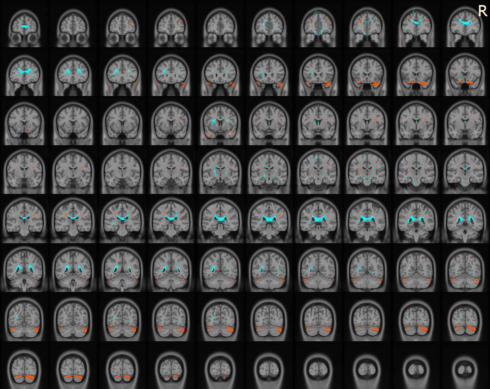{width=50%}

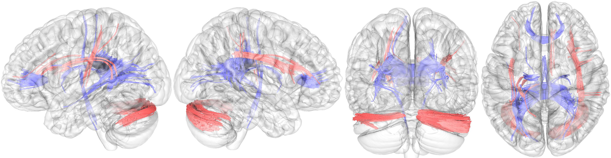

</center>
<br>


### Pre

<span style="color: #ff5500;"><font size="5"><bold> Positive Correlations (FDR =  0.000179) </span></font></bold>

```{r qa_pos_fsh_pre}
#Pre positive
df <- read_csv(here("data", "hormones", "fsh", "qa",
                    "qa_pos_fsh_pre.csv")) %>% 
  clean_names() %>% 
  filter(tract_name %in% c("number of tracts","mean length(mm)",
                          "diameter(mm)", "volume(mm^3)")) %>% 
  rotate_df() %>% row_to_names(row_number = 1) %>% 
  rownames_to_column("tract_name") %>% 
  mutate(tract_name = to_any_case(tract_name,"upper_camel", sep_out = "_")) %>% 
  mutate_at(c(2:5), as.numeric) %>% filter(`number of tracts` >= 10)

#Present table
df %>% 
  kable(col.names = c("Tract Name", "Number of Tracts", "Mean Length (mm)",
                      "Diameter (mm)", "Volume (mm^3)"),
        digits = 3,
        table.attr = "style='width:90%;'"
        ) %>% 
  kable_styling(bootstrap_options = "hover") %>% 
  scroll_box(width = "800px", height = "200px")
```


<br>
<span style="color: #00ffff;"><font size="5"><bold> Negative Correlations (FDR = 0.001314) </span></font></bold>


```{r qa_neg_fsh_pre}
#Pre negative
df <- read_csv(here("data", "hormones", "fsh", "qa",
                    "qa_neg_fsh_pre.csv")) %>% 
  clean_names() %>% 
  filter(tract_name %in% c("number of tracts","mean length(mm)",
                          "diameter(mm)", "volume(mm^3)")) %>% 
  rotate_df() %>% row_to_names(row_number = 1) %>% 
  rownames_to_column("tract_name") %>% 
  mutate(tract_name = to_any_case(tract_name,"upper_camel", sep_out = "_")) %>% 
  mutate_at(c(2:5), as.numeric) %>% 
  filter(`number of tracts` >= 10)

#Present table
df %>% 
  kable(col.names = c("Tract Name", "Number of Tracts", "Mean Length (mm)",
                      "Diameter (mm)", "Volume (mm^3)"),
        digits = 3,
        table.attr = "style='width:90%;'"
        ) %>% 
  kable_styling(bootstrap_options = "hover") %>% 
  scroll_box(width = "800px", height = "200px")
```

<br>
<font size="5"> Figures </font>

<center>
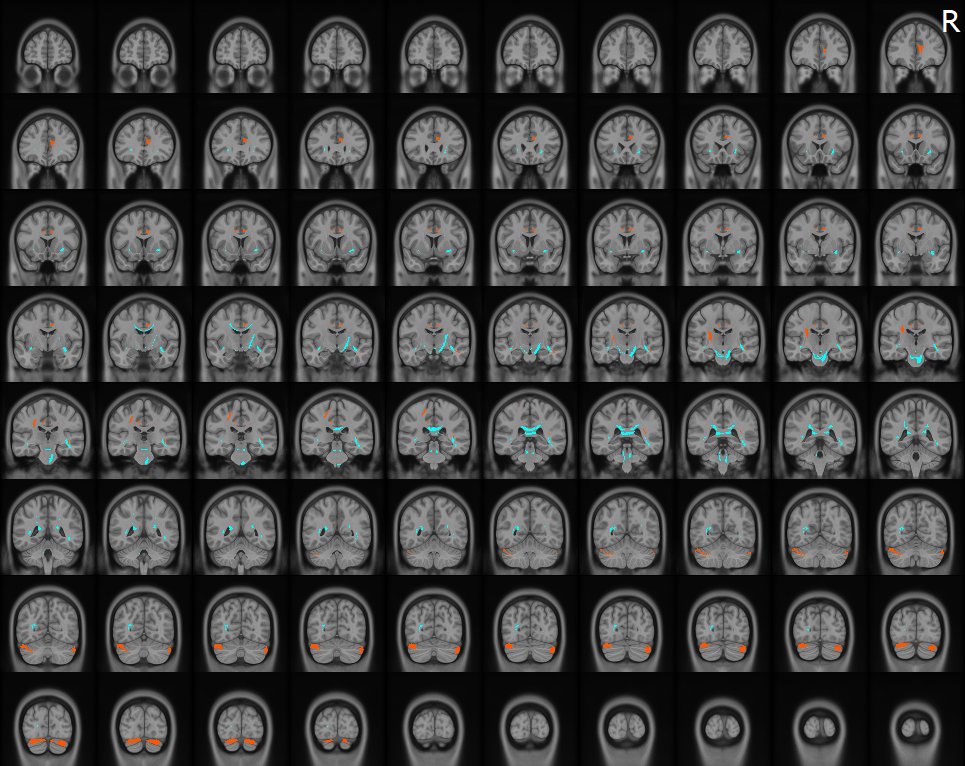{width=50%}

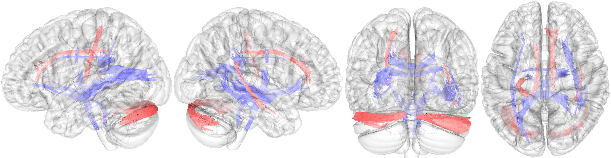

</center>
<br>

### Peri

<span style="color: #ff5500;"><font size="5"><bold> Positive Correlations (FDR =  0.000242) </span></font></bold>

```{r qa_pos_fsh_peri}
#Peri positive
df <- read_csv(here("data", "hormones", "fsh", "qa",
                    "qa_pos_fsh_peri.csv")) %>% 
  clean_names() %>% 
  filter(tract_name %in% c("number of tracts","mean length(mm)",
                          "diameter(mm)", "volume(mm^3)")) %>% 
  rotate_df() %>% row_to_names(row_number = 1) %>% 
  rownames_to_column("tract_name") %>% 
  mutate(tract_name = to_any_case(tract_name,"upper_camel", sep_out = "_")) %>% 
  mutate_at(c(2:5), as.numeric) %>% filter(`number of tracts` >= 10)

#Present table
df %>% 
  kable(col.names = c("Tract Name", "Number of Tracts", "Mean Length (mm)",
                      "Diameter (mm)", "Volume (mm^3)"),
        digits = 3,
        table.attr = "style='width:90%;'"
        ) %>% 
  kable_styling(bootstrap_options = "hover") %>% 
  scroll_box(width = "800px", height = "200px")
```


<br>
<span style="color: #00ffff;"><font size="5"><bold> Negative Correlations (FDR = 1.000000) </span></font></bold>

No significant results in tracts.

<br>
<font size="5"> Figures </font>

<center>
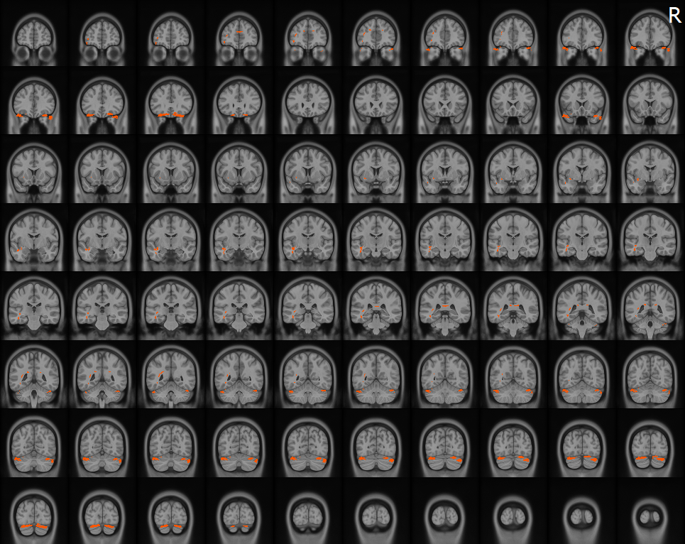{width=50%}

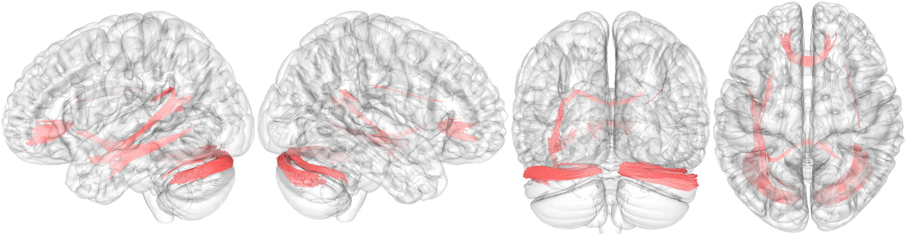

</center>
<br>

### Post

<span style="color: #ff5500;"><font size="5"><bold> Positive Correlations (FDR =  0.003623) </span></font></bold>

```{r qa_pos_fsh_post}
#Post positive
df <- read_csv(here("data", "hormones", "fsh", "qa",
                    "qa_pos_fsh_post.csv")) %>% 
  clean_names() %>% 
  filter(tract_name %in% c("number of tracts","mean length(mm)",
                          "diameter(mm)", "volume(mm^3)")) %>% 
  rotate_df() %>% row_to_names(row_number = 1) %>% 
  rownames_to_column("tract_name") %>% 
  mutate(tract_name = to_any_case(tract_name,"upper_camel", sep_out = "_")) %>% 
  mutate_at(c(2:5), as.numeric) %>% filter(`number of tracts` >= 10)

#Present table
df %>% 
  kable(col.names = c("Tract Name", "Number of Tracts", "Mean Length (mm)",
                      "Diameter (mm)", "Volume (mm^3)"),
        digits = 3,
        table.attr = "style='width:90%;'"
        ) %>% 
  kable_styling(bootstrap_options = "hover") %>% 
  scroll_box(width = "800px", height = "200px")
```


<br>
<span style="color: #00ffff;"><font size="5"><bold> Negative Correlations (FDR = 0.000531) </span></font></bold>


```{r qa_neg_fsh_post}
#Post negative
df <- read_csv(here("data", "hormones", "fsh", "qa",
                    "qa_neg_fsh_post.csv")) %>% 
  clean_names() %>% 
  filter(tract_name %in% c("number of tracts","mean length(mm)",
                          "diameter(mm)", "volume(mm^3)")) %>% 
  rotate_df() %>% row_to_names(row_number = 1) %>% 
  rownames_to_column("tract_name") %>% 
  mutate(tract_name = to_any_case(tract_name,"upper_camel", sep_out = "_")) %>% 
  mutate_at(c(2:5), as.numeric) %>% filter(`number of tracts` >= 10)

#Present table
df %>% 
  kable(col.names = c("Tract Name", "Number of Tracts", "Mean Length (mm)",
                      "Diameter (mm)", "Volume (mm^3)"),
        digits = 3,
        table.attr = "style='width:90%;'"
        ) %>% 
  kable_styling(bootstrap_options = "hover") %>% 
  scroll_box(width = "800px", height = "200px")
```


<br>
<font size="5"> Figures </font>

<center>
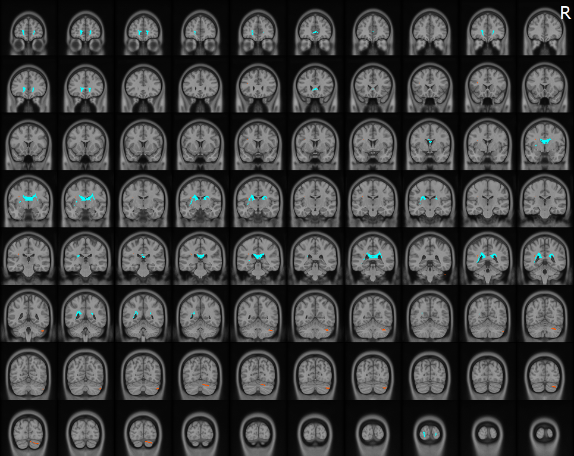{width=50%}


</center>
<br>

## {-}

## AD {.tabset}

For women and all reproductive groups, the left fornix tract was commonly displayed as a significant result for positive correlations between AD and FSH. There were more tracts with positive correlations than negative correlations for women. For pres, there were only tracts with positive correlations. Peris and posts have both positive and negative correlations.

### Women

<span style="color: #ff5500;"><font size="5"><bold> Positive Correlations (FDR =  0.017158) </span></font></bold>

```{r ad_pos_fsh_women}
#Women positive
df <- read_csv(here("data", "hormones", "fsh", "ad",
                    "ad_pos_fsh_women.csv")) %>% 
  clean_names() %>% 
  filter(tract_name %in% c("number of tracts","mean length(mm)",
                          "diameter(mm)", "volume(mm^3)")) %>% 
  rotate_df() %>% row_to_names(row_number = 1) %>% 
  rownames_to_column("tract_name") %>% 
  mutate(tract_name = to_any_case(tract_name,"upper_camel", sep_out = "_")) %>% 
  mutate_at(c(2:5), as.numeric) %>% filter(`number of tracts` >= 10)

#Present table
df %>% 
  kable(col.names = c("Tract Name", "Number of Tracts", "Mean Length (mm)",
                      "Diameter (mm)", "Volume (mm^3)"),
        digits = 3,
        table.attr = "style='width:90%;'"
        ) %>% 
  kable_styling(bootstrap_options = "hover") %>% 
  scroll_box(width = "800px", height = "200px")
```


<br>
<span style="color: #00ffff;"><font size="5"><bold> Negative Correlations (FDR = 0.063565) </span></font></bold>


```{r ad_neg_fsh_women}
#Women negative
df <- read_csv(here("data", "hormones", "fsh", "ad",
                    "ad_neg_fsh_women.csv")) %>% 
  clean_names() %>% 
  filter(tract_name %in% c("number of tracts","mean length(mm)",
                          "diameter(mm)", "volume(mm^3)")) %>% 
  rotate_df() %>% row_to_names(row_number = 1) %>% 
  rownames_to_column("tract_name") %>% 
  mutate(tract_name = to_any_case(tract_name,"upper_camel", sep_out = "_")) %>% 
  mutate_at(c(2:5), as.numeric) %>% 
  filter(`number of tracts` >= 10)

#Present table
df %>% 
  kable(col.names = c("Tract Name", "Number of Tracts", "Mean Length (mm)",
                      "Diameter (mm)", "Volume (mm^3)"),
        digits = 3,
        table.attr = "style='width:90%;'"
        ) %>% 
  kable_styling(bootstrap_options = "hover") %>% 
  scroll_box(width = "800px", height = "200px")
```

<br>
<font size="5"> Figures </font>

<center>
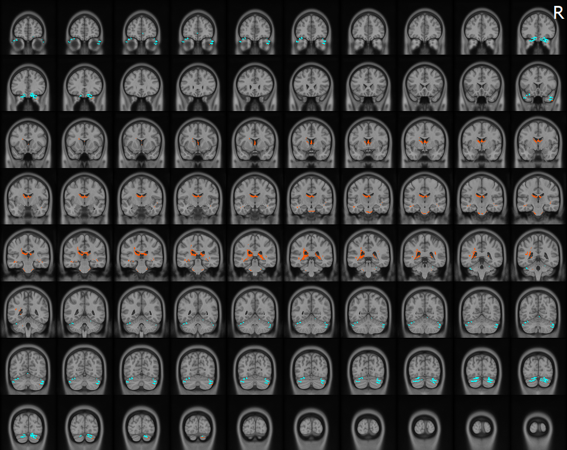{width=50%}

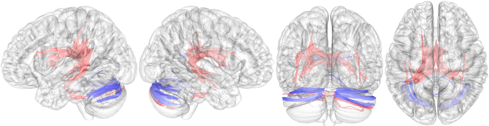

</center>
<br>

### Pre

<span style="color: #ff5500;"><font size="5"><bold> Positive Correlations (FDR =  0.000488) </span></font></bold>

```{r ad_pos_fsh_pre}
#Pre positive
df <- read_csv(here("data", "hormones", "fsh", "ad",
                    "ad_pos_fsh_pre.csv")) %>% 
  clean_names() %>% 
  filter(tract_name %in% c("number of tracts","mean length(mm)",
                          "diameter(mm)", "volume(mm^3)")) %>% 
  rotate_df() %>% row_to_names(row_number = 1) %>% 
  rownames_to_column("tract_name") %>% 
  mutate(tract_name = to_any_case(tract_name,"upper_camel", sep_out = "_")) %>% 
  mutate_at(c(2:5), as.numeric) %>% filter(`number of tracts` >= 10)

#Present table
df %>% 
  kable(col.names = c("Tract Name", "Number of Tracts", "Mean Length (mm)",
                      "Diameter (mm)", "Volume (mm^3)"),
        digits = 3,
        table.attr = "style='width:90%;'"
        ) %>% 
  kable_styling(bootstrap_options = "hover") %>% 
  scroll_box(width = "800px", height = "200px")
```


<br>
<span style="color: #00ffff;"><font size="5"><bold> Negative Correlations (FDR = 1.000000) </span></font></bold>

No significant results in tracts.

<br>
<font size="5"> Figures </font>

<center>
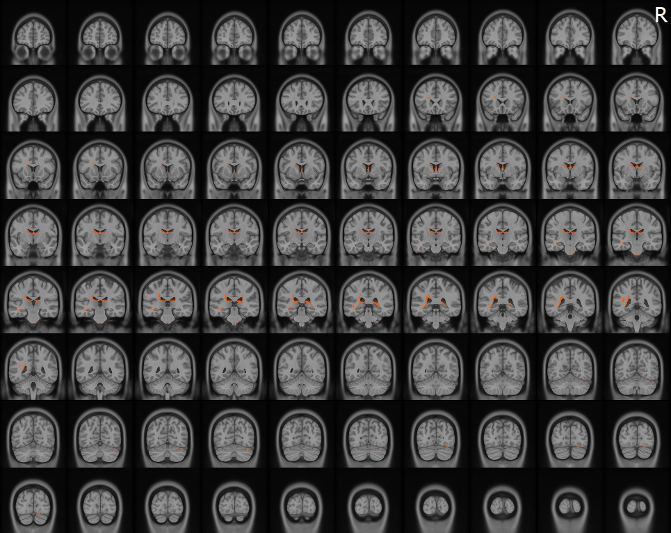{width=50%}

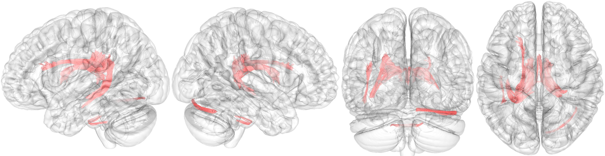

</center>
<br>

### Peri

<span style="color: #ff5500;"><font size="5"><bold> Positive Correlations (FDR =  0.001247) </span></font></bold>

```{r ad_pos_fsh_peri}
#Peri positive
df <- read_csv(here("data", "hormones", "fsh", "ad",
                    "ad_pos_fsh_peri.csv")) %>% 
  clean_names() %>% 
  filter(tract_name %in% c("number of tracts","mean length(mm)",
                          "diameter(mm)", "volume(mm^3)")) %>% 
  rotate_df() %>% row_to_names(row_number = 1) %>% 
  rownames_to_column("tract_name") %>% 
  mutate(tract_name = to_any_case(tract_name,"upper_camel", sep_out = "_")) %>% 
  mutate_at(c(2:5), as.numeric) %>% filter(`number of tracts` >= 10)

#Present table
df %>% 
  kable(col.names = c("Tract Name", "Number of Tracts", "Mean Length (mm)",
                      "Diameter (mm)", "Volume (mm^3)"),
        digits = 3,
        table.attr = "style='width:90%;'"
        ) %>% 
  kable_styling(bootstrap_options = "hover") %>% 
  scroll_box(width = "800px", height = "200px")
```


<br>
<span style="color: #00ffff;"><font size="5"><bold> Negative Correlations (FDR = 0.013068) </span></font></bold>


```{r ad_neg_fsh_peri}
#Peri negative
df <- read_csv(here("data", "hormones", "fsh", "ad",
                    "ad_neg_fsh_peri.csv")) %>% 
  clean_names() %>% 
  filter(tract_name %in% c("number of tracts","mean length(mm)",
                          "diameter(mm)", "volume(mm^3)")) %>% 
  rotate_df() %>% row_to_names(row_number = 1) %>% 
  rownames_to_column("tract_name") %>% 
  mutate(tract_name = to_any_case(tract_name,"upper_camel", sep_out = "_")) %>% 
  mutate_at(c(2:5), as.numeric) %>% filter(`number of tracts` >= 10)

#Present table
df %>% 
  kable(col.names = c("Tract Name", "Number of Tracts", "Mean Length (mm)",
                      "Diameter (mm)", "Volume (mm^3)"),
        digits = 3,
        table.attr = "style='width:90%;'"
        ) %>% 
  kable_styling(bootstrap_options = "hover") %>% 
  scroll_box(width = "800px", height = "200px")
```


<br>
<font size="5"> Figures </font>

<center>
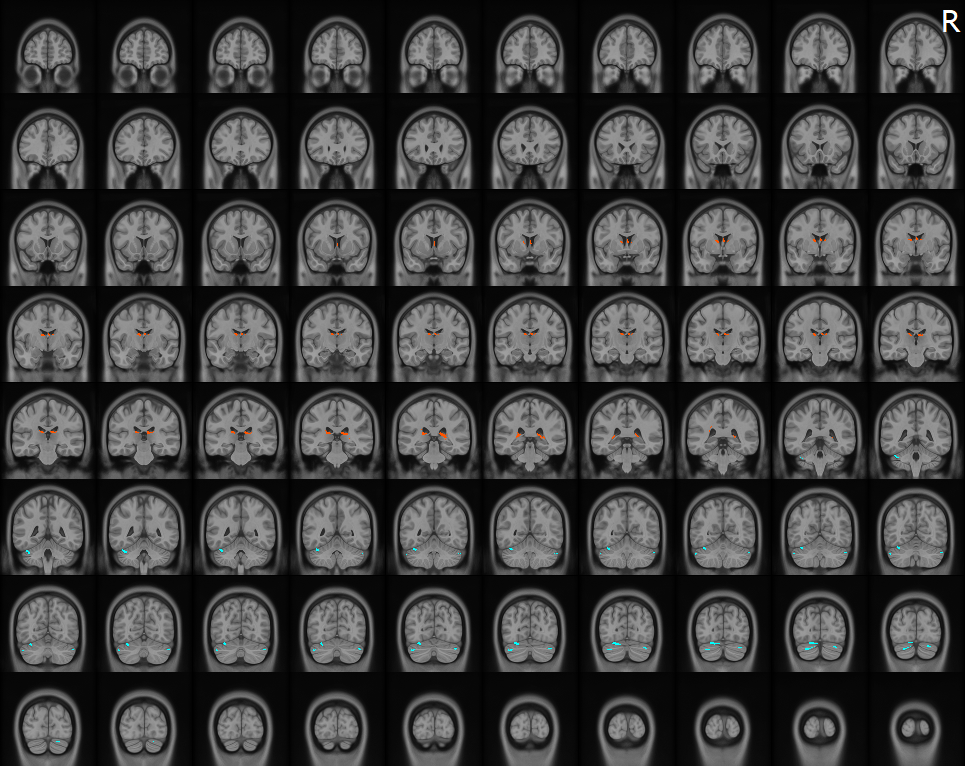{width=50%}


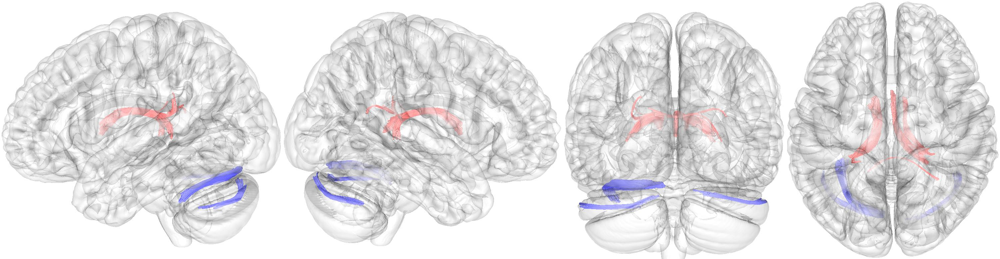

</center>
<br>

### Post

<span style="color: #ff5500;"><font size="5"><bold> Positive Correlations (FDR =  0.002841) </span></font></bold>

```{r ad_pos_fsh_post}
#Post positive
df <- read_csv(here("data", "hormones", "fsh", "ad",
                    "ad_pos_fsh_post.csv")) %>% 
  clean_names() %>% 
  filter(tract_name %in% c("number of tracts","mean length(mm)",
                          "diameter(mm)", "volume(mm^3)")) %>% 
  rotate_df() %>% row_to_names(row_number = 1) %>% 
  rownames_to_column("tract_name") %>% 
  mutate(tract_name = to_any_case(tract_name,"upper_camel", sep_out = "_")) %>% 
  mutate_at(c(2:5), as.numeric) %>% filter(`number of tracts` >= 10)

#Present table
df %>% 
  kable(col.names = c("Tract Name", "Number of Tracts", "Mean Length (mm)",
                      "Diameter (mm)", "Volume (mm^3)"),
        digits = 3,
        table.attr = "style='width:90%;'"
        ) %>% 
  kable_styling(bootstrap_options = "hover") %>% 
  scroll_box(width = "800px", height = "200px")
```


<br>
<span style="color: #00ffff;"><font size="5"><bold> Negative Correlations (FDR = 0.114572) </span></font></bold>


```{r ad_neg_fsh_post}
#Post negative
df <- read_csv(here("data", "hormones", "fsh", "ad",
                    "ad_neg_fsh_post.csv")) %>% 
  clean_names() %>% 
  filter(tract_name %in% c("number of tracts","mean length(mm)",
                          "diameter(mm)", "volume(mm^3)")) %>% 
  rotate_df() %>% row_to_names(row_number = 1) %>% 
  rownames_to_column("tract_name") %>% 
  mutate(tract_name = to_any_case(tract_name,"upper_camel", sep_out = "_")) %>% 
  mutate_at(c(2:5), as.numeric) %>% filter(`number of tracts` >= 10)

#Present table
df %>% 
  kable(col.names = c("Tract Name", "Number of Tracts", "Mean Length (mm)",
                      "Diameter (mm)", "Volume (mm^3)"),
        digits = 3,
        table.attr = "style='width:90%;'"
        ) %>% 
  kable_styling(bootstrap_options = "hover") %>% 
  scroll_box(width = "800px", height = "200px")
```


<br>
<font size="5"> Figures </font>

<center>
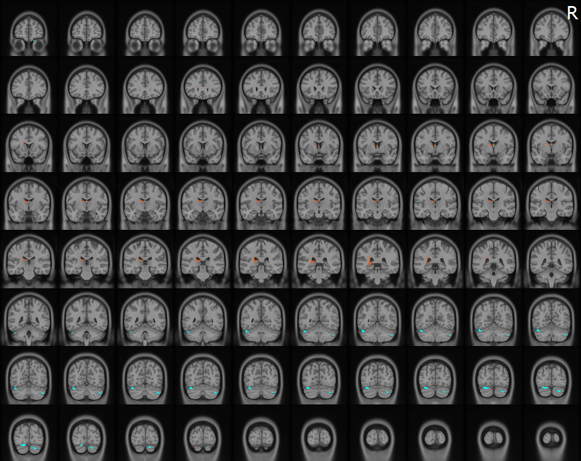{width=50%}


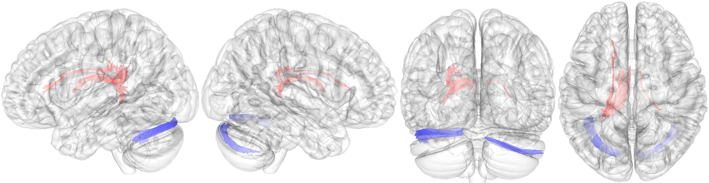

</center>
<br>

## {-}


## MD {.tabset}

The left and right fornix tracts were commonly displayed as significant for women and all reproductive stage groups for positive correlations with MD adn FSH. Women have more significant tracts with positive correlations than negative correlations. Pres have positive but no negative correlations. Both peris and posts have tracts with more positive than negative correlations with MD and FSH.

### Women

<span style="color: #ff5500;"><font size="5"><bold> Positive Correlations (FDR =  0.024803) </span></font></bold>

```{r md_pos_fsh_women}
#Women positive
df <- read_csv(here("data", "hormones", "fsh", "md",
                    "md_pos_fsh_women.csv")) %>% 
  clean_names() %>% 
  filter(tract_name %in% c("number of tracts","mean length(mm)",
                          "diameter(mm)", "volume(mm^3)")) %>% 
  rotate_df() %>% row_to_names(row_number = 1) %>% 
  rownames_to_column("tract_name") %>% 
  mutate(tract_name = to_any_case(tract_name,"upper_camel", sep_out = "_")) %>% 
  mutate_at(c(2:5), as.numeric) %>% filter(`number of tracts` >= 10)

#Present table
df %>% 
  kable(col.names = c("Tract Name", "Number of Tracts", "Mean Length (mm)",
                      "Diameter (mm)", "Volume (mm^3)"),
        digits = 3,
        table.attr = "style='width:90%;'"
        ) %>% 
  kable_styling(bootstrap_options = "hover") %>% 
  scroll_box(width = "800px", height = "200px")
```


<br>
<span style="color: #00ffff;"><font size="5"><bold> Negative Correlations (FDR = 0.194757) </span></font></bold>


```{r md_neg_fsh_women}
#Women negative
df <- read_csv(here("data", "hormones", "fsh", "md",
                    "md_neg_fsh_women.csv")) %>% 
  clean_names() %>% 
  filter(tract_name %in% c("number of tracts","mean length(mm)",
                          "diameter(mm)", "volume(mm^3)")) %>% 
  rotate_df() %>% row_to_names(row_number = 1) %>% 
  rownames_to_column("tract_name") %>% 
  mutate(tract_name = to_any_case(tract_name,"upper_camel", sep_out = "_")) %>% 
  mutate_at(c(2:5), as.numeric) %>% 
  filter(`number of tracts` >= 10)

#Present table
df %>% 
  kable(col.names = c("Tract Name", "Number of Tracts", "Mean Length (mm)",
                      "Diameter (mm)", "Volume (mm^3)"),
        digits = 3,
        table.attr = "style='width:90%;'"
        ) %>% 
  kable_styling(bootstrap_options = "hover") %>% 
  scroll_box(width = "800px", height = "200px")
```

<br>
<font size="5"> Figures </font>

<center>
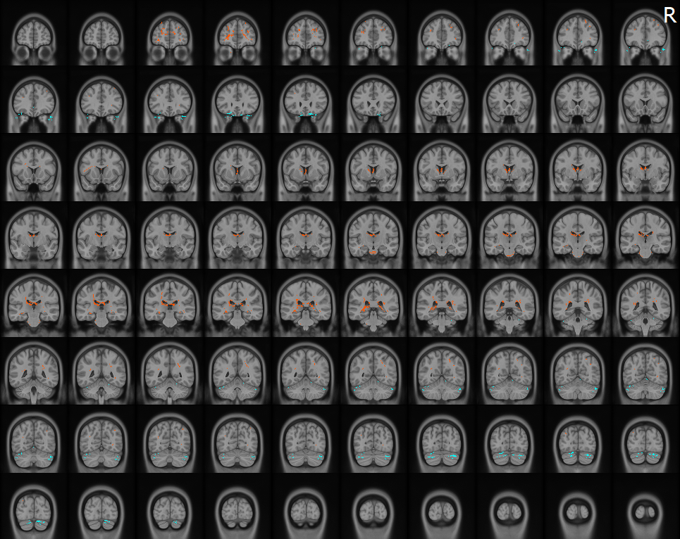{width=50%}

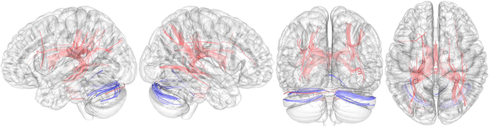

</center>
<br>

### Pre

<span style="color: #ff5500;"><font size="5"><bold> Positive Correlations (FDR =  0.012198) </span></font></bold>

```{r md_pos_fsh_pre}
#Pre positive
df <- read_csv(here("data", "hormones", "fsh", "md",
                    "md_pos_fsh_pre.csv")) %>% 
  clean_names() %>% 
  filter(tract_name %in% c("number of tracts","mean length(mm)",
                          "diameter(mm)", "volume(mm^3)")) %>% 
  rotate_df() %>% row_to_names(row_number = 1) %>% 
  rownames_to_column("tract_name") %>% 
  mutate(tract_name = to_any_case(tract_name,"upper_camel", sep_out = "_")) %>% 
  mutate_at(c(2:5), as.numeric) %>% filter(`number of tracts` >= 10)

#Present table
df %>% 
  kable(col.names = c("Tract Name", "Number of Tracts", "Mean Length (mm)",
                      "Diameter (mm)", "Volume (mm^3)"),
        digits = 3,
        table.attr = "style='width:90%;'"
        ) %>% 
  kable_styling(bootstrap_options = "hover") %>% 
  scroll_box(width = "800px", height = "200px")
```


<br>
<span style="color: #00ffff;"><font size="5"><bold> Negative Correlations (FDR = 1.000000) </span></font></bold>

No significant results in tracts.

<br>
<font size="5"> Figures </font>

<center>
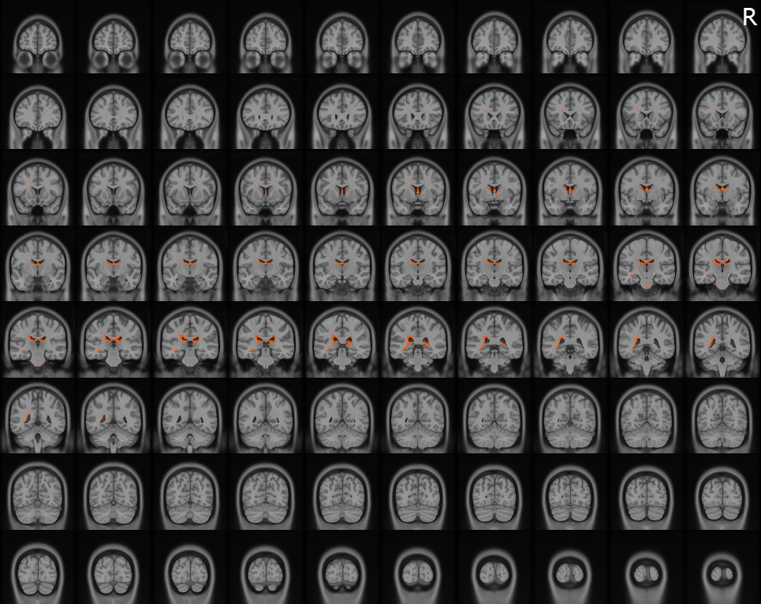{width=50%}

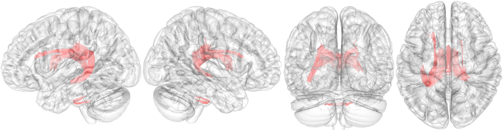

</center>
<br>

### Peri

<span style="color: #ff5500;"><font size="5"><bold> Positive Correlations (FDR =  0.035967) </span></font></bold>

```{r md_pos_fsh_peri}
#Peri positive
df <- read_csv(here("data", "hormones", "fsh", "md",
                    "md_pos_fsh_peri.csv")) %>% 
  clean_names() %>% 
  filter(tract_name %in% c("number of tracts","mean length(mm)",
                          "diameter(mm)", "volume(mm^3)")) %>% 
  rotate_df() %>% row_to_names(row_number = 1) %>% 
  rownames_to_column("tract_name") %>% 
  mutate(tract_name = to_any_case(tract_name,"upper_camel", sep_out = "_")) %>% 
  mutate_at(c(2:5), as.numeric) %>% filter(`number of tracts` >= 10)

#Present table
df %>% 
  kable(col.names = c("Tract Name", "Number of Tracts", "Mean Length (mm)",
                      "Diameter (mm)", "Volume (mm^3)"),
        digits = 3,
        table.attr = "style='width:90%;'"
        ) %>% 
  kable_styling(bootstrap_options = "hover") %>% 
  scroll_box(width = "800px", height = "200px")
```


<br>
<span style="color: #00ffff;"><font size="5"><bold> Negative Correlations (FDR = 0.012890) </span></font></bold>


```{r md_neg_fsh_peri}
#Peri negative
df <- read_csv(here("data", "hormones", "fsh", "md",
                    "md_neg_fsh_peri.csv")) %>% 
  clean_names() %>% 
  filter(tract_name %in% c("number of tracts","mean length(mm)",
                          "diameter(mm)", "volume(mm^3)")) %>% 
  rotate_df() %>% row_to_names(row_number = 1) %>% 
  rownames_to_column("tract_name") %>% 
  mutate(tract_name = to_any_case(tract_name,"upper_camel", sep_out = "_")) %>% 
  mutate_at(c(2:5), as.numeric) %>% filter(`number of tracts` >= 10)

#Present table
df %>% 
  kable(col.names = c("Tract Name", "Number of Tracts", "Mean Length (mm)",
                      "Diameter (mm)", "Volume (mm^3)"),
        digits = 3,
        table.attr = "style='width:90%;'"
        ) %>% 
  kable_styling(bootstrap_options = "hover") %>% 
  scroll_box(width = "800px", height = "200px")
```


<br>
<font size="5"> Figures </font>

<center>
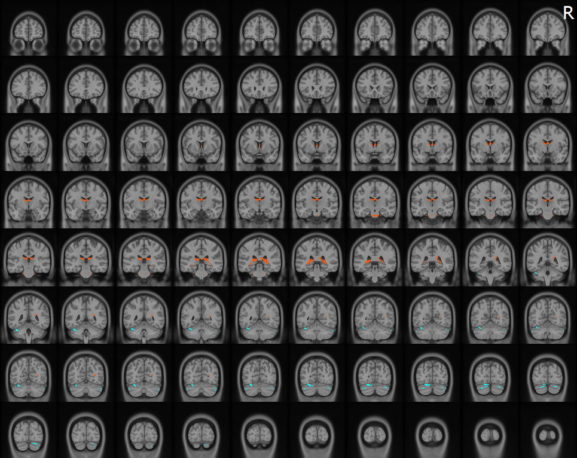{width=50%}

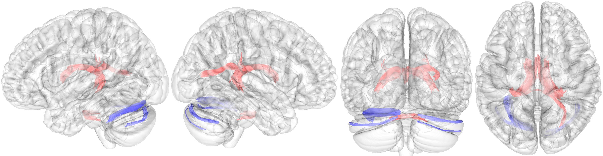

</center>
<br>

### Post

<span style="color: #ff5500;"><font size="5"><bold> Positive Correlations (FDR =  0.000394) </span></font></bold>

```{r md_pos_fsh_post}
#Post positive
df <- read_csv(here("data", "hormones", "fsh", "md",
                    "md_pos_fsh_post.csv")) %>% 
  clean_names() %>% 
  filter(tract_name %in% c("number of tracts","mean length(mm)",
                          "diameter(mm)", "volume(mm^3)")) %>% 
  rotate_df() %>% row_to_names(row_number = 1) %>% 
  rownames_to_column("tract_name") %>% 
  mutate(tract_name = to_any_case(tract_name,"upper_camel", sep_out = "_")) %>% 
  mutate_at(c(2:5), as.numeric) %>% filter(`number of tracts` >= 10)

#Present table
df %>% 
  kable(col.names = c("Tract Name", "Number of Tracts", "Mean Length (mm)",
                      "Diameter (mm)", "Volume (mm^3)"),
        digits = 3,
        table.attr = "style='width:90%;'"
        ) %>% 
  kable_styling(bootstrap_options = "hover") %>% 
  scroll_box(width = "800px", height = "200px")
```


<br>
<span style="color: #00ffff;"><font size="5"><bold> Negative Correlations (FDR = 0.544578) </span></font></bold>

"No significant results in tracts."


```{r md_neg_fsh_post}
#Post negative
df <- read_csv(here("data", "hormones", "fsh", "md",
                    "md_neg_fsh_post.csv")) %>% 
  clean_names() %>% 
  filter(tract_name %in% c("number of tracts","mean length(mm)",
                          "diameter(mm)", "volume(mm^3)")) %>% 
  rotate_df() %>% row_to_names(row_number = 1) %>% 
  rownames_to_column("tract_name") %>% 
  mutate(tract_name = to_any_case(tract_name,"upper_camel", sep_out = "_")) %>% 
  mutate_at(c(2:5), as.numeric) %>% filter(`number of tracts` >= 10)

#Present table
df %>% 
  kable(col.names = c("Tract Name", "Number of Tracts", "Mean Length (mm)",
                      "Diameter (mm)", "Volume (mm^3)"),
        digits = 3,
        table.attr = "style='width:90%;'"
        ) %>% 
  kable_styling(bootstrap_options = "hover") %>% 
  scroll_box(width = "800px", height = "200px")
```


<br>
<font size="5"> Figures </font>

<center>
{width=50%}

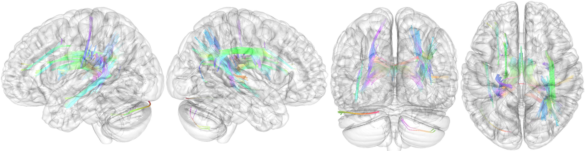

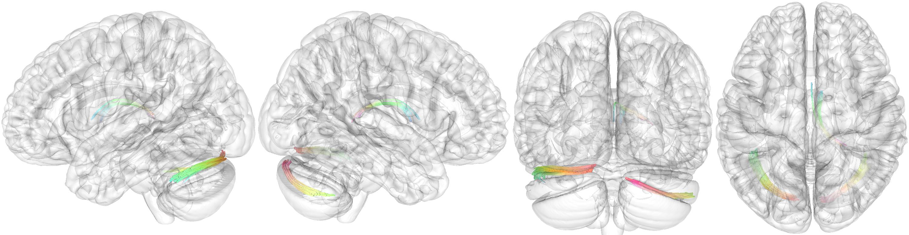

</center>
<br>

## {-}


## RD {.tabset}

### Women

<span style="color: #ff5500;"><font size="5"><bold> Positive Correlations (FDR =  0.032295) </span></font></bold>

```{r rd_pos_fsh_women}
#Women positive
df <- read_csv(here("data", "hormones", "fsh", "rd",
                    "rd_pos_fsh_women.csv")) %>% 
  clean_names() %>% 
  filter(tract_name %in% c("number of tracts","mean length(mm)",
                          "diameter(mm)", "volume(mm^3)")) %>% 
  rotate_df() %>% row_to_names(row_number = 1) %>% 
  rownames_to_column("tract_name") %>% 
  mutate(tract_name = to_any_case(tract_name,"upper_camel", sep_out = "_")) %>% 
  mutate_at(c(2:5), as.numeric) %>% filter(`number of tracts` >= 10)

#Present table
df %>% 
  kable(col.names = c("Tract Name", "Number of Tracts", "Mean Length (mm)",
                      "Diameter (mm)", "Volume (mm^3)"),
        digits = 3,
        table.attr = "style='width:90%;'"
        ) %>% 
  kable_styling(bootstrap_options = "hover") %>% 
  scroll_box(width = "800px", height = "200px")
```


<br>
<span style="color: #00ffff;"><font size="5"><bold> Negative Correlations (FDR = 0.360360) </span></font></bold>

"No significant results in tracts."


```{r rd_neg_fsh_women}
#Women negative
df <- read_csv(here("data", "hormones", "fsh", "rd",
                    "rd_neg_fsh_women.csv")) %>% 
  clean_names() %>% 
  filter(tract_name %in% c("number of tracts","mean length(mm)",
                          "diameter(mm)", "volume(mm^3)")) %>% 
  rotate_df() %>% row_to_names(row_number = 1) %>% 
  rownames_to_column("tract_name") %>% 
  mutate(tract_name = to_any_case(tract_name,"upper_camel", sep_out = "_")) %>% 
  mutate_at(c(2:5), as.numeric) %>% 
  filter(`number of tracts` >= 10)

#Present table
df %>% 
  kable(col.names = c("Tract Name", "Number of Tracts", "Mean Length (mm)",
                      "Diameter (mm)", "Volume (mm^3)"),
        digits = 3,
        table.attr = "style='width:90%;'"
        ) %>% 
  kable_styling(bootstrap_options = "hover") %>% 
  scroll_box(width = "800px", height = "200px")
```

<br>
<font size="5"> Figures </font>

<center>
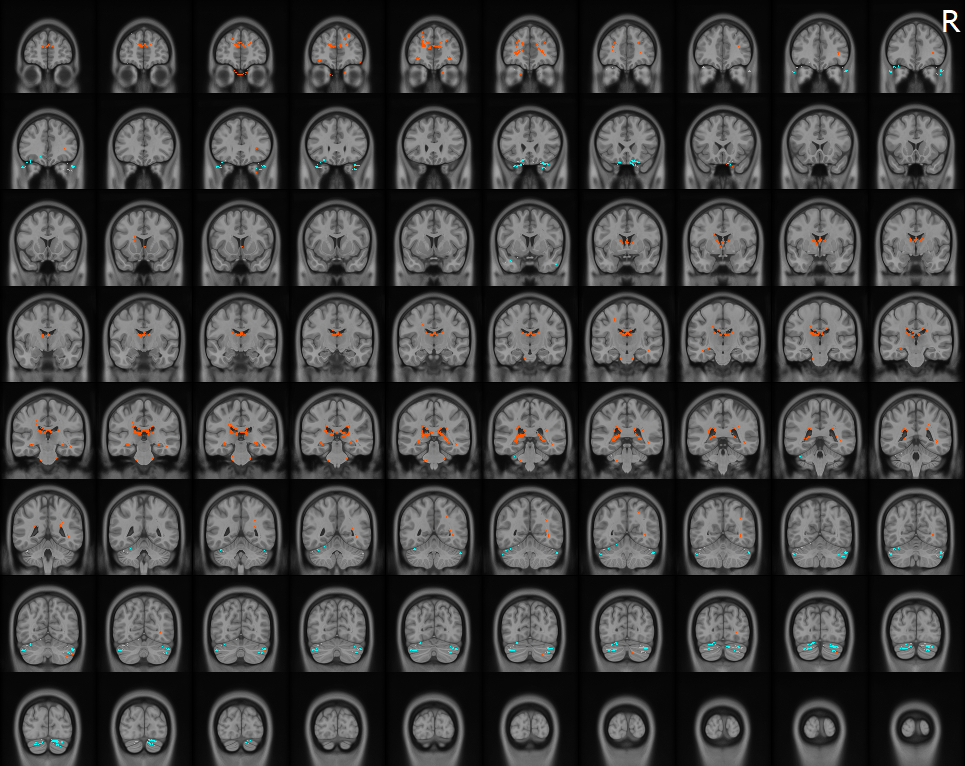{width=50%}

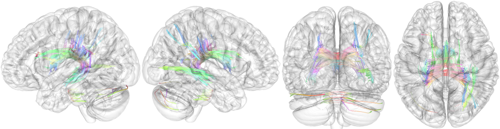

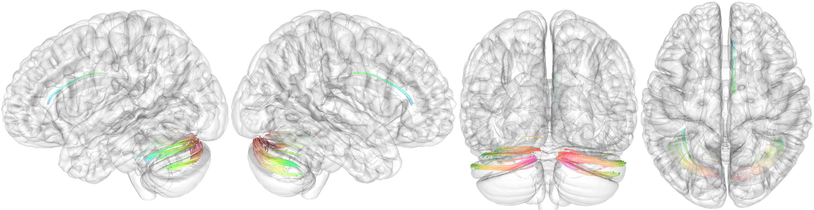

</center>
<br>


### Pre

### Peri

### Post

## {-}


# {-}

# Testosterone {.tabset .tabset-dropdown}

## QA {.tabset}

### Men

### Women

### Pre

### Peri

### Post

## {-}

## AD {.tabset}

### Men

### Women

### Pre

### Peri

### Post

## {-}


## MD {.tabset}

### Men

### Women

### Pre

### Peri

### Post

## {-}


## RD {.tabset}

### Men

### Women

### Pre

### Peri

### Post

## {-}

# {-}


# Summary


<br>

**QA is quantitative anisotropy**: density of anisotropic diffusion after removing the isotropic component (Yeh, 2010), quantifies how specific is the water movement

- Higher is greater white matter integrity
- Lower is lower white matter integrity

**AD is axial diffusivity**: quantifies how fast water diffuses along/parallel to the axon fibers, need to asses with other measurements

- Higher may or may not be associated with greater white matter integrity
- Lower may or may not be associated with lower white matter integrity

**MD is mean diffusivity**: average of the axial and radial diffusivity, overall how diffusive is the water

- Higher is greater diffusivity, associated with greater axonal injury
- Lower is lower diffusivity, better integrity

**RD is radial diffusivity**: water diffusivity moving away from axon, quantifies how fast water diffuses across the axonal bundles

- Higher is greater demyelination: water is not staying with axon and moving away from it
- Lower is better integrity


